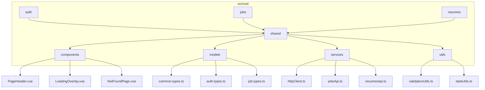
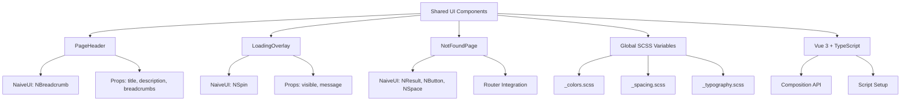
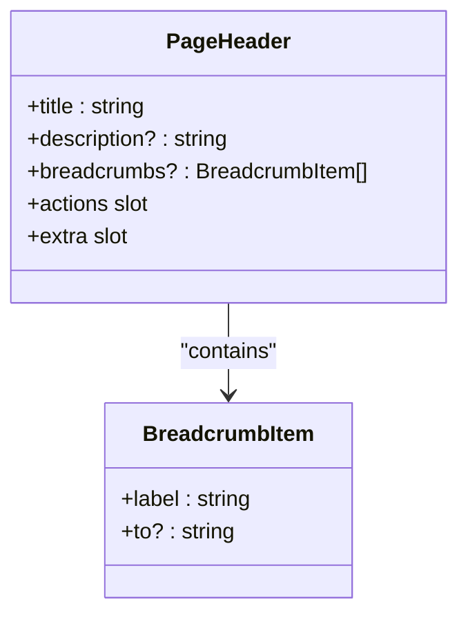
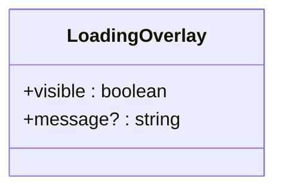
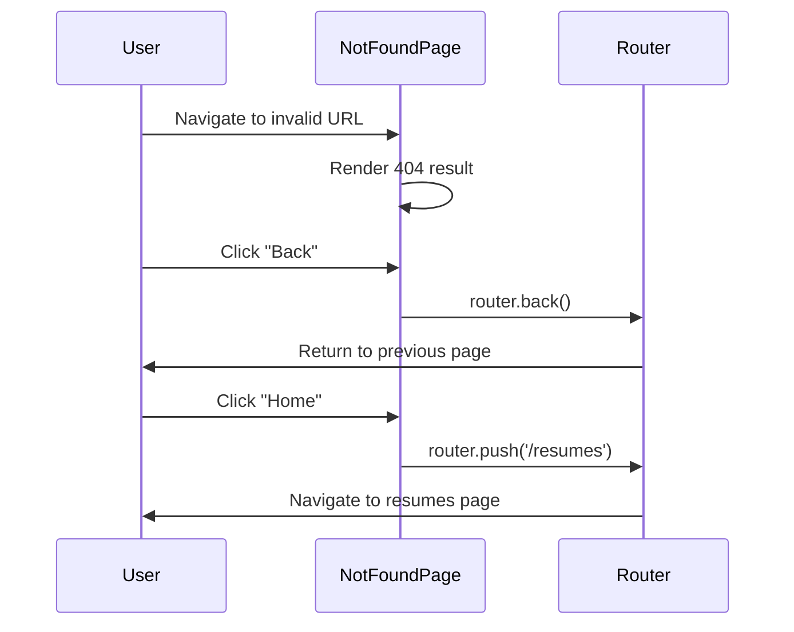
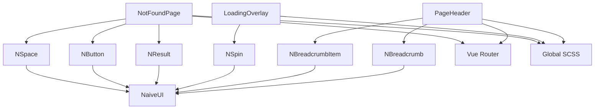

# Shared UI Components

<cite>
**Referenced Files in This Document**   
- [PageHeader.vue](file://src/root/shared/components/PageHeader.vue#L1-L106)
- [LoadingOverlay.vue](file://src/root/shared/components/LoadingOverlay.vue#L1-L51)
- [NotFoundPage.vue](file://src/root/shared/components/NotFoundPage.vue#L1-L45)
- [_colors.scss](file://src/styles/variables/_colors.scss)
- [_spacing.scss](file://src/styles/variables/_spacing.scss)
- [_typography.scss](file://src/styles/variables/_typography.scss)
- [common.types.ts](file://src/root/shared/models/common.types.ts)
</cite>

## Table of Contents
1. [Introduction](#introduction)
2. [Project Structure](#project-structure)
3. [Core Components](#core-components)
4. [Architecture Overview](#architecture-overview)
5. [Detailed Component Analysis](#detailed-component-analysis)
6. [Dependency Analysis](#dependency-analysis)
7. [Performance Considerations](#performance-considerations)
8. [Troubleshooting Guide](#troubleshooting-guide)
9. [Conclusion](#conclusion)

## Introduction
This document provides a comprehensive overview of the shared UI components in the maya-platform-frontend application. These reusable components are designed to ensure consistency in user interface design, streamline development workflows, and promote maintainability across different modules of the application. The components are located in the `src/root/shared/components` directory and are built using Vue 3 with TypeScript and the Naive UI component library. This documentation details their structure, usage patterns, props, events, slots, and integration with global styles and utilities.

## Project Structure
The shared UI components reside within a feature-based modular architecture. The application organizes its code by domain areas under the `src/root` directory, with shared resources isolated in the `shared` subdirectory. This promotes reusability and separation of concerns.



**Diagram sources**
- [PageHeader.vue](file://src/root/shared/components/PageHeader.vue#L1-L106)
- [LoadingOverlay.vue](file://src/root/shared/components/LoadingOverlay.vue#L1-L51)
- [NotFoundPage.vue](file://src/root/shared/components/NotFoundPage.vue#L1-L45)
- [common.types.ts](file://src/root/shared/models/common.types.ts)

**Section sources**
- [PageHeader.vue](file://src/root/shared/components/PageHeader.vue#L1-L106)
- [LoadingOverlay.vue](file://src/root/shared/components/LoadingOverlay.vue#L1-L51)
- [NotFoundPage.vue](file://src/root/shared/components/NotFoundPage.vue#L1-L45)

## Core Components
The core shared UI components include `PageHeader`, `LoadingOverlay`, and `NotFoundPage`. These components abstract common UI patterns such as page layout headers, loading states, and error handling for missing routes. They leverage Vue 3's Composition API and `<script setup>` syntax for concise and performant code. Props are strongly typed using TypeScript interfaces, ensuring type safety and better developer experience. The components integrate with the Naive UI library for consistent styling and accessibility features.

**Section sources**
- [PageHeader.vue](file://src/root/shared/components/PageHeader.vue#L1-L106)
- [LoadingOverlay.vue](file://src/root/shared/components/LoadingOverlay.vue#L1-L51)
- [NotFoundPage.vue](file://src/root/shared/components/NotFoundPage.vue#L1-L45)

## Architecture Overview
The shared UI components follow a modular, composable architecture that emphasizes reusability and consistency. Components are decoupled from business logic and communicate with parent components via props and events. They rely on globally defined SCSS variables for theming, ensuring visual consistency across the application. The architecture leverages the Naive UI component library for base components and styling, while extending functionality through custom wrappers and layouts.



**Diagram sources**
- [PageHeader.vue](file://src/root/shared/components/PageHeader.vue#L1-L106)
- [LoadingOverlay.vue](file://src/root/shared/components/LoadingOverlay.vue#L1-L51)
- [NotFoundPage.vue](file://src/root/shared/components/NotFoundPage.vue#L1-L45)
- [_colors.scss](file://src/styles/variables/_colors.scss)
- [_spacing.scss](file://src/styles/variables/_spacing.scss)
- [_typography.scss](file://src/styles/variables/_typography.scss)

## Detailed Component Analysis

### PageHeader Component Analysis
The `PageHeader` component provides a standardized header layout for application pages, including title, description, breadcrumbs, and action buttons. It uses slots for maximum flexibility in content placement.



**Diagram sources**
- [PageHeader.vue](file://src/root/shared/components/PageHeader.vue#L1-L106)

**Section sources**
- [PageHeader.vue](file://src/root/shared/components/PageHeader.vue#L1-L106)

#### Implementation Details
- **Props**: Accepts `title` (required), `description` (optional), and `breadcrumbs` (optional array of objects with label and route).
- **Slots**: Provides `actions` slot for primary buttons and `extra` slot for additional content below the main header.
- **Styling**: Uses CSS variables from `_typography.scss` and `_spacing.scss` for font sizes, weights, and margins.
- **Accessibility**: Semantic HTML with proper heading levels (`<h1>` for title) and keyboard-navigable breadcrumb links.
- **Internationalization**: Text content is passed as props, enabling easy translation integration.

Example usage:
```vue
<PageHeader 
  title="Job Listings" 
  description="Browse and manage all available job postings"
  :breadcrumbs="[{ label: 'Home', to: '/' }, { label: 'Jobs' }]">
  <template #actions>
    <NButton type="primary">Create Job</NButton>
  </template>
</PageHeader>
```

### LoadingOverlay Component Analysis
The `LoadingOverlay` component displays a full-screen loading indicator with optional message text, typically used during data fetching operations.



**Diagram sources**
- [LoadingOverlay.vue](file://src/root/shared/components/LoadingOverlay.vue#L1-L51)

**Section sources**
- [LoadingOverlay.vue](file://src/root/shared/components/LoadingOverlay.vue#L1-L51)

#### Implementation Details
- **Props**: `visible` (controls display, default false) and `message` (optional text below spinner).
- **Styling**: Fixed-position overlay with semi-transparent white background to prevent interaction during loading.
- **Z-index**: Set to 1000 to appear above all other content.
- **Accessibility**: Visual spinner with text alternative provided by message prop.
- **Performance**: Uses `v-if` instead of `v-show` to remove from DOM when not visible.

Example usage:
```vue
<LoadingOverlay 
  :visible="isLoading" 
  message="Fetching job data..." 
/>
```

### NotFoundPage Component Analysis
The `NotFoundPage` component handles 404 error states with a user-friendly interface and navigation options.



**Diagram sources**
- [NotFoundPage.vue](file://src/root/shared/components/NotFoundPage.vue#L1-L45)

**Section sources**
- [NotFoundPage.vue](file://src/root/shared/components/NotFoundPage.vue#L1-L45)

#### Implementation Details
- **Localization**: Currently displays Russian text ("Страница не найдена"), indicating need for i18n integration.
- **Navigation**: Provides "Back" and "Home" buttons with programmatic routing.
- **Styling**: Centered layout with minimum height to ensure visibility on small screens.
- **Accessibility**: Button labels are clear and actions are predictable.

## Dependency Analysis
The shared UI components have well-defined dependencies that promote loose coupling and reusability.



**Diagram sources**
- [PageHeader.vue](file://src/root/shared/components/PageHeader.vue#L1-L106)
- [LoadingOverlay.vue](file://src/root/shared/components/LoadingOverlay.vue#L1-L51)
- [NotFoundPage.vue](file://src/root/shared/components/NotFoundPage.vue#L1-L45)
- [_colors.scss](file://src/styles/variables/_colors.scss)
- [_spacing.scss](file://src/styles/variables/_spacing.scss)
- [_typography.scss](file://src/styles/variables/_typography.scss)

**Section sources**
- [PageHeader.vue](file://src/root/shared/components/PageHeader.vue#L1-L106)
- [LoadingOverlay.vue](file://src/root/shared/components/LoadingOverlay.vue#L1-L51)
- [NotFoundPage.vue](file://src/root/shared/components/NotFoundPage.vue#L1-L45)

## Performance Considerations
The shared UI components are optimized for performance through several strategies:
- Lightweight implementations with minimal reactivity overhead
- Use of `v-if` for conditional rendering to remove elements from DOM
- Efficient CSS with variables for consistent property reuse
- Proper event handling without memory leaks
- Tree-shakable imports from Naive UI

No heavy computations or watchers are present in these components, making them suitable for frequent use without performance degradation.

## Troubleshooting Guide
Common issues and solutions for shared UI components:

**Issue**: PageHeader breadcrumbs not clickable
- **Cause**: Missing `to` property in breadcrumb item
- **Solution**: Ensure breadcrumb items have valid route paths in `to` field

**Issue**: LoadingOverlay not disappearing
- **Cause**: `visible` prop not being updated after data load
- **Solution**: Verify the loading state variable is properly toggled in the parent component

**Issue**: NotFoundPage buttons not working
- **Cause**: Router instance not properly imported
- **Solution**: Check that `useRouter` is correctly imported from `vue-router`

**Issue**: Styling inconsistencies
- **Cause**: Missing SCSS variable imports
- **Solution**: Ensure global styles are properly loaded in main application entry

**Section sources**
- [PageHeader.vue](file://src/root/shared/components/PageHeader.vue#L1-L106)
- [LoadingOverlay.vue](file://src/root/shared/components/LoadingOverlay.vue#L1-L51)
- [NotFoundPage.vue](file://src/root/shared/components/NotFoundPage.vue#L1-L45)

## Conclusion
The shared UI components in the maya-platform-frontend application provide a solid foundation for consistent and maintainable user interfaces. By encapsulating common patterns in reusable components, the architecture promotes efficiency and reduces code duplication. The components demonstrate good practices in Vue 3 development, including proper typing, slot usage, and integration with design systems. Future improvements could include full internationalization support and enhanced accessibility features. These components serve as excellent examples of how to build scalable frontend architectures.