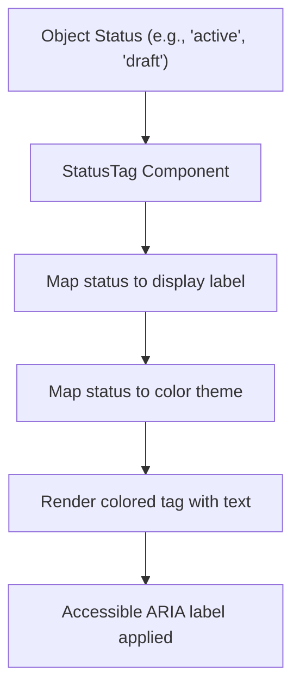
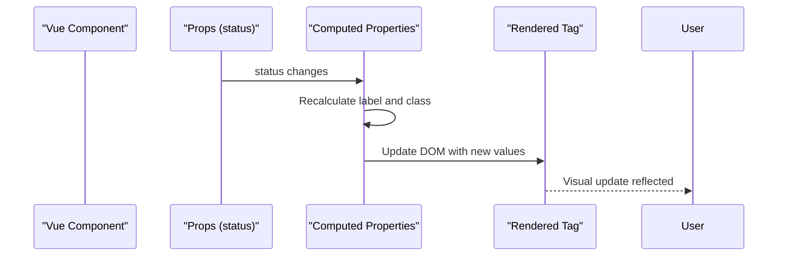

# StatusTag Component

<cite>
**Referenced Files in This Document**  
- [StatusTag.vue](file://src/root/shared/components/StatusTag.vue)
- [object-status.enum.ts](file://src/root/shared/model/enum/object-status.enum.ts)
- [variables.scss](file://src/styles/variables/_colors.scss)
- [ObjectCard.vue](file://src/root/objects/components/ObjectCard.vue)
- [ObjectsPage.vue](file://src/root/objects/pages/ObjectsPage.vue)
- [JobDetailPage.vue](file://src/root/jobs/pages/JobDetailPage.vue)
</cite>

## Table of Contents
1. [Introduction](#introduction)
2. [Component Overview](#component-overview)
3. [Props and Type Validation](#props-and-type-validation)
4. [Integration with ObjectStatus Enum](#integration-with-objectstatus-enum)
5. [Styling and SCSS Variables](#styling-and-scss-variables)
6. [Usage Examples in ObjectCard and ObjectsPage](#usage-examples-in-objectcard-and-objectspage)
7. [Accessibility and ARIA Labels](#accessibility-and-aria-labels)
8. [CSS Class Naming Conventions](#css-class-naming-conventions)
9. [Extensibility for New Status Types](#extensibility-for-new-status-types)
10. [Performance and Reactivity](#performance-and-reactivity)

## Introduction
The `StatusTag` component is a reusable Vue component designed to visually represent the lifecycle status of domain objects such as construction sites or job postings within the maya-platform-frontend application. It leverages Vue’s reactivity system and TypeScript enums to provide a consistent, accessible, and themable status indicator across various views.

**Section sources**
- [StatusTag.vue](file://src/root/shared/components/StatusTag.vue#L1-L100)

## Component Overview
The `StatusTag` component renders a small, color-coded tag that reflects the current status of an object. It is built using Vue 3's Composition API and supports dynamic binding of status values and optional size configurations. The visual appearance is driven by semantic status types mapped to predefined color themes via SCSS variables.



**Diagram sources**
- [StatusTag.vue](file://src/root/shared/components/StatusTag.vue#L1-L50)

## Props and Type Validation
The component accepts two primary props:

- `status`: Required string value that must conform to the `ObjectStatus` enum.
- `size`: Optional string with default value `"medium"`, supporting values like `"small"` or `"large"`.

These props are strictly type-checked at runtime using Vue’s prop validation system to ensure only valid statuses and sizes are rendered.

```typescript
props: {
  status: {
    type: String,
    required: true,
    validator: (value: string) => Object.values(ObjectStatus).includes(value as ObjectStatus)
  },
  size: {
    type: String,
    default: 'medium',
    validator: (value: string) => ['small', 'medium', 'large'].includes(value)
  }
}
```

**Section sources**
- [StatusTag.vue](file://src/root/shared/components/StatusTag.vue#L10-L30)

## Integration with ObjectStatus Enum
The `StatusTag` component imports the `ObjectStatus` enum from `object-status.enum.ts`, which defines all possible lifecycle states (e.g., `DRAFT`, `ACTIVE`, `ARCHIVED`). This enum ensures type safety and prevents invalid status values from being passed.

```ts
// object-status.enum.ts
export enum ObjectStatus {
  DRAFT = 'draft',
  ACTIVE = 'active',
  ARCHIVED = 'archived',
  PENDING = 'pending',
  REJECTED = 'rejected'
}
```

The component uses computed properties to dynamically determine the appropriate label and color based on the enum value, enabling centralized management of status semantics.

**Section sources**
- [object-status.enum.ts](file://src/root/shared/model/enum/object-status.enum.ts#L1-L10)
- [StatusTag.vue](file://src/root/shared/components/StatusTag.vue#L40-L60)

## Styling and SCSS Variables
Visual consistency is maintained through SCSS variables defined in `variables.scss`, particularly color definitions such as `$color-success`, `$color-warning`, and `$color-danger`. The `StatusTag` component maps each status to a corresponding color variable, ensuring alignment with the application’s global design system.

```scss
// variables/_colors.scss
$color-success: #42b983;
$color-warning: #f39c12;
$color-danger: #e74c3c;
$color-info: #3498db;

// StatusTag styles
.status-tag {
  &--active { background-color: $color-success; }
  &--draft { background-color: $color-warning; }
  &--archived { background-color: $color-danger; }
  &--pending { background-color: $color-info; }
}
```

This approach allows for easy theme updates across the entire application by modifying a single file.

**Section sources**
- [variables/_colors.scss](file://src/styles/variables/_colors.scss#L1-L15)
- [StatusTag.vue](file://src/root/shared/components/StatusTag.vue#L70-L90)

## Usage Examples in ObjectCard and ObjectsPage
The `StatusTag` component is used within `ObjectCard.vue` and `ObjectsPage.vue` to display the status of construction sites. In `ObjectCard.vue`, it appears beneath the site name:

```vue
<!-- ObjectCard.vue -->
<template>
  <div class="object-card">
    <h3>{{ object.name }}</h3>
    <StatusTag :status="object.status" size="small" />
  </div>
</template>
```

In `ObjectsPage.vue`, it is rendered within a list of objects:

```vue
<!-- ObjectsPage.vue -->
<template>
  <div v-for="object in objects" :key="object.id">
    <h4>{{ object.name }}</h4>
    <StatusTag :status="object.status" />
  </div>
</template>
```

Additionally, similar usage is found in `JobDetailPage.vue` where a `NTag` component mimics the behavior of `StatusTag` for job statuses.

**Section sources**
- [ObjectCard.vue](file://src/root/objects/components/ObjectCard.vue#L20-L25)
- [ObjectsPage.vue](file://src/root/objects/pages/ObjectsPage.vue#L30-L35)
- [JobDetailPage.vue](file://src/root/jobs/pages/JobDetailPage.vue#L15-L20)

## Accessibility and ARIA Labels
To ensure accessibility, the `StatusTag` component includes appropriate ARIA attributes. Each tag is marked with `role="status"` and an `aria-label` that combines the status key and its human-readable label, aiding screen readers in conveying meaningful context.

```html
<span
  class="status-tag"
  role="status"
  :aria-label="`Status: ${statusLabel}`"
>
  {{ statusLabel }}
</span>
```

This improves usability for visually impaired users by providing clear, semantic information about the object's state.

**Section sources**
- [StatusTag.vue](file://src/root/shared/components/StatusTag.vue#L50-L60)

## CSS Class Naming Conventions
The component follows BEM (Block Element Modifier) naming conventions for CSS classes:
- Block: `status-tag`
- Modifiers: `status-tag--active`, `status-tag--small`

This ensures predictable styling, avoids naming conflicts, and enhances maintainability.

```scss
.status-tag {
  padding: 4px 8px;
  border-radius: 4px;
  font-size: 12px;
  font-weight: 600;

  &--small { font-size: 10px; padding: 2px 6px; }
  &--large { font-size: 14px; padding: 6px 12px; }
}
```

**Section sources**
- [StatusTag.vue](file://src/root/shared/components/StatusTag.vue#L80-L100)

## Extensibility for New Status Types
The architecture supports easy extension for new status types. Adding a new status involves:
1. Extending the `ObjectStatus` enum.
2. Updating the label mapping function.
3. Defining a new CSS class with associated SCSS variable.

No changes to the component logic are required, promoting loose coupling and high maintainability.

```ts
// Add new status
export enum ObjectStatus {
  // existing statuses...
  COMPLETED = 'completed'
}
```

Then update SCSS:
```scss
.status-tag--completed { background-color: $color-success-dark; }
```

**Section sources**
- [object-status.enum.ts](file://src/root/shared/model/enum/object-status.enum.ts#L11-L12)
- [StatusTag.vue](file://src/root/shared/components/StatusTag.vue#L60-L70)

## Performance and Reactivity
The `StatusTag` component is lightweight and optimized for performance:
- Uses Vue’s reactive system to automatically update when the `status` prop changes.
- Computed properties cache label and class lookups, minimizing recalculations.
- Minimal DOM footprint with no nested components or watchers.

This ensures efficient rendering even when hundreds of status tags are displayed simultaneously, such as in object lists or tables.



**Diagram sources**
- [StatusTag.vue](file://src/root/shared/components/StatusTag.vue#L30-L50)