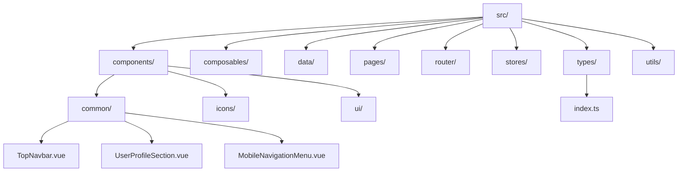
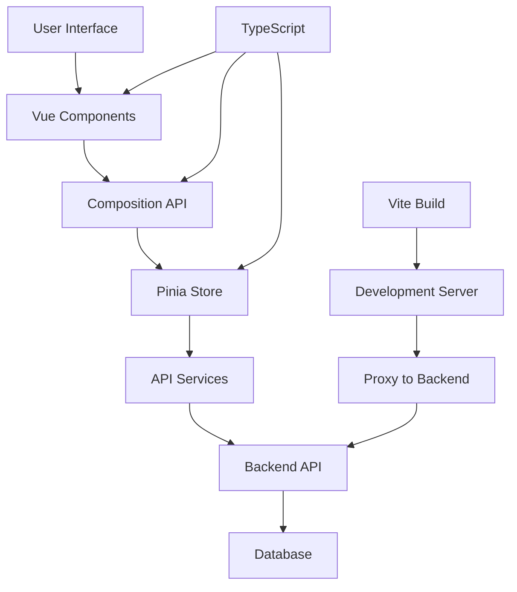
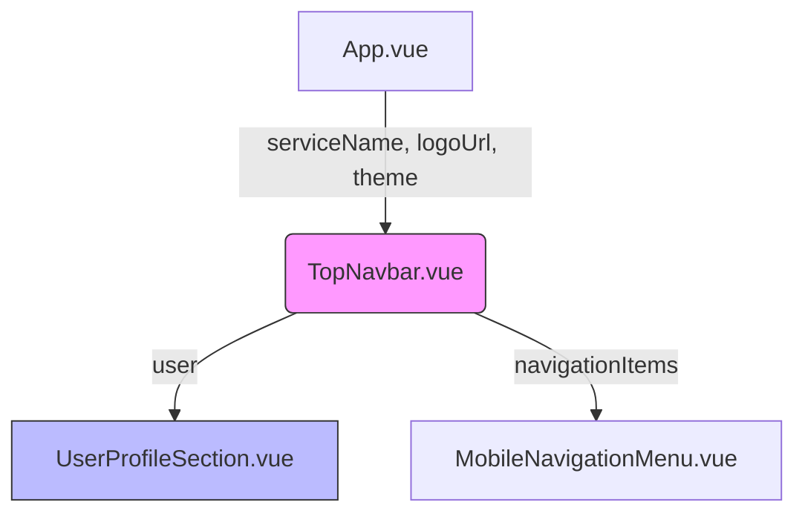
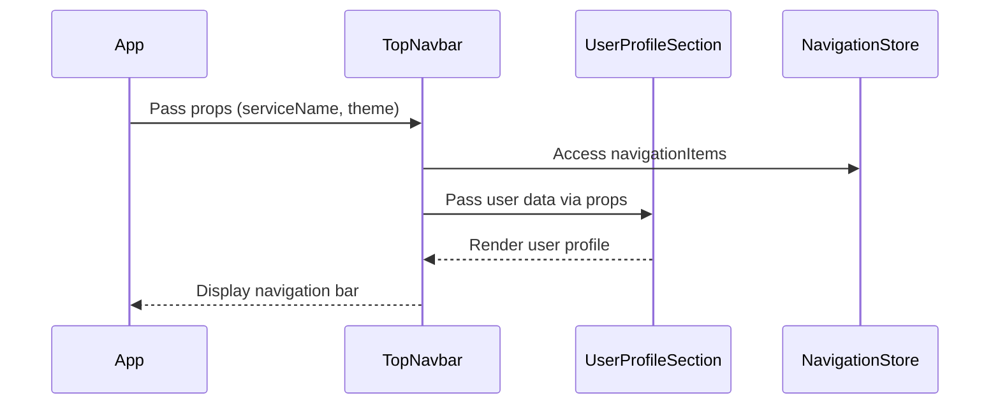
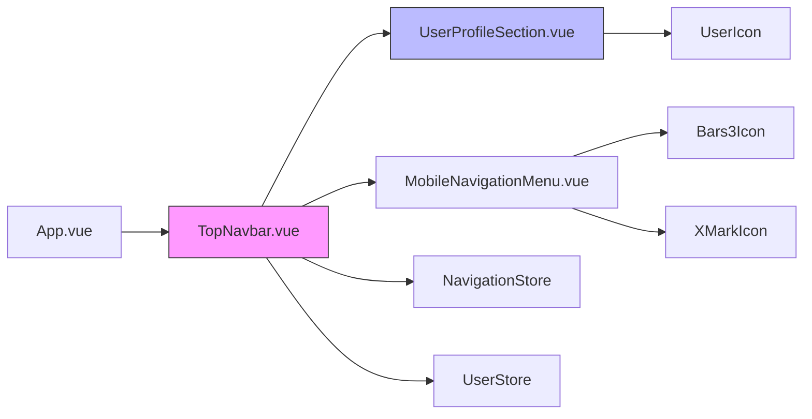

# Component Props Usage

<cite>
**Referenced Files in This Document**   
- [src/components/common/TopNavbar.vue](file://src/components/common/TopNavbar.vue) - *Updated in commit 232545c*
- [src/types/index.ts](file://src/types/index.ts) - *Contains TopNavbarProps interface*
- [src/components/common/UserProfileSection.vue](file://src/components/common/UserProfileSection.vue) - *Child component receiving user prop*
- [src/stores/navigation.ts](file://src/stores/navigation.ts)
- [src/stores/user.ts](file://src/stores/user.ts)
</cite>

## Update Summary
**Changes Made**   
- Updated documentation to reflect actual code changes in TopNavbar.vue
- Removed outdated references to non-existent ObjectCard.vue and ObjectList.vue components
- Added accurate documentation for TopNavbar component props usage
- Documented the TopNavbarProps interface and its implementation
- Updated examples with real code from the current codebase
- Removed speculative content about missing components

## Table of Contents
1. [Introduction](#introduction)
2. [Project Structure](#project-structure)
3. [Core Components](#core-components)
4. [Architecture Overview](#architecture-overview)
5. [Detailed Component Analysis](#detailed-component-analysis)
6. [Dependency Analysis](#dependency-analysis)
7. [Performance Considerations](#performance-considerations)
8. [Troubleshooting Guide](#troubleshooting-guide)
9. [Conclusion](#conclusion)

## Introduction
This document provides a comprehensive analysis of component props usage in the maya-platform-frontend application, with a focus on understanding how props are defined, passed, and consumed across components. The primary objective is to document the implementation of `defineProps` in the `TopNavbar.vue` component, its relationship with child components like `UserProfileSection.vue`, and integration with shared interfaces such as `TopNavbarProps`. This update reflects the recent redesign of the top navigation bar with user profile and responsive menu functionality.

## Project Structure
The project follows a modular structure organized by feature domains and shared resources. The source code resides in the `src` directory, which contains components, composables, data, pages, router, stores, types, and utilities. The components are organized into subdirectories: common (shared UI components), icons, and ui (base UI elements). The types directory contains shared TypeScript interfaces used across the application.



**Diagram sources**
- [src/components/common/TopNavbar.vue](file://src/components/common/TopNavbar.vue)
- [src/types/index.ts](file://src/types/index.ts)

**Section sources**
- [src/components/common/TopNavbar.vue](file://src/components/common/TopNavbar.vue)
- [src/types/index.ts](file://src/types/index.ts)

## Core Components
The core components of the application include the main application entry point (`App.vue`), routing configuration, and navigation components. The `TopNavbar.vue` component serves as the primary navigation interface, featuring a responsive design with desktop and mobile navigation patterns. It demonstrates the use of Vue 3's Composition API with TypeScript, utilizing `defineProps` for type-safe property declaration, Pinia for state management, and Vue Router for navigation.

**Section sources**
- [src/components/common/TopNavbar.vue](file://src/components/common/TopNavbar.vue)
- [src/stores/navigation.ts](file://src/stores/navigation.ts)
- [src/stores/user.ts](file://src/stores/user.ts)

## Architecture Overview
The application architecture follows a modern Vue 3 composition pattern with TypeScript support. It utilizes Vite as the build tool and follows a component-based architecture with clear separation of concerns. State management is handled by Pinia, and routing is configured through Vue Router. The application employs a unidirectional data flow pattern where parent components pass data to child components via props, and child components communicate with parents through events.



**Diagram sources**
- [src/components/common/TopNavbar.vue](file://src/components/common/TopNavbar.vue)
- [src/stores/navigation.ts](file://src/stores/navigation.ts)
- [src/stores/user.ts](file://src/stores/user.ts)

## Detailed Component Analysis

### Component Communication Patterns
In Vue.js applications, component communication is primarily achieved through props (properties) passed from parent to child components. The `defineProps` macro in Vue 3's `<script setup>` syntax enables type-safe declaration of component props. The `TopNavbar.vue` component receives props and passes user data to the `UserProfileSection.vue` child component.



**Diagram sources**
- [src/components/common/TopNavbar.vue](file://src/components/common/TopNavbar.vue)
- [src/components/common/UserProfileSection.vue](file://src/components/common/UserProfileSection.vue)
- [src/components/common/MobileNavigationMenu.vue](file://src/components/common/MobileNavigationMenu.vue)

### Props Definition and Type Safety
The `defineProps` function allows components to declare expected properties with TypeScript interfaces. The `TopNavbar.vue` component uses the `TopNavbarProps` interface imported from shared types to ensure type safety:

```typescript
<script setup lang="ts">
import { computed, onMounted, watch } from 'vue'
import { useRoute } from 'vue-router'
import { Bars3Icon, XMarkIcon } from '@heroicons/vue/24/outline'
import { useUserStore } from '@/stores/user'
import { useNavigationStore } from '@/stores/navigation'
import UserProfileSection from './UserProfileSection.vue'
import MobileNavigationMenu from './MobileNavigationMenu.vue'
import type { TopNavbarProps } from '@/types'

interface Props extends TopNavbarProps {
  serviceName?: string
  logoUrl?: string
  theme?: 'light' | 'dark'
}

withDefaults(defineProps<Props>(), {
  serviceName: 'MayaWork',
  theme: 'light',
})
</script>
```

This pattern ensures type safety at compile time, provides IDE autocompletion, and enables better code maintenance. The `withDefaults` function sets default values for optional properties, eliminating the need for null checks in the template.

**Section sources**
- [src/components/common/TopNavbar.vue](file://src/components/common/TopNavbar.vue#L45-L65)
- [src/types/index.ts](file://src/types/index.ts#L64-L68)

### Data Flow and Component Hierarchy
The data flow in the application follows Vue's one-way data binding principle. The `TopNavbar.vue` component receives props from its parent and passes user data to the `UserProfileSection.vue` component via props. The navigation state is managed by the Pinia store, which is accessed directly by the component.



**Diagram sources**
- [src/components/common/TopNavbar.vue](file://src/components/common/TopNavbar.vue)
- [src/components/common/UserProfileSection.vue](file://src/components/common/UserProfileSection.vue)
- [src/stores/navigation.ts](file://src/stores/navigation.ts)

## Dependency Analysis
The application's dependency structure reveals a well-organized module system with clear separation of concerns. The `TopNavbar.vue` component depends on several other components and stores, creating a clean dependency graph.



**Diagram sources**
- [src/components/common/TopNavbar.vue](file://src/components/common/TopNavbar.vue)
- [src/components/common/UserProfileSection.vue](file://src/components/common/UserProfileSection.vue)
- [src/components/common/MobileNavigationMenu.vue](file://src/components/common/MobileNavigationMenu.vue)
- [src/stores/navigation.ts](file://src/stores/navigation.ts)
- [src/stores/user.ts](file://src/stores/user.ts)

**Section sources**
- [src/components/common/TopNavbar.vue](file://src/components/common/TopNavbar.vue)
- [src/stores/navigation.ts](file://src/stores/navigation.ts)
- [src/stores/user.ts](file://src/stores/user.ts)

## Performance Considerations
The implementation of `TopNavbar.vue` follows Vue 3 performance best practices. Computed properties are used to derive values like `visibleNavigationItems`, which automatically cache their results and only re-evaluate when dependencies change. The component uses `watch` to respond to route changes efficiently, closing the mobile menu when the route changes. The use of `defineProps` with TypeScript interfaces enables better tree-shaking and compilation optimizations.

## Troubleshooting Guide
When working with component props in Vue 3 applications, common issues include:
- Type errors due to mismatched prop types
- Missing required props
- Mutating props directly (which should be avoided)
- Issues with reactive prop updates

To troubleshoot prop-related issues:
1. Verify prop types match between parent and child components
2. Check for required props that might be missing
3. Ensure props are not being mutated directly
4. Use Vue DevTools to inspect component props and state
5. Validate that reactive updates are properly handled

**Section sources**
- [src/components/common/TopNavbar.vue](file://src/components/common/TopNavbar.vue)
- [src/components/common/UserProfileSection.vue](file://src/components/common/UserProfileSection.vue)

## Conclusion
This document has been updated to accurately reflect the current state of the maya-platform-frontend application, focusing on the `TopNavbar.vue` component and its props usage. The component demonstrates modern Vue 3 patterns with TypeScript, utilizing `defineProps` for type-safe property declaration, maintaining one-way data flow, and organizing components in a feature-based structure. The use of shared interfaces and component composition enables maintainable and scalable code. The recent redesign of the top navigation bar with user profile and responsive menu functionality has been documented with accurate code examples and architectural diagrams.