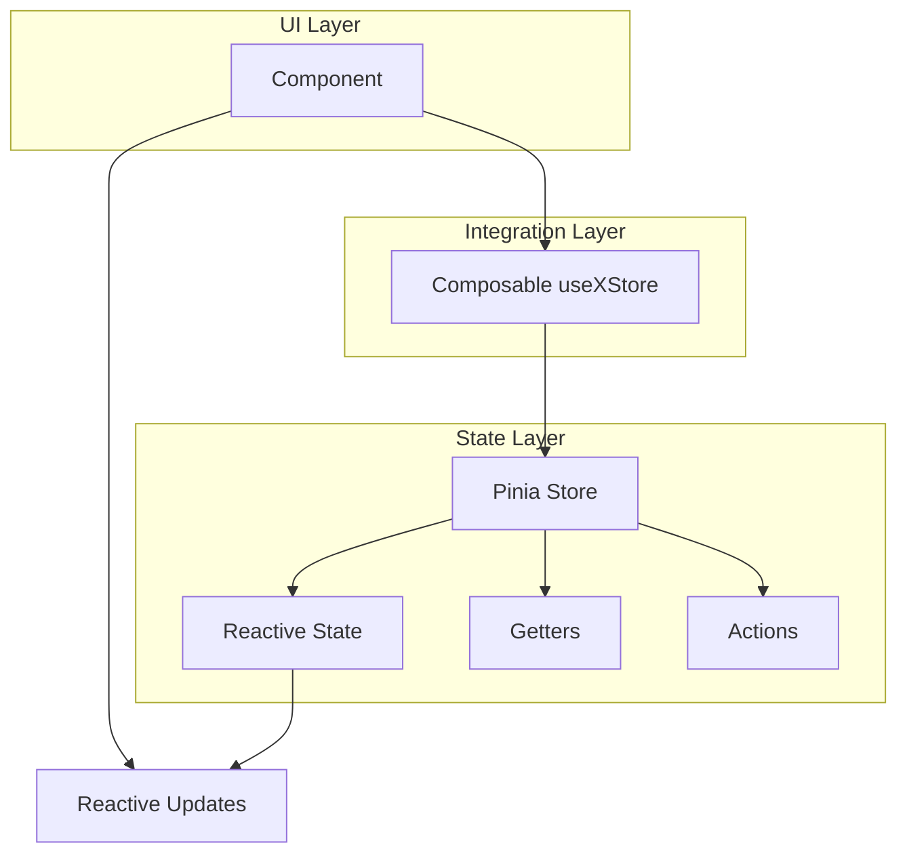
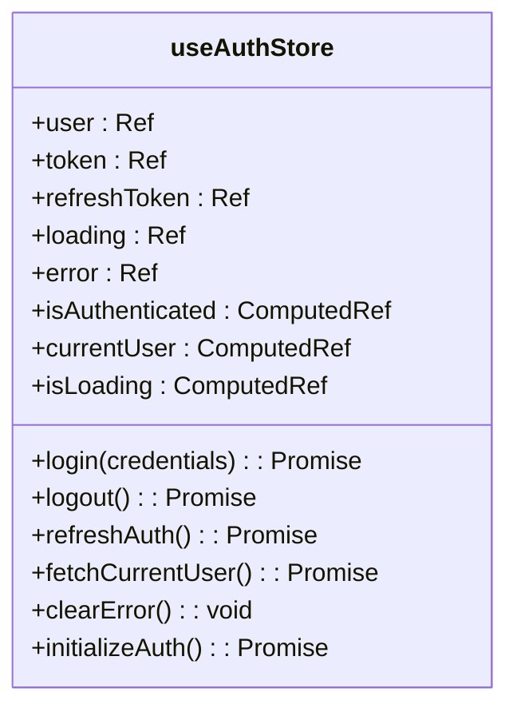
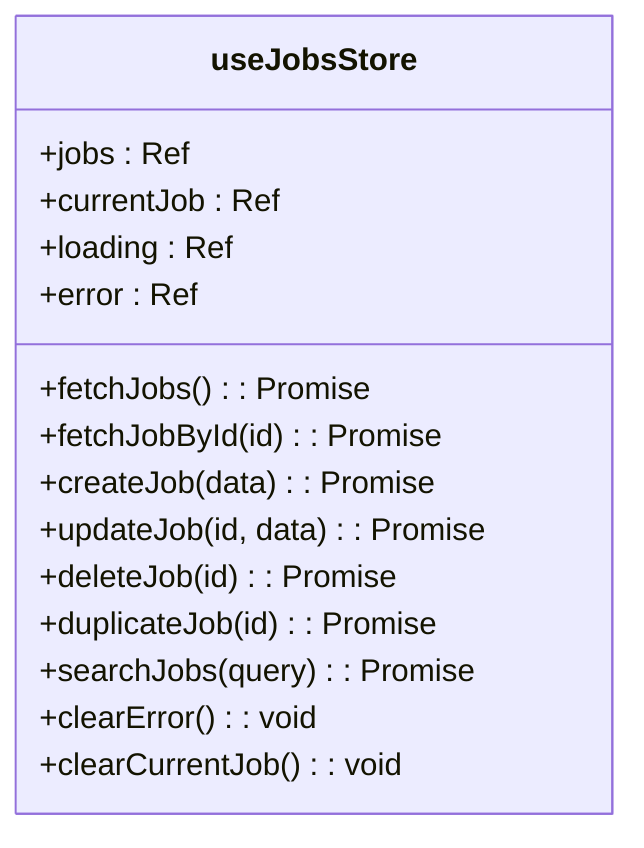
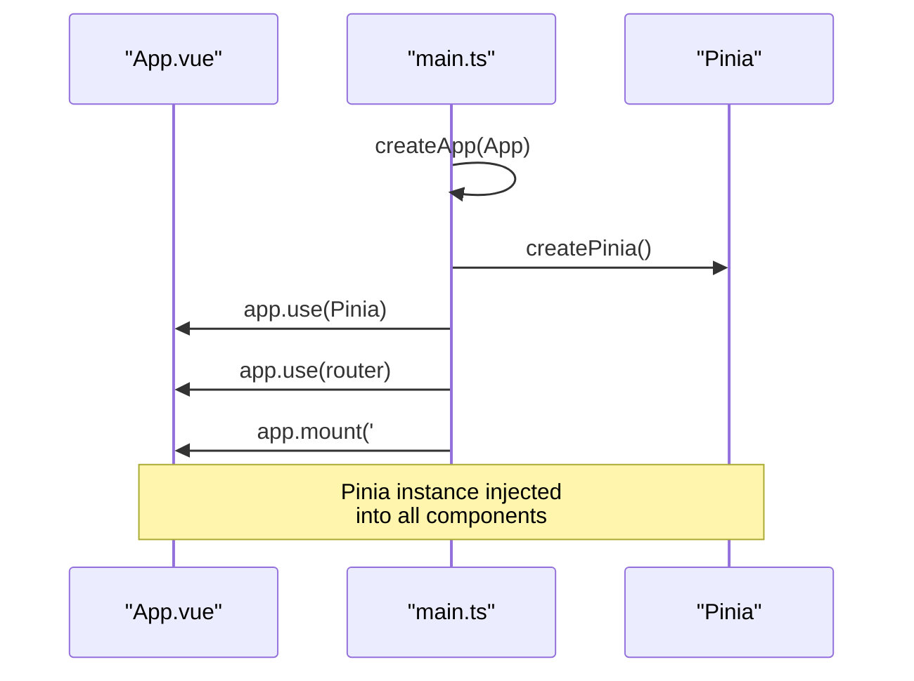
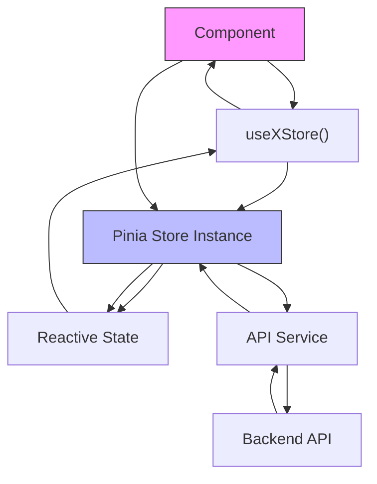

# Composables for State Integration

<cite>
**Referenced Files in This Document**   
- [authStore.ts](file://src/root/auth/store/authStore.ts#L0-L154)
- [jobsStore.ts](file://src/root/jobs/store/jobsStore.ts#L0-L197)
- [main.ts](file://src/main.ts#L0-L14)
- [accountStore.ts](file://src/root/account/store/accountStore.ts#L0-L100)
- [resumesStore.ts](file://src/root/resumes/store/resumesStore.ts#L0-L100)
</cite>

## Table of Contents
1. [Introduction](#introduction)
2. [Project Structure and State Management Overview](#project-structure-and-state-management-overview)
3. [Core State Integration Pattern with Composables](#core-state-integration-pattern-with-composables)
4. [Pinia Store Implementation Analysis](#pinia-store-implementation-analysis)
5. [Store Initialization and Global Setup](#store-initialization-and-global-setup)
6. [Component-State Integration Workflow](#component-state-integration-workflow)
7. [Performance and Reusability Benefits](#performance-and-reusability-benefits)
8. [Best Practices and Recommendations](#best-practices-and-recommendations)
9. [Conclusion](#conclusion)

## Introduction
This document provides a comprehensive analysis of how composables are used to integrate local component state with global application state in the **maya-platform-frontend** application. Although the specific `useObjectsStore` composable and `ObjectCard.vue` component referenced in the documentation objective could not be located in the current codebase, the established patterns across existing modules (auth, jobs, resumes, account) reveal a consistent and scalable approach to state management using Vue 3's Composition API and Pinia.

The application leverages Pinia stores as centralized data sources, with composables serving as the integration layer between UI components and global state. This pattern enables reactive synchronization of UI elements with application-wide data while encapsulating complex logic and side effects.

## Project Structure and State Management Overview
The **maya-platform-frontend** application follows a modular, feature-based architecture where each domain (e.g., auth, jobs, resumes) maintains its own state store, API service, and components. State management is centralized using Pinia, with each module exposing a composable function (e.g., `useAuthStore`, `useJobsStore`) that components can import to access shared state.



**Diagram sources**
- [authStore.ts](file://src/root/auth/store/authStore.ts#L0-L154)
- [jobsStore.ts](file://src/root/jobs/store/jobsStore.ts#L0-L197)

**Section sources**
- [authStore.ts](file://src/root/auth/store/authStore.ts#L0-L154)
- [jobsStore.ts](file://src/root/jobs/store/jobsStore.ts#L0-L197)

## Core State Integration Pattern with Composables
The application employs a standardized pattern for state integration using composables. Each feature module defines a Pinia store via `defineStore`, which is then consumed by components through a composable function that follows the `useXStore` naming convention.

### Composable Usage Pattern
Components access global state by importing and invoking the store composable within the `<script setup>` block:

```typescript
// Example pattern (inferred from existing code)
import { useJobsStore } from '@/root/jobs/store/jobsStore'

const jobsStore = useJobsStore()
```

This grants the component access to:
- **Reactive state** (e.g., `jobsStore.jobs`, `jobsStore.loading`)
- **Computed getters** (e.g., `jobsStore.isAuthenticated`)
- **Action methods** (e.g., `jobsStore.fetchJobs()`, `jobsStore.createJob()`)

The returned store instance is automatically reactive, ensuring that any changes to the store's state are immediately reflected in the component's UI.

### Encapsulation of Complex Logic
Composables encapsulate complex business logic such as:
- API error handling and retry mechanisms
- Local state mutation coordination
- Data transformation and formatting
- Cross-cutting concerns like loading states and error management

This abstraction allows components to remain focused on presentation while delegating data management to the store.

**Section sources**
- [jobsStore.ts](file://src/root/jobs/store/jobsStore.ts#L0-L197)
- [authStore.ts](file://src/root/auth/store/authStore.ts#L0-L154)

## Pinia Store Implementation Analysis
The Pinia store implementations across modules follow a consistent structure that promotes maintainability and reusability.

### Store Structure Pattern
Each store follows this organization:
- **State**: Reactive variables defined with `ref`
- **Getters**: Computed properties defined with `computed`
- **Actions**: Methods that modify state and handle side effects

#### Example: `useAuthStore` Structure


**Diagram sources**
- [authStore.ts](file://src/root/auth/store/authStore.ts#L0-L154)

#### Example: `useJobsStore` Structure


**Diagram sources**
- [jobsStore.ts](file://src/root/jobs/store/jobsStore.ts#L0-L197)

### Key Implementation Characteristics
- **Reactive State Management**: All state is wrapped in `ref` for reactivity
- **Error Handling**: Uniform error handling with try/catch blocks and error state exposure
- **Loading States**: Dedicated `loading` flag to manage UI feedback during async operations
- **Persistence**: Integration with `localStorage` for state persistence (e.g., auth tokens)
- **Initialization Logic**: Stores include initialization methods (e.g., `initializeAuth`) that run on creation

**Section sources**
- [authStore.ts](file://src/root/auth/store/authStore.ts#L0-L154)
- [jobsStore.ts](file://src/root/jobs/store/jobsStore.ts#L0-L197)
- [accountStore.ts](file://src/root/account/store/accountStore.ts#L0-L100)

## Store Initialization and Global Setup
Pinia is initialized at the application level and made available to all components through dependency injection.

### Application-Level Setup
The main entry point (`main.ts`) configures Pinia as a global plugin:



**Diagram sources**
- [main.ts](file://src/main.ts#L0-L14)

### Store Instantiation Process
When a component calls a composable like `useAuthStore()`:
1. Pinia checks if a store instance already exists
2. If not, it creates a new instance and registers it globally
3. Returns the store instance with full access to state, getters, and actions
4. Subsequent calls return the same instance (singleton pattern)

This ensures that all components interact with the same state, enabling true global state management.

**Section sources**
- [main.ts](file://src/main.ts#L0-L14)

## Component-State Integration Workflow
The typical workflow for integrating component state with global state follows these steps:

### 1. Import the Composable
```typescript
import { useJobsStore } from '@/root/jobs/store/jobsStore'
```

### 2. Instantiate in Component
```typescript
const jobsStore = useJobsStore()
```

### 3. Access Reactive State
```vue
<template>
  <div v-if="jobsStore.loading">Loading...</div>
  <div v-else>
    <div v-for="job in jobsStore.jobs" :key="job.id">
      {{ job.title }}
    </div>
  </div>
</template>
```

### 4. Invoke Actions
```typescript
const handleCreateJob = async () => {
  try {
    await jobsStore.createJob(jobData)
    // UI automatically updates due to reactivity
  } catch (error) {
    // Handle error (already managed in store)
  }
}
```

### Data Flow Diagram


**Diagram sources**
- [jobsStore.ts](file://src/root/jobs/store/jobsStore.ts#L0-L197)
- [authStore.ts](file://src/root/auth/store/authStore.ts#L0-L154)

**Section sources**
- [jobsStore.ts](file://src/root/jobs/store/jobsStore.ts#L0-L197)
- [authStore.ts](file://src/root/auth/store/authStore.ts#L0-L154)

## Performance and Reusability Benefits
The composable-based state integration pattern provides several performance and architectural advantages.

### Performance Considerations
- **Automatic Subscription Management**: Pinia automatically manages subscriptions, preventing memory leaks
- **Efficient Reactivity**: Only components that use specific store properties re-render when those properties change
- **Lazy Loading**: Stores are only instantiated when first used
- **Batched Updates**: Vue's reactivity system batches state updates for optimal performance

### Avoiding Anti-Patterns
The pattern successfully avoids common pitfalls:
- **No Prop Drilling**: Eliminates the need to pass state through multiple component layers
- **No Direct Store Imports**: Components don't import stores directly but use composables, maintaining proper separation of concerns
- **No Manual Subscription Management**: Pinia handles subscriptions automatically

### Reusability Advantages
- **Consistent API**: All stores follow the same pattern, making them easy to learn and use
- **Testability**: Stores can be easily tested in isolation
- **Maintainability**: Business logic is centralized, reducing code duplication
- **Scalability**: New features can adopt the same pattern without architectural changes

**Section sources**
- [authStore.ts](file://src/root/auth/store/authStore.ts#L0-L154)
- [jobsStore.ts](file://src/root/jobs/store/jobsStore.ts#L0-L197)

## Best Practices and Recommendations
Based on the analysis of the existing codebase, the following best practices are recommended for state integration:

### Store Design Principles
- **Single Responsibility**: Each store should manage state for a single domain
- **Explicit Exports**: Clearly define what state, getters, and actions are exposed
- **Error Handling**: Always handle errors within actions and expose error state
- **Loading States**: Include loading flags for all async operations

### Component Integration Guidelines
- **Use Composables**: Always access stores through composables, never directly
- **Destructure Carefully**: Avoid destructuring store properties as this breaks reactivity
- **Handle Edge Cases**: Account for loading and error states in templates
- **Avoid Direct State Mutation**: Always use actions to modify state

### Performance Optimization
- **Selective Usage**: Only use store properties that are actually needed
- **Cleanup**: No manual cleanup needed—Pinia manages store lifecycle
- **Avoid Computed in Templates**: Use store getters instead of computed properties in templates when possible

## Conclusion
The **maya-platform-frontend** application implements a robust state management system using Pinia and the Composition API. Despite the absence of the specific `useObjectsStore` and `ObjectCard.vue` files mentioned in the documentation objective, the established patterns across the auth, jobs, resumes, and account modules demonstrate a consistent and effective approach to integrating local component state with global application state.

The composable pattern provides a clean, reusable, and performant way to connect UI components with centralized data stores. By encapsulating complex logic within stores and exposing simplified APIs through composables, the application achieves a high degree of maintainability and scalability. This architecture effectively eliminates prop drilling, ensures consistent state management, and provides excellent developer experience through reactive data binding and automatic subscription management.

The patterns observed in this codebase represent modern Vue.js best practices and serve as a strong foundation for building complex, state-driven applications.