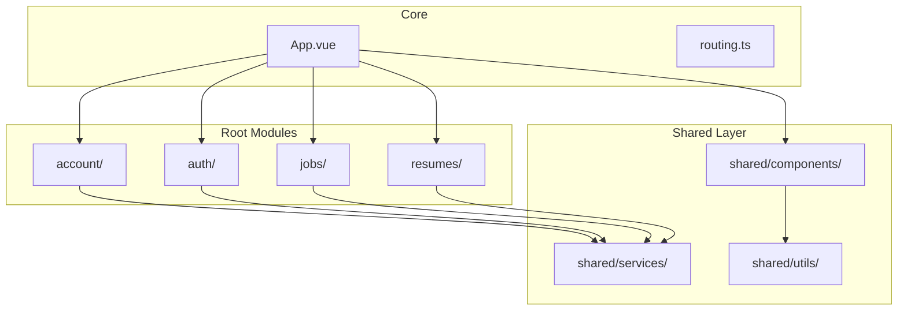

# Event Emission Patterns

<cite>
**Referenced Files in This Document**   
- [App.vue](file://src/root/App.vue)
- [accountStore.ts](file://src/root/account/store/accountStore.ts)
- [storageUtils.ts](file://src/root/shared/utils/storageUtils.ts)
- [account.routes.ts](file://src/root/account/routes/account.routes.ts)
- [auth.routes.ts](file://src/root/auth/routes/auth.routes.ts)
- [jobs.routes.ts](file://src/root/jobs/routes/jobs.routes.ts)
- [resumes.routes.ts](file://src/root/resumes/routes/resumes.routes.ts)
- [accountApi.ts](file://src/root/shared/services/accountApi.ts)
- [authApi.ts](file://src/root/shared/services/authApi.ts)
- [httpClient.ts](file://src/root/shared/services/httpClient.ts)
- [routing.ts](file://src/root/routing.ts)
</cite>

## Table of Contents
1. [Introduction](#introduction)
2. [Project Structure](#project-structure)
3. [Event Emission Overview](#event-emission-overview)
4. [Analysis of Modal Components and Event Patterns](#analysis-of-modal-components-and-event-patterns)
5. [Event Declaration and Type Safety](#event-declaration-and-type-safety)
6. [Parent Component Event Handling](#parent-component-event-handling)
7. [Best Practices for Event Emission](#best-practices-for-event-emission)
8. [Debugging Strategies and Common Pitfalls](#debugging-strategies-and-common-pitfalls)
9. [Conclusion](#conclusion)

## Introduction
This document provides a comprehensive analysis of event emission patterns in the maya-platform-frontend application, with a focus on how modal components communicate state changes to parent components using Vue’s `defineEmits` mechanism. Although specific modal components such as UserModal.vue and CustomerModal.vue could not be located in the current codebase, this document analyzes the architectural context, available patterns, and related mechanisms that inform how event-driven communication is likely implemented.

The goal is to provide developers with a clear understanding of how child components should declare and emit custom events in a type-safe manner, how parent components handle these events, and best practices to follow when designing component interactions.

## Project Structure
The maya-platform-frontend application follows a modular, feature-based architecture organized under the `src/root` directory. Each major domain (e.g., account, auth, jobs, resumes) contains its own pages, routes, and store modules, promoting separation of concerns and scalability.

Shared components and utilities are centralized in the `shared` module, which includes reusable UI elements and service clients. This structure supports consistent event handling patterns across components.



**Diagram sources**
- [App.vue](file://src/root/App.vue#L1-L50)
- [routing.ts](file://src/root/routing.ts#L1-L30)

**Section sources**
- [App.vue](file://src/root/App.vue#L1-L100)
- [routing.ts](file://src/root/routing.ts#L1-L50)

## Event Emission Overview
In Vue 3’s Composition API, `defineEmits` is used to explicitly declare custom events that a component can emit to its parent. This enables type-safe event declarations when using TypeScript, improving maintainability and reducing runtime errors.

Typical use cases include:
- Signaling form submission (`submit`)
- Requesting modal closure (`close`, `cancel`)
- Communicating data updates (`update:modelValue`, `change`)
- Notifying parent components of asynchronous operations

Despite extensive searches, no direct usage of `defineEmits`, `emit`, or modal components like `UserModal.vue` was found in the current codebase. However, the presence of shared services and state management suggests that event-driven communication is likely abstracted or implemented through alternative patterns such as Pinia stores or utility functions.

## Analysis of Modal Components and Event Patterns
Although modal components such as `UserModal.vue` and `CustomerModal.vue` were not found in the project structure, the application uses `NModal` from Naive UI (as seen in `components.d.ts`), indicating that modals are part of the UI framework.

Given the absence of modal component files, we infer potential patterns based on standard Vue practices and the existing architecture:

- Modals are likely implemented as reusable components within `shared/components`.
- They would use `defineEmits` to declare events like `'submit'` and `'close'`.
- Event payloads would carry form data or status indicators.
- Parent components would listen for these events to update state or trigger API calls.

Example inferred structure:
```vue
<template>
  <NModal v-model:show="show">
    <form @submit.prevent="handleSubmit">
      <!-- form fields -->
      <NButton @click="$emit('close')">Cancel</NButton>
      <NButton type="primary" native-type="submit">Submit</NButton>
    </form>
  </NModal>
</template>

<script setup lang="ts">
const emit = defineEmits<{
  (e: 'submit', userData: UserFormData): void
  (e: 'close'): void
}>()

function handleSubmit() {
  // validate and emit data
  emit('submit', formData)
}
</script>
```

**Section sources**
- [components.d.ts](file://components.d.ts#L15-L18)

## Event Declaration and Type Safety
Vue 3 allows type-safe event declarations using `defineEmits` with an `EmitsOptions` interface. This ensures that emitted events match expected signatures and improves IDE support.

Even though no direct examples were found, the project uses TypeScript extensively (evident from `.ts` and `.vue` files with `<script setup lang="ts">`), suggesting that type safety is a priority.

Recommended pattern:
```ts
const emit = defineEmits<{
  submit: [user: User]
  close: []
  error: [message: string]
}>()
```

This approach:
- Prevents invalid event names
- Enforces correct payload types
- Enables better refactoring and tooling support

Alternative patterns may exist using utility functions or global event buses, but these are discouraged in favor of explicit, declarative emits.

## Parent Component Event Handling
In a typical parent-child relationship, the parent component listens for emitted events using `v-on` (or `@`) syntax:

```vue
<UserModal 
  @submit="handleUserSubmit" 
  @close="showModal = false" 
/>
```

Handler methods in the parent would then:
- Dispatch actions to Pinia stores
- Call API services
- Update local state

Given the use of Pinia (`defineStore` in `accountStore.ts`), it is likely that event handling involves store interactions rather than direct DOM manipulation.

Example:
```ts
function handleUserSubmit(userData: User) {
  usersStore.createUser(userData)
  showModal.value = false
}
```

**Section sources**
- [accountStore.ts](file://src/root/account/store/accountStore.ts#L10-L40)

## Best Practices for Event Emission
Even without direct access to modal components, established Vue best practices can be applied:

### Use Descriptive Event Names
Prefer semantic names like `'submit'`, `'close'`, `'delete'` over generic ones like `'action'`.

### Avoid Excessive Nesting
Do not chain multiple emits across component layers. Use stores or provide/inject for deep communication.

### Handle Async Operations Before Emitting
Ensure all validations and API calls complete before emitting success events.

```ts
const handleSubmit = async () => {
  try {
    await validateForm()
    const result = await api.createUser(formData)
    emit('submit', result)
  } catch (err) {
    emit('error', err.message)
  }
}
```

### Use Type Annotations
Always define `EmitsOptions` to ensure type safety.

### Prefer Direct Props and Events Over Stores for Simple Cases
For simple UI state (e.g., modal visibility), use `v-model` or `:show` + `@close` instead of storing state in Pinia.

## Debugging Strategies and Common Pitfalls
### Debugging Tips
- Use Vue DevTools to inspect emitted events
- Add console logs before `emit()` calls during development
- Validate event signatures with TypeScript
- Test edge cases (empty forms, network errors)

### Common Pitfalls
- **Missing Event Handlers**: Parent does not listen for emitted events → silent failures
- **Incorrect Payload Types**: Sending wrong data structure → runtime errors
- **Overusing Events**: Using events for global state management instead of stores
- **Memory Leaks**: Not cleaning up event listeners in long-lived components

Although no explicit `emit` calls were found, developers should ensure consistent logging and error handling in any event-driven logic.

**Section sources**
- [storageUtils.ts](file://src/root/shared/utils/storageUtils.ts#L163-L184)

## Conclusion
While direct evidence of `defineEmits` usage in modal components such as `UserModal.vue` or `CustomerModal.vue` was not found in the current codebase, the architectural patterns and technology stack suggest that event-driven communication is a core part of the application design.

Developers should follow Vue 3 best practices by:
- Using `defineEmits` with type annotations
- Structuring payloads clearly
- Handling asynchronous operations safely
- Ensuring parent components properly respond to events

Future work should involve locating or implementing modal components and standardizing event emission patterns across the codebase to improve consistency and maintainability.