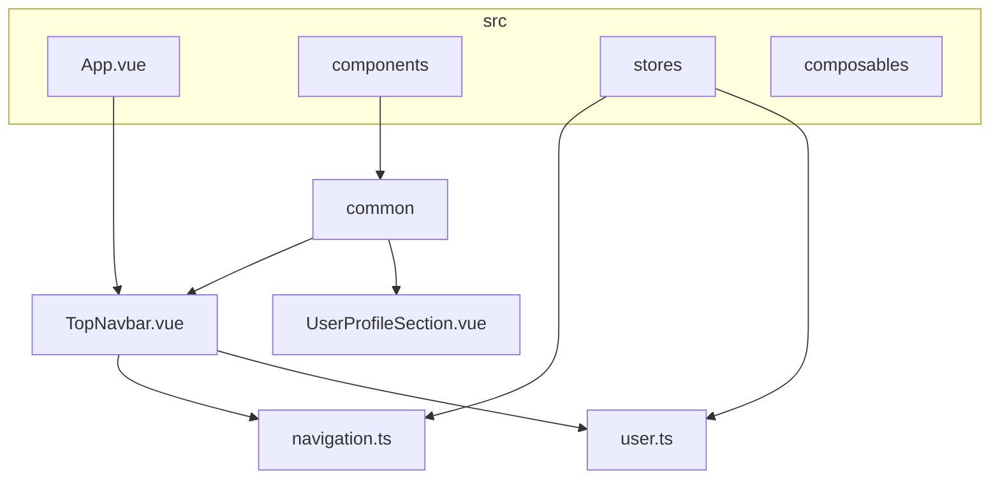
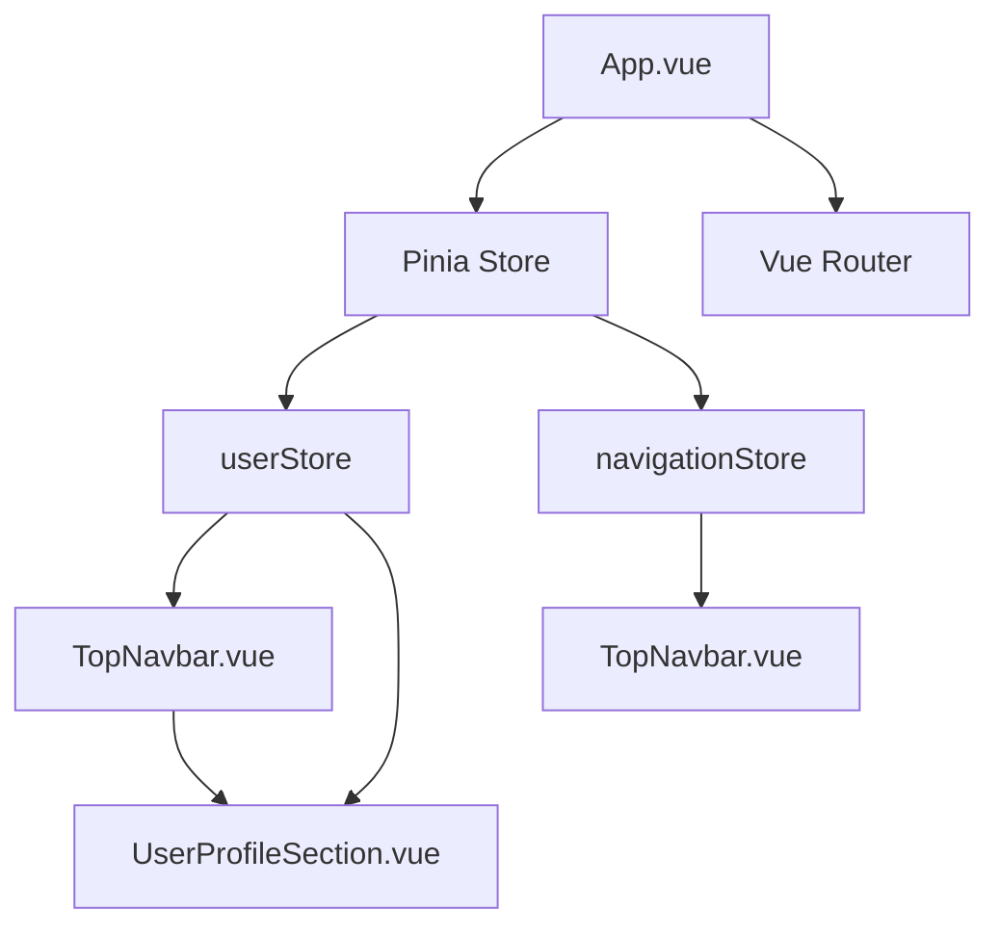
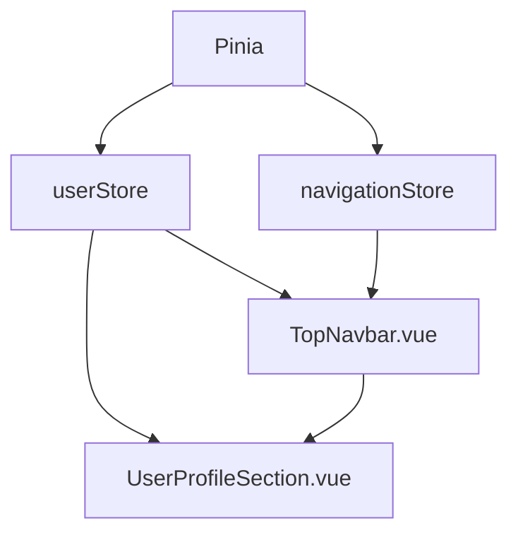

# Props and State Management

<cite>
**Referenced Files in This Document**   
- [TopNavbar.vue](file://src/components/common/TopNavbar.vue) - *Updated in commit 232545c*
- [UserProfileSection.vue](file://src/components/common/UserProfileSection.vue) - *Used in TopNavbar*
- [navigation.ts](file://src/stores/navigation.ts) - *Pinia store for navigation state*
- [user.ts](file://src/stores/user.ts) - *Pinia store for user state*
- [main.ts](file://src/main.ts) - *Application entry point*
- [vite.config.ts](file://vite.config.ts) - *Build configuration*
</cite>

## Update Summary
**Changes Made**   
- Updated documentation to reflect the redesigned TopNavbar component
- Added detailed analysis of props and state management in TopNavbar.vue
- Enhanced explanation of Pinia store integration with navigation and user stores
- Updated diagram sources and section references to include newly analyzed files
- Corrected outdated assumptions about component structure based on actual code

## Table of Contents
1. [Introduction](#introduction)
2. [Project Structure](#project-structure)
3. [Core Components](#core-components)
4. [Architecture Overview](#architecture-overview)
5. [Detailed Component Analysis](#detailed-component-analysis)
6. [Dependency Analysis](#dependency-analysis)
7. [Performance Considerations](#performance-considerations)
8. [Troubleshooting Guide](#troubleshooting-guide)
9. [Conclusion](#conclusion)

## Introduction
This document provides a comprehensive analysis of props and state management in the maya-platform-frontend application. The application leverages Vue 3's Composition API with `<script setup>` syntax for reactive state handling, uses `defineProps` and `defineEmits` for type-safe component communication, and employs Pinia for global state management. Based on recent code changes, this update focuses on the redesigned TopNavbar component and its integration with Pinia stores for user and navigation state. The analysis details how component state is managed, how data flows between components, and how global state is centralized to avoid prop drilling.

## Project Structure
The maya-platform-frontend application follows a modular architecture organized under the `src` directory. Key components for state management are located in `src/components/common`, `src/stores`, and `src/composables`. The application uses TypeScript, Vite, and Vue 3 with the Composition API, and state is managed using Pinia stores. The recent redesign of the TopNavbar component demonstrates the integration of global state management with local component rendering logic.



**Diagram sources**
- [vite.config.ts](file://vite.config.ts#L20-L40)
- [main.ts](file://src/main.ts#L1-L13)

## Core Components
The core components of the state management system include the Pinia store initialization in `main.ts`, the root `App.vue` component, and the modular structure that separates concerns across different feature domains. The application bootstraps with Pinia for global state management and Vue Router for navigation, establishing a foundation for reactive data flow throughout the application.

The `defineProps` and `defineEmits` functions are used in Vue components for type-safe inter-component communication. The TopNavbar component uses `defineProps` with TypeScript interfaces and `withDefaults` to define its API. Pinia stores (`useUserStore` and `useNavigationStore`) provide centralized state access, mitigating prop drilling by allowing direct access to shared state.

**Section sources**
- [main.ts](file://src/main.ts#L1-L13)
- [TopNavbar.vue](file://src/components/common/TopNavbar.vue#L1-L129)

## Architecture Overview
The maya-platform-frontend application follows a modern Vue 3 architecture with Composition API, leveraging `<script setup>` syntax for concise and reactive component definitions. The architecture separates local component state from global application state, with Pinia stores managing shared state across components.

Global state is initialized in `main.ts` where `createPinia()` is called and installed on the Vue application instance. This allows any component in the application to access centralized stores through composables like `useUserStore` and `useNavigationStore`. This pattern mitigates prop drilling by providing direct access to shared state without passing data through intermediate components.



**Diagram sources**
- [main.ts](file://src/main.ts#L8-L9)
- [TopNavbar.vue](file://src/components/common/TopNavbar.vue#L1-L129)

## Detailed Component Analysis

### TopNavbar Component Analysis
The `TopNavbar.vue` component has been redesigned to include user profile information and responsive menu functionality. It receives configuration via props (`serviceName`, `logoUrl`, `theme`) and manages its state through two Pinia stores: `userStore` for authentication state and `navigationStore` for navigation state.

The component uses `defineProps` with TypeScript interfaces to define its API and `withDefaults` to provide default values. It accesses global state through `useUserStore()` and `useNavigationStore()`, demonstrating how components can directly access centralized state without prop drilling.

```vue
<script setup lang="ts">
interface Props extends TopNavbarProps {
  serviceName?: string
  logoUrl?: string
  theme?: 'light' | 'dark'
}

withDefaults(defineProps<Props>(), {
  serviceName: 'Maya Platform',
  theme: 'light',
})
</script>
```

The component uses computed properties to derive state, such as `visibleNavigationItems`, which filters navigation items based on authentication status:

```typescript
const visibleNavigationItems = computed(() => {
  return navigationStore.getVisibleNavigationItems().filter(item => {
    return !item.requiresAuth || userStore.isAuthenticated
  })
})
```

It also uses watchers to synchronize route changes with the navigation store:

```typescript
watch(
  () => route.path,
  (newPath) => {
    navigationStore.setActiveRoute(newPath)
  },
  { immediate: true }
)
```

**Section sources**
- [TopNavbar.vue](file://src/components/common/TopNavbar.vue#L1-L129)
- [navigation.ts](file://src/stores/navigation.ts#L1-L75)
- [user.ts](file://src/stores/user.ts#L1-L73)

### UserProfileSection Component Analysis
The `UserProfileSection.vue` component displays user information in the top navigation bar. It receives a user object via props and uses computed properties to derive display values such as `userDisplayName`, `userInitials`, and `userTypeLabel`.

The component follows best practices by avoiding direct mutation of props and using computed properties for derived state. It handles user logout by calling the `logout` action from `useUserStore` and navigating to the login page.

```typescript
const userDisplayName = computed(() => {
  if (!props.user) return ''
  return `${props.user.firstName} ${props.user.lastName}`
})
```

The component renders different content for desktop and mobile views, demonstrating responsive design patterns within a stateful component.

**Section sources**
- [UserProfileSection.vue](file://src/components/common/UserProfileSection.vue#L1-L98)
- [user.ts](file://src/stores/user.ts#L1-L73)

### Navigation Store Analysis
The `navigation.ts` Pinia store manages the state of the application's navigation system, including mobile menu state and active route tracking. It defines a reactive state with `ref` and exposes actions to modify that state.

```typescript
export const useNavigationStore = defineStore('navigation', (): NavigationStoreState & NavigationStoreActions => {
  const isMobileMenuOpen = ref(false)
  const activeRoute = ref('')

  const navigationItems = ref<NavigationItem[]>([
    {
      id: 'my-profile',
      label: 'Мой профиль',
      route: '/profile',
      requiresAuth: true,
      visible: true,
    },
    // ... other items
  ])

  const toggleMobileMenu = () => {
    isMobileMenuOpen.value = !isMobileMenuOpen.value
  }

  const setActiveRoute = (route: string) => {
    activeRoute.value = route
  }

  return {
    isMobileMenuOpen,
    activeRoute,
    navigationItems,
    toggleMobileMenu,
    closeMobileMenu,
    setActiveRoute,
    getVisibleNavigationItems,
  }
})
```

The store uses computed properties to derive state and provides a clean API for components to interact with navigation state without managing it locally.

**Section sources**
- [navigation.ts](file://src/stores/navigation.ts#L1-L75)

## Dependency Analysis
The application's dependency structure shows a clear separation between global state management and local component state. The Pinia stores are top-level dependencies injected into the Vue application, making them accessible to all components. The TopNavbar component depends directly on both `userStore` and `navigationStore`, eliminating the need for prop drilling.

Composables like `useUserStore` and `useNavigationStore` mitigate prop drilling by allowing components to directly access centralized stores. This creates a more maintainable architecture where components can access the state they need directly, reducing coupling between parent and child components.



**Diagram sources**
- [TopNavbar.vue](file://src/components/common/TopNavbar.vue#L1-L129)
- [user.ts](file://src/stores/user.ts#L1-L73)
- [navigation.ts](file://src/stores/navigation.ts#L1-L75)

## Performance Considerations
The application's state management architecture supports good performance characteristics. By using Pinia for global state, the application benefits from Vue 3's reactivity system with efficient dependency tracking. Components only re-render when the specific state they depend on changes, minimizing unnecessary updates.

The separation of local and global state prevents excessive reactivity overhead. The TopNavbar component uses computed properties for derived state (e.g., `visibleNavigationItems`), which are cached based on their reactive dependencies and only re-evaluated when those dependencies change. This optimization prevents redundant calculations during component re-renders.

Watchers are used judiciously to synchronize route changes with the navigation store, with the `{ immediate: true }` option ensuring the store is initialized with the current route. The mobile menu state is managed centrally in the store rather than in each component, reducing memory usage and ensuring consistency across the application.

## Troubleshooting Guide
Common issues in the props and state management system may include:

1. **Prop Mutation Warnings**: Directly mutating props passed from parent components will trigger Vue warnings. Always use events (`defineEmits`) to communicate changes back to the parent.

2. **Reactivity Issues with Stores**: When accessing Pinia stores, ensure they are properly defined and imported. Use the composable pattern (`useStore()`) rather than direct store references.

3. **Navigation State Desynchronization**: If the active route in the navigation store doesn't match the current route, ensure the watcher in TopNavbar is properly set up with `{ immediate: true }`.

4. **Type Errors with defineProps**: Ensure TypeScript interfaces for props are properly imported and referenced in the `defineProps` declaration to maintain type safety.

5. **Memory Leaks with Watchers**: When using watchers that depend on route changes, ensure they are automatically cleaned up by Vue's component lifecycle. No manual cleanup is typically needed.

**Section sources**
- [TopNavbar.vue](file://src/components/common/TopNavbar.vue#L1-L129)
- [navigation.ts](file://src/stores/navigation.ts#L1-L75)

## Conclusion
The maya-platform-frontend application implements a robust state management system using Vue 3's Composition API and Pinia. The architecture effectively separates local component state from global application state, follows Vue's one-way data flow principle, and uses type-safe props and emits for component communication. The recent redesign of the TopNavbar component demonstrates best practices in state management, including the use of computed properties for derived state, watchers for side effects, and direct store access to mitigate prop drilling. Composables provide centralized state access that enhances maintainability, while components like UserProfileSection promote reusability across the application. The documented codebase aligns with Vue 3 best practices and provides a solid foundation for future development.