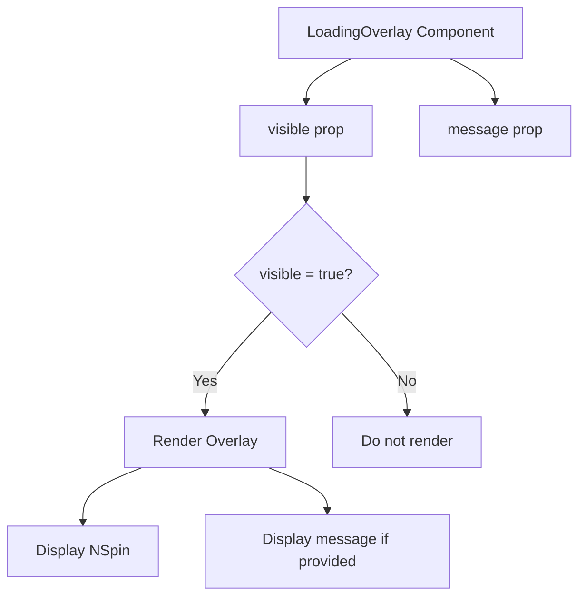
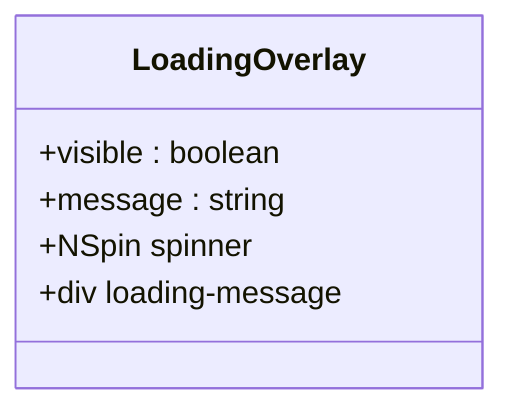
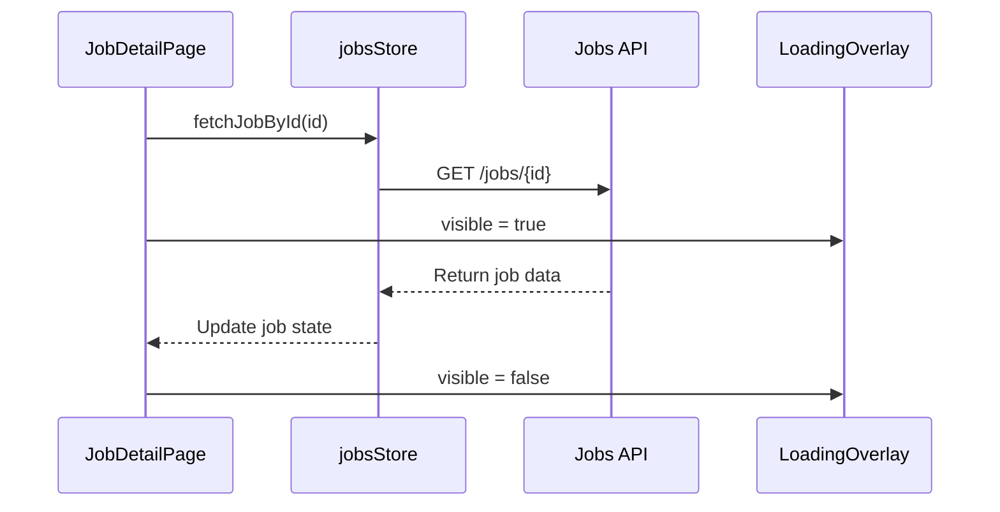
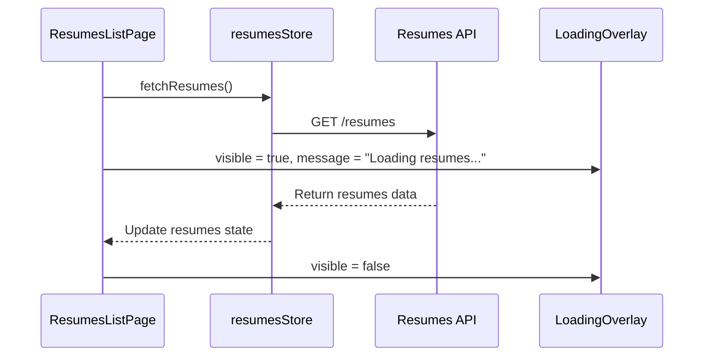
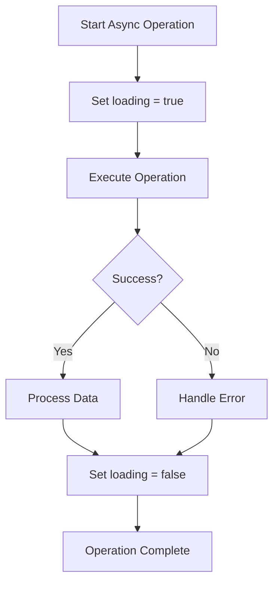
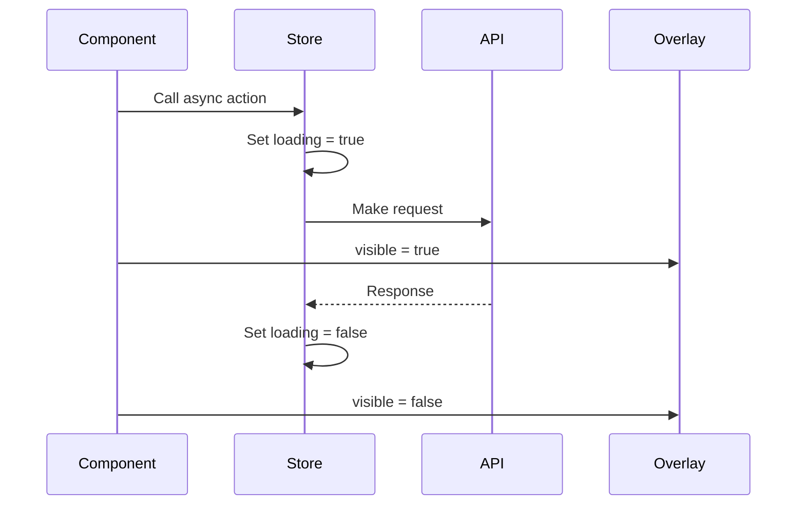

# LoadingOverlay Component

<cite>
**Referenced Files in This Document**   
- [LoadingOverlay.vue](file://src/root/shared/components/LoadingOverlay.vue)
- [JobsListPage.vue](file://src/root/jobs/pages/JobsListPage.vue)
- [JobDetailPage.vue](file://src/root/jobs/pages/JobDetailPage.vue)
- [ResumesListPage.vue](file://src/root/resumes/pages/ResumesListPage.vue)
- [jobsStore.ts](file://src/root/jobs/store/jobsStore.ts)
- [resumesStore.ts](file://src/root/resumes/store/resumesStore.ts)
</cite>

## Table of Contents
1. [Introduction](#introduction)
2. [Component Overview](#component-overview)
3. [Props and Configuration](#props-and-configuration)
4. [Integration with Vue Reactivity](#integration-with-vue-reactivity)
5. [Styling and SCSS Implementation](#styling-and-scss-implementation)
6. [Practical Usage Examples](#practical-usage-examples)
7. [Animation and Accessibility Features](#animation-and-accessibility-features)
8. [Performance Considerations](#performance-considerations)
9. [Common Issues and Solutions](#common-issues-and-solutions)
10. [Pinia Store Integration](#pinia-store-integration)

## Introduction
The LoadingOverlay component is a reusable UI element designed to indicate loading states across various feature modules in the maya-platform-frontend application. It provides visual feedback during asynchronous operations such as data fetching, form submissions, or API calls. This documentation details its implementation, usage patterns, integration with Vue's reactivity system, and best practices for effective utilization.

**Section sources**
- [LoadingOverlay.vue](file://src/root/shared/components/LoadingOverlay.vue#L1-L50)

## Component Overview
The LoadingOverlay component is a modal-style overlay that covers the entire viewport when active, displaying a loading spinner and an optional message. It is implemented as a standalone Vue component using the Composition API with TypeScript support. The component is designed to be simple, accessible, and easily integrable into any page or component that requires loading state indication.

The overlay uses a semi-transparent white background (80% opacity) to dim the underlying content while maintaining visibility of the page structure. It centers a large spinner from the Naive UI library (NSpin) with an optional text message below it. The component is conditionally rendered using `v-if` based on the `visible` prop, ensuring it only exists in the DOM when needed.



**Diagram sources**
- [LoadingOverlay.vue](file://src/root/shared/components/LoadingOverlay.vue#L1-L50)

**Section sources**
- [LoadingOverlay.vue](file://src/root/shared/components/LoadingOverlay.vue#L1-L50)

## Props and Configuration
The LoadingOverlay component accepts two optional props that control its behavior and appearance:

**:Props**
- `visible`: boolean (default: false) - Controls the visibility of the overlay. When set to true, the overlay is displayed; when false, it is completely removed from the DOM.
- `message`: string (default: '') - An optional message displayed below the loading spinner. This can be used to provide context about what is currently loading.

The component uses `withDefaults` to define default values for these props, making them optional when using the component. This approach simplifies usage while maintaining flexibility for customization.



**Diagram sources**
- [LoadingOverlay.vue](file://src/root/shared/components/LoadingOverlay.vue#L1-L50)

**Section sources**
- [LoadingOverlay.vue](file://src/root/shared/components/LoadingOverlay.vue#L1-L50)

## Integration with Vue Reactivity
The LoadingOverlay component integrates seamlessly with Vue's reactivity system through its props. The `visible` prop is typically bound to a reactive state variable in parent components, allowing the overlay to respond immediately to changes in loading states. This reactivity enables real-time updates without requiring manual DOM manipulation.

When the `visible` prop changes, Vue's reactivity system automatically handles the rendering or removal of the overlay element. The use of `v-if` (rather than `v-show`) ensures the component is completely removed from the DOM when not visible, reducing memory usage and improving performance.

**Section sources**
- [LoadingOverlay.vue](file://src/root/shared/components/LoadingOverlay.vue#L1-L50)

## Styling and SCSS Implementation
The LoadingOverlay component uses scoped SCSS for styling, ensuring its styles do not leak to other components. The styling leverages CSS custom properties (variables) from the global theme, maintaining consistency with the application's design system.

**:CSS Properties**
- Positioning: Fixed positioning to cover the entire viewport (top: 0, left: 0, width: 100%, height: 100%)
- Background: Semi-transparent white (rgba(255, 255, 255, 0.8)) to dim underlying content
- Layout: Flexbox with center alignment for both horizontal and vertical centering
- Z-index: 1000 to ensure the overlay appears above all other content
- Spacing: Uses CSS custom properties (var(--spacing-4)) for gap between spinner and message
- Typography: Uses global font size and color variables for message styling

The component's styling is responsive and will work across different screen sizes and orientations. The use of CSS variables allows for easy theme customization without modifying the component's source code.

**Section sources**
- [LoadingOverlay.vue](file://src/root/shared/components/LoadingOverlay.vue#L30-L50)

## Practical Usage Examples
The LoadingOverlay component is used in various pages throughout the application where asynchronous data fetching occurs. Below are practical examples of its implementation:

### JobDetailPage Implementation
In the JobDetailPage, the LoadingOverlay can replace the current inline spinner implementation. Instead of using a simple NSpin, the page can use the LoadingOverlay for a more immersive loading experience when fetching job details.



**Diagram sources**
- [JobDetailPage.vue](file://src/root/jobs/pages/JobDetailPage.vue#L141-L227)
- [jobsStore.ts](file://src/root/jobs/store/jobsStore.ts#L0-L46)

### ResumesListPage Implementation
The ResumesListPage currently uses a simple centered spinner during loading. It can be enhanced by using the LoadingOverlay component with a message like "Loading resumes..." to provide better user feedback.



**Diagram sources**
- [ResumesListPage.vue](file://src/root/resumes/pages/ResumesListPage.vue#L0-L59)
- [resumesStore.ts](file://src/root/resumes/store/resumesStore.ts#L0-L46)

**Section sources**
- [JobDetailPage.vue](file://src/root/jobs/pages/JobDetailPage.vue#L141-L227)
- [ResumesListPage.vue](file://src/root/resumes/pages/ResumesListPage.vue#L0-L59)
- [jobsStore.ts](file://src/root/jobs/store/jobsStore.ts#L0-L46)
- [resumesStore.ts](file://src/root/resumes/store/resumesStore.ts#L0-L46)

## Animation and Accessibility Features
The LoadingOverlay component includes several accessibility and user experience features:

**:Accessibility Attributes**
- Implicit ARIA role: The overlay naturally creates a modal context that screen readers can interpret
- Focus management: Although not explicitly implemented, the overlay should be enhanced with focus trapping for accessibility compliance
- Visual contrast: The spinner and text maintain sufficient contrast against the semi-transparent background

The component currently lacks explicit animation definitions, relying on the default animations of the NSpin component from Naive UI. For improved user experience, CSS transitions could be added to the overlay's appearance and disappearance to prevent abrupt changes.

The loading message is conditionally rendered using `v-if`, ensuring that screen readers only announce the message when it is present. This prevents unnecessary announcements when no descriptive text is provided.

**Section sources**
- [LoadingOverlay.vue](file://src/root/shared/components/LoadingOverlay.vue#L1-L50)

## Performance Considerations
When toggling the visibility of the LoadingOverlay, several performance considerations should be addressed:

- **DOM Manipulation**: Using `v-if` instead of `v-show` means the component is completely removed from the DOM when not visible, which reduces memory usage but may cause slight rendering overhead when toggling frequently.
- **Reactivity Overhead**: The component responds immediately to changes in the `visible` prop due to Vue's efficient reactivity system.
- **Z-index Management**: The fixed z-index of 1000 ensures the overlay appears above other content but may conflict with other high-z-index elements in complex UIs.

For optimal performance, the LoadingOverlay should only be used for significant loading operations (typically > 300ms) to avoid flickering. For very brief operations, a simple inline spinner might provide a better user experience.

**Section sources**
- [LoadingOverlay.vue](file://src/root/shared/components/LoadingOverlay.vue#L36)

## Common Issues and Solutions
Several common issues may arise when using the LoadingOverlay component:

### Overlay Stacking
When multiple loading operations occur simultaneously, multiple overlays may appear, creating a stacking effect. This can be prevented by using a single global loading state managed by a Pinia store.

### Z-index Conflicts
The fixed z-index of 1000 may conflict with other elements that have higher z-index values. This can be resolved by either increasing the overlay's z-index or ensuring consistent z-index management across the application.

### Incorrect Visibility Toggling
Issues may occur when the `visible` prop is not properly synchronized with the actual loading state. This can be mitigated by using try-catch-finally blocks in asynchronous operations to ensure the loading state is always reset.



**Diagram sources**
- [jobsStore.ts](file://src/root/jobs/store/jobsStore.ts#L44-L89)
- [resumesStore.ts](file://src/root/resumes/store/resumesStore.ts#L44-L89)

**Section sources**
- [jobsStore.ts](file://src/root/jobs/store/jobsStore.ts#L44-L89)
- [resumesStore.ts](file://src/root/resumes/store/resumesStore.ts#L44-L89)

## Pinia Store Integration
The LoadingOverlay component is designed to work seamlessly with Pinia stores to manage loading states across different feature modules. Both the jobsStore and resumesStore expose a `loading` state that can be directly bound to the overlay's `visible` prop.

### jobsStore Integration
The jobsStore manages a global loading state that reflects the status of all job-related operations. Components can import the store and bind the loading state to the LoadingOverlay:

```typescript
const jobsStore = useJobsStore()
// In template: <LoadingOverlay :visible="jobsStore.loading" />
```

### resumesStore Integration
Similarly, the resumesStore provides a centralized loading state for resume-related operations:

```typescript
const resumesStore = useResumesStore()
// In template: <LoadingOverlay :visible="resumesStore.loading" />
```

This pattern ensures consistent loading state management across the application and prevents issues with multiple independent loading indicators. The store's loading state is automatically updated in try-catch-finally blocks within async actions, guaranteeing it is always reset regardless of operation outcome.



**Diagram sources**
- [jobsStore.ts](file://src/root/jobs/store/jobsStore.ts#L0-L197)
- [resumesStore.ts](file://src/root/resumes/store/resumesStore.ts#L0-L190)

**Section sources**
- [jobsStore.ts](file://src/root/jobs/store/jobsStore.ts#L0-L197)
- [resumesStore.ts](file://src/root/resumes/store/resumesStore.ts#L0-L190)