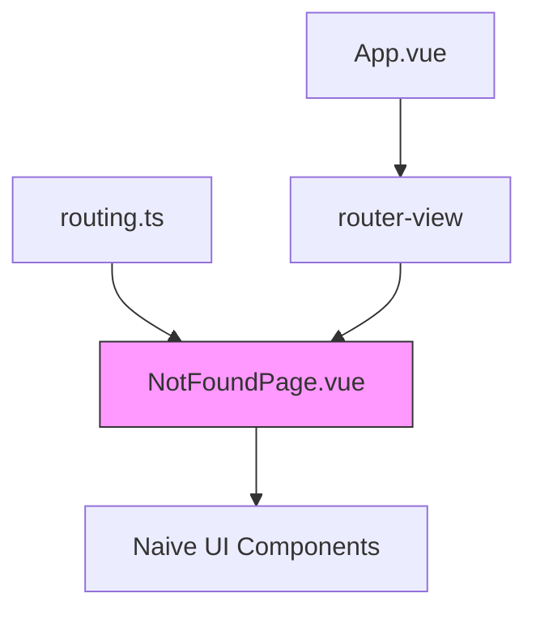
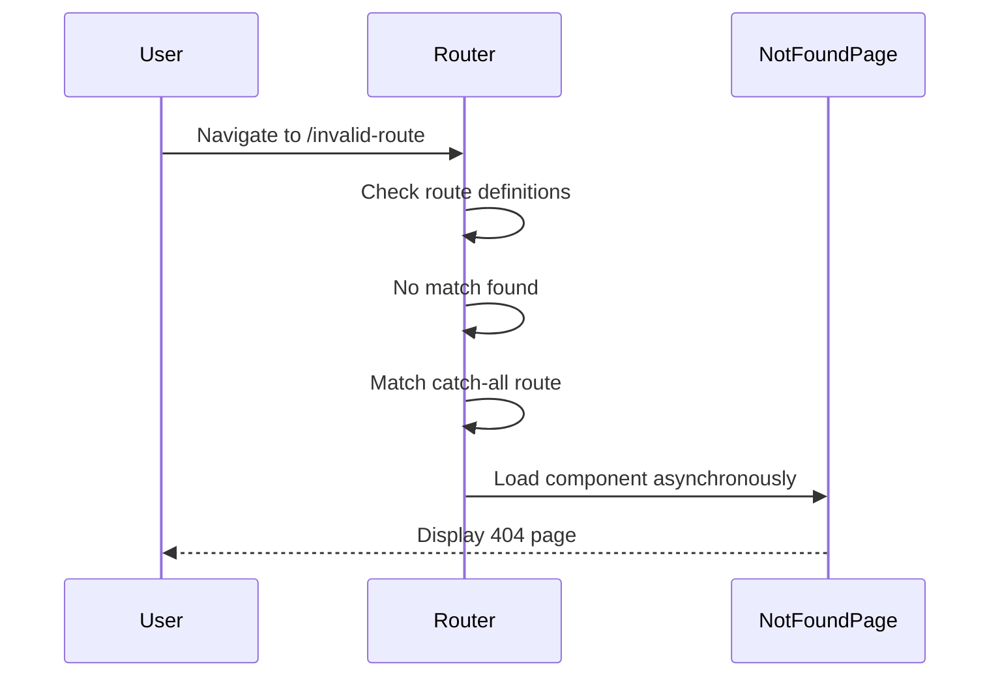
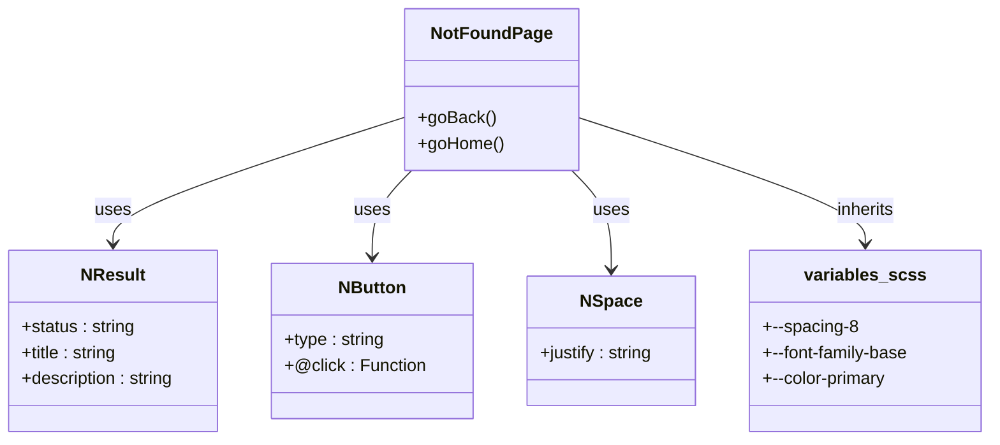

# NotFoundPage Component

<cite>
**Referenced Files in This Document**  
- [NotFoundPage.vue](file://src/root/shared/components/NotFoundPage.vue)
- [routing.ts](file://src/root/routing.ts)
- [main.scss](file://src/styles/main.scss)
- [variables.scss](file://src/styles/variables/_colors.scss)
- [variables.scss](file://src/styles/variables/_spacing.scss)
- [App.vue](file://src/root/App.vue)
</cite>

## Table of Contents
1. [Introduction](#introduction)
2. [Project Structure Context](#project-structure-context)
3. [Component Overview](#component-overview)
4. [Routing Integration](#routing-integration)
5. [Visual Structure and Styling](#visual-structure-and-styling)
6. [Navigation Recovery Logic](#navigation-recovery-logic)
7. [Theming and Design System Alignment](#theming-and-design-system-alignment)
8. [Accessibility and Internationalization](#accessibility-and-internationalization)
9. [SEO Implications](#seo-implications)
10. [User Experience Considerations](#user-experience-considerations)

## Introduction
The `NotFoundPage` component serves as the global 404 error handler in the `maya-platform-frontend` application. It is displayed whenever a user navigates to a route that does not exist within the application's routing configuration. This document provides a comprehensive analysis of its implementation, integration with Vue Router, visual design, and role in enhancing user experience during navigation errors.

**Section sources**
- [NotFoundPage.vue](file://src/root/shared/components/NotFoundPage.vue#L1-L45)
- [routing.ts](file://src/root/routing.ts#L1-L45)

## Project Structure Context
The `NotFoundPage.vue` component resides in the shared components directory at `src/root/shared/components/`, indicating it is a reusable UI element available across multiple modules. It is part of a modular Vue.js application structured by feature domains such as auth, resumes, jobs, and account. The routing configuration is centralized in `src/root/routing.ts`, which dynamically imports this component for catch-all routes.



**Diagram sources**
- [routing.ts](file://src/root/routing.ts#L1-L45)
- [NotFoundPage.vue](file://src/root/shared/components/NotFoundPage.vue#L1-L45)

**Section sources**
- [routing.ts](file://src/root/routing.ts#L1-L45)
- [App.vue](file://src/root/App.vue#L1-L39)

## Component Overview
The `NotFoundPage` is a simple yet critical component that informs users when they attempt to access a non-existent page. It uses Naive UI's `NResult` component to display a structured error message with status code 404.

### Key Features:
- Displays a clear 404 status indicator
- Shows a descriptive error message in Russian (currently hardcoded)
- Provides two recovery navigation options: "Back" and "Go Home"
- Responsive layout centered vertically and horizontally
- Minimalist design consistent with the overall UI framework

```vue
<template>
  <div class="not-found__container">
    <NResult
      status="404"
      title="Страница не найдена"
      description="Запрашиваемая страница не существует или была перемещена"
    >
      <template #footer>
        <NSpace justify="center">
          <NButton @click="goBack">Назад</NButton>
          <NButton type="primary" @click="goHome">На главную</NButton>
        </NSpace>
      </template>
    </NResult>
  </div>
</template>
```

**Section sources**
- [NotFoundPage.vue](file://src/root/shared/components/NotFoundPage.vue#L1-L20)

## Routing Integration
The `NotFoundPage` is integrated into the Vue Router configuration as a catch-all route using a dynamic segment with a regex pattern that matches any path.

### Route Configuration:
```ts
{
  path: '/:pathMatch(.*)*',
  name: 'NotFound',
  component: () => import('@/root/shared/components/NotFoundPage.vue')
}
```

This route is placed at the end of the route list to ensure it only activates when no other route matches. It leverages dynamic import for code splitting, ensuring the component is only loaded when needed.

### Router Setup:
- Uses `createWebHistory` for clean URLs
- Applies global `authGuard` middleware
- Redirects root `/` to `/resumes` by default
- Handles asynchronous component loading



**Diagram sources**
- [routing.ts](file://src/root/routing.ts#L30-L40)

**Section sources**
- [routing.ts](file://src/root/routing.ts#L1-L45)

## Visual Structure and Styling
The component employs a clean, centered layout optimized for user readability and visual balance.

### Layout Properties:
- Flexbox-based centering (`align-items: center`, `justify-content: center`)
- Minimum height of `50vh` to prevent cramped appearance
- Responsive padding using SCSS variable `--spacing-8` (2rem / 32px)

### CSS Variables Used:
:root {
  --spacing-8: 2rem; // 32px
}

The container ensures the content remains visually balanced regardless of screen size, providing a professional and polished error experience.

```mermaid
flowchart TD
A[not-found__container] --> B[Flex Centering]
B --> C[Vertical Alignment]
B --> D[Horizontal Alignment]
C --> E[Min Height: 50vh]
D --> F[Padding: var(--spacing-8)]
E --> G[NResult Component]
F --> G
G --> H[Title & Description]
G --> I[Footer Actions]
```

**Diagram sources**
- [NotFoundPage.vue](file://src/root/shared/components/NotFoundPage.vue#L21-L45)
- [main.scss](file://src/styles/main.scss#L1-L31)

**Section sources**
- [NotFoundPage.vue](file://src/root/shared/components/NotFoundPage.vue#L21-L45)
- [main.scss](file://src/styles/main.scss#L1-L31)

## Navigation Recovery Logic
The component provides two intuitive navigation recovery options through Vue Router's navigation methods.

### Methods:
- `goBack()`: Uses `router.back()` to return to the previous page in history
- `goHome()`: Navigates to `/resumes` route using `router.push('/resumes')`

### Implementation:
```ts
const goBack = () => {
  router.back()
}

const goHome = () => {
  router.push('/resumes')
}
```

This dual-option approach gives users flexibility:
- **Back**: Return to where they came from (browser history-based)
- **Home**: Jump to a known valid location in the app (application-based)

The primary button style on "Go Home" emphasizes the recommended recovery path.

**Section sources**
- [NotFoundPage.vue](file://src/root/shared/components/NotFoundPage.vue#L25-L37)

## Theming and Design System Alignment
The component integrates with the application's design system through global SCSS variables and Naive UI theming.

### SCSS Variables Utilized:
- Spacing: `--spacing-8` (32px padding)
- Typography: Inherits from global `--font-family-base` and size variables
- Colors: Uses default Naive UI theme, which aligns with project color tokens

### Theme Consistency:
The styling leverages the imported SCSS architecture:
```scss
@import 'variables/colors';
@import 'variables/typography';
@import 'variables/spacing';
```

While the component itself doesn't directly reference color variables, it inherits the application's visual language through Naive UI's `NResult`, `NButton`, and `NSpace` components, which are configured in `App.vue` via `NConfigProvider`.



**Diagram sources**
- [NotFoundPage.vue](file://src/root/shared/components/NotFoundPage.vue#L1-L45)
- [variables.scss](file://src/styles/variables/_spacing.scss#L1-L37)
- [main.scss](file://src/styles/main.scss#L1-L31)

**Section sources**
- [NotFoundPage.vue](file://src/root/shared/components/NotFoundPage.vue#L1-L45)
- [main.scss](file://src/styles/main.scss#L1-L31)
- [variables.scss](file://src/styles/variables/_spacing.scss#L1-L37)

## Accessibility and Internationalization
While the component provides essential functionality, there are opportunities for improvement in accessibility and internationalization.

### Current State:
- **Language**: Text is hardcoded in Russian ("Страница не найдена", "Назад", "На главную")
- **Accessibility**: 
  - Uses semantic UI components from Naive UI
  - Interactive elements have click handlers
  - Lacks explicit ARIA labels or roles

### Recommendations:
- Implement i18n support using a translation service
- Extract text into language files
- Add `aria-label` attributes to buttons
- Ensure keyboard navigation works properly
- Include `lang` attribute on text elements

The error message pattern appears consistent with other application errors (e.g., job/resume not found pages), suggesting a potential pattern for centralized error messaging.

**Section sources**
- [NotFoundPage.vue](file://src/root/shared/components/NotFoundPage.vue#L4-L8)
- [apiUtils.ts](file://src/root/shared/utils/apiUtils.ts#L0-L46)
- [constants.ts](file://src/root/shared/utils/constants.ts#L108-L143)

## SEO Implications
The 404 page has important implications for search engine optimization and user retention.

### Best Practices Implemented:
- Clear 404 status communication
- Helpful guidance for users
- Navigation recovery options
- Clean URL handling

### Recommendations:
- Ensure server returns proper HTTP 404 status code
- Add `noindex` meta tag to prevent indexing of error pages
- Consider adding sitemap links or popular page suggestions
- Monitor 404 logs to identify broken links

The client-side nature of this implementation means additional server configuration may be needed for optimal SEO performance.

**Section sources**
- [NotFoundPage.vue](file://src/root/shared/components/NotFoundPage.vue#L1-L45)

## User Experience Considerations
The `NotFoundPage` plays a crucial role in maintaining positive user experience during navigation failures.

### UX Strengths:
- Immediate feedback on invalid navigation
- Clear explanation of the error
- Multiple recovery pathways
- Visually balanced, non-intimidating design
- Fast loading due to code splitting

### Enhancement Opportunities:
- Add search functionality to help users find content
- Include links to popular sections
- Show recently visited pages
- Provide feedback mechanism ("Was this page supposed to exist?")
- Add animated illustration for visual engagement

The component successfully transforms a potentially frustrating experience into a guided recovery process, aligning with modern UX best practices for error handling.

**Section sources**
- [NotFoundPage.vue](file://src/root/shared/components/NotFoundPage.vue#L1-L45)
- [routing.ts](file://src/root/routing.ts#L1-L45)