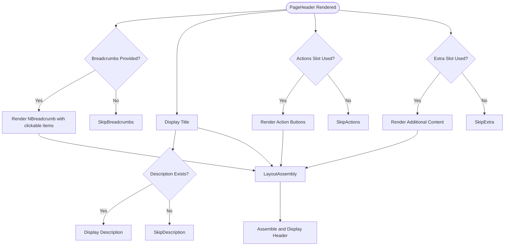
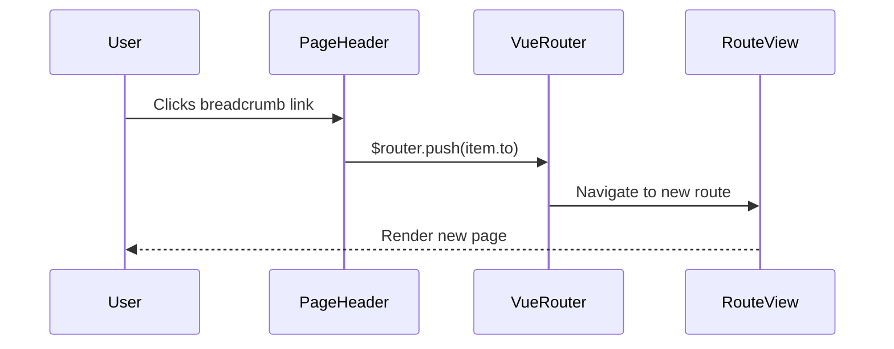
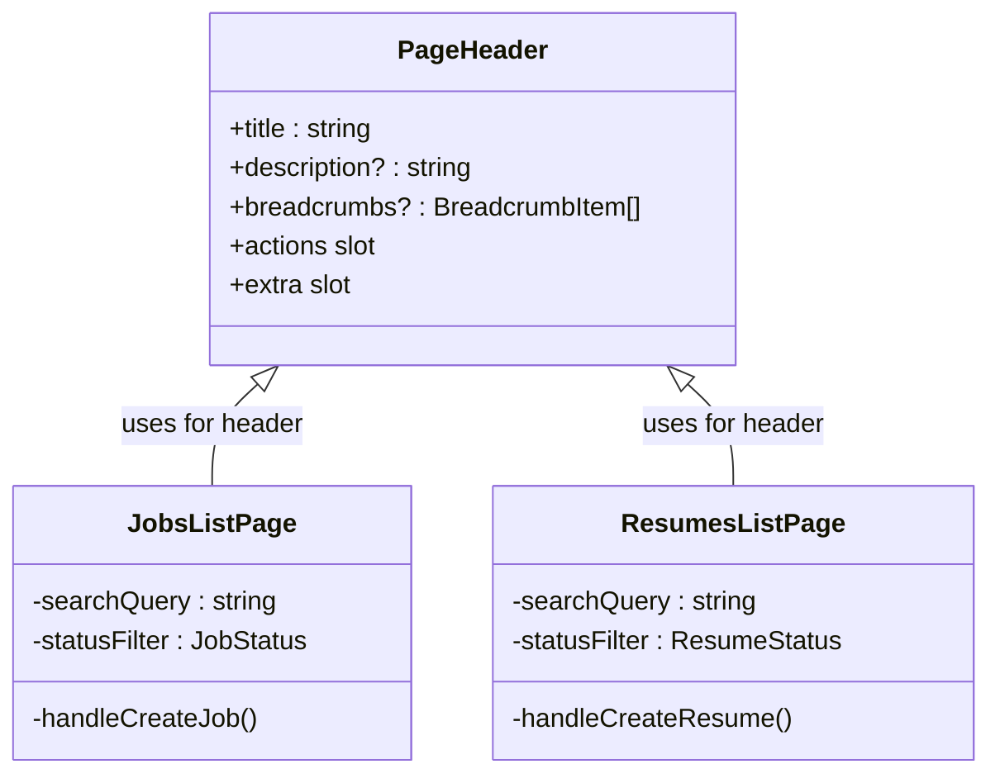

# PageHeader Component

<cite>
**Referenced Files in This Document**  
- [PageHeader.vue](file://src/root/shared/components/PageHeader.vue#L1-L105)
- [JobsListPage.vue](file://src/root/jobs/pages/JobsListPage.vue#L1-L552)
- [ResumesListPage.vue](file://src/root/resumes/pages/ResumesListPage.vue#L1-L393)
- [App.vue](file://src/root/App.vue#L1-L39)
</cite>

## Table of Contents
1. [Introduction](#introduction)
2. [Core Features and Purpose](#core-features-and-purpose)
3. [Props Interface](#props-interface)
4. [Slots Usage](#slots-usage)
5. [Styling and SCSS Modules](#styling-and-scss-modules)
6. [Integration with App.vue and Vue Router](#integration-with-appvue-and-vue-router)
7. [Real-World Usage Examples](#real-world-usage-examples)
8. [Responsive Design and Accessibility](#responsive-design-and-accessibility)
9. [Extensibility and Future Enhancements](#extensibility-and-future-enhancements)

## Introduction

The **PageHeader** component is a reusable UI element in the `maya-platform-frontend` application, designed to provide a consistent and structured header across various feature modules. It supports dynamic content rendering through props and slots, enabling flexible integration into different pages such as job listings, resume management, and other domain-specific views.

This documentation details the component’s structure, functionality, integration points, and usage patterns, ensuring clarity for developers and maintainers.

**Section sources**
- [PageHeader.vue](file://src/root/shared/components/PageHeader.vue#L1-L105)

## Core Features and Purpose

The `PageHeader` component serves as a standardized header across the application, ensuring visual and functional consistency. Its primary responsibilities include:

- Displaying the page title and optional description
- Rendering breadcrumb navigation for improved user orientation
- Hosting action buttons (e.g., "Create New Job") via named slots
- Supporting additional content below the main header via the `extra` slot

This component enhances user experience by providing clear navigation cues and accessible entry points to key actions.



**Diagram sources**
- [PageHeader.vue](file://src/root/shared/components/PageHeader.vue#L1-L105)

**Section sources**
- [PageHeader.vue](file://src/root/shared/components/PageHeader.vue#L1-L105)

## Props Interface

The component accepts a typed props interface defined using TypeScript. These props allow customization of the header's content and behavior.

### Props Definition

```ts
interface Props {
  title: string
  description?: string
  breadcrumbs?: BreadcrumbItem[]
}
```

### Prop Descriptions

- **title**: Required string that sets the main heading of the page.
- **description**: Optional string providing a brief explanation or context for the page.
- **breadcrumbs**: Optional array of `BreadcrumbItem` objects, each containing:
  - `label`: String displayed as the breadcrumb text.
  - `to`: Optional string representing the route path; if present, the item becomes clickable and triggers navigation via `$router.push()`.

Default values are applied using `withDefaults`:

```ts
withDefaults(defineProps<Props>(), {
  description: '',
  breadcrumbs: () => []
})
```

This ensures safe rendering even when optional props are omitted.

**Section sources**
- [PageHeader.vue](file://src/root/shared/components/PageHeader.vue#L48-L60)

## Slots Usage

The `PageHeader` component leverages Vue’s slot system to enable flexible content composition.

### Named Slots

- **actions**: Used to insert action buttons (e.g., "Create New Job"). The slot is conditionally rendered only if content is provided.
- **extra**: Allows insertion of additional content beneath the main header section, such as filters or secondary controls.

These slots are accessed via `<slot name="actions" />` and `<slot name="extra" />`, respectively, and wrapped in conditional `v-if="$slots.slotName"` checks to prevent unnecessary DOM elements.

Example usage:
```vue
<PageHeader :title="'Jobs'" :description="'Manage your job postings'">
  <template #actions>
    <NButton type="primary" @click="createJob">Create Job</NButton>
  </template>
</PageHeader>
```

**Section sources**
- [PageHeader.vue](file://src/root/shared/components/PageHeader.vue#L1-L105)

## Styling and SCSS Modules

The component uses scoped SCSS for encapsulated styling, leveraging CSS variables defined in the global stylesheet for consistency.

### Key Style Rules

- `.page-header`: Adds bottom margin using `--spacing-8`.
- `.page-header__content`: Flex layout aligning title and actions horizontally.
- `.page-header__title`: Large, bold text styled with `--font-size-3xl` and primary text color.
- `.page-header__description`: Secondary text color with relaxed line height and max width of 600px.
- `.page-header__actions`: Horizontal flex container with gap between buttons.
- `.page-header__extra`: Top padding and light border to visually separate from main header.

All styles are scoped to prevent leakage, and variable-based design ensures alignment with the application’s design system.

**Section sources**
- [PageHeader.vue](file://src/root/shared/components/PageHeader.vue#L62-L105)

## Integration with App.vue and Vue Router

The `PageHeader` is not directly mounted in `App.vue`, but is used within individual page components that are rendered via `router-view`. The `App.vue` file sets up the global UI providers from Naive UI (e.g., `NConfigProvider`, `NMessageProvider`), which are required for components like `NBreadcrumb` and `NButton` used inside `PageHeader`.

Vue Router integration occurs through the `to` property in breadcrumb items. When a breadcrumb is clicked, the handler executes `$router.push(item.to)`, enabling declarative navigation.



**Diagram sources**
- [PageHeader.vue](file://src/root/shared/components/PageHeader.vue#L1-L105)
- [App.vue](file://src/root/App.vue#L1-L39)

**Section sources**
- [PageHeader.vue](file://src/root/shared/components/PageHeader.vue#L1-L105)
- [App.vue](file://src/root/App.vue#L1-L39)

## Real-World Usage Examples

### JobsListPage

In `JobsListPage.vue`, the `PageHeader` pattern is mirrored using a custom header structure. Although it does not directly use `PageHeader`, it demonstrates equivalent functionality:

- Title: "Вакансии" (Jobs)
- Action Button: "Добавить вакансию" (Create Job)
- Search and filter controls

This indicates a potential refactoring opportunity to replace the custom header with `PageHeader`.

### ResumesListPage

Similarly, `ResumesListPage.vue` uses a comparable structure:
- Title: "Резюме" (Resumes)
- Action Button: "Создать резюме" (Create Resume)

Both pages would benefit from adopting `PageHeader` to reduce duplication and improve consistency.



**Diagram sources**
- [JobsListPage.vue](file://src/root/jobs/pages/JobsListPage.vue#L1-L552)
- [ResumesListPage.vue](file://src/root/resumes/pages/ResumesListPage.vue#L1-L393)

**Section sources**
- [JobsListPage.vue](file://src/root/jobs/pages/JobsListPage.vue#L1-L552)
- [ResumesListPage.vue](file://src/root/resumes/pages/ResumesListPage.vue#L1-L393)

## Responsive Design and Accessibility

### Responsive Behavior

The header uses flexbox layout (`display: flex`) with responsive spacing variables (e.g., `--spacing-3`, `--spacing-4`). On smaller screens, the actions section may wrap or be hidden depending on parent container constraints.

### Accessibility Compliance

- **Keyboard Navigation**: Breadcrumb items are clickable and respond to Enter key when focused.
- **Screen Reader Support**: 
  - `<h1>` for title ensures proper document structure.
  - Text content is semantic and descriptive.
  - ARIA attributes are implicitly handled by Naive UI components.
- **Focus Management**: Interactive elements (buttons, links) maintain focus visibility.

No explicit ARIA roles are defined, relying on native HTML semantics and Naive UI’s built-in accessibility features.

**Section sources**
- [PageHeader.vue](file://src/root/shared/components/PageHeader.vue#L1-L105)

## Extensibility and Future Enhancements

The component is designed for extensibility:

- **New Slots**: Could introduce `subtitle` or `toolbar` slots for richer layouts.
- **Emit Events**: Currently does not emit events; could emit `back` or `action` events for parent handling.
- **Internationalization**: Text content should be passed through i18n; currently uses raw strings.
- **Back Button Support**: While not currently implemented, adding a `showBack` prop could enable navigation history support.

Example enhancement:
```vue
<PageHeader 
  :title="$t('jobs.title')" 
  :showBack="true"
  @back="goBack"
>
  <template #actions>
    <NButton @click="createJob">{{ $t('jobs.create') }}</NButton>
  </template>
</PageHeader>
```

Such improvements would increase reusability across more page types.

**Section sources**
- [PageHeader.vue](file://src/root/shared/components/PageHeader.vue#L1-L105)