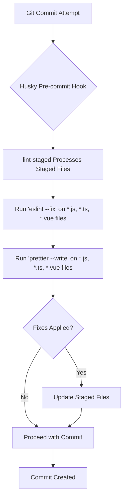
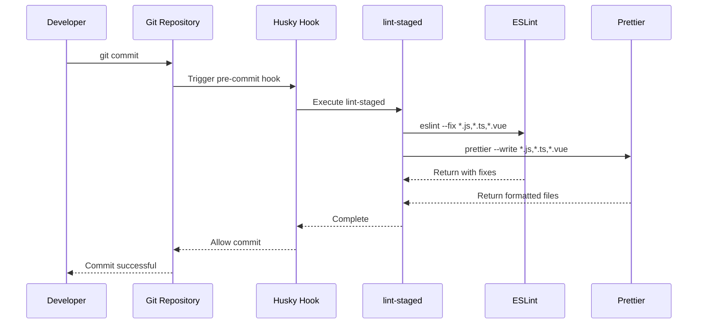

# Contributing Guide

<cite>
**Referenced Files in This Document**   
- [README.md](file://README.md)
- [commitlint.config.js](file://commitlint.config.js)
- [eslint.config.ts](file://eslint.config.ts)
- [package.json](file://package.json)
- [vite.config.ts](file://vite.config.ts)
- [src/main.ts](file://src/main.ts)
- [src/root/App.vue](file://src/root/App.vue)
- [src/root/routing.ts](file://src/root/routing.ts)
- [src/environments/index.ts](file://src/environments/index.ts)
- [src/root/shared/model/interface/auth.interface.ts](file://src/root/shared/model/interface/auth/auth.interface.ts)
- [src/root/shared/api/authApi.ts](file://src/root/shared/api/authApi.ts)
- [src/root/shared/components/HeaderComponent.vue](file://src/root/shared/components/HeaderComponent.vue)
- [src/root/core/api/http.ts](file://src/root/core/api/http.ts)
</cite>

## Table of Contents
1. [Development Workflow](#development-workflow)
2. [Code Quality Standards](#code-quality-standards)
3. [Development Environment Setup](#development-environment-setup)
4. [Component Development Guidelines](#component-development-guidelines)
5. [Service and API Integration](#service-and-api-integration)
6. [State Management with Pinia](#state-management-with-pinia)
7. [Code Review and Documentation](#code-review-and-documentation)
8. [Issue Reporting and Feature Proposals](#issue-reporting-and-feature-proposals)

## Development Workflow

The maya-platform-frontend project follows a structured development workflow to ensure code quality, consistency, and maintainability. The workflow is enforced through Git hooks and automated tooling.

### Branching Strategy
While the repository does not explicitly document a branching strategy, standard Git practices are recommended:
- Use `main` as the primary branch for production code
- Create feature branches from `main` for new functionality
- Use descriptive branch names following the pattern `feature/descriptive-name` or `fix/issue-description`
- Submit pull requests to `main` for code review before merging

### Commit Message Conventions
The project enforces conventional commit message formatting through Commitlint. This ensures consistent, readable, and machine-parsable commit history.

The configuration extends `@commitlint/config-conventional`, requiring commit messages to follow this format:
```
<type>[optional scope]: <description>

[optional body]

[optional footer(s)]
```

**Valid commit types include:**
- `build`: Changes that affect the build system or external dependencies
- `ci`: Changes to CI configuration files and scripts
- `docs`: Documentation only changes
- `feat`: A new feature
- `fix`: A bug fix
- `perf`: A code change that improves performance
- `refactor`: A code change that neither fixes a bug nor adds a feature
- `style`: Changes that do not affect the meaning of the code (white-space, formatting, etc.)
- `test`: Adding missing tests or correcting existing tests

**Example commit messages:**
- `feat(login): add two-factor authentication support`
- `fix(api): resolve user profile loading error`
- `refactor(components): simplify modal dialog structure`

The commitlint configuration is defined in `commitlint.config.js`:
```javascript
export default {
  extends: ['@commitlint/config-conventional'],
}
```

**Section sources**
- [commitlint.config.js](file://commitlint.config.js#L1-L4)

### Pre-commit Hooks
The project uses Husky and lint-staged to enforce code quality before commits are created. When you attempt to commit changes, the following process occurs:



**Diagram sources**
- [package.json](file://package.json#L54-L58)

This automated process ensures that all committed code adheres to the project's formatting and linting rules, preventing style inconsistencies from entering the codebase.

**Section sources**
- [package.json](file://package.json#L54-L58)

## Code Quality Standards

The project maintains high code quality standards through ESLint, Prettier, and TypeScript, ensuring type safety and code consistency across the codebase.

### ESLint Configuration
The ESLint configuration is defined in `eslint.config.ts` and extends Vue's official TypeScript configuration. The configuration includes:

- Vue 3 best practices enforcement
- TypeScript type checking integration
- Prettier formatting rules
- Custom rules specific to the project

Key configuration settings:
- Lints all `.ts` and `.vue` files
- Disables `vue/multi-word-component-names` rule to allow single-word component names
- Disables `vue/require-default-prop` rule for flexibility in component design
- Ignores distribution and coverage directories

The ESLint configuration:
```typescript
import { globalIgnores } from 'eslint/config'
import { defineConfigWithVueTs, vueTsConfigs } from '@vue/eslint-config-typescript'
import pluginVue from 'eslint-plugin-vue'
import skipFormatting from '@vue/eslint-config-prettier/skip-formatting'

export default defineConfigWithVueTs(
  {
    name: 'app/files-to-lint',
    files: ['**/*.{ts,vue}'],
    rules: {
      'vue/multi-word-component-names': 'off',
      'vue/require-default-prop': 'off',
    },
  },
  globalIgnores(['**/dist/**', '**/dist-ssr/**', '**/coverage/**']),
  pluginVue.configs['flat/essential'],
  vueTsConfigs.recommended,
  skipFormatting,
)
```

**Section sources**
- [eslint.config.ts](file://eslint.config.ts#L1-L27)

### Running Linting and Formatting Tools
The project provides npm scripts to run linting and formatting tools:

**Available scripts:**
- `npm run lint`: Runs ESLint on all files and automatically fixes fixable issues
- `npm run format`: Runs Prettier to format all files in the src directory
- `npm run type-check`: Runs Vue TypeScript checker to validate types

These scripts are also automatically executed through Git hooks via lint-staged, ensuring code quality is maintained on every commit.



**Diagram sources**
- [package.json](file://package.json#L35-L37)
- [eslint.config.ts](file://eslint.config.ts#L1-L27)

**Section sources**
- [package.json](file://package.json#L35-L37)

## Development Environment Setup

Setting up the development environment for maya-platform-frontend is straightforward with Node.js and npm.

### Prerequisites
- Node.js version ^20.19.0 or >=22.12.0 (specified in package.json engines)
- npm (bundled with Node.js)

### Setup Steps
1. Clone the repository
2. Navigate to the project directory
3. Install dependencies:

```bash
npm install
```

### Development Server
Start the development server with hot-reload:

```bash
npm run dev
```

This command starts Vite development server in development mode, providing fast hot module replacement and a responsive development experience.

### Building for Production
Build the application for different environments:

```bash
# Build for development environment
npm run build:dev

# Build for staging environment
npm run build:staging

# Build for production environment
npm run build:production
```

The Vite configuration sets up proxying for API requests to the backend server:

```typescript
server: {
  proxy: {
    '/backend/api': {
      target: 'https://vlk-g.dev.api.thelightech.com',
      changeOrigin: true,
      secure: true,
      rewrite: (path) => path,
    },
  },
}
```

This configuration proxies requests from `/backend/api` to the specified target, facilitating API integration during development.

**Section sources**
- [package.json](file://package.json#L7-L10)
- [vite.config.ts](file://vite.config.ts#L38-L44)
- [README.md](file://README.md#L18-L20)

## Component Development Guidelines

When creating new components, services, or feature modules, follow the existing patterns in the codebase to maintain consistency and predictability.

### Component Structure and Patterns
The project follows a feature-based organization structure, with components organized by domain area within the `src/root/` directory.

**Component organization pattern:**
```
src/root/[feature]/
├── components/
├── pages/
├── routing/
└── store/
```

When creating a new component:
1. Place it in the appropriate feature directory under `src/root/[feature]/components/`
2. Use PascalCase for component file names (e.g., `UserCard.vue`)
3. Follow Vue 3 Composition API with `<script setup>` syntax
4. Import types from the shared model directory when possible
5. Use descriptive props with proper typing

Example component structure:
```vue
<script setup lang="ts">
import type { User } from '@/root/shared/model/interface/users/user.interface'

defineProps<{
  user: User
  showActions?: boolean
}>()

const emit = defineEmits<{
  (e: 'edit', userId: string): void
  (e: 'delete', userId: string): void
}>()
</script>

<template>
  <div class="user-card">
    <h3>{{ user.name }}</h3>
    <p>{{ user.email }}</p>
    <div v-if="showActions" class="actions">
      <button @click="() => emit('edit', user.id)">Edit</button>
      <button @click="() => emit('delete', user.id)">Delete</button>
    </div>
  </div>
</template>
```

The project uses alias imports (`@`, `@core`, `@shared`, etc.) configured in Vite for cleaner import paths:

```typescript
resolve: {
  alias: {
    '@': fileURLToPath(new URL('./src', import.meta.url)),
    '@assets': fileURLToPath(new URL('./src/assets', import.meta.url)),
    '@core': fileURLToPath(new URL('./src/root/core', import.meta.url)),
    '@main': fileURLToPath(new URL('./src/root/main', import.meta.url)),
    // ... other aliases
  },
}
```

**Section sources**
- [vite.config.ts](file://vite.config.ts#L20-L36)
- [src/root/shared/components/HeaderComponent.vue](file://src/root/shared/components/HeaderComponent.vue)

### Page Components
Page components are top-level components that represent entire views or routes. They are placed in the `pages/` directory within each feature module.

Page components typically:
- Handle route parameters and query strings
- Manage data fetching from APIs
- Coordinate multiple child components
- Handle user interactions that affect the overall page state

### Composables
The project uses Vue composables for reusable logic. Custom composables are placed in `composables/` directories within feature modules or in `src/root/shared/composables/` for cross-cutting concerns.

Example composable pattern:
```typescript
// src/root/shared/composables/usePagination.ts
export function usePagination() {
  const page = ref(1)
  const pageSize = ref(10)
  
  const offset = computed(() => (page.value - 1) * pageSize.value)
  
  function nextPage() {
    page.value++
  }
  
  function prevPage() {
    if (page.value > 1) page.value--
  }
  
  function setPage(newPage: number) {
    page.value = newPage
  }
  
  return {
    page,
    pageSize,
    offset,
    nextPage,
    prevPage,
    setPage
  }
}
```

## Service and API Integration

The project uses a structured approach to API integration and service layer implementation.

### API Client Structure
The core HTTP client is defined in `src/root/core/api/http.ts`, providing a configured Axios instance with interceptors for authentication and error handling.

API service modules are organized in `src/root/shared/api/`, with separate files for different domain areas:
- `authApi.ts`: Authentication-related endpoints
- `customersApi.ts`: Customer management endpoints
- `refsApi.ts`: Reference data endpoints
- `rolesApi.ts`: Role management endpoints
- `usersApi.ts`: User management endpoints

This separation allows for better organization and easier maintenance of API endpoints.

### Type Safety and Interfaces
The project maintains strong type safety through TypeScript interfaces defined in `src/root/shared/model/interface/`. These interfaces are used throughout the application to ensure data consistency.

Key interface categories:
- Domain models (users, objects, customers, etc.)
- API request/response structures
- Form data structures
- Store state structures

When creating new API endpoints, define corresponding interfaces in the appropriate subdirectory and import them in the main index file for easy access.

### Interceptors and Error Handling
The project uses Axios interceptors to handle cross-cutting concerns like authentication and error handling. Interceptors are defined in `src/root/core/interceptors/` and registered in the core API module.

Common interceptor patterns:
- Request interceptor: Add authentication tokens to requests
- Response interceptor: Handle authentication errors and redirect to login
- Error interceptor: Standardize error handling and display user-friendly messages

## State Management with Pinia

The project uses Pinia for state management, following Vue 3's recommended state management library.

### Store Organization
Stores are organized by feature within each module:
- `src/root/auth/store/authStore.ts`: Authentication state
- `src/root/objects/store/objectsStore.ts`: Objects module state
- `src/root/refs/store/refsStore.ts`: References module state
- `src/root/users/store/usersStore.ts`: Users module state

Each store follows the Pinia composition API pattern:

```typescript
// Example store structure
import { defineStore } from 'pinia'
import { ref } from 'vue'

export const useUserStore = defineStore('user', () => {
  const user = ref<User | null>(null)
  const isLoading = ref(false)
  const error = ref<string | null>(null)
  
  async function fetchUser(userId: string) {
    isLoading.value = true
    error.value = null
    
    try {
      const response = await usersApi.getUser(userId)
      user.value = response.data
    } catch (err) {
      error.value = 'Failed to fetch user'
      console.error(err)
    } finally {
      isLoading.value = false
    }
  }
  
  function clearUser() {
    user.value = null
  }
  
  return {
    // state
    user,
    isLoading,
    error,
    
    // actions
    fetchUser,
    clearUser,
  }
})
```

### Best Practices
When creating new stores:
1. Use descriptive store names that reflect their purpose
2. Keep state minimal and focused on what's needed across components
3. Use getters for derived state
4. Use actions for asynchronous operations and complex state mutations
5. Handle errors appropriately within actions
6. Consider store hydration for server-side rendering if applicable

## Code Review and Documentation

### Code Review Expectations
When submitting code for review, ensure that:

1. **Code Quality**: All code passes ESLint and Prettier checks
2. **Type Safety**: TypeScript types are used appropriately and consistently
3. **Testing**: New functionality includes appropriate tests (if testing framework is present)
4. **Documentation**: Complex logic is documented with comments
5. **Performance**: Code is optimized and doesn't introduce performance bottlenecks
6. **Accessibility**: Components are accessible to users with disabilities
7. **Responsiveness**: UI components work well on different screen sizes

Reviewers will check for:
- Adherence to Vue 3 best practices
- Proper use of Composition API
- Efficient reactivity patterns
- Appropriate component decomposition
- Consistent coding style
- Proper error handling
- Security considerations

### Documentation Update Requirements
When making changes that affect the public interface or user experience:

1. **Component Documentation**: Update inline documentation for components, especially props, emits, and slots
2. **Type Definitions**: Ensure interface and type definitions are up-to-date
3. **README Updates**: Update README.md if installation, configuration, or usage instructions have changed
4. **API Documentation**: Update any API documentation if endpoints or data structures have changed
5. **Changelog**: Add entries to a changelog file (if present) for significant changes

For new features, consider adding:
- Usage examples in documentation
- Type definitions with clear JSDoc comments
- Example implementations in storybook or similar (if available)

## Issue Reporting and Feature Proposals

### Reporting Issues
When reporting issues, provide the following information:

1. **Environment**: Browser, OS, and application version
2. **Steps to Reproduce**: Clear, step-by-step instructions to reproduce the issue
3. **Expected Behavior**: What you expected to happen
4. **Actual Behavior**: What actually happened
5. **Screenshots/Video**: Visual evidence when applicable
6. **Console Errors**: Any relevant error messages from the browser console
7. **Network Requests**: Relevant API calls and responses (redact sensitive information)

Use the following template for issue reports:
```
## Environment
- Browser: [e.g., Chrome 120]
- OS: [e.g., Windows 11]
- Application Version: [e.g., 1.0.0]

## Steps to Reproduce
1. [Step 1]
2. [Step 2]
3. [Step 3]

## Expected Behavior
[Description of expected behavior]

## Actual Behavior
[Description of actual behavior]

## Additional Context
[Screenshots, console errors, network requests, etc.]
```

### Proposing New Features
When proposing new features:

1. **Problem Statement**: Clearly describe the problem the feature solves
2. **Proposed Solution**: Detail your proposed implementation
3. **Alternatives Considered**: Discuss other approaches and why they were rejected
4. **Impact Analysis**: Consider the impact on existing functionality
5. **Design Mockups**: Include UI mockups if applicable
6. **Technical Considerations**: Address performance, security, and accessibility

Use the following template for feature proposals:
```
## Problem
[Description of the problem]

## Proposed Solution
[Detailed description of the proposed solution]

## Alternatives
[Discussion of alternative approaches]

## Implementation Plan
[High-level steps for implementation]

## Open Questions
[Any unresolved questions or decisions needed]
```

### Maintaining Type Safety and Vue 3 Best Practices
Throughout development, prioritize:

1. **Type Safety**: Use TypeScript interfaces and types consistently
   - Define interfaces for all complex data structures
   - Use strict typing for props, emits, and return values
   - Avoid `any` type; use `unknown` or specific types instead

2. **Vue 3 Best Practices**:
   - Use Composition API with `<script setup>` syntax
   - Leverage Vue's reactivity system efficiently
   - Use computed properties for derived state
   - Use watchers sparingly and only when necessary
   - Prefer refs over reactive for primitive values
   - Use proper component lifecycle hooks

3. **Performance Optimization**:
   - Use lazy loading for routes and components when appropriate
   - Implement proper caching strategies
   - Optimize reactivity with shallow refs when appropriate
   - Use virtual scrolling for large lists

4. **Accessibility**:
   - Use semantic HTML elements
   - Ensure keyboard navigation works properly
   - Add appropriate ARIA attributes
   - Test with screen readers when possible

By following these guidelines, contributors can ensure that the maya-platform-frontend project maintains high code quality, consistency, and maintainability.