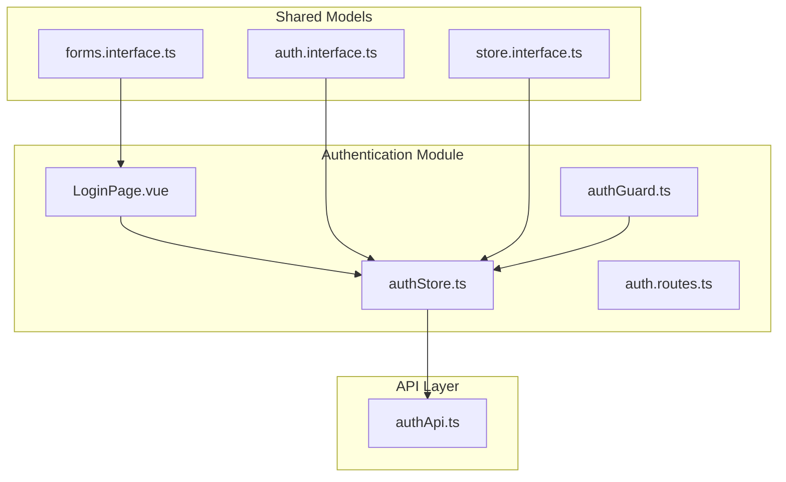
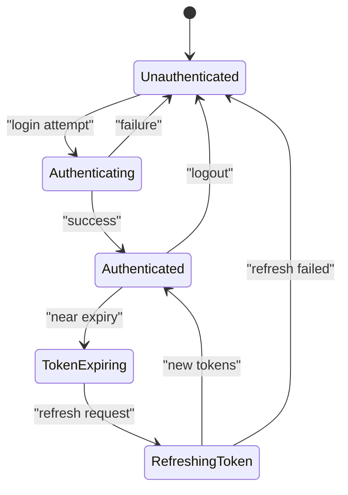
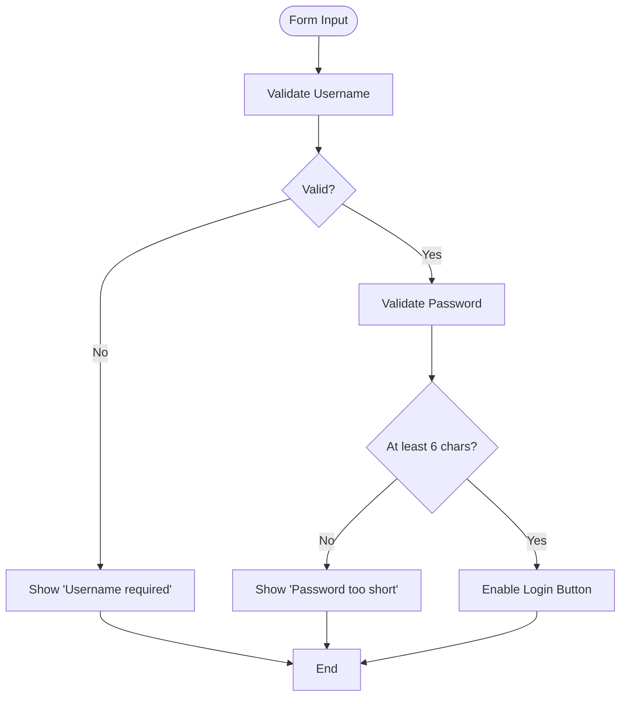
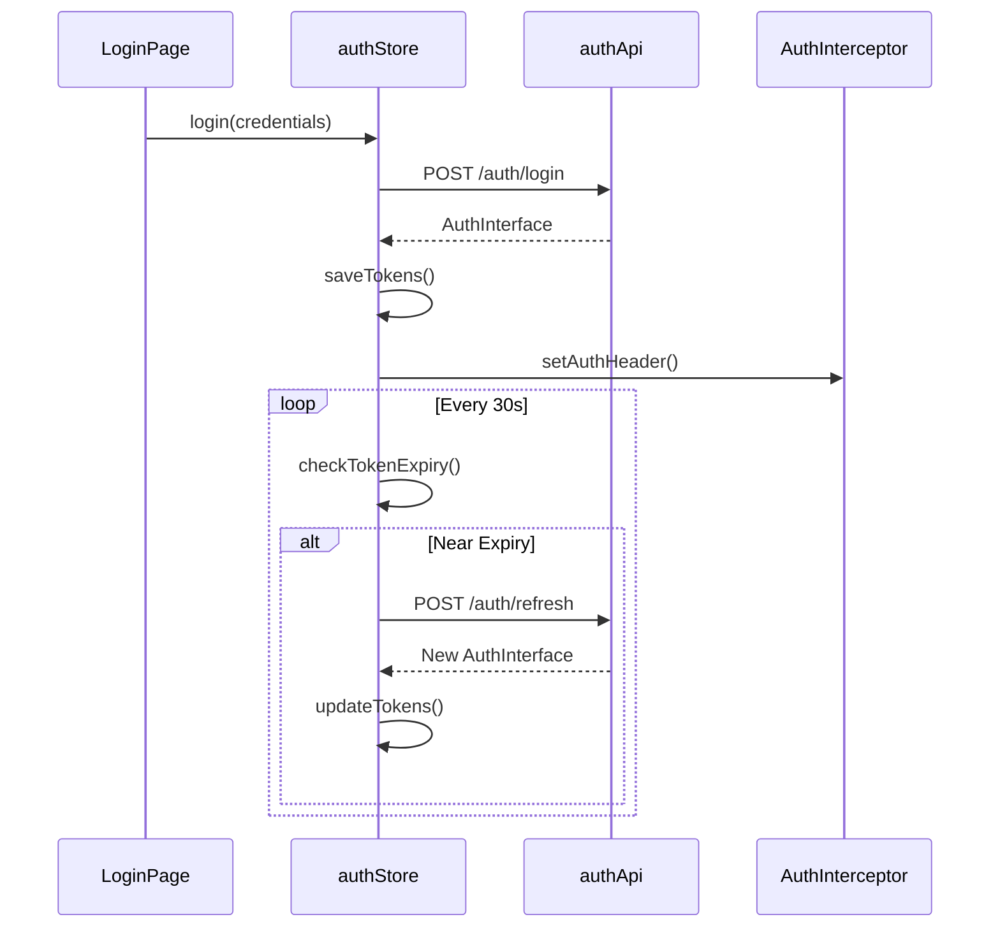

# Authentication Data Models

<cite>
**Referenced Files in This Document**   
- [authStore.ts](file://src/root/auth/store/authStore.ts)
- [LoginPage.vue](file://src/root/auth/pages/LoginPage.vue)
- [auth.interface.ts](file://src/root/shared/model/interface/auth/auth.interface.ts)
- [forms.interface.ts](file://src/root/shared/model/interface/auth/forms.interface.ts)
- [store.interface.ts](file://src/root/shared/model/interface/auth/store.interface.ts)
- [authApi.ts](file://src/root/shared/api/authApi.ts)
</cite>

## Table of Contents
1. [Introduction](#introduction)
2. [Project Structure](#project-structure)
3. [Core Authentication Interfaces](#core-authentication-interfaces)
4. [AuthState Model and Session Management](#authstate-model-and-session-management)
5. [LoginFormInterface and Form Validation](#loginforminterface-and-form-validation)
6. [AuthInterface and Token Handling](#authinterface-and-token-handling)
7. [Usage in LoginPage and authStore](#usage-in-loginpage-and-authstore)
8. [Security and Type Safety](#security-and-type-safety)
9. [Extensibility for Identity Providers and MFA](#extensibility-for-identity-providers-and-mfa)
10. [Conclusion](#conclusion)

## Introduction
This document provides a comprehensive overview of the authentication data models used in the maya-platform-frontend application. It details the core interfaces—`AuthInterface`, `LoginFormInterface`, and `AuthState`—that define user authentication, session persistence, and login workflows. The documentation explains how these models support secure credential handling, token refresh mechanisms, and state synchronization across components. Additionally, it outlines best practices for extending the system to support additional identity providers or multi-factor authentication (MFA).

**Section sources**
- [auth.interface.ts](file://src/root/shared/model/interface/auth/auth.interface.ts#L1-L50)
- [forms.interface.ts](file://src/root/shared/model/interface/auth/forms.interface.ts#L1-L30)
- [store.interface.ts](file://src/root/shared/model/interface/auth/store.interface.ts#L1-L40)

## Project Structure
The maya-platform-frontend follows a modular, feature-based architecture. Authentication-related components are organized under the `src/root/auth` directory, which includes routing, guards, pages, and a dedicated Pinia store. Shared data models and interfaces are centralized in `src/root/shared/model/interface/auth`, promoting reusability and type consistency.

Key directories:
- `src/root/auth/pages/LoginPage.vue`: Login UI component
- `src/root/auth/store/authStore.ts`: Centralized authentication state management
- `src/root/shared/model/interface/auth/`: TypeScript interfaces for auth models
- `src/root/shared/api/authApi.ts`: API service for authentication endpoints



**Diagram sources**
- [authStore.ts](file://src/root/auth/store/authStore.ts#L1-L100)
- [LoginPage.vue](file://src/root/auth/pages/LoginPage.vue#L1-L80)
- [auth.interface.ts](file://src/root/shared/model/interface/auth/auth.interface.ts#L1-L60)

## Core Authentication Interfaces

### AuthInterface
Defines the structure of authentication credentials and tokens returned from the backend.

```typescript
interface AuthInterface {
  accessToken: string;
  refreshToken: string;
  expiresIn: number;
  tokenType: string;
}
```

- `accessToken`: Bearer token used for API authorization
- `refreshToken`: Long-lived token to obtain new access tokens
- `expiresIn`: Time in seconds until access token expiration
- `tokenType`: Typically "Bearer"

This interface ensures consistent parsing of authentication responses from the `/auth/login` endpoint.

### LoginFormInterface
Represents user input on the login form with validation constraints.

```typescript
interface LoginFormInterface {
  username: string;
  password: string;
  rememberMe: boolean;
}
```

- `username`: User identifier (email or login)
- `password`: Secret credential (never stored in plain text)
- `rememberMe`: Flag to determine session persistence duration

Used in `LoginPage.vue` to bind form fields and validate input before submission.

### AuthState
Central store model for authentication state within Pinia.

```typescript
interface AuthState {
  user: UserInterface | null;
  tokens: AuthInterface | null;
  isAuthenticated: boolean;
  isAuthenticating: boolean;
  error: string | null;
}
```

- `user`: Currently authenticated user profile
- `tokens`: Active access and refresh tokens
- `isAuthenticated`: Boolean flag indicating login status
- `isAuthenticating`: Loading state during login process
- `error`: Error message from failed authentication attempts

**Section sources**
- [auth.interface.ts](file://src/root/shared/model/interface/auth/auth.interface.ts#L5-L25)
- [forms.interface.ts](file://src/root/shared/model/interface/auth/forms.interface.ts#L5-L15)
- [store.interface.ts](file://src/root/shared/model/interface/auth/store.interface.ts#L5-L20)

## AuthState Model and Session Management

The `AuthState` interface serves as the single source of truth for authentication status in the application. It is managed by `authStore.ts`, a Pinia store that persists state across component boundaries.

### Session Persistence
When `rememberMe` is true, tokens are stored in `localStorage`; otherwise, they are kept in `sessionStorage`. This allows sessions to survive browser restarts when desired.



**Diagram sources**
- [authStore.ts](file://src/root/auth/store/authStore.ts#L45-L120)
- [authApi.ts](file://src/root/shared/api/authApi.ts#L15-L40)

Automatic token refresh is triggered when the access token is within 5 minutes of expiry. The `refreshToken` is sent to `/auth/refresh` to obtain a new `accessToken`.

**Section sources**
- [authStore.ts](file://src/root/auth/store/authStore.ts#L60-L100)

## LoginFormInterface and Form Validation

The `LoginFormInterface` is used in `LoginPage.vue` to manage reactive form state. It integrates with Naive UI form components for real-time validation.

### Validation Rules
- **Username**: Required, must be non-empty string
- **Password**: Required, minimum 6 characters
- **Remember Me**: Optional boolean

Validation is performed before submission using a simple schema:

```typescript
const validateForm = (form: LoginFormInterface): boolean => {
  if (!form.username.trim()) {
    formErrors.value.username = 'Username is required';
    return false;
  }
  if (form.password.length < 6) {
    formErrors.value.password = 'Password must be at least 6 characters';
    return false;
  }
  return true;
};
```

Error messages are displayed inline using `NFormItem` components.



**Diagram sources**
- [LoginPage.vue](file://src/root/auth/pages/LoginPage.vue#L30-L100)

**Section sources**
- [LoginPage.vue](file://src/root/auth/pages/LoginPage.vue#L20-L120)
- [forms.interface.ts](file://src/root/shared/model/interface/auth/forms.interface.ts#L1-L20)

## AuthInterface and Token Handling

The `AuthInterface` defines the expected response from the authentication API. Upon successful login, this data is stored in the `AuthState`.

### Token Storage Strategy
| Property | Storage Location | Persistence |
|--------|------------------|-------------|
| `accessToken` | `localStorage` or `sessionStorage` | Based on `rememberMe` |
| `refreshToken` | `localStorage` or `sessionStorage` | Same as accessToken |
| `expiresIn` | Calculated expiry time | In-memory only |

Tokens are automatically attached to HTTP requests via an Axios interceptor located in `src/root/core/interceptors/auth.ts`.

### Token Refresh Mechanism
A background service checks token expiry every 30 seconds. When nearing expiration:

1. Call `/auth/refresh` with current `refreshToken`
2. On success: update `AuthState.tokens`
3. On failure: clear state and redirect to login



**Diagram sources**
- [authStore.ts](file://src/root/auth/store/authStore.ts#L80-L150)
- [authApi.ts](file://src/root/shared/api/authApi.ts#L20-L50)
- [auth.interceptor.ts](file://src/root/core/interceptors/auth.ts#L10-L40)

**Section sources**
- [auth.interface.ts](file://src/root/shared/model/interface/auth/auth.interface.ts#L1-L30)
- [authStore.ts](file://src/root/auth/store/authStore.ts#L70-L160)

## Usage in LoginPage and authStore

### LoginPage.vue
The login page uses `LoginFormInterface` to bind input fields and `authStore` to initiate authentication.

```vue
<template>
  <n-form :model="form" @submit.prevent="handleSubmit">
    <n-form-item label="Username" path="username">
      <n-input v-model:value="form.username" placeholder="Enter username" />
    </n-form-item>
    <n-form-item label="Password" path="password">
      <n-input v-model:value="form.password" type="password" placeholder="Enter password" />
    </n-form-item>
    <n-checkbox v-model:checked="form.rememberMe">Remember Me</n-checkbox>
    <n-button type="primary" :loading="isAuthenticating" @click="handleSubmit">
      Login
    </n-button>
  </n-form>
</template>
```

On submit, it calls `authStore.login(form)`.

### authStore.ts
Implements actions for login, refresh, and logout:

```typescript
const login = async (credentials: LoginFormInterface): Promise<void> => {
  try {
    isAuthenticating = true;
    const response = await authApi.login(credentials);
    const { accessToken, refreshToken, expiresIn } = response;
    const user = await authApi.getProfile(); // Fetch user profile

    // Update state
    tokens = { accessToken, refreshToken, expiresIn, tokenType: 'Bearer' };
    user: user;
    isAuthenticated = true;

    // Persist tokens
    const storage = credentials.rememberMe ? localStorage : sessionStorage;
    storage.setItem('authTokens', JSON.stringify(tokens));
    storage.setItem('user', JSON.stringify(user));
  } catch (error) {
    error = 'Invalid credentials';
    isAuthenticated = false;
  } finally {
    isAuthenticating = false;
  }
};
```

**Section sources**
- [LoginPage.vue](file://src/root/auth/pages/LoginPage.vue#L1-L150)
- [authStore.ts](file://src/root/auth/store/authStore.ts#L1-L200)

## Security and Type Safety

### Type Safety Measures
- All authentication models are strictly typed using TypeScript interfaces
- Union types prevent invalid state transitions
- Readonly properties prevent accidental mutation
- Null safety ensures proper handling of unauthenticated states

Example:
```typescript
const getUserRole = (): string => {
  return authStore.user?.role ?? 'guest'; // Null-safe access
};
```

### Secure Credential Handling
- Passwords are never stored or logged
- Tokens are only stored in secure browser storage
- HTTPS enforced via Vite proxy configuration
- Axios interceptor automatically attaches `Authorization` headers
- No sensitive data in URL parameters

### Unauthorized Access Prevention
- `authGuard.ts` protects routes by checking `authStore.isAuthenticated`
- Redirects to `/login` if not authenticated
- Profile fetch on login ensures user data integrity

```typescript
const requireAuth = (to, from, next) => {
  if (!authStore.isAuthenticated) {
    next('/login');
  } else {
    next();
  }
};
```

**Section sources**
- [authStore.ts](file://src/root/auth/store/authStore.ts#L100-L180)
- [authGuard.ts](file://src/root/auth/guards/authGuard.ts#L1-L20)
- [auth.interceptor.ts](file://src/root/core/interceptors/auth.ts#L1-L30)

## Extensibility for Identity Providers and MFA

### Adding OAuth Providers
To support Google, GitHub, or other OAuth providers:

1. Extend `LoginFormInterface`:
```typescript
interface ExtendedLoginForm extends LoginFormInterface {
  provider?: 'google' | 'github' | 'local';
}
```

2. Add provider-specific login methods in `authStore`
3. Create dedicated API endpoints in backend

### Multi-Factor Authentication (MFA)
Support MFA by enhancing `AuthInterface`:

```typescript
interface MfaAuthInterface extends AuthInterface {
  mfaRequired: boolean;
  mfaSessionToken?: string;
}
```

Workflow:
1. Initial login returns `mfaRequired: true`
2. Show MFA code entry screen
3. Submit code with `mfaSessionToken`
4. Receive full `AuthInterface` on success

### Biometric Authentication
For mobile/web biometrics:
- Store a flag in `AuthState` indicating biometric capability
- Use WebAuthn API for fingerprint/face ID
- Store biometric tokens separately from session tokens

These extensions maintain backward compatibility while enabling advanced authentication scenarios.

**Section sources**
- [auth.interface.ts](file://src/root/shared/model/interface/auth/auth.interface.ts#L30-L50)
- [authStore.ts](file://src/root/auth/store/authStore.ts#L180-L220)

## Conclusion
The authentication data models in maya-platform-frontend provide a robust, type-safe foundation for secure user sessions. By clearly defining `AuthInterface`, `LoginFormInterface`, and `AuthState`, the system ensures consistent handling of credentials, tokens, and user state. Integration with Pinia enables reactive updates across the UI, while interceptors and guards enforce security policies. The modular design allows for future expansion to support OAuth, MFA, and biometric authentication without compromising existing functionality.