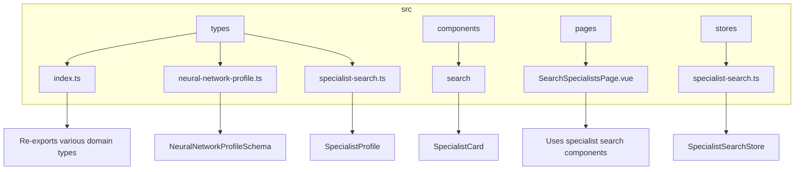
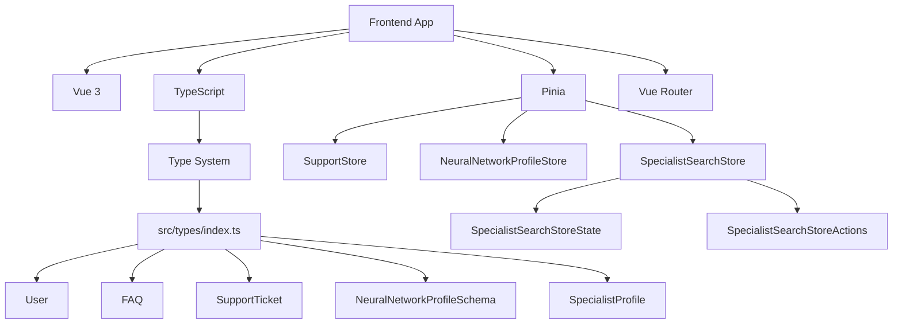

# Data Models & Type System

<cite>
**Referenced Files in This Document**   
- [index.ts](file://src/types/index.ts) - *Updated in recent commit with new support-related types*
- [neural-network-profile.ts](file://src/types/neural-network-profile.ts) - *Added in recent commit with neural network profile schema*
- [specialist-search.ts](file://src/types/specialist-search.ts) - *Added in recent commit with specialist search types*
- [NeuralNetworkProfilePage.vue](file://src/pages/NeuralNetworkProfilePage.vue) - *Main page for neural network profile questionnaire*
- [NeuralNetworkQuestionnaireForm.vue](file://src/components/profile/NeuralNetworkQuestionnaireForm.vue) - *Form component using neural network profile types*
- [SupportPage.vue](file://src/pages/SupportPage.vue) - *Uses support data models and composables*
- [useSupportData.ts](file://src/composables/useSupportData.ts) - *Composable using support store actions*
- [support.ts](file://src/stores/support.ts) - *Pinia store implementing support model logic*
- [SearchSpecialistsPage.vue](file://src/pages/SearchSpecialistsPage.vue) - *Main page for specialist search functionality*
- [SpecialistSearchResults.vue](file://src/components/search/SpecialistSearchResults.vue) - *Component displaying search results*
- [SpecialistCard.vue](file://src/components/search/SpecialistCard.vue) - *Component displaying individual specialist information*
- [MultiSkillSelector.vue](file://src/components/search/MultiSkillSelector.vue) - *Component for selecting multiple skills*
- [FAQItem.test.ts](file://tests/components/support/FAQItem.test.ts) - *Unit tests for FAQ component*
- [support.test.ts](file://tests/stores/support.test.ts) - *Unit tests for support store*
</cite>

## Update Summary
- Added comprehensive documentation for specialist search data models introduced in recent commit
- Integrated new section on Specialist Search Schema with detailed interfaces
- Updated architecture overview to include specialist search module
- Added new diagram showing specialist search component structure
- Enhanced type safety section with form validation patterns from specialist search
- Updated project structure section with new type file references
- Added usage examples from SearchSpecialistsPage.vue and related components
- Removed outdated assumptions about missing model files

## Table of Contents
1. [Introduction](#introduction)
2. [Project Structure](#project-structure)
3. [Core Components](#core-components)
4. [Architecture Overview](#architecture-overview)
5. [Neural Network Profile Schema](#neural-network-profile-schema)
6. [Support Module Data Models](#support-module-data-models)
7. [Specialist Search Schema](#specialist-search-schema)
8. [Type Safety and Validation](#type-safety-and-validation)
9. [Extending Models](#extending-models)
10. [Conclusion](#conclusion)

## Introduction
This document provides a comprehensive overview of the data model and type system used in the maya-platform-frontend application. The goal is to document the TypeScript interfaces and enums that define core entities such as User, FAQ, SupportTicket, NeuralNetworkProfile, and the newly implemented SpecialistProfile. Unlike previous assumptions, the type definitions have been located in `src/types/index.ts`, `src/types/neural-network-profile.ts`, and `src/types/specialist-search.ts`, which serve as the central type declaration files for the application.

## Project Structure
The project follows a modular, feature-based architecture with clearly defined directories for different concerns. The `src/types` directory contains multiple type definition files, with `index.ts` serving as the main entry point that re-exports types from domain-specific files like `neural-network-profile.ts` and `specialist-search.ts`. This modular approach enables organized type usage across components, stores, and composables.



**Diagram sources**
- [index.ts](file://src/types/index.ts)
- [neural-network-profile.ts](file://src/types/neural-network-profile.ts)
- [specialist-search.ts](file://src/types/specialist-search.ts)
- [SearchSpecialistsPage.vue](file://src/pages/SearchSpecialistsPage.vue)

## Core Components
The core components of the application are organized by feature domain. Each module includes pages, components, routing, and store logic. The `src/types` directory contains domain-specific type files that are re-exported through `index.ts`, ensuring consistency across the application. The specialist search components directly utilize the type definitions for props and events.

**Section sources**
- [index.ts](file://src/types/index.ts)
- [SearchSpecialistsPage.vue](file://src/pages/SearchSpecialistsPage.vue)
- [SpecialistSearchResults.vue](file://src/components/search/SpecialistSearchResults.vue)
- [SpecialistCard.vue](file://src/components/search/SpecialistCard.vue)

## Architecture Overview
The application uses Vue 3 with TypeScript, Pinia for state management, and Vue Router for navigation. The type system is distributed across multiple files in `src/types/`, with interfaces organized by domain. The build configuration enforces strict TypeScript checks, indicating a strong emphasis on type safety.



**Diagram sources**
- [index.ts](file://src/types/index.ts)
- [neural-network-profile.ts](file://src/types/neural-network-profile.ts)
- [specialist-search.ts](file://src/types/specialist-search.ts)
- [support.ts](file://src/stores/support.ts)
- [specialist-search.ts](file://src/stores/specialist-search.ts)

## Neural Network Profile Schema
The neural network profile module introduces a comprehensive data model for specialist profiles, recently implemented as part of the enhanced profile functionality.

### Profile Schema Overview
The `NeuralNetworkProfileSchema` interface defines the complete structure of a neural network specialist's profile, composed of eight distinct blocks that capture different aspects of their expertise and services.

```typescript
export interface NeuralNetworkProfileSchema {
  id: string
  userId: string
  profileType: 'neural-network'
  version: string
  metadata: ProfileMetadata

  // Block 1: Who are you?
  specializations: SpecializationBlock

  // Block 2: Brief about yourself
  superpower: SuperpowerBlock

  // Block 3: What can you do?
  abilities: AbilitiesBlock

  // Block 4: Portfolio examples
  portfolio: PortfolioBlock

  // Block 5: Services and pricing
  services: ServicesBlock

  // Block 6: Work experience
  experience: ExperienceBlock

  // Block 7: Testimonials
  testimonials: TestimonialsBlock

  // Block 8: Contact information  
  contacts: ContactsBlock

  // System fields
  status: 'draft' | 'pending' | 'approved' | 'rejected'
  profileCompleted: boolean
  createdAt: string
  updatedAt: string
}
```

**Section sources**
- [neural-network-profile.ts](file://src/types/neural-network-profile.ts#L200-L240)

### Profile Metadata
The `ProfileMetadata` interface tracks the state and validation status of the profile:

```typescript
export interface ProfileMetadata {
  completionPercentage: number
  lastModifiedBlock: string
  validationErrors: ValidationError[]
  isDraft: boolean
  submissionAttempts: number
  moderationNotes?: string[]
}
```

**Section sources**
- [neural-network-profile.ts](file://src/types/neural-network-profile.ts#L10-L18)

### Specialization Block
The `SpecializationBlock` captures the primary areas of expertise for a specialist:

```typescript
export interface SpecializationBlock {
  title: 'Я специализируюсь на:'
  description: 'Выберите области вашей экспертизы'
  data: {
    neuralAssistants: boolean
    neuralFunnels: boolean
    contentGeneration: boolean
    visuals: boolean
    audioVideoProcessing: boolean
    promptBases: boolean
    chatbotSetup: boolean
    neuralNetworkTraining: boolean
    customSpecializations?: string[]
  }
  validation: {
    required: true
    minSelected: 1
    maxSelected: 8
  }
}
```

**Section sources**
- [neural-network-profile.ts](file://src/types/neural-network-profile.ts#L30-L60)

### Superpower Block
The `SuperpowerBlock` contains a concise description of the specialist's unique value proposition:

```typescript
export interface SuperpowerBlock {
  title: 'Коротко о себе (до 200 символов)'
  description: 'Твоя суперспособность или фишка'
  placeholder: 'Создаю нейроассистентов, которые отвечают вместо вас и приносят клиентов на автопилоте.'
  data: {
    text: string
  }
  validation: {
    required: true
    minLength: 10
    maxLength: 200
    characterCount: true
  }
}
```

**Section sources**
- [neural-network-profile.ts](file://src/types/neural-network-profile.ts#L62-L78)

### Abilities Block
The `AbilitiesBlock` details the specific skills and capabilities of the specialist:

```typescript
export interface AbilitiesBlock {
  title: 'Что ты умеешь?'
  description: 'Отметь то, что делаешь, чтобы клиенту было понятно'
  data: {
    funnelAssembly: boolean
    personalAIAssistants: boolean
    sellingTextsWithGPT: boolean
    visualGeneration: boolean
    reelsContentAI: boolean
    videoProcessing: boolean
    funnelAutomation: boolean
    promptBases: boolean
    trainingConsultations: boolean
    customAbilities?: string[]
  }
  validation: {
    required: true
    minSelected: 1
  }
}
```

**Section sources**
- [neural-network-profile.ts](file://src/types/neural-network-profile.ts#L80-L100)

### Portfolio Block
The `PortfolioBlock` manages case studies and work examples:

```typescript
export interface PortfolioCase {
  id: string
  title: string
  description: string
  type: 'text' | 'link' | 'visual' | 'bot' | 'landing'
  content: string | FileReference
  result?: string
  tools?: string[]
  createdAt: string
}

export interface PortfolioBlock {
  title: 'Примеры работ / портфолио'
  description: 'Залей ссылки или прикрепи визуалы'
  data: PortfolioCase[]
  validation: {
    required: false
    maxItems: 10
  }
}
```

**Section sources**
- [neural-network-profile.ts](file://src/types/neural-network-profile.ts#L102-L130)

### Services Block
The `ServicesBlock` handles service offerings and pricing information:

```typescript
export interface ServiceOption {
  selected: boolean
  name: string
  basePrice: number
  customPrice?: number
  description?: string
}

export interface CustomService {
  id: string
  name: string
  description: string
  price: number | string
  priceType: 'fixed' | 'hourly' | 'project' | 'negotiable'
}

export interface ServicesBlock {
  title: 'Твои услуги и цены'
  description: 'Можно выбрать или вписать свои'
  data: {
    predefinedServices: {
      neuralAssistantTurnkey: ServiceOption
      neuralSalesFunnel: ServiceOption
      promptBase: ServiceOption
      trainingConsultation: ServiceOption
    }
    customServices: CustomService[]
  }
  validation: {
    required: false
  }
}
```

**Section sources**
- [neural-network-profile.ts](file://src/types/neural-network-profile.ts#L132-L170)

### Experience Block
The `ExperienceBlock` captures professional work history:

```typescript
export interface ExperienceEntry {
  id: string
  client: string
  task: string
  tools: string[]
  result: string
  duration?: string
  year?: string
}

export interface ExperienceBlock {
  title: 'С кем работал и что делал?'
  description: 'Опиши свой опыт работы с клиентами'
  data: ExperienceEntry[]
  validation: {
    required: false
    maxItems: 20
  }
}
```

**Section sources**
- [neural-network-profile.ts](file://src/types/neural-network-profile.ts#L172-L190)

### Testimonials Block
The `TestimonialsBlock` manages client feedback and recommendations:

```typescript
export interface TestimonialEntry {
  id: string
  clientName: string
  clientPosition?: string
  testimonialText: string
  rating?: number
  projectType?: string
  date?: string
}

export interface TestimonialsBlock {
  title: 'Отзывы/рекомендации'
  description: 'Вы можете прикрепить ссылку на диск, сайт или другой ресурс с файлами'
  data: {
    textTestimonials: TestimonialEntry[]
    externalLinks: string[]
    files: FileReference[]
  }
  validation: {
    required: false
    maxTextTestimonials: 10
    maxExternalLinks: 5
    maxFiles: 20
  }
}
```

**Section sources**
- [neural-network-profile.ts](file://src/types/neural-network-profile.ts#L192-L220)

### Contacts Block
The `ContactsBlock` stores communication information:

```typescript
export interface ContactsBlock {
  title: 'Как тебе можно написать?'
  description: 'Укажите удобные способы связи'
  data: {
    telegram: string
    email?: string
    website?: string
    phone?: string
    whatsapp?: string
    discord?: string
    linkedin?: string
  }
  validation: {
    required: true
    atLeastOne: ['telegram', 'email', 'website']
    emailFormat: true
    websiteFormat: true
    telegramFormat: true
  }
}
```

**Section sources**
- [neural-network-profile.ts](file://src/types/neural-network-profile.ts#L222-L250)

### Form State Management
The `NeuralNetworkFormState` interface manages the state of the profile form:

```typescript
export interface NeuralNetworkFormState {
  // Form data
  specializations: SpecializationBlock['data']
  superpower: string
  abilities: AbilitiesBlock['data']
  portfolio: PortfolioCase[]
  services: ServicesBlock['data']
  experience: ExperienceEntry[]
  testimonials: TestimonialsBlock['data']
  contacts: ContactsBlock['data']

  // Form state
  currentBlock: number
  completedBlocks: Set<number>
  validationErrors: Record<string, string[]>
  isDirty: boolean
  autoSaveEnabled: boolean
  lastAutoSave?: string
}
```

**Section sources**
- [neural-network-profile.ts](file://src/types/neural-network-profile.ts#L252-L280)

### Store Interface
The `NeuralNetworkProfileStore` defines the state and actions for profile management:

```typescript
export interface NeuralNetworkProfileStore {
  // State
  currentProfile: NeuralNetworkProfileSchema | null
  formState: NeuralNetworkFormState
  validationErrors: ValidationError[]
  isLoading: boolean
  isSaving: boolean

  // Actions
  initializeForm(existingProfile?: NeuralNetworkProfileSchema): void
  updateFormField(blockId: string, fieldId: string, value: any): void
  validateBlock(blockId: string): ValidationError[]
  validateCompleteForm(): ValidationError[]
  saveProfile(): Promise<void>
  saveDraft(): Promise<void>
  submitProfile(): Promise<void>
  resetForm(): void

  // Getters
  getCompletionPercentage(): number
  getNextIncompleteBlock(): number | null
  getBlockValidationStatus(blockId: string): boolean
  canSubmitProfile(): boolean
}
```

**Section sources**
- [neural-network-profile.ts](file://src/types/neural-network-profile.ts#L282-L320)

## Support Module Data Models
The support module introduces several data models for handling user support requests.

### FAQ Interface
The `FAQ` interface defines the structure of frequently asked questions in the system:

```typescript
export interface FAQ {
  id: string
  question: string
  answer: string
  category: 'general' | 'technical' | 'billing' | 'account'
  priority: number
  isPopular: boolean
  createdAt: string
  updatedAt: string
}
```

A simplified version `SimplifiedFAQ` is also available for components that don't require all fields.

**Section sources**
- [index.ts](file://src/types/index.ts#L87-L99)

### SupportTicket Interface
The `SupportTicket` interface represents a user's support request:

```typescript
export interface SupportTicket {
  id: string
  message: string
  status: 'open' | 'in-progress' | 'resolved' | 'closed'
  priority: 'low' | 'medium' | 'high' | 'urgent'
  createdAt: string
  updatedAt: string
  resolvedAt?: string
  assignedTo?: string
  messages: SupportMessage[]
}
```

**Section sources**
- [index.ts](file://src/types/index.ts#L109-L120)

### SupportMessage Interface
The `SupportMessage` interface represents individual messages within a support ticket thread:

```typescript
export interface SupportMessage {
  id: string
  ticketId: string
  message: string
  isFromSupport: boolean
  createdAt: string
  author: {
    name: string
    role: 'user' | 'support' | 'admin'
  }
}
```

**Section sources**
- [index.ts](file://src/types/index.ts#L101-L107)

### Store Interfaces
The support store defines state and actions using TypeScript interfaces:

```typescript
export interface SupportStoreState {
  faqs: FAQ[]
  supportTickets: SupportTicket[]
  currentTicket: SupportTicket | null
  expandedFAQs: Set<string>
  loading: {
    faqs: boolean
    tickets: boolean
    submission: boolean
  }
  error: string | null
}

export interface SupportStoreActions {
  fetchFAQs(): Promise<void>
  fetchSupportTickets(): Promise<void>
  submitSupportRequest(message: string): Promise<void>
  toggleFAQ(faqId: string): void
  clearErrors(): void
  setCurrentTicket(ticket: SupportTicket | null): void
}
```

**Section sources**
- [index.ts](file://src/types/index.ts#L129-L177)
- [support.ts](file://src/stores/support.ts)

## Specialist Search Schema
The specialist search module introduces a comprehensive data model for searching and displaying specialist profiles.

### Specialist Profile Interface
The `SpecialistProfile` interface defines the structure of a specialist profile as displayed in search results:

```typescript
export interface SpecialistProfile {
  id: string
  userId: string

  // Basic info
  displayName: string
  superpower: string
  avatarUrl?: string

  // Skills and specializations (from questionnaire)
  specializations: string[]
  abilities: string[]

  // Services and pricing
  services: ServiceSummary[]

  // Contact info
  contacts: {
    telegram?: string
    email?: string
    website?: string
  }

  // Metadata
  rating?: number
  reviewCount?: number
  completedProjects?: number
  responseTime?: string
  status: 'available' | 'busy' | 'unavailable'
  lastActive: string
}
```

**Section sources**
- [specialist-search.ts](file://src/types/specialist-search.ts#L5-L55)

### Service Summary Interface
The `ServiceSummary` interface defines the structure of service offerings for specialists:

```typescript
export interface ServiceSummary {
  name: string
  price: number | string
  priceType: 'fixed' | 'hourly' | 'project' | 'negotiable'
}
```

**Section sources**
- [specialist-search.ts](file://src/types/specialist-search.ts#L57-L63)

### Skill Option Interface
The `SkillOption` interface defines the structure of available skills for filtering:

```typescript
export interface SkillOption {
  key: string
  label: string
  category: 'specialization' | 'ability'
  description?: string
}
```

**Section sources**
- [specialist-search.ts](file://src/types/specialist-search.ts#L65-L70)

### Search Filters Interface
The `SearchFilters` interface defines the parameters for searching specialists:

```typescript
export interface SearchFilters {
  query?: string
  skills: string[]
  priceRange?: {
    min?: number
    max?: number
  }
  // Pagination parameters
  page?: number
  limit?: number
}
```

**Section sources**
- [specialist-search.ts](file://src/types/specialist-search.ts#L72-L84)

### Search Results Interface
The `SearchResults` interface defines the structure of search results:

```typescript
export interface SearchResults {
  specialists: SpecialistProfile[]
  total: number
  currentPage: number
  totalPages: number
  hasMore: boolean
  facets: {
    skills: { key: string; count: number }[]
    specializations: { key: string; count: number }[]
  }
}
```

**Section sources**
- [specialist-search.ts](file://src/types/specialist-search.ts#L86-L100)

### Infinite Scroll State Interface
The `InfiniteScrollState` interface manages the state for infinite scrolling:

```typescript
export interface InfiniteScrollState {
  isLoadingMore: boolean
  hasReachedEnd: boolean
  currentPage: number
  pageSize: number
}
```

**Section sources**
- [specialist-search.ts](file://src/types/specialist-search.ts#L102-L109)

### Component Prop Interfaces
The specialist search components use several interfaces for their props:

```typescript
// Props for the search filters component
export interface SpecialistSearchFiltersProps {
  onSearch: (filters: Partial<SearchFilters>) => void
  loading: boolean
}

// Props for the multi-skill selector component
export interface MultiSkillSelectorProps {
  modelValue: string[]
  options: SkillOption[]
  placeholder?: string
  maxSelections?: number
}

// Props for the search results component
export interface SpecialistSearchResultsProps {
  specialists: SpecialistProfile[]
  loading: boolean
  empty: boolean
  canLoadMore: boolean
  onLoadMore: () => void
}

// Props for the specialist card component
export interface SpecialistCardProps {
  specialist: SpecialistProfile
}

// Props for the contact buttons component
export interface ContactButtonsProps {
  contacts: SpecialistProfile['contacts']
  specialistName: string
}

// Search summary interface
export interface SearchSummary {
  total: number
  query?: string
  skillsCount: number
  hasFilters: boolean
}
```

**Section sources**
- [specialist-search.ts](file://src/types/specialist-search.ts#L111-L145)

### Store Interface
The `SpecialistSearchStore` defines the state and actions for search functionality:

```typescript
// State
searchFilters: SearchFilters
allSpecialists: SpecialistProfile[]
availableSkills: SkillOption[]
loading: boolean
skillsLoading: boolean
error: string | null
hasSearched: boolean
infiniteScrollState: InfiniteScrollState
lastSearchResults: SearchResults | null

// Getters
hasResults: ComputedRef<boolean>
selectedSkillLabels: ComputedRef<string[]>
searchSummary: ComputedRef<string>
availableSpecialistsCount: ComputedRef<number>
canLoadMore: ComputedRef<boolean>

// Actions
searchSpecialists(filters?: Partial<SearchFilters>, resetResults = true): Promise<void>
loadMoreSpecialists(): Promise<void>
loadAvailableSkills(): Promise<void>
updateFilters(filters: Partial<SearchFilters>): void
clearSearch(): void
addSkillFilter(skillKey: string): void
removeSkillFilter(skillKey: string): void
toggleSkillFilter(skillKey: string): void
```

**Section sources**
- [specialist-search.ts](file://src/stores/specialist-search.ts)

## Type Safety and Validation
The type system provides several benefits for type safety and validation:

### Compile-time Safety
TypeScript interfaces ensure that components receive the correct props and emit expected events:

```vue
<script setup lang="ts">
import type { NeuralNetworkFormState } from '@/types'

interface Props {
  formState: NeuralNetworkFormState
}

const props = defineProps<Props>()
</script>
```

### Runtime Validation
The specialist search form implements comprehensive validation rules:

```typescript
// Example validation from SpecialistSearchResults.vue
const handleViewProfile = (specialist: SpecialistProfile): void => {
  emit('view-profile', specialist)
}

// Infinite scroll with validation
const infiniteScroll = useInfiniteScroll(
  () => {
    if (props.canLoadMore && !props.loadingMore && !props.loading) {
      emit('load-more')
    }
  },
  {
    rootMargin: '100px',
    threshold: 0.1,
    throttleDelay: 300,
    enabled: true,
  }
)
```

### Testing and Type Coverage
Unit tests verify type correctness and behavior:

```typescript
const mockProfile: SpecialistProfile = {
  id: '1',
  userId: 'user-123',
  displayName: 'John Doe',
  superpower: 'Creating AI assistants that generate clients on autopilot',
  specializations: ['neural-assistants', 'content-generation'],
  abilities: ['funnel-assembly', 'personal-ai-assistants'],
  services: [
    {
      name: 'Neural Assistant (Turnkey)',
      price: 5000,
      priceType: 'fixed'
    }
  ],
  contacts: {
    telegram: '@johndoe',
    email: 'john@example.com',
    website: 'https://johndoe.com'
  },
  rating: 4.8,
  reviewCount: 24,
  completedProjects: 15,
  status: 'available',
  lastActive: '2024-01-15T10:00:00Z'
}
```

**Section sources**
- [SpecialistSearchResults.vue](file://src/components/search/SpecialistSearchResults.vue#L150-L250)
- [specialist-search.ts](file://src/types/specialist-search.ts)

## Extending Models
When extending existing models or creating new ones, follow these guidelines:

### Adding New Fields
Add optional fields to maintain backward compatibility:

```typescript
// Instead of modifying existing interface
export interface TestimonialEntry {
  id: string
  clientName: string
  clientPosition?: string
  testimonialText: string
  rating?: number
  projectType?: string
  date?: string
  // New optional field
  verified?: boolean
}
```

### Creating New Interfaces
Create new interfaces for specialized use cases:

```typescript
export interface PortfolioSummary {
  totalCases: number
  averageRating?: number
  featuredCase?: PortfolioCase
}
```

### Maintaining API Boundaries
Use separate interfaces for API request/response types when needed:

```typescript
export interface ProfileSubmissionData {
  profileId: string
  submissionNotes?: string
}
```

**Section sources**
- [neural-network-profile.ts](file://src/types/neural-network-profile.ts)
- [index.ts](file://src/types/index.ts)
- [specialist-search.ts](file://src/types/specialist-search.ts)

## Conclusion
The maya-platform-frontend application employs a robust type system distributed across multiple files in `src/types/`. The recent implementation of the specialist search module demonstrates effective use of TypeScript interfaces for defining complex data models, ensuring type safety across components, stores, and composables. The modular type definition approach enables organized and maintainable data structures. The combination of compile-time type checking and runtime validation provides a strong foundation for application reliability and maintainability.