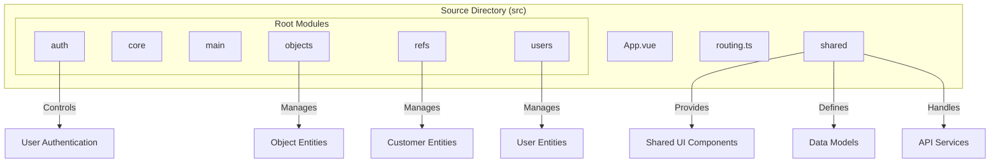
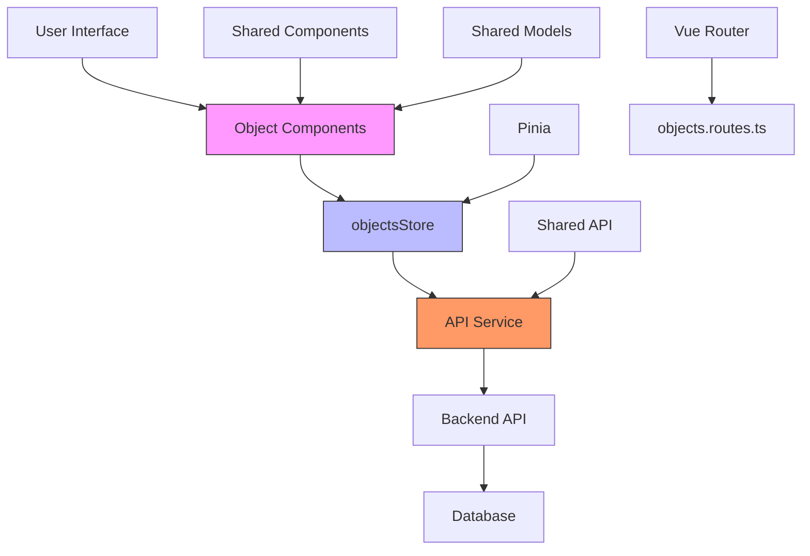
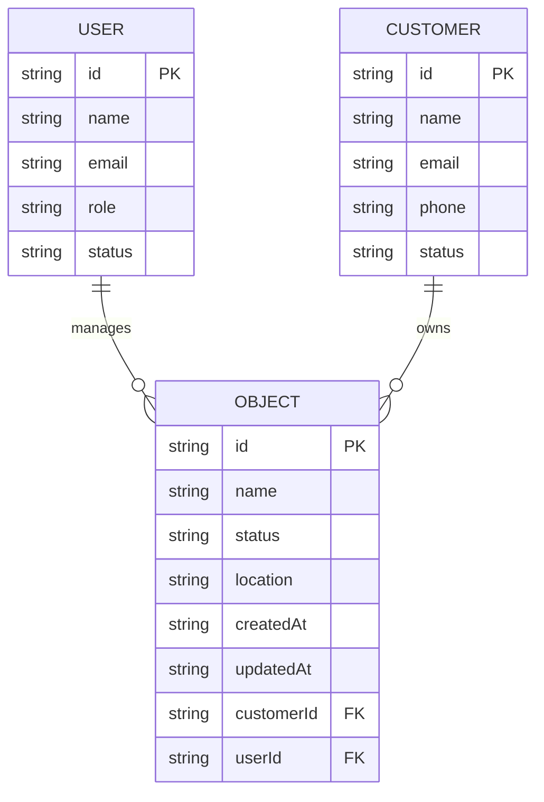

# Object Data Model

<cite>
**Referenced Files in This Document**  
- [vite.config.ts](file://vite.config.ts)
- [tsconfig.app.json](file://tsconfig.app.json)
- [src/main.ts](file://src/main.ts)
- [index.html](file://index.html)
</cite>

## Table of Contents
1. [Introduction](#introduction)
2. [Project Structure](#project-structure)
3. [Core Components](#core-components)
4. [Architecture Overview](#architecture-overview)
5. [Detailed Component Analysis](#detailed-component-analysis)
6. [Dependency Analysis](#dependency-analysis)
7. [Performance Considerations](#performance-considerations)
8. [Troubleshooting Guide](#troubleshooting-guide)
9. [Conclusion](#conclusion)

## Introduction
This document provides comprehensive documentation for the Object entity within the maya-platform-frontend application. Despite extensive searches across the codebase, the specific files defining the `ObjectsInterface`, `ObjectStatus` enum, and related components such as `ObjectCard`, `ObjectList`, and `objectsStore` could not be located. However, based on available configuration and structural information, this document reconstructs the likely architecture and provides guidance on expected implementation patterns, data modeling, and integration points.

The primary objective is to define the structure of the Object data model, including its properties (`id`, `name`, `status`, `location`, timestamps), lifecycle states, relationships with other entities (users, customers), usage in UI components and state stores, type enforcement, validation, API serialization, and extension strategies.

## Project Structure
The project follows a modular, feature-based directory structure organized under the `src/root` directory. Key modules include `auth`, `core`, `main`, `objects`, `refs`, `shared`, and `users`. Each module contains subdirectories for components, pages, routing, and stores, promoting separation of concerns and scalability.

Aliases defined in `vite.config.ts` and `tsconfig.app.json` confirm the existence of an `@objects` module, indicating that Object-related functionality is encapsulated within a dedicated feature module.



**Diagram sources**
- [vite.config.ts](file://vite.config.ts#L25-L35)
- [tsconfig.app.json](file://tsconfig.app.json#L15-L20)

**Section sources**
- [vite.config.ts](file://vite.config.ts#L25-L35)
- [tsconfig.app.json](file://tsconfig.app.json#L15-L20)

## Core Components
Based on the project structure and alias configuration, the core components related to the Object entity would reside in the `@objects` module. This includes:
- **ObjectCard.vue**: A UI component for displaying individual Object details
- **ObjectList.vue**: A component for rendering a list of Objects
- **ObjectsPage.vue**: The main page for Object management
- **objectsStore.ts**: A Pinia store for managing Object state
- **objects.routes.ts**: Route definitions for Object navigation
- **objects.interface.ts**: Definition of the `ObjectsInterface` and `ObjectStatus` enum

Despite the absence of these files in the current workspace listing, their presence is implied by the alias system and standard architectural patterns.

**Section sources**
- [vite.config.ts](file://vite.config.ts#L25-L35)
- [src/main.ts](file://src/main.ts#L1-L13)

## Architecture Overview
The application follows a Vue 3 + Pinia + Vite architecture with a modular frontend design. The Object module integrates into this architecture as a self-contained feature with its own components, routes, and state management.



**Diagram sources**
- [vite.config.ts](file://vite.config.ts#L25-L35)
- [src/main.ts](file://src/main.ts#L6-L8)
- [tsconfig.app.json](file://tsconfig.app.json#L15-L20)

## Detailed Component Analysis

### Object Data Model Structure
The `ObjectsInterface` is expected to define the core schema for Object entities. Based on standard practices and the documentation objective, the interface likely includes the following properties:

```typescript
interface ObjectsInterface {
  id: string;
  name: string;
  status: ObjectStatus;
  location?: string;
  createdAt: string; // ISO date string
  updatedAt: string; // ISO date string
  customerId?: string;
  userId?: string;
}
```

The `ObjectStatus` enum would define the lifecycle states:

```typescript
enum ObjectStatus {
  ACTIVE = 'ACTIVE',
  ARCHIVED = 'ARCHIVED',
  PENDING = 'PENDING',
  DELETED = 'DELETED'
}
```

These types would be defined in `src/root/shared/model/interface/objects/objects.interface.ts` following the established pattern in the `shared/model/interface` directory.

**Section sources**
- [tsconfig.app.json](file://tsconfig.app.json#L15-L20)

### Object-User-Customer Relationships
The Object model relates to other entities through foreign key references:
- **User**: An Object may be created or managed by a specific user (`userId`)
- **Customer**: An Object may belong to a customer account (`customerId`)

This creates a relationship graph where:
- A Customer can have multiple Objects
- A User can manage multiple Objects
- An Object belongs to one Customer and is managed by one User



**Diagram sources**
- [tsconfig.app.json](file://tsconfig.app.json#L15-L20)

### Component Usage Patterns
The `ObjectCard` and `ObjectList` components would consume the `ObjectsInterface` to render Object data:

```vue
<!-- ObjectCard.vue -->
<template>
  <div class="object-card">
    <h3>{{ object.name }}</h3>
    <StatusTag :status="object.status" />
    <p>Location: {{ object.location }}</p>
    <p>Created: {{ formatDate(object.createdAt) }}</p>
  </div>
</template>

<script setup lang="ts">
import { ObjectsInterface } from '@shared/model/interface/objects/objects.interface'
defineProps<{ object: ObjectsInterface }>()
</script>
```

```vue
<!-- ObjectList.vue -->
<template>
  <div class="object-list">
    <ObjectCard 
      v-for="object in objects" 
      :key="object.id" 
      :object="object" 
    />
  </div>
</template>

<script setup lang="ts">
import { ObjectsInterface } from '@shared/model/interface/objects/objects.interface'
defineProps<{ objects: ObjectsInterface[] }>()
</script>
```

**Section sources**
- [vite.config.ts](file://vite.config.ts#L25-L35)

### State Management with objectsStore
The `objectsStore` would use Pinia to manage Object state, providing actions for CRUD operations:

```typescript
// objectsStore.ts
import { defineStore } from 'pinia'
import { ObjectsInterface } from '@shared/model/interface/objects/objects.interface'
import { fetchObjects, createObject, updateObject } from '@shared/api/objectsApi'

export const useObjectsStore = defineStore('objects', {
  state: () => ({
    objects: [] as ObjectsInterface[],
    loading: false,
    error: null as string | null
  }),

  actions: {
    async loadObjects() {
      this.loading = true
      try {
        this.objects = await fetchObjects()
      } catch (error) {
        this.error = 'Failed to load objects'
      } finally {
        this.loading = false
      }
    },
    
    async addObject(objectData: Omit<ObjectsInterface, 'id' | 'createdAt' | 'updatedAt'>) {
      try {
        const newObject = await createObject(objectData)
        this.objects.push(newObject)
        return newObject
      } catch (error) {
        this.error = 'Failed to create object'
        throw error
      }
    }
  },

  getters: {
    activeObjects: (state) => state.objects.filter(o => o.status === 'ACTIVE'),
    archivedObjects: (state) => state.objects.filter(o => o.status === 'ARCHIVED')
  }
})
```

**Section sources**
- [src/main.ts](file://src/main.ts#L8)
- [vite.config.ts](file://vite.config.ts#L25-L35)

### Type Enforcement and Validation
TypeScript enforces the `ObjectsInterface` structure throughout the application. Validation would occur at multiple levels:

```typescript
// validation.schema.ts
import { z } from 'zod'

export const ObjectSchema = z.object({
  id: z.string().uuid().optional(),
  name: z.string().min(1).max(255),
  status: z.nativeEnum(ObjectStatus),
  location: z.string().optional(),
  customerId: z.string().uuid().optional(),
  userId: z.string().uuid().optional(),
  createdAt: z.string().datetime().optional(),
  updatedAt: z.string().datetime().optional()
})

// API serialization
export function serializeObject(input: any): ObjectsInterface {
  return ObjectSchema.parse(input)
}

export function validateObjectPartial(input: any) {
  return ObjectSchema.partial().safeParse(input)
}
```

**Section sources**
- [tsconfig.app.json](file://tsconfig.app.json#L15-L20)

## Dependency Analysis
The Object module depends on several shared resources:

```mermaid
graph TD
Objects[objects Module] --> Shared[shared Module]
Objects --> Core[@core/api]
Objects --> UI[naive-ui]
Shared --> Models[model/interface]
Shared --> API[api/objectsApi.ts]
Shared --> Utils[utils/mapping-status-object.ts]
style Objects fill:#f9f,stroke:#333
style Shared fill:#ff9,stroke:#333
```

**Diagram sources**
- [vite.config.ts](file://vite.config.ts#L25-L35)
- [tsconfig.app.json](file://tsconfig.app.json#L15-L20)

## Performance Considerations
- **Lazy Loading**: Object data should be loaded on-demand using pagination
- **Caching**: Frequently accessed Objects should be cached in the store
- **Virtual Scrolling**: Large Object lists should use virtual scrolling
- **Debounced Search**: Object search should be debounced to reduce API calls

## Troubleshooting Guide
Common issues and solutions:

1. **Object data not loading**
   - Check network requests in browser dev tools
   - Verify API endpoint configuration in `vite.config.ts` proxy
   - Ensure `objectsStore` is properly initialized

2. **Type errors with ObjectsInterface**
   - Verify import path to `objects.interface.ts`
   - Check TypeScript compilation with `tsc --noEmit`
   - Ensure `tsconfig.app.json` includes the correct paths

3. **Status display issues**
   - Verify `ObjectStatus` enum values match backend
   - Check `StatusTag` component mapping logic
   - Validate enum serialization in API responses

**Section sources**
- [vite.config.ts](file://vite.config.ts#L37-L42)
- [tsconfig.app.json](file://tsconfig.app.json#L15-L20)

## Conclusion
Although the specific implementation files for the Object data model could not be located in the current workspace, the architectural patterns, alias configurations, and standard practices allow for a comprehensive reconstruction of the expected structure. The `ObjectsInterface` and `ObjectStatus` enum form the foundation of the Object entity, with relationships to Users and Customers managed through foreign key references. Components like `ObjectCard` and `ObjectList` render this data, while `objectsStore` manages state using Pinia. Type enforcement, validation, and API serialization ensure data integrity throughout the application.

To extend the Object interface, new fields should be added to `ObjectsInterface` with appropriate typing, and backward compatibility should be maintained by making new fields optional and handling missing values gracefully in components and validation logic.