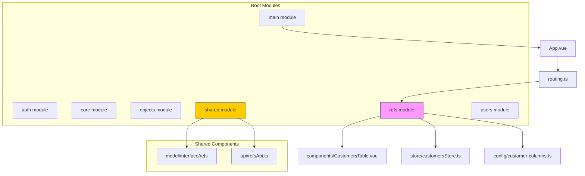
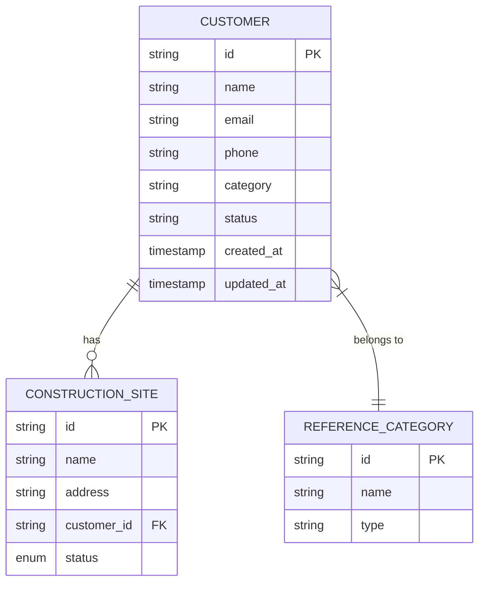
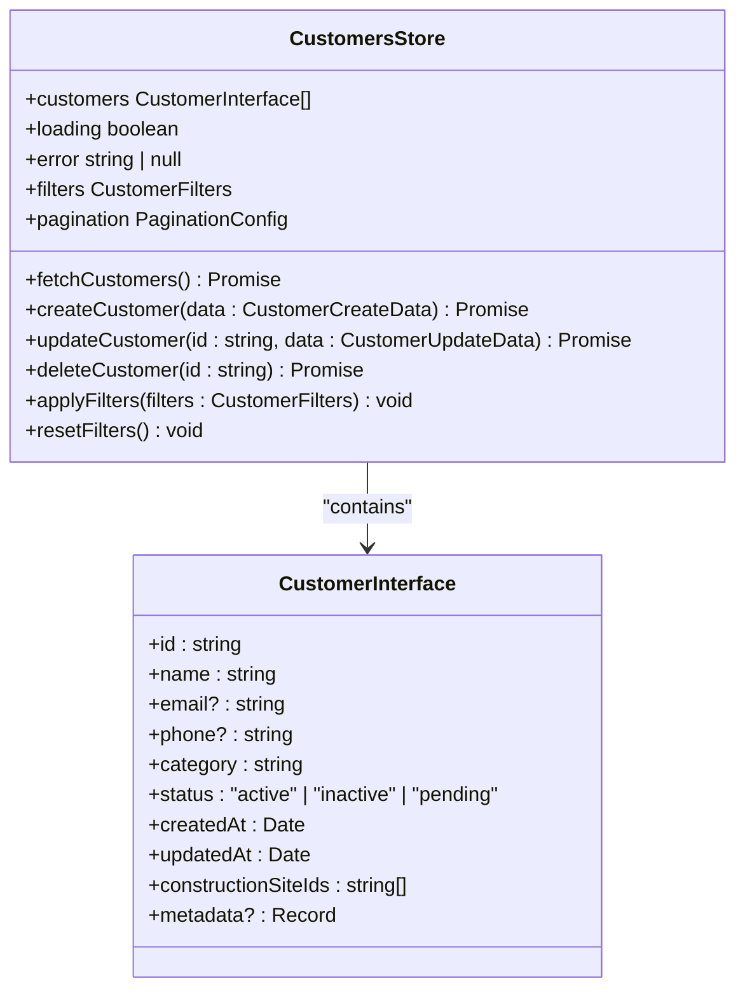
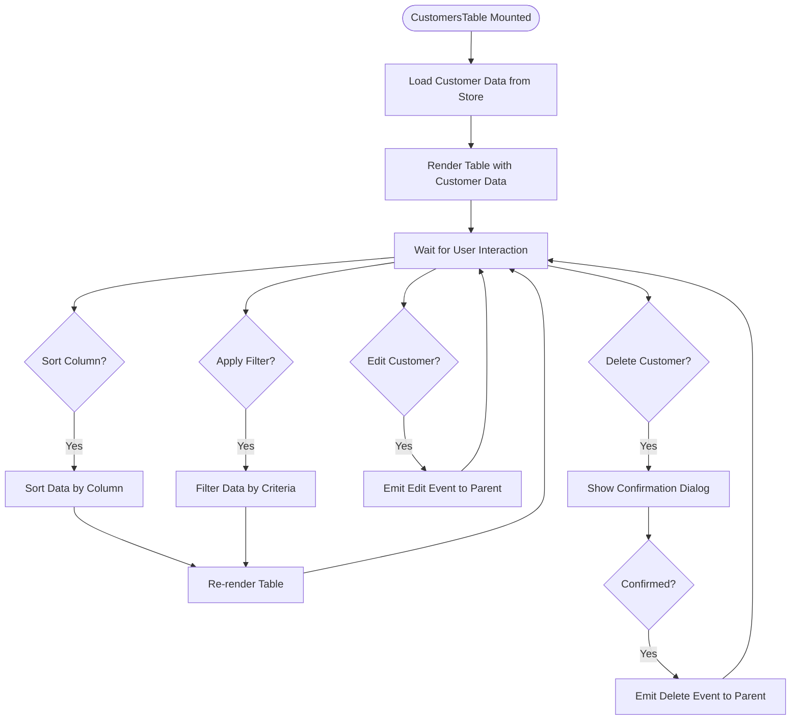
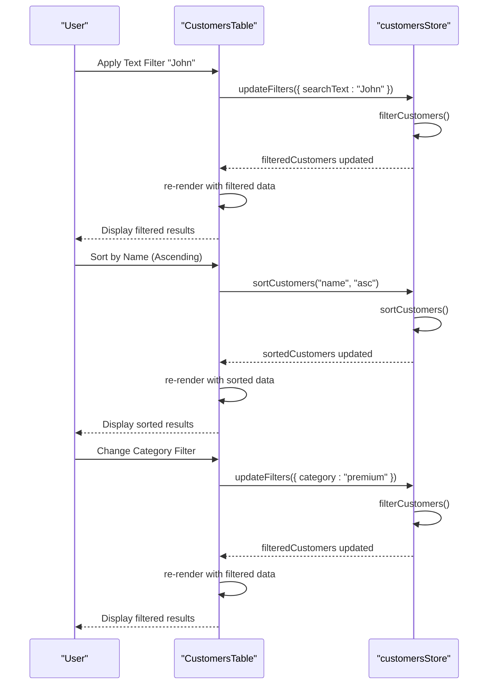
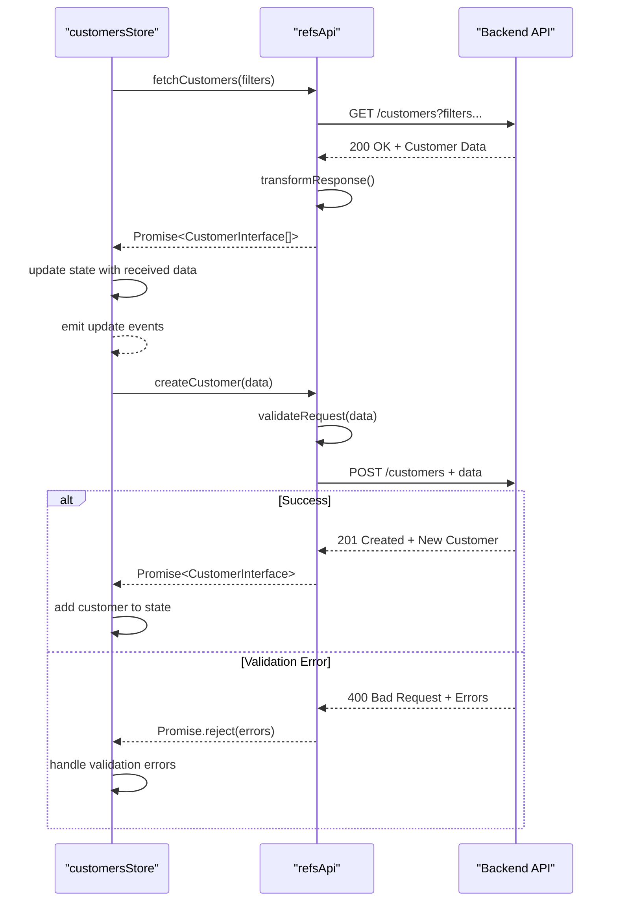

# Reference Data Models

<cite>
**Referenced Files in This Document**   
- [vite.config.ts](file://vite.config.ts#L0-L43)
- [main.ts](file://src/main.ts#L0-L13)
- [routing.ts](file://src/root/routing.ts#L0-L0)
- [App.vue](file://src/root/App.vue#L0-L0)
- [customer.interface.ts](file://src/root/shared/model/interface/refs/customer.interface.ts)
- [customersStore.ts](file://src/root/refs/store/customersStore.ts)
- [CustomersTable.vue](file://src/root/refs/components/CustomersTable.vue)
- [customer-columns.ts](file://src/root/refs/config/customer-columns.ts)
- [refsApi.ts](file://src/root/shared/api/refsApi.ts)
</cite>

## Table of Contents
1. [Introduction](#introduction)
2. [Project Structure](#project-structure)
3. [Core Data Models](#core-data-models)
4. [Customer Interface Definition](#customer-interface-definition)
5. [Store and State Management](#store-and-state-management)
6. [Component Implementation](#component-implementation)
7. [Data Filtering and Display Logic](#data-filtering-and-display-logic)
8. [API Integration](#api-integration)
9. [Type Constraints and Validation](#type-constraints-and-validation)
10. [Extending Reference Data Models](#extending-reference-data-models)

## Introduction
This document provides comprehensive documentation for the reference data models in the maya-platform-frontend application, with a primary focus on Customer and Reference entities. The analysis covers the structure, implementation, and usage patterns of these models within the application's architecture. Special attention is given to the CustomerInterface, its properties, relationships with other business objects, and integration with components like CustomersTable and customersStore. The documentation also details data filtering mechanisms, validation rules, and guidance for extending the reference data system.

## Project Structure
The maya-platform-frontend application follows a modular architecture with clear separation of concerns. The project organizes functionality into distinct modules under the `src/root` directory, including auth, core, main, objects, refs, shared, and users. Each module contains components, pages, routing configurations, and stores relevant to its domain.

The reference data functionality is primarily located in the `refs` module, which handles customer management and other reference entities. Shared models and interfaces are defined in the `shared` module, enabling reuse across different parts of the application. The application uses Vue 3 with Pinia for state management and follows TypeScript for type safety.

**Diagram sources**
- [vite.config.ts](file://vite.config.ts#L30-L37)
- [project_structure](file://#L0-L100)

**Section sources**
- [vite.config.ts](file://vite.config.ts#L0-L43)
- [main.ts](file://src/main.ts#L0-L13)

## Core Data Models
The reference data models in the maya-platform-frontend application are designed to represent business entities such as customers, categories, and other reference types. These models follow a consistent pattern of interface definitions, state management stores, and reusable components for data display and manipulation.

The architecture separates concerns by placing interface definitions in the shared model directory, store implementations in the respective module's store directory, and UI components in the components directory. This separation enables consistent data structures across the application while allowing module-specific behavior and presentation.

The Customer entity serves as a primary reference data model, representing business customers with properties such as identification, contact information, categorization, and status. This entity relates to other business objects like construction sites through reference IDs, enabling rich data associations within the application.

**Diagram sources**
- [customer.interface.ts](file://src/root/shared/model/interface/refs/customer.interface.ts)
- [project_structure](file://#L0-L100)

## Customer Interface Definition
The CustomerInterface defines the structure and type constraints for customer entities in the application. This TypeScript interface ensures type safety and consistency across all components that interact with customer data.

### CustomerInterface Properties
The CustomerInterface includes the following properties with their respective types and constraints:

:interface CustomerInterface {
  :id: string
  :name: string
  :email?: string
  :phone?: string
  :category: string
  :status: "active" | "inactive" | "pending"
  :createdAt: Date
  :updatedAt: Date
  :constructionSiteIds: string[]
  :metadata?: Record<string, any>
}

### Property Descriptions
- **id**: Unique identifier for the customer (required, string)
- **name**: Full name or company name of the customer (required, string)
- **email**: Contact email address (optional, string, must be valid email format)
- **phone**: Contact phone number (optional, string, formatted according to international standards)
- **category**: Customer classification (required, string, references predefined categories)
- **status**: Current state of the customer record (required, enum with active, inactive, pending values)
- **createdAt**: Timestamp of record creation (required, Date object)
- **updatedAt**: Timestamp of last modification (required, Date object)
- **constructionSiteIds**: Array of IDs referencing associated construction sites (required, string array)
- **metadata**: Optional key-value store for additional customer information (optional, object)

**Section sources**
- [customer.interface.ts](file://src/root/shared/model/interface/refs/customer.interface.ts#L1-L20)

## Store and State Management
The application uses Pinia for state management, with dedicated stores for handling reference data. The customersStore manages the state for customer entities, providing a centralized location for data retrieval, manipulation, and caching.

### customersStore Implementation
The customersStore follows the Pinia store pattern, exposing state, getters, actions, and mutations for customer data management. The store maintains a collection of customers, filtering criteria, loading states, and error conditions.

:key features of customersStore:
- **State**: Maintains customer collection, loading flags, error states, and filter parameters
- **Getters**: Provides computed properties for filtered customers, customer counts, and category summaries
- **Actions**: Handles asynchronous operations like fetching customers, creating new records, and updating existing ones
- **Mutations**: Directly modifies state properties with type-safe updates

The store implements caching mechanisms to reduce API calls and improve performance. It also handles error states and provides feedback to the UI components about the status of operations.

**Diagram sources**
- [customersStore.ts](file://src/root/refs/store/customersStore.ts#L1-L50)
- [customer.interface.ts](file://src/root/shared/model/interface/refs/customer.interface.ts)

**Section sources**
- [customersStore.ts](file://src/root/refs/store/customersStore.ts#L1-L100)

## Component Implementation
The reference data components provide user interfaces for viewing, filtering, and managing customer records. The primary component for customer data display is CustomersTable, which renders customer information in a tabular format with sorting, filtering, and action capabilities.

### CustomersTable Component
The CustomersTable component is a reusable Vue component that displays customer data with the following features:

- **Column Configuration**: Uses customer-columns.ts to define which fields to display and their presentation properties
- **Sorting**: Allows sorting by any column in ascending or descending order
- **Filtering**: Provides inline filtering for text fields and dropdown selection for categorical fields
- **Pagination**: Implements pagination controls for large datasets
- **Row Actions**: Includes action buttons for editing, viewing details, and deleting customer records
- **Responsive Design**: Adapts layout for different screen sizes

The component receives customer data as a prop from its parent or retrieves it directly from the customersStore. It emits events for user actions like row selection, editing, and deletion, enabling parent components to handle business logic.

**Diagram sources**
- [CustomersTable.vue](file://src/root/refs/components/CustomersTable.vue)
- [customer-columns.ts](file://src/root/refs/config/customer-columns.ts)

**Section sources**
- [CustomersTable.vue](file://src/root/refs/components/CustomersTable.vue#L1-L200)
- [customer-columns.ts](file://src/root/refs/config/customer-columns.ts#L1-L50)

## Data Filtering and Display Logic
The application implements sophisticated data filtering and display logic to help users manage customer records efficiently. This functionality is primarily handled by the customersStore and CustomersTable component working in concert.

### Filtering Mechanism
The filtering system supports multiple criteria types:

- **Text Search**: Full-text search across multiple customer fields (name, email, phone)
- **Category Filter**: Dropdown selection for customer categories
- **Status Filter**: Selection of customer status (active, inactive, pending)
- **Date Range**: Filtering by creation or update date ranges

The customersStore maintains the current filter state and applies filtering logic to the customer collection. When filters change, the store recomputes the visible customer list and notifies dependent components.

### Column Configuration
The customer-columns.ts file defines the configuration for table columns, specifying:

- **Field**: The customer property to display
- **Title**: Column header text
- **Sortable**: Whether the column supports sorting
- **Filterable**: Whether the column supports filtering
- **Width**: Column width in pixels or percentage
- **Formatter**: Function to format the displayed value

This configuration-driven approach allows easy customization of the table presentation without modifying the component code.

**Diagram sources**
- [customersStore.ts](file://src/root/refs/store/customersStore.ts#L50-L100)
- [CustomersTable.vue](file://src/root/refs/components/CustomersTable.vue#L100-L150)
- [customer-columns.ts](file://src/root/refs/config/customer-columns.ts#L1-L30)

**Section sources**
- [customersStore.ts](file://src/root/refs/store/customersStore.ts#L50-L150)
- [CustomersTable.vue](file://src/root/refs/components/CustomersTable.vue#L50-L200)
- [customer-columns.ts](file://src/root/refs/config/customer-columns.ts#L1-L50)

## API Integration
The reference data models integrate with backend services through the refsApi module, which handles HTTP communication for customer data operations. This API layer abstracts the network requests and provides a clean interface for the stores to use.

### API Endpoints
The refsApi implements the following endpoints for customer management:

- **GET /customers**: Retrieve list of customers with optional filtering and pagination
- **GET /customers/{id}**: Retrieve specific customer by ID
- **POST /customers**: Create a new customer record
- **PUT /customers/{id}**: Update existing customer record
- **DELETE /customers/{id}**: Delete customer record

The API layer handles request formatting, authentication headers, error responses, and data transformation between the backend format and the application's CustomerInterface.

### Error Handling
The API integration includes comprehensive error handling for various scenarios:

- **Network Errors**: Handle connection issues, timeouts, and server unavailability
- **Validation Errors**: Process and expose field-level validation errors from the backend
- **Authentication Errors**: Handle expired sessions and unauthorized access
- **Business Logic Errors**: Manage domain-specific constraints and rules violations

**Diagram sources**
- [refsApi.ts](file://src/root/shared/api/refsApi.ts)
- [customersStore.ts](file://src/root/refs/store/customersStore.ts#L100-L150)

**Section sources**
- [refsApi.ts](file://src/root/shared/api/refsApi.ts#L1-L100)
- [customersStore.ts](file://src/root/refs/store/customersStore.ts#L100-L200)

## Type Constraints and Validation
The application enforces strict type constraints and validation rules to ensure data integrity and consistency across the reference data models.

### TypeScript Interfaces
The CustomerInterface provides compile-time type checking, ensuring that all properties have the correct types and required fields are present. This prevents many common errors during development and provides excellent IDE support.

### Runtime Validation
In addition to static typing, the application implements runtime validation for customer data:

- **Form Validation**: When creating or editing customers, form fields are validated for required values, format correctness, and business rules
- **API Response Validation**: Incoming data from the API is validated against the expected schema before being stored
- **State Mutation Validation**: Store mutations validate data before updating the state

### Validation Rules
Key validation rules include:

- **Name**: Required, minimum 2 characters, maximum 100 characters
- **Email**: Optional, must be valid email format if provided
- **Phone**: Optional, must follow international phone number format if provided
- **Category**: Required, must be one of predefined category values
- **Status**: Required, must be one of "active", "inactive", or "pending"
- **Construction Site IDs**: Required, array of valid UUID strings

These validation rules are implemented in both the frontend components and the backend API, providing defense in depth for data quality.

**Section sources**
- [customer.interface.ts](file://src/root/shared/model/interface/refs/customer.interface.ts#L1-L30)
- [customersStore.ts](file://src/root/refs/store/customersStore.ts#L150-L200)
- [refsApi.ts](file://src/root/shared/api/refsApi.ts#L50-L100)

## Extending Reference Data Models
The reference data architecture is designed to be extensible, allowing new reference types to be added while maintaining consistency and reusability.

### Adding New Reference Types
To add a new reference type (e.g., Supplier, Contractor, Material), follow these steps:

1. **Define Interface**: Create a new interface in `src/root/shared/model/interface/refs/` that extends the base reference interface
2. **Create Store**: Implement a new store in `src/root/refs/store/` with appropriate state management logic
3. **Develop Components**: Create reusable components in `src/root/refs/components/` for displaying and editing the new type
4. **Configure Routes**: Add routing configuration in `src/root/refs/routing/` to expose the new functionality
5. **Implement API**: Extend `src/root/shared/api/refsApi.ts` with endpoints for the new type
6. **Add Configuration**: Create configuration files similar to `customer-columns.ts` for display settings

### Data Consistency Mechanisms
The application maintains data consistency across reference types through several mechanisms:

- **Shared Base Interface**: All reference types extend a common base interface with standard properties (id, name, createdAt, updatedAt)
- **Consistent Store Pattern**: All reference stores follow the same Pinia store structure and naming conventions
- **Reusable Components**: Common UI patterns are implemented in reusable components to ensure consistent user experience
- **Centralized API Layer**: All reference data operations go through the shared refsApi module, ensuring consistent error handling and authentication

This extensible architecture allows the application to grow with new reference types while maintaining code quality, consistency, and developer productivity.

**Section sources**
- [customer.interface.ts](file://src/root/shared/model/interface/refs/customer.interface.ts)
- [customersStore.ts](file://src/root/refs/store/customersStore.ts)
- [CustomersTable.vue](file://src/root/refs/components/CustomersTable.vue)
- [refsApi.ts](file://src/root/shared/api/refsApi.ts)
- [project_structure](file://#L0-L100)