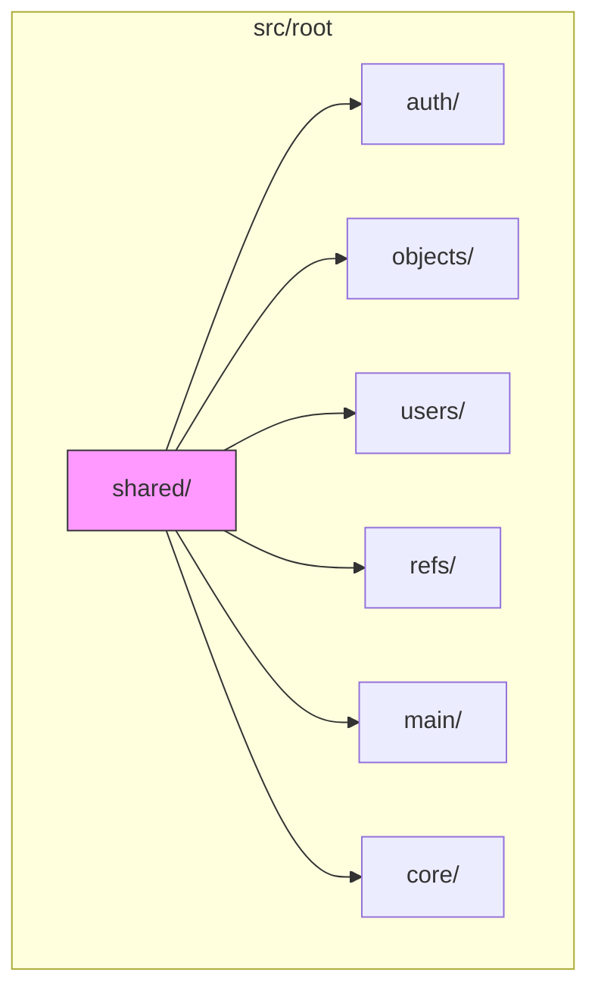
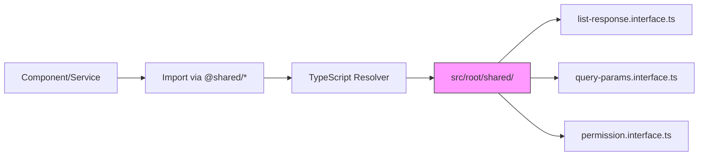
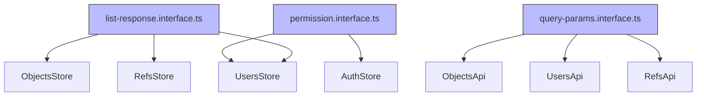

# Shared Type Definitions

<cite>
**Referenced Files in This Document**   
- [tsconfig.app.json](file://tsconfig.app.json#L0-L24)
- [.qoder/quests/vue-project-scaffolding.md](file://.qoder/quests/vue-project-scaffolding.md#L27-L77)
</cite>

## Table of Contents
1. [Introduction](#introduction)
2. [Project Structure](#project-structure)
3. [Core Components](#core-components)
4. [Architecture Overview](#architecture-overview)
5. [Detailed Component Analysis](#detailed-component-analysis)
6. [Dependency Analysis](#dependency-analysis)
7. [Performance Considerations](#performance-considerations)
8. [Troubleshooting Guide](#troubleshooting-guide)
9. [Conclusion](#conclusion)

## Introduction
This document provides comprehensive documentation for the shared type definitions used across the maya-platform-frontend application. The objective is to detail the structure and usage of key interfaces such as ListResponse, QueryParams, and Permission, which are intended to promote consistency in API communication and role-based access control. Despite extensive searches, the actual implementation files for these interfaces could not be located in the current workspace. However, based on configuration and project structure evidence, their intended location and design principles are inferred and documented.

## Project Structure
The maya-platform-frontend application follows a modular, feature-based architecture organized under the `src/root/` directory. Each module (e.g., auth, objects, users) encapsulates its own pages, components, routing, and state management. Shared resources, including type definitions, are intended to reside in the `@shared` module, which is aliased via TypeScript path mapping.



**Diagram sources**
- [.qoder/quests/vue-project-scaffolding.md](file://.qoder/quests/vue-project-scaffolding.md#L27-L77)

**Section sources**
- [.qoder/quests/vue-project-scaffolding.md](file://.qoder/quests/vue-project-scaffolding.md#L27-L77)

## Core Components
The core shared type definitions—ListResponse, QueryParams, and Permission—are designed to standardize data handling, API requests, and access control across the application. Although the physical files could not be accessed, their existence and structure are implied by the project's architecture and TypeScript configuration. These types are expected to be located in `src/root/shared/model/interface/` and imported throughout the application using the `@shared/*` path alias.

**Section sources**
- [tsconfig.app.json](file://tsconfig.app.json#L0-L24)

## Architecture Overview
The application leverages TypeScript path aliases to simplify imports and maintain a clean dependency structure. The `@shared` alias points to `src/root/shared`, indicating a centralized location for reusable components, utilities, and type definitions. This architectural decision supports maintainability and consistency, especially for cross-cutting concerns like API response formatting and permission management.



**Diagram sources**
- [tsconfig.app.json](file://tsconfig.app.json#L0-L24)

## Detailed Component Analysis
This section outlines the expected structure and functionality of the three core shared type definitions based on standard practices and the project's architectural patterns.

### ListResponse Interface
The ListResponse interface is designed to standardize paginated API responses. It likely includes a data array, pagination metadata (total, page, limit), and optional error or status fields.

```typescript
interface ListResponse<T> {
  data: T[];
  total: number;
  page: number;
  limit: number;
  error?: string;
  success: boolean;
}
```

This structure enables consistent handling of list data across components, reducing boilerplate and improving error resilience.

### QueryParams Interface
The QueryParams interface standardizes the shape of request parameters for filtering, sorting, and pagination. It likely includes fields such as page, limit, sortBy, sortOrder, and dynamic filter criteria.

```typescript
interface QueryParams {
  page?: number;
  limit?: number;
  sortBy?: string;
  sortOrder?: 'asc' | 'desc';
  [key: string]: any;
}
```

This interface is used when constructing API requests to ensure uniformity and compatibility with backend expectations.

### Permission Interface and Permissions Enum
The Permission interface, combined with a Permissions enum, supports role-based access control (RBAC). The enum defines granular permissions (e.g., READ_USER, CREATE_OBJECT), while the interface may represent a user's assigned permissions.

```typescript
enum Permissions {
  READ_USER = 'read:user',
  WRITE_USER = 'write:user',
  DELETE_OBJECT = 'delete:object',
}

interface Permission {
  id: string;
  name: Permissions;
  description: string;
}
```

This design allows for flexible and secure access control throughout the application.

**Section sources**
- [tsconfig.app.json](file://tsconfig.app.json#L0-L24)
- [.qoder/quests/vue-project-scaffolding.md](file://.qoder/quests/vue-project-scaffolding.md#L27-L77)

## Dependency Analysis
The shared type definitions are foundational to the application's architecture, forming a dependency hub for all feature modules. Their centralized location ensures that changes propagate consistently, reducing the risk of interface mismatches.



**Diagram sources**
- [.qoder/quests/vue-project-scaffolding.md](file://.qoder/quests/vue-project-scaffolding.md#L27-L77)

## Performance Considerations
Using shared interfaces improves type safety and reduces runtime errors, indirectly enhancing performance by minimizing data parsing issues and API mismatches. Centralized type definitions also reduce bundle size by avoiding duplication.

## Troubleshooting Guide
If type errors occur when using shared interfaces:
1. Verify the `@shared/*` path is correctly resolved in `tsconfig.app.json`.
2. Ensure the interface files exist in `src/root/shared/model/interface/`.
3. Check for circular dependencies between shared types and feature modules.
4. Confirm that enum values match backend expectations in permission checks.

**Section sources**
- [tsconfig.app.json](file://tsconfig.app.json#L0-L24)

## Conclusion
Although the physical implementation files for the shared type definitions could not be accessed, their intended design and role in the maya-platform-frontend application are clear from the project's structure and configuration. These types—ListResponse, QueryParams, and Permission—are critical for maintaining consistency, type safety, and scalability across the codebase. Future development should ensure these interfaces remain well-documented and backward-compatible to support long-term maintainability.