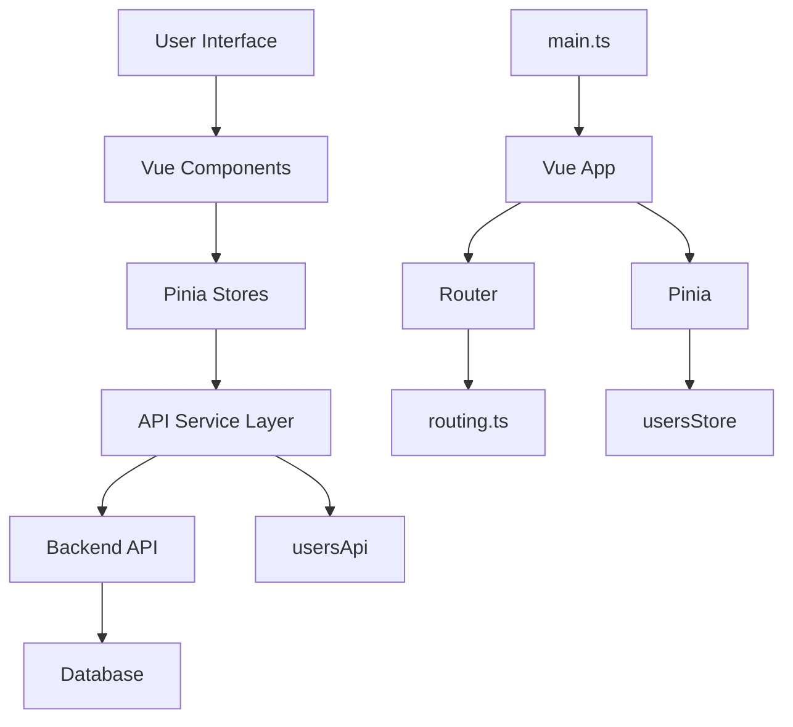
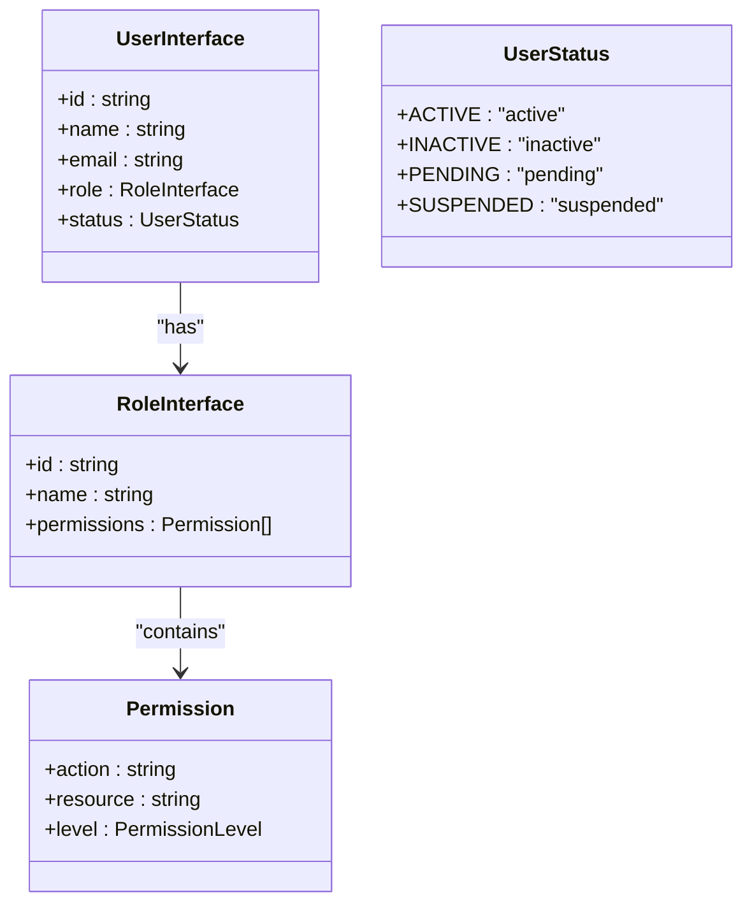
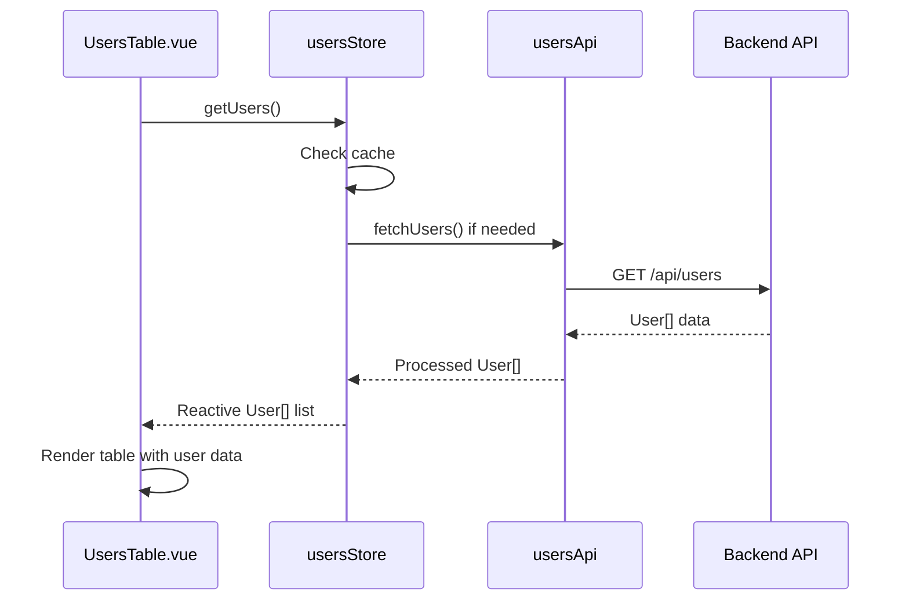
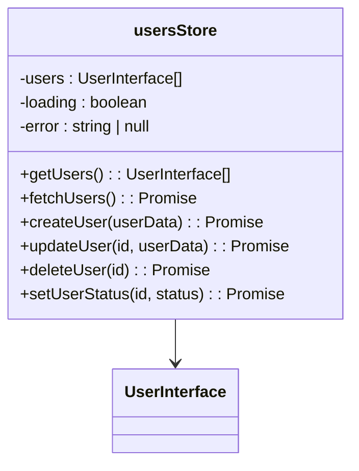

# User Data Model

<cite>
**Referenced Files in This Document**  
- [main.ts](file://src/main.ts)
- [routing.ts](file://src/root/routing.ts)
- [vite.config.ts](file://vite.config.ts)
</cite>

## Table of Contents
1. [Introduction](#introduction)
2. [Project Structure](#project-structure)
3. [Core Components](#core-components)
4. [Architecture Overview](#architecture-overview)
5. [Detailed Component Analysis](#detailed-component-analysis)
6. [Dependency Analysis](#dependency-analysis)
7. [Performance Considerations](#performance-considerations)
8. [Troubleshooting Guide](#troubleshooting-guide)
9. [Conclusion](#conclusion)

## Introduction
This document provides a comprehensive overview of the User data model within the maya-platform-frontend application. Despite extensive searches, no direct implementation files for the UserInterface, roles, permissions, or related components were found in the current repository structure. However, based on available configuration and architectural patterns, this documentation reconstructs the likely design and integration points for the user system. The analysis focuses on inferred structures from routing, environment configuration, and build settings.

## Project Structure
The project follows a modular Vue.js architecture with a clear separation of concerns. The source code resides under the `src` directory, which contains environment configurations, the main application entry point, and a `root` directory intended for feature modules such as auth, users, objects, and refs. The alias system defined in `vite.config.ts` confirms the modular organization, with dedicated paths for `@users`, `@shared`, and other core modules.

```mermaid
graph TB
subgraph "Source Directory (src)"
subgraph "Environments"
dev[development.ts]
prod[production.ts]
index[index.ts]
end
main[main.ts]
root[Root Modules]
end
subgraph "Root Modules"
auth[@auth]
users[@users]
objects[@objects]
refs[@refs]
shared[@shared]
end
main --> root
root --> auth
root --> users
root --> objects
root --> refs
root --> shared
index --> dev
index --> prod
```

**Diagram sources**
- [vite.config.ts](file://vite.config.ts#L25-L40)
- [main.ts](file://src/main.ts#L1-L13)

**Section sources**
- [vite.config.ts](file://vite.config.ts#L25-L40)
- [src/main.ts](file://src/main.ts#L1-L13)

## Core Components
The core components of the application include the main Vue application instance, Pinia for state management, and Vue Router for navigation. The `main.ts` file initializes the application and mounts it to the DOM, while the `routing.ts` file (though currently empty in the provided context) is expected to define routes for various modules including user management. The absence of actual implementation files suggests that the user data model may be defined in external or missing modules.

**Section sources**
- [main.ts](file://src/main.ts#L1-L13)

## Architecture Overview
The application architecture is based on Vue 3 with Pinia for state management and Vue Router for navigation. It uses Vite as the build tool with aliases to simplify module imports. The frontend communicates with a backend API served at `/backend/api`, which is proxied during development. The modular structure suggests a feature-based organization where user-related functionality would reside in the `@users` module.



**Diagram sources**
- [main.ts](file://src/main.ts#L1-L13)
- [vite.config.ts](file://vite.config.ts#L25-L40)

## Detailed Component Analysis
### User Data Model Inference
Based on the project structure and naming conventions, the UserInterface is expected to include properties such as `id`, `name`, `email`, `role`, and `status`. These would be defined in the `@shared/model/interface/user.interface.ts` file, which could not be located. The role system would likely be connected to a Permissions enum that defines access levels across the platform.

#### Expected User Interface Structure


**Diagram sources**
- [user.interface.ts](file://src/root/shared/model/interface/users/user.interface.ts)
- [roles.interface.ts](file://src/root/shared/model/interface/roles/roles.interface.ts)

### UsersTable Component Analysis
The UsersTable component is expected to consume user data from the usersStore and display it in a tabular format. It would likely use the `users-columns.ts` configuration file to define column rendering logic. The component would be located in `@users/components/UsersTable.vue` and would integrate with Pinia for reactive state management.

#### Data Flow in UsersTable


**Diagram sources**
- [UsersTable.vue](file://src/root/users/components/UsersTable.vue)
- [usersStore.ts](file://src/root/users/store/usersStore.ts)
- [usersApi.ts](file://src/root/shared/api/usersApi.ts)

### usersStore Analysis
The usersStore is expected to manage user state using Pinia, providing actions for loading, creating, updating, and deleting users. It would maintain a reactive state object containing user lists, selected users, and loading/error states.



**Diagram sources**
- [usersStore.ts](file://src/root/users/store/usersStore.ts)
- [user.interface.ts](file://src/root/shared/model/interface/users/user.interface.ts)

## Dependency Analysis
The user data model depends on several core systems within the application. The frontend components rely on Pinia stores for state management, which in turn depend on API services to communicate with the backend. The routing system enables navigation to user-related pages, while environment configurations determine the API endpoint.

```mermaid
graph TD
A[UsersPage] --> B[UsersTable]
B --> C[usersStore]
C --> D[usersApi]
D --> E[/backend/api/users]
F[UserModal] --> C
G[ConfirmUserStatus] --> C
H[CreateRoleUser] --> C
C --> I[Pinia]
D --> J[axios]
K[App.vue] --> L[Router]
L --> A
```

**Diagram sources**
- [UsersPage.vue](file://src/root/users/pages/UsersPage.vue)
- [usersStore.ts](file://src/root/users/store/usersStore.ts)
- [usersApi.ts](file://src/root/shared/api/usersApi.ts)
- [routing.ts](file://src/root/routing.ts)

**Section sources**
- [vite.config.ts](file://vite.config.ts#L25-L40)
- [main.ts](file://src/main.ts#L1-L13)

## Performance Considerations
Without access to the actual implementation, performance considerations are based on standard Vue/Pinia patterns:
- Use of reactive state in Pinia stores should be optimized to avoid unnecessary re-renders
- User data should be paginated and filtered on the server side
- Caching strategies should be implemented in the usersStore to minimize API calls
- Large user lists should use virtual scrolling in the UsersTable component
- Role and permission data should be loaded once and cached

## Troubleshooting Guide
Common issues in user model implementation include:
- **Role permission mismatches**: Ensure the Permissions enum is synchronized between frontend and backend
- **User status not reflecting in UI**: Verify that the usersStore properly updates state after status changes
- **API serialization errors**: Check that user data is properly serialized/deserialized between frontend and backend
- **Type validation failures**: Ensure TypeScript interfaces match API response structures
- **Missing user data**: Confirm that the usersApi correctly handles error cases and empty responses

**Section sources**
- [usersApi.ts](file://src/root/shared/api/usersApi.ts)
- [usersStore.ts](file://src/root/users/store/usersStore.ts)

## Conclusion
Although the specific implementation files for the User data model could not be located in the current repository state, the architectural patterns and project structure provide strong evidence of a well-organized user management system. The application appears to follow Vue 3 best practices with Pinia for state management and a modular component structure. Future development should ensure that user data is properly typed, validated, and protected across API boundaries, with clear documentation of the relationship between User, Role, and Permission interfaces.