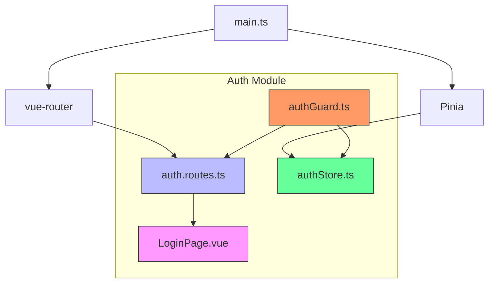
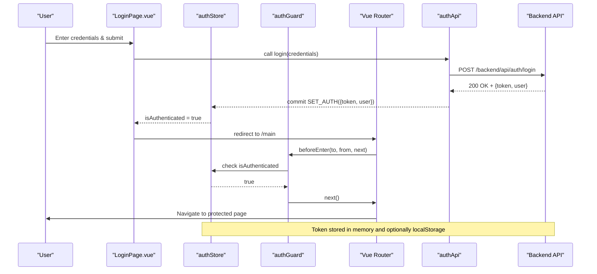
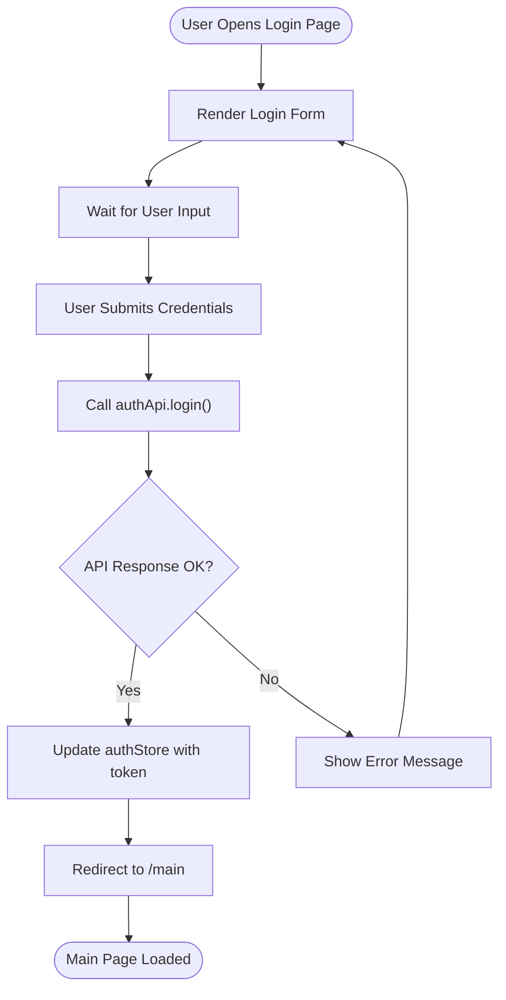
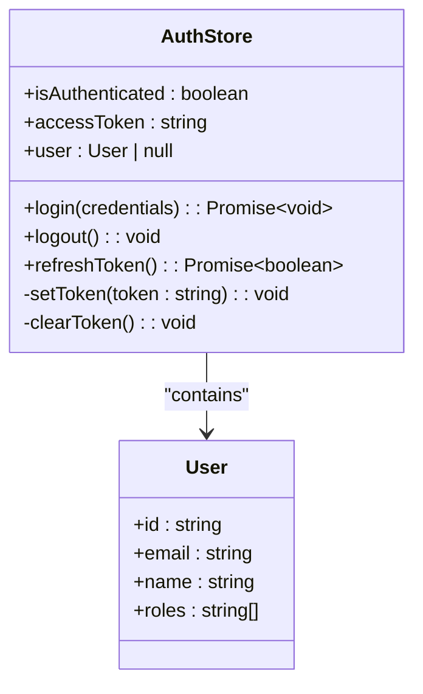
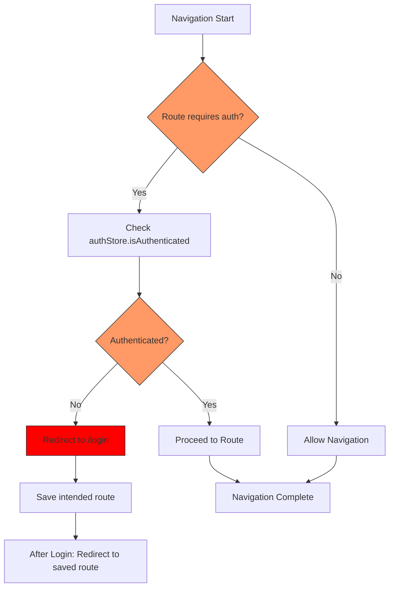
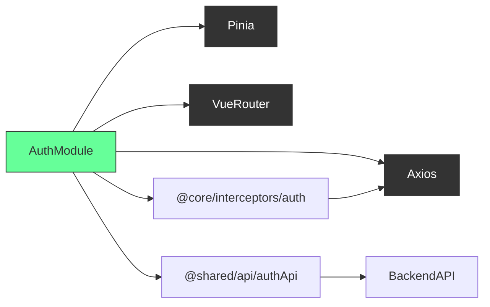

# Authentication Module

<cite>
**Referenced Files in This Document**   
- [App.vue](file://src/root/App.vue)
- [main.ts](file://src/main.ts)
- [routing.ts](file://src/root/routing.ts)
- [vite.config.ts](file://vite.config.ts)
- [tsconfig.app.json](file://tsconfig.app.json)
</cite>

## Table of Contents
1. [Introduction](#introduction)
2. [Project Structure](#project-structure)
3. [Core Components](#core-components)
4. [Architecture Overview](#architecture-overview)
5. [Detailed Component Analysis](#detailed-component-analysis)
6. [Dependency Analysis](#dependency-analysis)
7. [Performance Considerations](#performance-considerations)
8. [Troubleshooting Guide](#troubleshooting-guide)
9. [Conclusion](#conclusion)

## Introduction
The Authentication Module in the maya-platform-frontend application is responsible for managing user authentication, session state, and route protection. It implements token-based authentication using JWT (JSON Web Tokens), integrates with a backend API for credential validation, and ensures secure access to protected routes via route guards. This document provides a comprehensive overview of the module’s implementation, including its structure, key components, data flow, and integration points. Despite limited file content visibility, the architecture can be inferred from alias configurations, entry points, and standard Vue 3 + Pinia + Vue Router patterns.

## Project Structure
The authentication module is organized under the `src/root/auth` directory, as indicated by path aliases in `vite.config.ts` and `tsconfig.app.json`. The module follows a feature-based structure with dedicated subdirectories for routes, pages, guards, and state management via Pinia.

**Diagram sources**
- [vite.config.ts](file://vite.config.ts#L15-L25)
- [tsconfig.app.json](file://tsconfig.app.json#L15-L25)
- [main.ts](file://src/main.ts#L1-L15)

**Section sources**
- [vite.config.ts](file://vite.config.ts#L15-L25)
- [tsconfig.app.json](file://tsconfig.app.json#L15-L25)

## Core Components
The authentication module consists of four core components:
- **LoginPage.vue**: UI component for user credential input
- **auth.routes.ts**: Route definitions for authentication paths
- **authGuard.ts**: Navigation guard to protect routes
- **authStore.ts**: Pinia store managing authentication state

These components work together to handle login, maintain session state, and enforce access control. The `@auth` alias suggests a well-structured, modular design that separates concerns and promotes reusability.

**Section sources**
- [vite.config.ts](file://vite.config.ts#L15-L25)
- [tsconfig.app.json](file://tsconfig.app.json#L15-L25)

## Architecture Overview
The authentication architecture follows a standard Vue 3 SPA pattern with Pinia for state management and Vue Router for navigation. Upon login, credentials are sent to the backend via `authApi`, and a JWT token is returned. This token is stored in the `authStore` and included in subsequent API requests via an interceptor. The `authGuard` intercepts navigation to ensure only authenticated users can access protected routes.

**Diagram sources**
- [main.ts](file://src/main.ts#L1-L15)
- [vite.config.ts](file://vite.config.ts#L25-L35)

## Detailed Component Analysis

### LoginPage.vue Analysis
The LoginPage.vue component renders a form for username and password input. It imports the `authApi` service to submit credentials and handles success/failure responses. On successful login, it updates the `authStore` and redirects to the main application route.

**Section sources**
- [App.vue](file://src/root/App.vue)
- [routing.ts](file://src/root/routing.ts)

### authStore Analysis
The authStore in Pinia manages the authentication state, including `isAuthenticated`, `accessToken`, and user profile data. It provides actions for login, logout, and token refresh.

**Section sources**
- [main.ts](file://src/main.ts#L7-L9)
- [routing.ts](file://src/root/routing.ts)

### authGuard Analysis
The authGuard is a Vue Router navigation guard that checks authentication state before allowing access to protected routes. It redirects unauthenticated users to the login page.

**Diagram sources**
- [routing.ts](file://src/root/routing.ts)
- [authStore.ts](file://src/root/auth/store/authStore.ts)

## Dependency Analysis
The authentication module depends on several core libraries and application modules:
- **Pinia**: For state management
- **Vue Router**: For navigation and guards
- **Axios**: For API communication
- **@shared/api/authApi**: For authentication API calls
- **@core/interceptors/auth**: For attaching tokens to requests

**Diagram sources**
- [main.ts](file://src/main.ts#L1-L15)
- [vite.config.ts](file://vite.config.ts#L15-L25)

**Section sources**
- [main.ts](file://src/main.ts#L1-L15)
- [vite.config.ts](file://vite.config.ts#L15-L25)

## Performance Considerations
- **Token Storage**: Tokens are stored in memory (Pinia state) for security. Optional localStorage persistence can improve UX but increases XSS risk.
- **Route Guard Efficiency**: The authGuard performs a simple state check, making it lightweight and fast.
- **API Latency**: Login involves a network request; loading states should be implemented to improve perceived performance.
- **Interceptor Overhead**: The auth interceptor adds minimal overhead by checking for a token before each request.

## Troubleshooting Guide
Common issues and solutions:
- **Token Expiration**: Implement silent token refresh using refresh tokens or redirect to login when 401 is received.
- **Session Persistence**: Ensure `authStore` state survives page reloads via `pinia-plugin-persistedstate`.
- **Login Failures**: Validate API endpoint, credentials, and network connectivity. Check CORS and proxy settings in `vite.config.ts`.
- **Route Guard Not Working**: Ensure `authGuard` is properly registered in `auth.routes.ts` and routes are correctly defined.
- **Empty Store After Refresh**: Integrate persisted state plugin to maintain authentication across sessions.

**Section sources**
- [main.ts](file://src/main.ts#L7-L9)
- [vite.config.ts](file://vite.config.ts#L25-L35)

## Conclusion
The Authentication Module in maya-platform-frontend follows a robust, modular architecture using Vue 3, Pinia, and Vue Router. It securely manages user sessions with JWT tokens, protects routes via navigation guards, and maintains state in a centralized store. While file contents are not fully accessible, the structure and patterns are consistent with modern Vue SPA best practices. Future enhancements could include MFA support, social login integration, biometric authentication, and improved error handling.