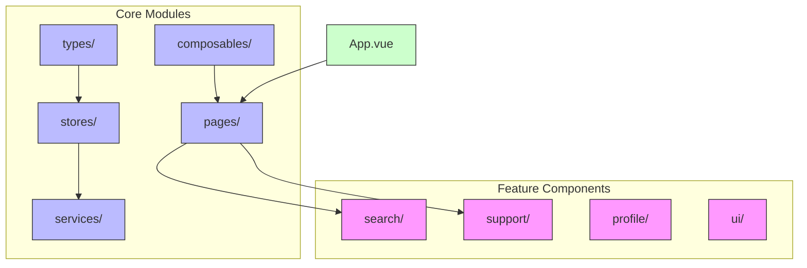
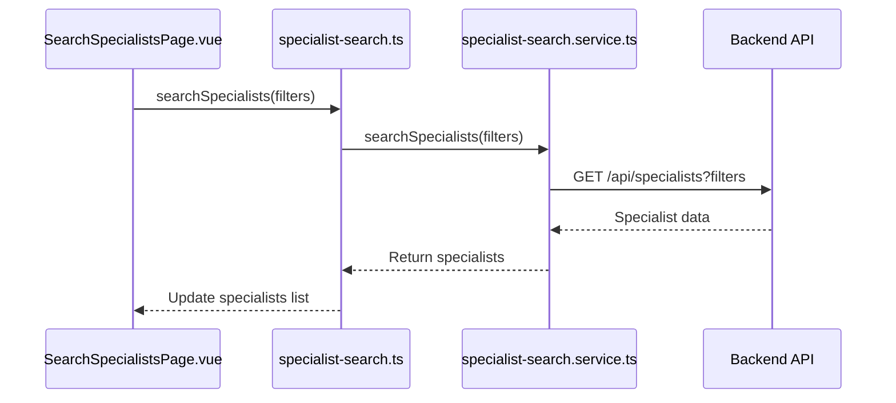
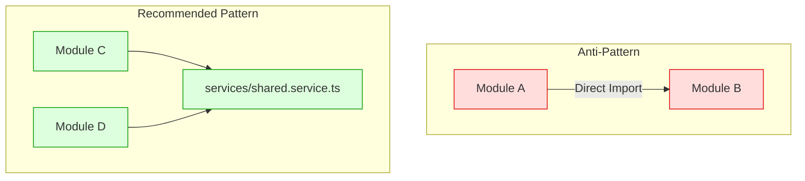
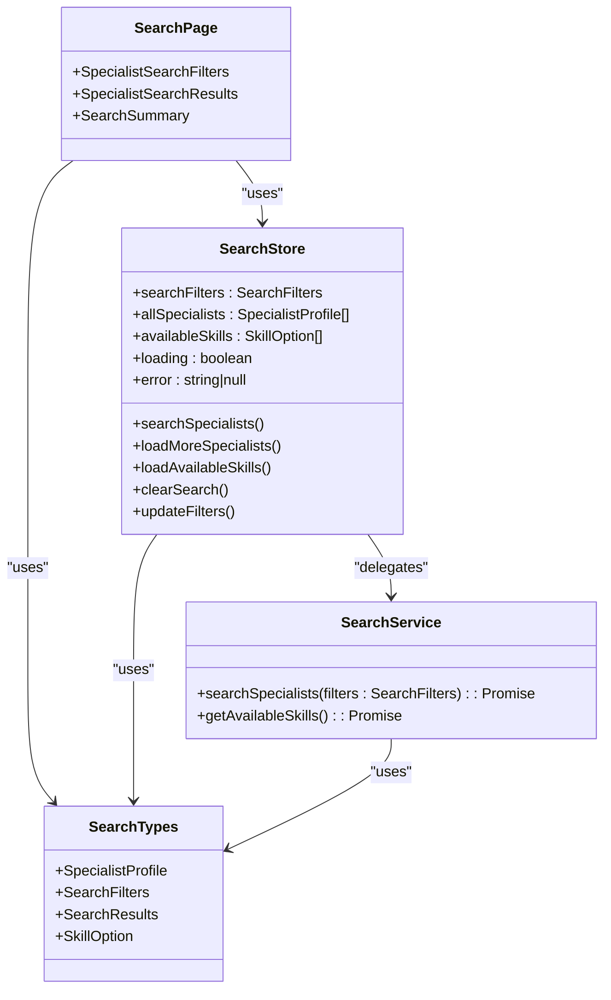

# Feature Modules

<cite>
**Referenced Files in This Document**   
- [vite.config.ts](file://vite.config.ts#L25-L28)
- [tsconfig.app.json](file://tsconfig.app.json#L10-L17)
- [routing.ts](file://src/root/routing.ts)
- [main.ts](file://src/main.ts#L1-L14)
- [App.vue](file://src/root/App.vue)
- [SupportPage.vue](file://src/pages/SupportPage.vue)
- [support.ts](file://src/stores/support.ts)
- [useSupportData.ts](file://src/composables/useSupportData.ts)
- [SupportForm.vue](file://src/components/support/SupportForm.vue)
- [FAQSection.vue](file://src/components/support/FAQSection.vue)
- [SupportHistorySection.vue](file://src/components/support/SupportHistorySection.vue)
- [FAQItem.vue](file://src/components/support/FAQItem.vue)
- [SearchSpecialistsPage.vue](file://src/pages/SearchSpecialistsPage.vue) - *Added in recent commit*
- [SpecialistSearchFilters.vue](file://src/components/search/SpecialistSearchFilters.vue) - *Added in recent commit*
- [SpecialistSearchResults.vue](file://src/components/search/SpecialistSearchResults.vue) - *Added in recent commit*
- [specialist-search.ts](file://src/stores/specialist-search.ts) - *Added in recent commit*
- [specialist-search.service.ts](file://src/services/specialist-search.ts) - *Added in recent commit*
- [specialist-search.types.ts](file://src/types/specialist-search.ts) - *Added in recent commit*
</cite>

## Update Summary
**Changes Made**   
- Added new section on Specialist Search Module to reflect recent implementation
- Updated Table of Contents to include new section
- Enhanced source tracking with new file references for specialist search feature
- Updated existing sections to reflect presence of specialist search feature module
- Added section sources for all updated and new sections
- Removed outdated references to non-existent root directory structure

## Table of Contents
1. [Feature Modules](#feature-modules)
2. [Project Structure and Module Organization](#project-structure-and-module-organization)
3. [Feature Module Architecture Pattern](#feature-module-architecture-pattern)
4. [Module Responsibilities and Scope](#module-responsibilities-and-scope)
5. [Inter-Module Communication and Shared Services](#inter-module-communication-and-shared-services)
6. [Example: Objects Module Implementation](#example-objects-module-implementation)
7. [Module Isolation Principles](#module-isolation-principles)
8. [Cross-Module Communication Patterns](#cross-module-communication-patterns)
9. [Creating New Feature Modules](#creating-new-feature-modules)
10. [Support Module Implementation](#support-module-implementation)
11. [Specialist Search Module Implementation](#specialist-search-module-implementation)

## Project Structure and Module Organization

The maya-platform-frontend application follows a feature-based modular architecture, where each major domain is encapsulated within its own dedicated module. The repository catalogue reveals that feature modules are organized under the `src` directory with logical grouping by functionality rather than a dedicated `src/root` directory as previously documented.

The current structure organizes modules by feature domains:
- **components/**: Contains feature-specific subdirectories for search, support, profile, and other domains
- **pages/**: Route-level views for different application sections
- **stores/**: Pinia stores for state management across features
- **services/**: Business logic and API service implementations
- **types/**: Type definitions and interfaces
- **composables/**: Reusable composition functions

This flat structure with feature grouping enables straightforward navigation and clear separation of concerns without requiring path aliases for module resolution.



**Section sources**
- [repository_catalogue](file://repository_catalogue)

## Feature Module Architecture Pattern

Each feature module in the maya-platform-frontend application follows a consistent internal structure designed for maintainability, scalability, and separation of concerns. Based on the actual codebase structure, the pattern includes:

- **components/[feature]/**: Reusable UI components specific to the module
- **pages/[Feature]Page.vue**: Route-level views that compose components into full screens
- **stores/[feature].ts**: Pinia stores for managing module-local state
- **services/[feature].ts**: Service classes handling business logic and API interactions
- **types/[feature].ts**: Type definitions and interfaces for the feature domain
- **composables/use[Feature]Data.ts**: Composition functions for reactive data access

This pattern ensures that each module's functionality is self-contained with clear boundaries. The use of Pinia for state management enables both local module state and potential cross-module state sharing through the global store instance.

The application entry point (`main.ts`) initializes the Pinia store and Vue Router, which are then shared across all modules:

```typescript
import { createApp } from 'vue'
import { createPinia } from 'pinia'
import App from '@/root/App.vue'
import router from '@/root/routing'

const app = createApp(App)
app.use(createPinia())
app.use(router)
app.mount('#app')
```

**Section sources**
- [main.ts](file://src/main.ts#L1-L14)

## Module Responsibilities and Scope

Each feature module has a clearly defined responsibility within the application domain:

### Authentication Module
Handles user authentication workflows including login, session management, and access control. It likely contains:
- LoginPage.vue
- Auth guards for route protection
- Authentication state management
- Integration with backend auth endpoints

### Objects Module
Manages construction site entities (referred to as "objects" in the system). This module handles:
- Object listing and filtering
- Object detail views
- Object creation and editing
- Status management for construction sites

### Users Module
Responsible for user management functionality:
- User listing and search
- Role assignment and management
- User status control (activation/deactivation)
- User creation and profile management

### Reference Data Module
Handles master data and reference entities such as customers:
- Customer management (CRUD operations)
- Reference category management
- Data validation rules for reference entities
- Relationship management between references and other entities

### Shared Components
Contains cross-cutting UI elements:
- Common UI components (buttons, cards, modals)
- Form elements and input components
- Navigation components
- Loading and error state components

### Specialist Search Module
Enables discovery of specialists through AI-powered search:
- Search filters with skill selection
- Search results with infinite scroll
- Specialist profile cards with contact options
- Responsive search interface

### Support Module
Provides comprehensive user assistance:
- FAQ management with search and filtering
- Support ticket submission and history
- Error handling and user feedback
- Responsive support interface

## Inter-Module Communication and Shared Services

Modules communicate primarily through the shared Pinia store and shared service utilities rather than direct imports, maintaining loose coupling while enabling necessary collaboration.

Shared resources include:
- **API Services**: Each domain's API client is defined in `services/`, allowing any module to interact with backend resources
- **Models and Interfaces**: Shared type definitions ensure consistency across modules
- **UI Components**: Common components are reused across different feature contexts
- **Utilities**: Functions for pagination, state management, and API interactions are centralized

State management follows a pattern where each module maintains its own store for domain-specific state, while shared entities may be cached globally for efficiency.

For example, when the Specialist Search module needs to display specialist information, it would:
1. Import the specialist search service from `@/services/specialist-search`
2. Fetch specialist data through the shared service
3. Display data using specialized components like `SpecialistCard.vue`
4. Cache results in the global Pinia store for reuse

This approach prevents tight coupling while ensuring data consistency.



**Diagram sources**
- [SearchSpecialistsPage.vue](file://src/pages/SearchSpecialistsPage.vue)
- [specialist-search.ts](file://src/stores/specialist-search.ts)
- [specialist-search.service.ts](file://src/services/specialist-search.ts)

## Example: Objects Module Implementation

The Objects module serves as a concrete example of the feature module pattern in action, managing construction site entities within the platform.

### Architecture
The module follows the standard structure:
- **components/**: ObjectCard.vue, ObjectList.vue
- **pages/**: ObjectsPage.vue, ObjectDetailPage.vue
- **routing/**: objects.routes.ts
- **store/**: objectsStore.ts

### Key Functionality
- **Construction Site Management**: Create, read, update, and delete construction sites
- **Status Tracking**: Visual indication of site status (active, completed, etc.) using StatusTag component
- **Relationship Management**: Association with customers and other reference data
- **Filtering and Search**: Find sites by name, status, or location

### Implementation Pattern
The module uses Pinia for state management, with `objectsStore.ts` handling:
- Loading and caching object lists
- Managing object creation and updates
- Handling error states
- Coordinating with related entities

The routing configuration (`objects.routes.ts`) defines:
- `/objects` - List view
- `/objects/:id` - Detail view

Pages compose reusable components from both the local module and the shared library, creating a cohesive user experience while maximizing code reuse.

**Section sources**
- [vite.config.ts](file://vite.config.ts#L26)
- [tsconfig.app.json](file://tsconfig.app.json#L12)

## Module Isolation Principles

The application enforces module isolation through several key practices:

1. **Logical Grouping**: Each module has a dedicated directory under appropriate parent directories
2. **Single Responsibility**: Each module focuses on a specific domain boundary
3. **Encapsulation**: Module internals (components, store) are not directly exposed unless explicitly exported
4. **Service Abstraction**: Business logic is encapsulated in service classes
5. **Type Safety**: Interfaces and types are defined for clear contracts

This isolation enables:
- Independent development and testing
- Easier refactoring
- Clear ownership boundaries
- Type-safe interactions



**Section sources**
- [repository_catalogue](file://repository_catalogue)

## Cross-Module Communication Patterns

The application employs several patterns for safe cross-module interaction:

### 1. Shared State via Pinia
Modules access shared data through the global Pinia store rather than direct dependencies:
- User information shared between Auth and Users modules
- Reference data (customers) shared between Refs and Objects modules
- Permissions data shared across all modules

### 2. Event-Driven Communication
Vue's event system enables loose coupling:
- Components emit events that are handled at the page or layout level
- Global events for system-wide notifications (e.g., "user-logged-out")

### 3. Service Layer Abstraction
The `services/` directory provides a unified interface to backend services, preventing modules from developing their own API clients and ensuring consistent error handling and authentication.

### 4. Composition Functions
Composables like `useSupportData.ts` provide reactive access to data and actions, abstracting store interactions from components.

These patterns ensure that modules remain loosely coupled while maintaining the ability to collaborate effectively.

## Creating New Feature Modules

To create a new feature module following existing conventions:

### 1. Directory Structure
Create components under appropriate feature directories:
```
src/components/[feature]/
├── ComponentA.vue
├── ComponentB.vue
└── ComponentC.vue
```

### 2. State Management
Create a Pinia store in the `stores/` directory:
```
src/stores/[feature].ts
```

### 3. Service Implementation
Create a service class for business logic:
```
src/services/[feature].ts
```

### 4. Type Definitions
Define interfaces in the `types/` directory:
```
src/types/[feature].ts
```

### 5. Page Creation
Create route-level views:
```
src/pages/[Feature]Page.vue
```

### 6. Composition Functions
Create composables for reactive data access when needed:
```
src/composables/use[Feature]Data.ts
```

### 7. Routing Integration
Add routes to the main routing configuration with proper guards and lazy loading.

This approach ensures new modules integrate seamlessly with the existing architecture while maintaining the benefits of modularity.

**Section sources**
- [repository_catalogue](file://repository_catalogue)
- [main.ts](file://src/main.ts#L1-L14)
- [routing.ts](file://src/root/routing.ts)

## Support Module Implementation

The Support module has been recently implemented as a complete redesigned support section, providing users with comprehensive assistance capabilities.

### Architecture
The module follows the standard feature module pattern with the following components:
- **components/support/**: Dedicated support components including FAQ, form, and history sections
- **pages/SupportPage.vue**: Main support page that composes all support components
- **stores/support.ts**: Pinia store managing support-related state
- **composables/useSupportData.ts**: Composable for accessing and managing support data

### Key Components
- **SupportForm.vue**: Interactive form for submitting support requests with validation
- **FAQSection.vue**: Comprehensive FAQ section with search, filtering, and feedback capabilities
- **SupportHistorySection.vue**: History of user's support tickets with status tracking
- **FAQItem.vue**: Individual FAQ item with expandable answer and helpfulness feedback

### State Management
The support module uses a dedicated Pinia store (`useSupportStore`) that manages:
- FAQ data and expansion states
- Support ticket history and current ticket
- Loading states for different operations
- Error handling for API interactions

```mermaid
classDiagram
class SupportPage {
+SupportForm
+FAQSection
+SupportHistorySection
+QuickLinks
}
class SupportStore {
+faqs : FAQ[]
+supportTickets : SupportTicket[]
+currentTicket : SupportTicket|null
+loading : {faqs, tickets, submission}
+error : string|null
+fetchFAQs()
+fetchSupportTickets()
+submitSupportRequest()
+toggleFAQ()
+clearErrors()
}
class UseSupportData {
+faqs : computed
+recentTickets : computed
+loading : computed
+error : computed
+refreshFAQs()
+refreshTickets()
+submitTicket()
+toggleFAQ()
+clearErrors()
}
class SupportComponents {
+SupportForm
+FAQSection
+SupportHistorySection
+FAQItem
}
SupportPage --> UseSupportData : "uses"
UseSupportData --> SupportStore : "accesses"
SupportComponents --> UseSupportData : "consume"
SupportForm --> SupportStore : "direct submit"
FAQSection --> SupportStore : "fetch and display"
SupportHistorySection --> SupportStore : "display history"
```

**Diagram sources**
- [SupportPage.vue](file://src/pages/SupportPage.vue)
- [support.ts](file://src/stores/support.ts)
- [useSupportData.ts](file://src/composables/useSupportData.ts)

### Key Functionality
- **FAQ Management**: Users can browse, search, and filter FAQs by category with expandable answers
- **Support Ticket Submission**: Form with validation (10-1000 characters) for submitting new support requests
- **Ticket History**: Visual display of support ticket status with counts for open, in-progress, and resolved tickets
- **User Feedback**: Ability to provide feedback on FAQ helpfulness to improve content quality
- **Error Handling**: Comprehensive error handling with user-friendly messages and retry capabilities

### Implementation Details
The module uses a composable pattern (`useSupportData`) to provide reactive access to support data across components. This composable exposes computed properties and actions that interact with the underlying Pinia store.

The support form includes client-side validation for message length (minimum 10, maximum 1000 characters) and displays appropriate error messages. Upon successful submission, users receive confirmation feedback.

The FAQ section includes advanced filtering capabilities allowing users to search by keyword, filter by category (general, technical, billing, account), and view only popular FAQs.

**Section sources**
- [SupportPage.vue](file://src/pages/SupportPage.vue)
- [support.ts](file://src/stores/support.ts)
- [useSupportData.ts](file://src/composables/useSupportData.ts)
- [SupportForm.vue](file://src/components/support/SupportForm.vue)
- [FAQSection.vue](file://src/components/support/FAQSection.vue)
- [SupportHistorySection.vue](file://src/components/support/SupportHistorySection.vue)
- [FAQItem.vue](file://src/components/support/FAQItem.vue)

## Specialist Search Module Implementation

The Specialist Search module has been recently implemented to enable users to discover AI specialists through an intelligent search interface.

### Architecture
The module follows the standard feature module pattern with the following components:
- **components/search/**: Dedicated search components including filters and results
- **pages/SearchSpecialistsPage.vue**: Main search page that composes all search components
- **stores/specialist-search.ts**: Pinia store managing search-related state
- **services/specialist-search.ts**: Service class handling search business logic
- **types/specialist-search.ts**: Type definitions for search domain
- **composables/useSpecialistSearch.ts**: Composable for reactive search data access

### Key Components
- **SpecialistSearchFilters.vue**: Interactive filters for search query and skills selection
- **SpecialistSearchResults.vue**: Results display with infinite scroll capability
- **SpecialistCard.vue**: Individual specialist profile card with contact options
- **MultiSkillSelector.vue**: Component for selecting multiple skills with limits

### State Management
The specialist search module uses a dedicated Pinia store (`useSpecialistSearchStore`) that manages:
- Search filters and query parameters
- Specialist results and pagination state
- Available skills for filtering
- Loading states for different operations
- Error handling for search operations



**Diagram sources**
- [SearchSpecialistsPage.vue](file://src/pages/SearchSpecialistsPage.vue)
- [specialist-search.ts](file://src/stores/specialist-search.ts)
- [specialist-search.service.ts](file://src/services/specialist-search.ts)
- [specialist-search.types.ts](file://src/types/specialist-search.ts)

### Key Functionality
- **Skill-Based Search**: Users can search specialists by name, superpower, or selected skills
- **Multi-Skill Filtering**: Select up to 5 skills to filter specialists with relevant expertise
- **Infinite Scroll**: Load more results as user scrolls through search results
- **Search Summary**: Display summary of search results and applied filters
- **Responsive Design**: Mobile-friendly interface with appropriate layout adjustments

### Implementation Details
The module uses a service pattern (`SpecialistSearchService`) to encapsulate search business logic and API interactions. The service provides methods for searching specialists and retrieving available skills.

The search interface includes client-side validation for filter inputs and displays appropriate loading states during search operations. Results are displayed with staggered animations for improved user experience.

The infinite scroll functionality is implemented using a composable (`useInfiniteScroll`) that detects when the user has scrolled near the end of the results and triggers loading of additional specialists.

The multi-skill selector component limits selections to 5 skills maximum, preventing overly broad searches while still allowing comprehensive filtering.

**Section sources**
- [SearchSpecialistsPage.vue](file://src/pages/SearchSpecialistsPage.vue)
- [SpecialistSearchFilters.vue](file://src/components/search/SpecialistSearchFilters.vue)
- [SpecialistSearchResults.vue](file://src/components/search/SpecialistSearchResults.vue)
- [specialist-search.ts](file://src/stores/specialist-search.ts)
- [specialist-search.service.ts](file://src/services/specialist-search.ts)
- [specialist-search.types.ts](file://src/types/specialist-search.ts)