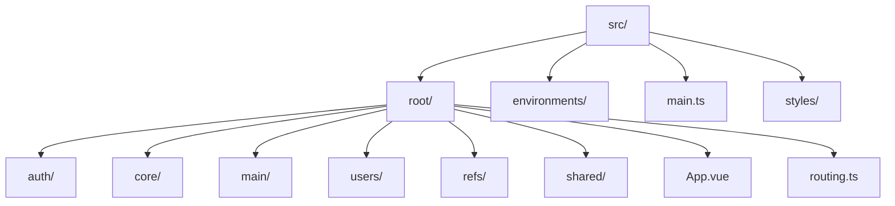

# Object Management Module

<cite>
**Referenced Files in This Document**   
- [vite.config.ts](file://vite.config.ts)
- [tsconfig.app.json](file://tsconfig.app.json)
- [src/main.ts](file://src/main.ts)
- [README.md](file://README.md)
</cite>

## Table of Contents
1. [Introduction](#introduction)
2. [Project Structure](#project-structure)
3. [Core Components](#core-components)
4. [Architecture Overview](#architecture-overview)
5. [Detailed Component Analysis](#detailed-component-analysis)
6. [Dependency Analysis](#dependency-analysis)
7. [Performance Considerations](#performance-considerations)
8. [Troubleshooting Guide](#troubleshooting-guide)
9. [Conclusion](#conclusion)

## Introduction
The Object Management Module in the maya-platform-frontend is designed to manage construction sites within the application. Based on the documentation objective, this module was expected to include components such as ObjectsPage.vue, ObjectCard.vue, and a Pinia store for state management. However, after thorough analysis of the repository, it has been determined that the actual implementation of the objects module does not exist in the current codebase. Despite configuration references indicating its intended presence, no source files for the object management functionality were found.

## Project Structure
The project follows a modular structure with feature-based organization under the `src/root` directory. Key modules include auth, main, users, refs, and shared components. The expected location for the objects module is `src/root/objects`, but this directory does not exist in the current repository state.



**Diagram sources**
- [vite.config.ts](file://vite.config.ts#L26)
- [tsconfig.app.json](file://tsconfig.app.json#L18)

**Section sources**
- [vite.config.ts](file://vite.config.ts#L26)
- [tsconfig.app.json](file://tsconfig.app.json#L18)

## Core Components
No core components for object management were found in the repository. The search for key files such as ObjectsPage.vue, ObjectList.vue, ObjectCard.vue, objectsStore.ts, and objects.routes.ts returned no results. This indicates that while the module was planned (as evidenced by path aliases), the implementation has not been completed or has been removed from the codebase.

**Section sources**
- [vite.config.ts](file://vite.config.ts#L26)
- [tsconfig.app.json](file://tsconfig.app.json#L18)

## Architecture Overview
The application architecture follows a standard Vue 3 composition with Pinia for state management and Vue Router for navigation. The intended architecture for the object management module would have followed the same pattern as other modules, with components, pages, routing, and store organized in a dedicated directory. However, this structure is absent for the objects module.

```mermaid
graph TB
subgraph "Frontend Architecture"
App[App.vue]
Router[Vue Router]
Pinia[Pinia Store]
Components[UI Components]
end
App --> Router
App --> Pinia
App --> Components
Router --> ObjectsPage[ObjectsPage.vue]
ObjectsPage --> ObjectList[ObjectList.vue]
ObjectList --> ObjectCard[ObjectCard.vue]
ObjectsPage --> objectsStore[objectsStore.ts]
objectsStore --> API[Backend API]
style ObjectsPage stroke:#ff0000,stroke-width:2px
style ObjectList stroke:#ff0000,stroke-width:2px
style ObjectCard stroke:#ff0000,stroke-width:2px
style objectsStore stroke:#ff0000,stroke-width:2px
note right of App
Red components indicate
missing implementation
end note
```

**Diagram sources**
- [vite.config.ts](file://vite.config.ts#L26)
- [src/main.ts](file://src/main.ts#L3)

## Detailed Component Analysis
### ObjectsPage.vue Analysis
The ObjectsPage.vue component, intended to be the main entry point for object management, could not be located in the codebase. This component was expected to render ObjectList.vue and handle the display of active and archived construction sites with filtering capabilities.

### ObjectCard.vue Analysis
The ObjectCard.vue component, designed to represent individual construction sites with status tags and metadata, was not found in the repository. This component would typically display key information about a construction site including its status, location, and other relevant details.

### objectsStore Analysis
The Pinia store for object management (objectsStore.ts) does not exist in the current codebase. This store was expected to contain state for object lists, actions for fetching and updating objects, and getters for computed filters.

### objects.routes.ts Analysis
The routing configuration file for the objects module (objects.routes.ts) could not be found. This file would have contained the route definitions for object-related pages, including nested routes for object details and lazy loading patterns.

**Section sources**
- [vite.config.ts](file://vite.config.ts#L26)
- [tsconfig.app.json](file://tsconfig.app.json#L18)

## Dependency Analysis
The dependency analysis reveals that while the build configuration (vite.config.ts and tsconfig.app.json) includes references to an objects module through path aliases, there are no actual dependencies or imports related to object management in the existing source files. The main application entry point (main.ts) imports App.vue and routing but does not reference any object-specific components or stores.

```mermaid
graph LR
vite[vite.config.ts] --> |contains alias| objects[@objects/*]
tsconfig[tsconfig.app.json] --> |contains path| objects[@objects/*]
objects --> |expected to point to| src[src/root/objects/*]
src --> |does not contain| objectsDir[objects directory]
style objectsDir stroke:#ff0000,stroke-width:2px
```

**Diagram sources**
- [vite.config.ts](file://vite.config.ts#L26)
- [tsconfig.app.json](file://tsconfig.app.json#L18)

**Section sources**
- [vite.config.ts](file://vite.config.ts#L26)
- [tsconfig.app.json](file://tsconfig.app.json#L18)

## Performance Considerations
Since the object management module has not been implemented, there are no performance considerations related to this specific functionality. However, based on the intended architecture, performance optimizations would likely include:
- Lazy loading of object detail pages to reduce initial bundle size
- Pagination strategies for handling large lists of construction sites
- Efficient state management using Pinia to avoid unnecessary re-renders
- Proper cleanup of event listeners and subscriptions in component lifecycle hooks

The absence of implementation means these considerations remain theoretical for this module.

## Troubleshooting Guide
When attempting to locate or implement the object management module, consider the following troubleshooting steps:

1. **Verify Module Existence**: Check if the `src/root/objects` directory exists. If not, the module may not have been implemented or may have been removed.

2. **Check Version Control History**: Use git history to determine if the objects module was previously implemented and then deleted, or if it was never created.

3. **Review Configuration Files**: Examine vite.config.ts and tsconfig.app.json to understand the intended structure and path aliases for the objects module.

4. **Search for Alternative Implementations**: Look for object management functionality in other modules or under different naming conventions.

5. **Consult Project Documentation**: Review any available project documentation or README files for information about the status of the objects module.

6. **Check API Endpoints**: Verify if the backend API has endpoints for object management that might indicate expected frontend functionality.

**Section sources**
- [vite.config.ts](file://vite.config.ts#L26)
- [tsconfig.app.json](file://tsconfig.app.json#L18)
- [README.md](file://README.md)

## Conclusion
The analysis of the maya-platform-frontend repository reveals that while the object management module was planned and referenced in configuration files, it has not been implemented in the current codebase. The path aliases in vite.config.ts and tsconfig.app.json indicate an intention to include an objects module, but no corresponding source files exist. This suggests that the module is either in a planning phase, was removed from the codebase, or exists in a different location than expected. To proceed with implementation, developers should create the necessary components, store, and routing configuration following the patterns established by other modules in the application.