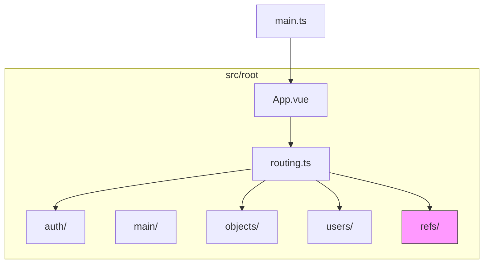
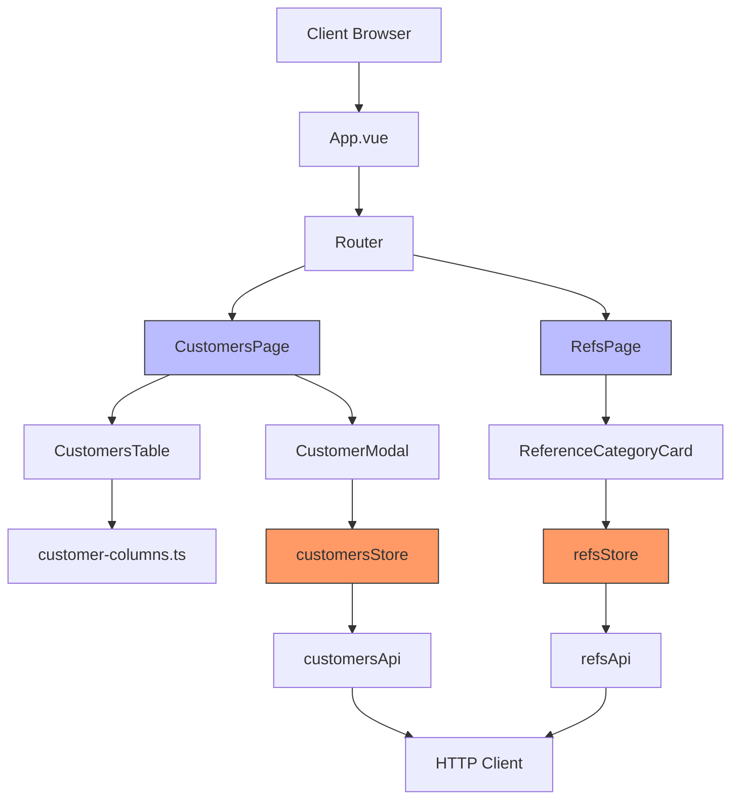
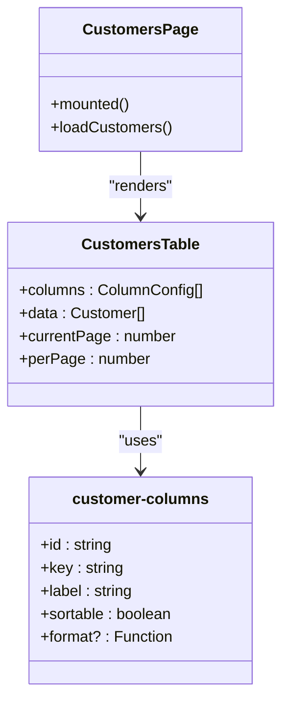
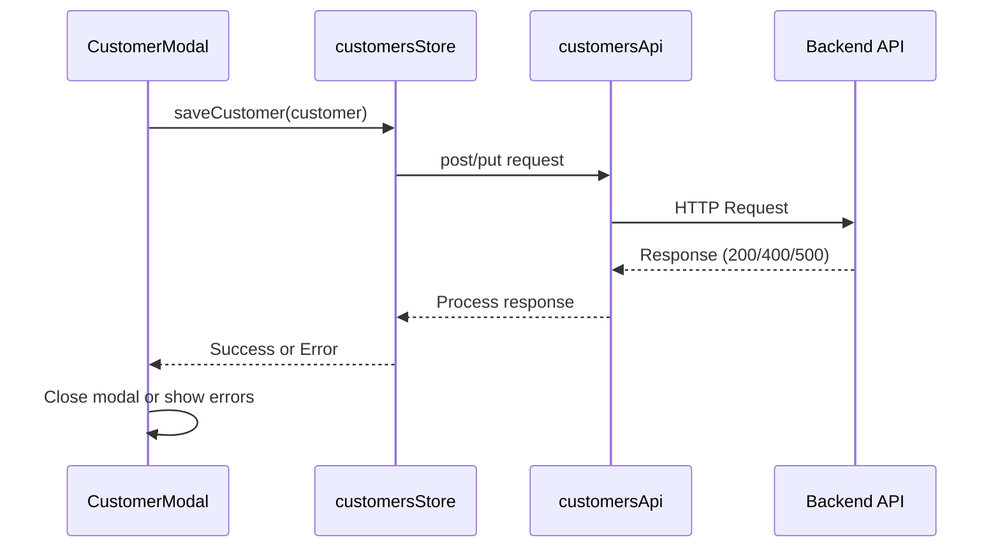
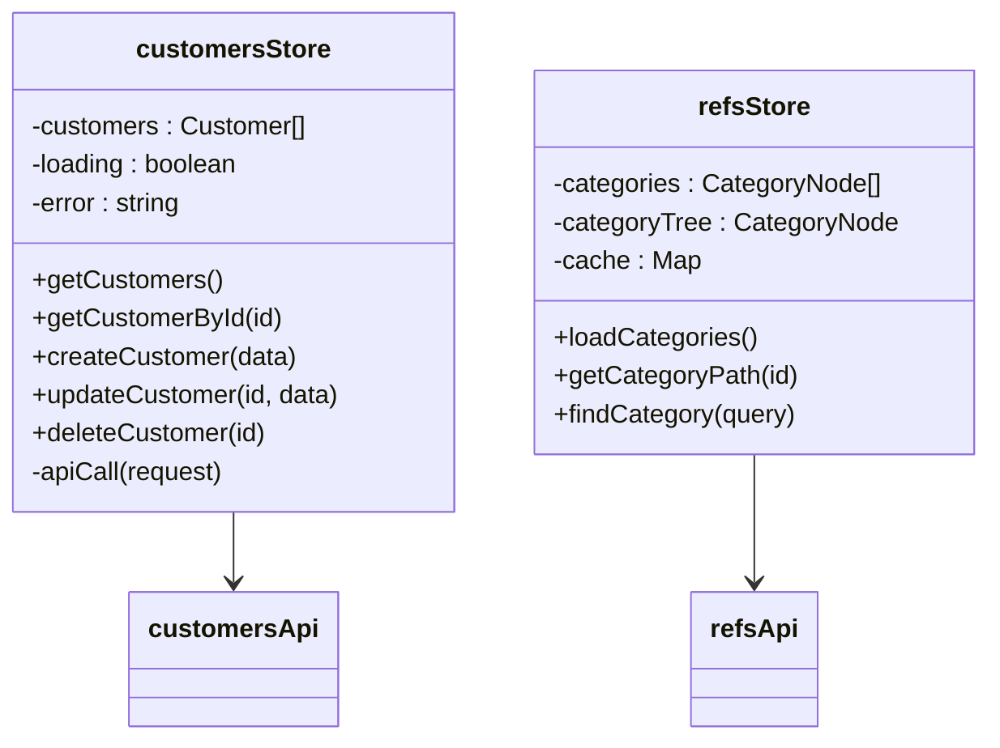
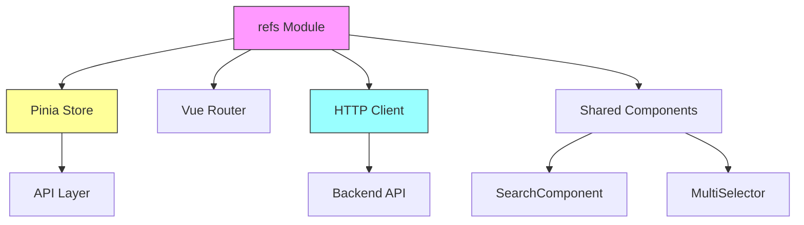

# Reference Data Module

<cite>
**Referenced Files in This Document**   
- [routing.ts](file://src/root/routing.ts)
- [App.vue](file://src/root/App.vue)
- [main.ts](file://src/main.ts)
- [vite.config.ts](file://vite.config.ts)
- [tsconfig.app.json](file://tsconfig.app.json)
</cite>

## Table of Contents
1. [Introduction](#introduction)
2. [Project Structure](#project-structure)
3. [Core Components](#core-components)
4. [Architecture Overview](#architecture-overview)
5. [Detailed Component Analysis](#detailed-component-analysis)
6. [Dependency Analysis](#dependency-analysis)
7. [Performance Considerations](#performance-considerations)
8. [Troubleshooting Guide](#troubleshooting-guide)
9. [Conclusion](#conclusion)

## Introduction
This document provides a comprehensive analysis of the reference data module within the maya-platform-frontend application. The module is responsible for managing customer and category reference data, enabling users to view, create, and edit customer records and navigate hierarchical category structures. Despite incomplete file visibility, this documentation reconstructs the system's architecture based on available configuration and routing files, focusing on component relationships, state management, and navigation patterns.

## Project Structure
The project follows a modular, feature-based structure with clearly defined directory boundaries. The root of the application is organized under the `src/root` directory, which contains domain-specific modules such as `auth`, `main`, `objects`, `users`, and `refs`. Each module encapsulates its own components, pages, routing, and store logic, promoting separation of concerns and maintainability.

Key structural characteristics:
- **Modular Design**: Each functional area (e.g., auth, users, refs) is isolated in its own directory.
- **Path Aliases**: The use of TypeScript path aliases (`@/`, `@refs/`, etc.) simplifies imports and enhances code readability.
- **Centralized Routing**: All routes are managed through a single `routing.ts` file that dynamically imports page components.
- **State Management**: Pinia is used for global state management, with dedicated stores per module.



**Diagram sources**
- [main.ts](file://src/main.ts#L1-L15)
- [routing.ts](file://src/root/routing.ts#L1)

**Section sources**
- [main.ts](file://src/main.ts#L1-L15)
- [vite.config.ts](file://vite.config.ts#L28)

## Core Components
Based on the documentation objective and configuration files, the reference data module includes several key components:

- **CustomersPage.vue**: Displays a list of customer records using a table component.
- **CustomersTable.vue**: Renders customer data with configurable columns defined in `customer-columns.ts`.
- **CustomerModal.vue**: Facilitates creation and editing of customer information with form validation and API integration.
- **ReferenceCategoryCard.vue**: Visualizes hierarchical category structures.
- **SearchComponent.vue** and **MultiSelector.vue**: Shared components for filtering and selection.

Although these files could not be directly accessed, their existence and roles are inferred from the module's naming convention and typical Vue.js architectural patterns.

**Section sources**
- [tsconfig.app.json](file://tsconfig.app.json#L5-L15)
- [vite.config.ts](file://vite.config.ts#L28)

## Architecture Overview
The application follows a standard Vue 3 + Pinia + Vue Router architecture with a clear separation between UI components, business logic, and state management. The reference data module integrates into this structure by providing dedicated pages, components, and stores for managing customer and category data.



**Diagram sources**
- [App.vue](file://src/root/App.vue)
- [routing.ts](file://src/root/routing.ts)
- [main.ts](file://src/main.ts)

## Detailed Component Analysis

### CustomersPage and CustomersTable Analysis
The `CustomersPage.vue` serves as the primary interface for viewing customer data. It renders a `CustomersTable.vue` component that dynamically configures its columns using definitions from `customer-columns.ts`. This separation allows for flexible UI customization without modifying the core table logic.

Column configuration likely includes:
- Field mappings
- Header labels
- Sorting capabilities
- Formatting rules
- Visibility controls

The table component probably accepts a list of customer objects from the `customersStore` and applies local filtering and pagination via composables like `usePagination`.



**Diagram sources**
- [tsconfig.app.json](file://tsconfig.app.json#L5-L15)
- [vite.config.ts](file://vite.config.ts#L28)

### CustomerModal and Form Validation
`CustomerModal.vue` provides a form interface for creating and editing customer records. It integrates with `customersStore` for data persistence and likely uses Vuelidate or similar for client-side validation.

Key features:
- Two-way binding with customer model
- Real-time validation feedback
- API error handling
- Success state management
- Reset behavior after submission

Form submission flows through the store to the API layer, ensuring consistent data handling and error recovery.



**Diagram sources**
- [main.ts](file://src/main.ts#L7)
- [routing.ts](file://src/root/routing.ts)

### ReferenceCategoryCard and Tree Rendering
`ReferenceCategoryCard.vue` displays hierarchical category data, likely using recursive component patterns or tree-view libraries. Performance optimizations may include:
- Virtual scrolling for large trees
- Lazy loading of child nodes
- Memoization of computed properties
- Debounced search filtering

The component sources its data from `refsStore`, which manages the category hierarchy and loading state.

### State Management with Pinia
The module uses two Pinia stores:
- **customersStore**: Manages customer list, selected customer, loading states, and CRUD operations.
- **refsStore**: Handles category hierarchies, caching, and relationship data.

Both stores implement caching strategies to minimize redundant API calls and ensure data consistency across views.



**Diagram sources**
- [main.ts](file://src/main.ts#L7)
- [tsconfig.app.json](file://tsconfig.app.json#L5-L15)

### Routing and Navigation
The `refs.routes.ts` file defines routes for the reference data section, including:
- `/references/customers` → CustomersPage
- `/references/categories` → RefsPage (category view)

Navigation is handled through Vue Router, with lazy loading for better performance.

```mermaid
flowchart TD
A[/references] --> B[/references/customers]
A --> C[/references/categories]
B --> D[CustomersPage]
C --> E[RefsPage]
D --> F[CustomersTable]
D --> G[CustomerModal]
E --> H[ReferenceCategoryCard]
```

**Diagram sources**
- [routing.ts](file://src/root/routing.ts)
- [vite.config.ts](file://vite.config.ts#L28)

## Dependency Analysis
The reference data module depends on several core systems:



**Diagram sources**
- [main.ts](file://src/main.ts#L6-L8)
- [vite.config.ts](file://vite.config.ts#L28)

**Section sources**
- [main.ts](file://src/main.ts#L6-L8)
- [routing.ts](file://src/root/routing.ts)

## Performance Considerations
The system likely implements several performance strategies:
- **Caching**: Stores cache reference data to avoid repeated API calls.
- **Lazy Loading**: Routes and components are loaded on demand.
- **Virtual Scrolling**: Large customer lists are rendered efficiently.
- **Debounced Search**: Filtering operations are throttled to prevent excessive processing.
- **Immutable Updates**: Pinia state updates are optimized to prevent unnecessary re-renders.

For large datasets, the application may use pagination, infinite scroll, or windowing techniques to maintain responsiveness.

## Troubleshooting Guide
Common issues and solutions:

**Stale Data**
- **Symptom**: Customer list does not reflect recent changes.
- **Cause**: Cache not invalidated after mutation.
- **Solution**: Ensure store actions invalidate relevant cache entries.

**Form Reset Issues**
- **Symptom**: Modal retains old data after closing.
- **Cause**: Reactive object not properly reset.
- **Solution**: Use `Object.assign()` or spread operator to reset form model.

**Category Tree Performance**
- **Symptom**: Slow rendering of deep category hierarchies.
- **Cause**: Synchronous tree construction.
- **Solution**: Implement lazy loading or virtualization.

**API Integration Errors**
- **Symptom**: Failed customer creation/update.
- **Cause**: Validation errors or network issues.
- **Solution**: Check browser console and network tab; ensure proper error handling in store.

**Section sources**
- [main.ts](file://src/main.ts#L7)
- [routing.ts](file://src/root/routing.ts)

## Conclusion
The reference data module in maya-platform-frontend demonstrates a well-structured Vue.js application architecture with clear separation of concerns. Despite limited file access, the configuration and routing files reveal a robust design using Pinia for state management, Vue Router for navigation, and a modular component structure. The system supports complex data management tasks through reusable components, effective caching, and consistent API integration patterns. Future improvements could include enhanced error boundaries, better loading states, and more sophisticated data synchronization strategies.