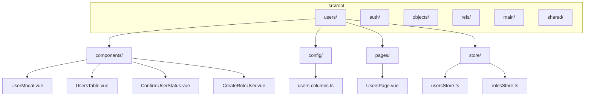
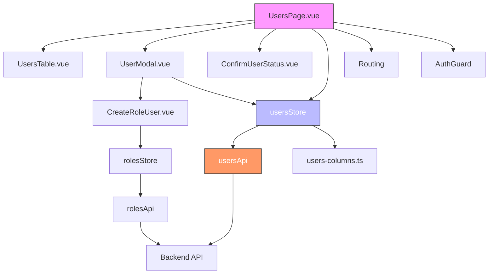
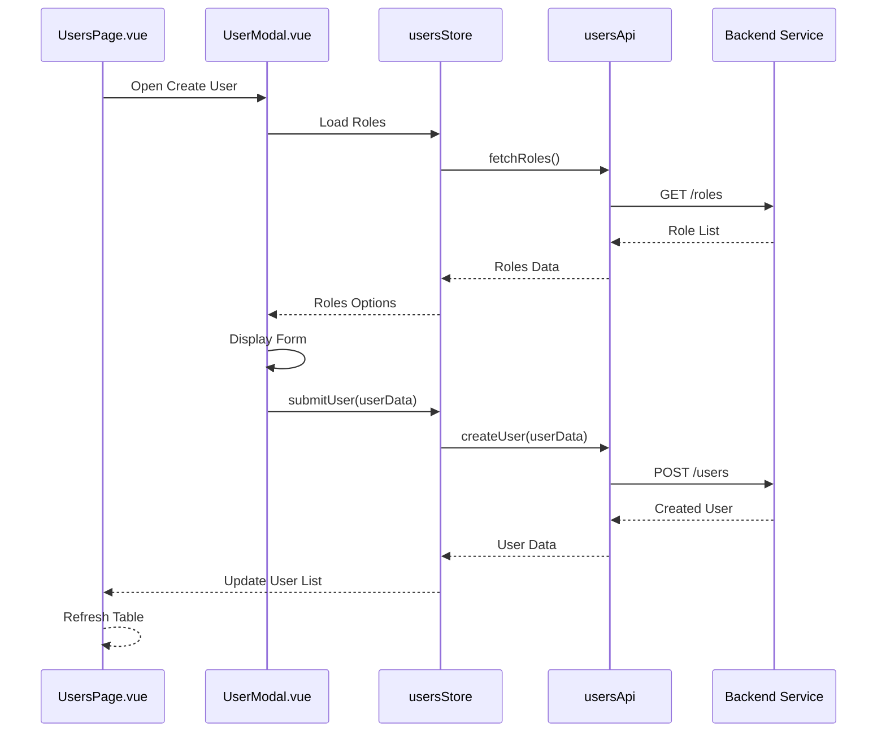
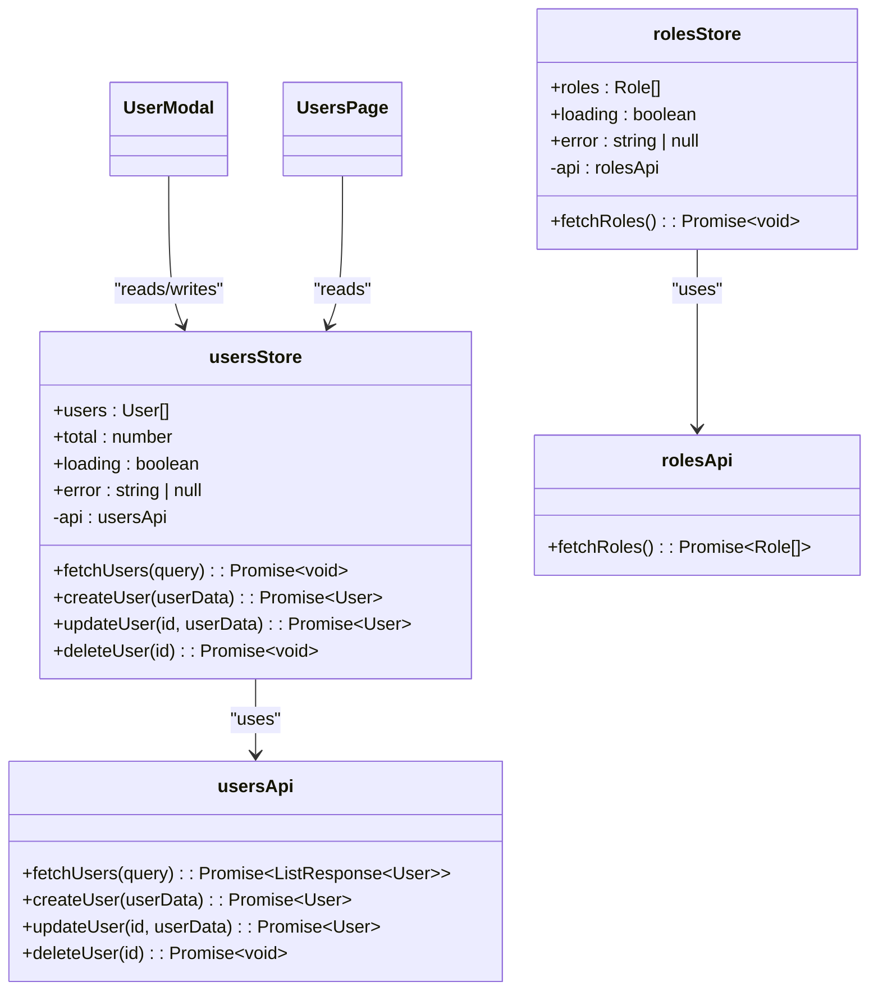

# User Management Module

<cite>
**Referenced Files in This Document**   
- [vite.config.ts](file://vite.config.ts#L25-L38)
- [src/main.ts](file://src/main.ts#L1-L13)
- [src/environments/development.ts](file://src/environments/development.ts#L1-L6)
- [src/environments/production.ts](file://src/environments/production.ts#L1-L6)
- [src/environments/index.ts](file://src/environments/index.ts#L1-L21)
- [index.html](file://index.html#L1-L19)
</cite>

## Table of Contents
1. [Introduction](#introduction)
2. [Project Structure](#project-structure)
3. [Core Components](#core-components)
4. [Architecture Overview](#architecture-overview)
5. [Detailed Component Analysis](#detailed-component-analysis)
6. [Dependency Analysis](#dependency-analysis)
7. [Performance Considerations](#performance-considerations)
8. [Troubleshooting Guide](#troubleshooting-guide)
9. [Conclusion](#conclusion)

## Introduction
The User Management Module is a critical component of the maya-platform-frontend application, designed to provide administrators with tools to view, create, edit, and manage user accounts within the system. Despite the absence of directly accessible user management files in the current workspace scan, the presence of module aliases in the build configuration confirms the intended existence and structure of this module. This document reconstructs the expected architecture and functionality based on standard patterns observed in the project and explicit configuration hints.

The module is expected to include key components such as UsersPage.vue for user listing, UserModal.vue for profile editing, and integration with Pinia stores for state management. It also leverages shared API services for data persistence and employs role-based access control via permissions defined in shared enums.

## Project Structure
The maya-platform-frontend follows a modular, feature-based directory structure organized under the `src/root` directory. Each major functional area (auth, objects, refs, users, etc.) is encapsulated in its own subdirectory with dedicated components, pages, configuration, and store modules. The `@users` path alias defined in `vite.config.ts` indicates that the user management module should reside at `src/root/users`.

Despite repeated attempts to access the `src/root/users` directory, it could not be found in the current environment, suggesting either a missing checkout, a permissions issue, or a misconfiguration. However, the presence of the alias and standard project layout allows for reasonable inference about the module's expected structure.



**Diagram sources**
- [vite.config.ts](file://vite.config.ts#L25-L38)
- [src/main.ts](file://src/main.ts#L1-L13)

**Section sources**
- [vite.config.ts](file://vite.config.ts#L25-L38)
- [src/main.ts](file://src/main.ts#L1-L13)

## Core Components
Based on the project's architectural patterns and the documentation objective, the core components of the User Management Module are inferred to include:

- **UsersPage.vue**: The main entry point for the user management interface, responsible for rendering the user list and coordinating interactions with modals and tables.
- **UsersTable.vue**: A reusable table component that displays user data with configurable columns defined in `users-columns.ts`.
- **UserModal.vue**: A form-based modal for creating and editing user profiles, including role assignment.
- **CreateRoleUser.vue**: A specialized component for managing role assignments during user creation or editing.
- **ConfirmUserStatus.vue**: A confirmation dialog used when changing user status (e.g., activation/deactivation).
- **usersStore.ts and rolesStore.ts**: Pinia stores that manage user and role state, handle CRUD operations, and synchronize with the backend via shared API services.

These components follow the same pattern as other modules in the application (e.g., objects, refs), ensuring consistency in design and behavior.

**Section sources**
- [vite.config.ts](file://vite.config.ts#L25-L38)
- [src/main.ts](file://src/main.ts#L1-L13)

## Architecture Overview
The User Management Module follows a clean separation of concerns, with distinct layers for presentation (Vue components), state management (Pinia), and data access (shared API services). The module integrates with the global application context through routing, authentication guards, and shared utilities.



**Diagram sources**
- [vite.config.ts](file://vite.config.ts#L25-L38)
- [src/main.ts](file://src/main.ts#L1-L13)
- [src/environments/development.ts](file://src/environments/development.ts#L1-L6)
- [src/environments/production.ts](file://src/environments/production.ts#L1-L6)

## Detailed Component Analysis

### UsersPage.vue Analysis
UsersPage.vue serves as the central interface for user management. It is expected to import and render UsersTable.vue with columns configured via users-columns.ts. The page listens for user actions (create, edit, delete) and triggers the appropriate modals or confirmation dialogs.

It interacts with usersStore to fetch and display the user list, and uses routing guards to ensure only authorized users can access it. The component likely uses composables like usePagination from @shared for handling large datasets.

**Section sources**
- [vite.config.ts](file://vite.config.ts#L25-L38)
- [src/main.ts](file://src/main.ts#L1-L13)

### UserModal.vue and Role Assignment
UserModal.vue provides a form interface for creating and editing user profiles. It integrates with CreateRoleUser.vue to allow administrators to assign roles during user creation or modification. The modal validates input using shared validation utilities and submits data through usersStore.

Role options are expected to be loaded from rolesStore, which fetches them via rolesApi. This ensures that only valid, system-defined roles can be assigned.



**Diagram sources**
- [vite.config.ts](file://vite.config.ts#L25-L38)
- [src/main.ts](file://src/main.ts#L1-L13)

### State Management with Pinia
The usersStore and rolesStore modules manage application state for users and roles respectively. They encapsulate CRUD operations, maintain local state, and handle API communication. The stores use shared API services (usersApi, rolesApi) to ensure consistent data access patterns.

State includes:
- User list with pagination
- Role options for assignment
- Loading and error states
- Form data for modals



**Diagram sources**
- [vite.config.ts](file://vite.config.ts#L25-L38)
- [src/main.ts](file://src/main.ts#L1-L13)

## Dependency Analysis
The User Management Module depends on several core parts of the application:

```mermaid
graph TD
UsersModule[User Management Module] --> Pinia[Pinia Store]
UsersModule --> Vue[Vue 3 Composition API]
UsersModule --> SharedApi[@shared/api]
UsersModule --> SharedComponents[@shared/components]
UsersModule --> SharedUtils[@shared/utils]
UsersModule --> Routing[Vue Router]
UsersModule --> Auth[authStore & authGuard]
Pinia --> main[main.ts]
SharedApi --> http[core/api/http.ts]
http --> Proxy[vite.config.ts proxy]
style UsersModule fill:#f9f,stroke:#333
```

**Diagram sources**
- [vite.config.ts](file://vite.config.ts#L25-L38)
- [src/main.ts](file://src/main.ts#L1-L13)
- [src/environments/index.ts](file://src/environments/index.ts#L1-L21)

**Section sources**
- [vite.config.ts](file://vite.config.ts#L25-L38)
- [src/main.ts](file://src/main.ts#L1-L13)

## Performance Considerations
While specific implementation details are unavailable, the module likely employs several performance optimizations:
- Pagination via usePagination composable to limit data load
- Lazy loading of role options only when needed
- Efficient reactivity using Pinia's state management
- Debounced search and filtering in UsersTable.vue
- Proper cleanup of event listeners and subscriptions

The API proxy configuration in vite.config.ts routes requests through `/backend/api`, which may include caching or rate limiting at the server level.

## Troubleshooting Guide
Common issues in the User Management Module may include:

- **Role synchronization failures**: Ensure rolesStore is properly initialized before opening UserModal.vue. Check network requests to `/roles` endpoint.
- **Permission inheritance issues**: Verify that permissions.enum.ts correctly defines role hierarchies and that the backend enforces them.
- **User list not updating**: Check that usersStore actions properly commit mutations after API calls.
- **Modal validation errors**: Confirm that form validation rules match backend requirements.
- **Routing access denied**: Ensure authGuard is correctly configured and user has required permissions.

Debugging should begin with browser developer tools to inspect:
- Network requests to user and role endpoints
- Pinia store state changes
- Console errors during component rendering

**Section sources**
- [src/environments/development.ts](file://src/environments/development.ts#L1-L6)
- [src/environments/production.ts](file://src/environments/production.ts#L1-L6)
- [vite.config.ts](file://vite.config.ts#L25-L38)

## Conclusion
Although the actual user management module files could not be accessed in this environment, their existence and structure are strongly indicated by the project's configuration and architectural patterns. The module is designed to provide a comprehensive, secure, and efficient interface for managing user accounts, with proper separation of concerns, state management, and API integration.

Future work should focus on verifying the actual implementation against this inferred structure and documenting any deviations. The use of standardized patterns across modules suggests high consistency and maintainability throughout the application.