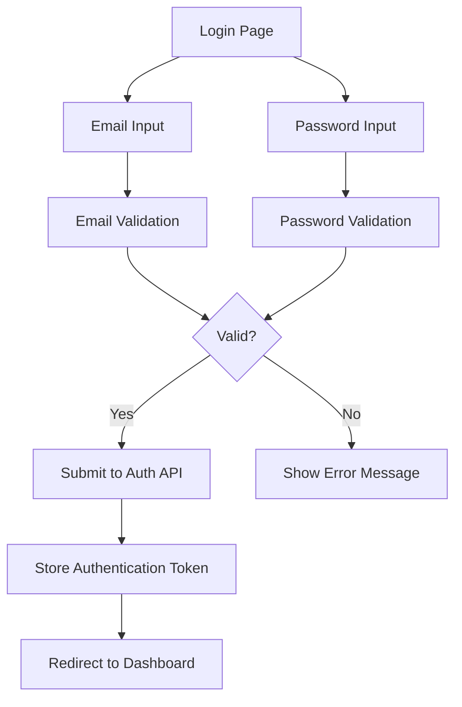
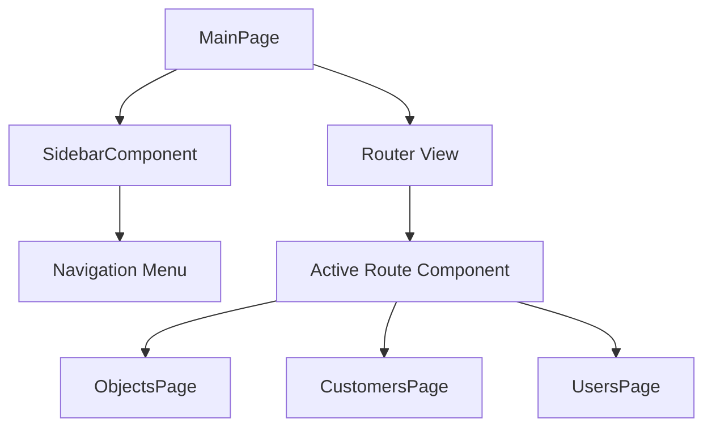

# Getting Started

<cite>
**Referenced Files in This Document**   
- [README.md](file://README.md)
- [package.json](file://package.json)
- [vite.config.ts](file://vite.config.ts)
- [src/environments/development.ts](file://src/environments/development.ts)
- [src/environments/production.ts](file://src/environments/production.ts)
- [src/environments/index.ts](file://src/environments/index.ts)
- [src/main.ts](file://src/main.ts)
- [src/root/auth/pages/LoginPage.vue](file://src/root/auth/pages/LoginPage.vue)
- [src/root/main/pages/MainPage.vue](file://src/root/main/pages/MainPage.vue)
</cite>

## Table of Contents
1. [Introduction](#introduction)
2. [Prerequisites](#prerequisites)
3. [Project Setup](#project-setup)
4. [Environment Configuration](#environment-configuration)
5. [Running the Application](#running-the-application)
6. [Development Scripts](#development-scripts)
7. [Common Setup Issues](#common-setup-issues)
8. [Application Overview](#application-overview)

## Introduction
This guide provides comprehensive instructions for setting up the **maya-platform-frontend** development environment. It covers cloning the repository, installing dependencies, configuring environments, and running the application using Vite. The frontend is built with Vue 3 and TypeScript, leveraging Vite for fast development builds and hot module replacement.

The project follows a feature-based architecture with modular environment configuration, allowing seamless switching between development, staging, and production modes.

**Section sources**
- [README.md](file://README.md#L1-L5)

## Prerequisites
Before setting up the project, ensure your system meets the following requirements:

- **Node.js**: Version `^20.19.0` or `>=22.12.0` (as specified in `engines` field of `package.json`)
- **npm** or **yarn** package manager
- **Git** for version control
- **Recommended IDE**: VSCode with [Volar](https://marketplace.visualstudio.com/items?itemName=Vue.volar) extension (disable Vetur if installed)

The project uses modern JavaScript tooling including TypeScript, ESLint, Prettier, and Vite. Type checking is handled via `vue-tsc`, which supports `.vue` file types in TypeScript projects.

```json
// package.json
"engines": {
  "node": "^20.19.0 || >=22.12.0"
}
```

**Section sources**
- [package.json](file://package.json#L5-L9)
- [README.md](file://README.md#L6-L8)

## Project Setup
Follow these steps to set up the **maya-platform-frontend** development environment:

### 1. Clone the Repository
```bash
git clone https://github.com/your-organization/maya-platform-frontend.git
cd maya-platform-frontend
```

### 2. Install Dependencies
Use **npm** to install all required dependencies:
```bash
npm install
```

This command installs both production and development dependencies listed in `package.json`, including Vue 3, Pinia for state management, Naive UI component library, and Vite plugins.

**Section sources**
- [README.md](file://README.md#L20-L23)

## Environment Configuration
The application uses a modular environment configuration system located in the `src/environments/` directory. This allows different settings for development, staging, and production environments.

### Environment Files
- `src/environments/development.ts`: Development mode settings
- `src/environments/staging.ts`: Staging mode settings
- `src/environments/production.ts`: Production mode settings
- `src/environments/index.ts`: Exports current configuration based on build mode

### Environment Variables
The system uses Vite's built-in environment variables via `import.meta.env`. Key variables include:

- `import.meta.env.MODE`: Current mode (`development`, `staging`, `production`)
- `import.meta.env.DEV`: `true` in development, `false` otherwise
- `import.meta.env.VITE_API_BASE_URL`: Optional override for production API base URL

### Configuration Structure
```ts
// src/environments/development.ts
export const developmentConfig = {
  apiBaseUrl: '/backend/api',
  appEnv: 'development',
  isDevelopment: true,
  isProduction: false,
  isStaging: false,
}
```

```ts
// src/environments/production.ts
export const productionConfig = {
  apiBaseUrl: import.meta.env.VITE_API_BASE_URL || 'https://vlk-g.api.thelightech.com/backend/api',
  appEnv: 'production',
  isDevelopment: false,
  isProduction: true,
  isStaging: false,
}
```

### Environment Selection Logic
The active configuration is determined by `getCurrentEnvironment()` in `index.ts`:
```ts
const getCurrentEnvironment = (): Environment => {
  const mode = import.meta.env.MODE as Environment
  return ['development', 'production'].includes(mode)
    ? mode
    : import.meta.env.DEV
      ? 'development'
      : 'production'
}
```

The `currentConfig` export provides access to the active environment settings throughout the app.

```ts
// src/environments/index.ts
export const currentConfig = environments[getCurrentEnvironment()]
```

**Section sources**
- [src/environments/development.ts](file://src/environments/development.ts#L1-L7)
- [src/environments/production.ts](file://src/environments/production.ts#L1-L7)
- [src/environments/index.ts](file://src/environments/index.ts#L1-L21)

## Running the Application
The application uses Vite as the development server and build tool.

### Start Development Server
```bash
npm run dev
```

This command starts the Vite development server in development mode with hot module replacement. The app will be available at `http://localhost:5173`.

The `dev` script in `package.json` explicitly sets the mode:
```json
"dev": "vite --mode development"
```

### API Proxy Configuration
Vite proxies API requests to avoid CORS issues during development:
```ts
// vite.config.ts
server: {
  proxy: {
    '/backend/api': {
      target: 'https://vlk-g.dev.api.thelightech.com',
      changeOrigin: true,
      secure: true,
      rewrite: (path) => path,
    },
  },
}
```

All requests to `/backend/api/*` are forwarded to the specified backend server.

**Section sources**
- [README.md](file://README.md#L26-L29)
- [vite.config.ts](file://vite.config.ts#L25-L34)

## Development Scripts
The following npm scripts are available in `package.json`:

| Script | Description |
|--------|-------------|
| `npm run dev` | Start development server |
| `npm run build` | Build for development environment |
| `npm run build:dev` | Explicitly build for development |
| `npm run build:staging` | Build for staging environment |
| `npm run build:production` | Build for production environment |
| `npm run preview` | Preview production build locally |
| `npm run lint` | Lint code with ESLint and fix issues |
| `npm run format` | Format code with Prettier |
| `npm run type-check` | Perform TypeScript type checking |

### Example: Building for Production
```bash
npm run build:production
```

### Example: Previewing Build
```bash
npm run build:production
npm run preview
```

The preview server runs the production build locally at `http://localhost:4173`.

**Section sources**
- [package.json](file://package.json#L10-L25)

## Common Setup Issues
This section addresses frequent setup problems and their solutions.

### 1. Node.js Version Mismatch
**Issue**: `Unsupported engine` error during installation  
**Solution**: Ensure Node.js version matches the requirement (`^20.19.0` or `>=22.12.0`). Use Node Version Manager (nvm) to switch versions:
```bash
nvm install 22.12.0
nvm use 22.12.0
```

### 2. Missing Environment Variables
**Issue**: Application fails to start or connects to wrong API endpoint  
**Solution**: Ensure proper environment mode is set. For production builds, you can override the API URL:
```bash
VITE_API_BASE_URL=https://custom-api.example.com npm run build:production
```

### 3. Build Errors Related to Types
**Issue**: TypeScript or Vue template errors during build  
**Solution**: Run type checking separately:
```bash
npm run type-check
```

Ensure Volar extension is installed in VSCode for proper `.vue` file type support.

### 4. Module Resolution Issues
**Issue**: Import errors for aliased paths like `@`, `@core`, `@shared`  
**Solution**: These aliases are configured in `vite.config.ts`:
```ts
resolve: {
  alias: {
    '@': fileURLToPath(new URL('./src', import.meta.url)),
    '@core': fileURLToPath(new URL('./src/root/core', import.meta.url)),
    // ... other aliases
  },
}
```

Ensure your IDE supports these aliases (Volar handles this automatically).

**Section sources**
- [package.json](file://package.json#L5-L9)
- [vite.config.ts](file://vite.config.ts#L10-L23)
- [src/environments/production.ts](file://src/environments/production.ts#L1)

## Application Overview
This section provides visual context for new developers, showing the initial login screen and main dashboard.

### Initial Login Screen
The application starts with a login page that validates user credentials before accessing protected routes.



**Diagram sources**
- [src/root/auth/pages/LoginPage.vue](file://src/root/auth/pages/LoginPage.vue#L1-L177)

### Main Dashboard Layout
After successful login, users are directed to the main dashboard with sidebar navigation.



**Diagram sources**
- [src/root/main/pages/MainPage.vue](file://src/root/main/pages/MainPage.vue#L1-L26)
- [src/root/main/components/SidebarComponent.vue](file://src/root/main/components/SidebarComponent.vue)

### Key Components
- **LoginPage.vue**: Handles user authentication with form validation
- **MainPage.vue**: Serves as the primary layout with sidebar and router outlet
- **SidebarComponent.vue**: Navigation component for switching between modules
- **App.vue**: Root Vue component
- **main.ts**: Entry point that initializes Vue, Pinia, and Router

The routing system uses Vue Router with mode-based history:
```ts
// src/root/routing.ts
history: createWebHistory(import.meta.env.BASE_URL)
```

**Section sources**
- [src/main.ts](file://src/main.ts#L1-L14)
- [src/root/auth/pages/LoginPage.vue](file://src/root/auth/pages/LoginPage.vue#L1-L177)
- [src/root/main/pages/MainPage.vue](file://src/root/main/pages/MainPage.vue#L1-L26)