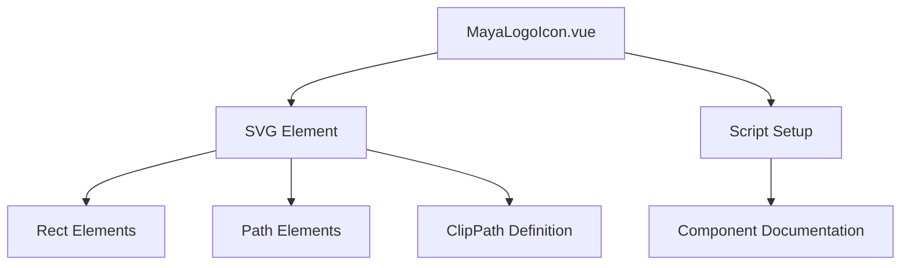
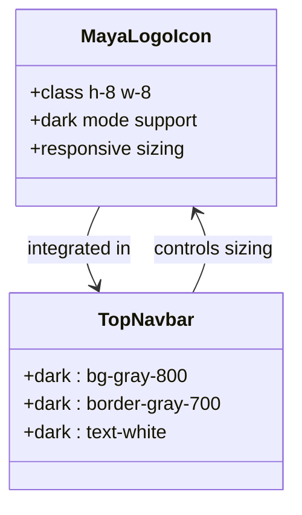

# Maya Logo Icon Component

<cite>
**Referenced Files in This Document**   
- [MayaLogoIcon.vue](file://src/components/icons/MayaLogoIcon.vue)
- [TopNavbar.vue](file://src/components/common/TopNavbar.vue)
- [MayaLogoIcon.test.ts](file://tests/components/icons/MayaLogoIcon.test.ts)
</cite>

## Table of Contents
1. [Introduction](#introduction)
2. [Component Overview](#component-overview)
3. [SVG Structure Analysis](#svg-structure-analysis)
4. [Theming and Styling](#theming-and-styling)
5. [Accessibility Features](#accessibility-features)
6. [Integration with Navigation Components](#integration-with-navigation-components)
7. [Usage Examples](#usage-examples)
8. [Testing Strategy](#testing-strategy)
9. [Best Practices](#best-practices)

## Introduction
The Maya Logo Icon component is a Vue.js component that renders the Maya Platform logo as an SVG icon. This documentation provides comprehensive details about its implementation, structure, theming support, accessibility features, and integration patterns within the application's navigation system. The component is designed to be reusable across different parts of the application while maintaining consistent visual representation of the brand.

**Section sources**
- [MayaLogoIcon.vue](file://src/components/icons/MayaLogoIcon.vue#L1-L28)

## Component Overview
The MayaLogoIcon component is a simple yet essential branding element in the Maya Platform frontend application. It encapsulates the platform's logo as an SVG graphic, making it scalable and resolution-independent. The component is implemented using Vue 3's Composition API with TypeScript support, ensuring type safety and modern development practices.

The component serves as a visual identifier for the Maya Platform and is primarily used in navigation components such as the TopNavbar. Its implementation focuses on delivering a crisp, recognizable logo that maintains brand consistency across different application views.



**Diagram sources**
- [MayaLogoIcon.vue](file://src/components/icons/MayaLogoIcon.vue#L1-L28)

**Section sources**
- [MayaLogoIcon.vue](file://src/components/icons/MayaLogoIcon.vue#L1-L28)

## SVG Structure Analysis
The MayaLogoIcon component contains a detailed SVG structure that defines the visual appearance of the Maya Platform logo. The SVG has a viewBox of "0 0 100 100" with dimensions of 100x100 pixels, providing a consistent coordinate system for the logo elements.

The SVG structure consists of several key elements:

- **Root SVG element**: Configured with xmlns, width, height, viewBox, and fill attributes
- **Clip path**: Defines a rounded rectangular clipping area with rx="10" for corner radius
- **Background rectangles**: Two overlapping rectangles that create the pink (#FF3EB3) background with a rounded corner effect
- **Path elements**: Multiple black paths that form the textual and graphical elements of the logo

The logo appears to contain stylized text elements that represent "Maya" and additional graphical components that form part of the brand identity. The SVG uses a clipPath to ensure all content is contained within the rounded rectangular boundary, creating a consistent visual container for the logo.

```mermaid
erDiagram
SVG["<svg> Root Element"] {
string xmlns
string width
string height
string viewBox
string fill
}
CLIP_PATH["<clipPath> Definition"] {
string id
}
RECT["<rect> Background"] {
string width
string height
string rx
string fill
}
PATH["<path> Logo Elements"] {
string d
string fill
}
DEFS["<defs> Container"] {
}
SVG --> CLIP_PATH : contains
SVG --> RECT : contains
SVG --> PATH : contains
SVG --> DEFS : contains
DEFS --> CLIP_PATH : contains
RECT --> CLIP_PATH : referenced by clip-path
```

**Diagram sources**
- [MayaLogoIcon.vue](file://src/components/icons/MayaLogoIcon.vue#L2-L28)

**Section sources**
- [MayaLogoIcon.vue](file://src/components/icons/MayaLogoIcon.vue#L2-L28)

## Theming and Styling
The MayaLogoIcon component implements theming support through the application's dark mode capabilities. While the logo itself has fixed colors (pink background with black logo elements), it integrates with the overall application theming system through its parent components.

The component's styling is designed to be flexible in terms of size, allowing it to be resized using CSS classes applied to the component instance. In the TopNavbar, the logo is rendered with a height and width of 8 units (likely rem or em units), making it appropriately sized for the navigation bar.

The component does not contain explicit theme-specific styling within its own code, but relies on the broader application theming system that uses CSS classes like "dark:bg-gray-800" and "dark:text-white" in parent components. This approach ensures consistency across the application while keeping the logo component focused on its primary responsibility of rendering the brand identity.



**Diagram sources**
- [MayaLogoIcon.vue](file://src/components/icons/MayaLogoIcon.vue#L1-L28)
- [TopNavbar.vue](file://src/components/common/TopNavbar.vue#L1-L132)

**Section sources**
- [MayaLogoIcon.vue](file://src/components/icons/MayaLogoIcon.vue#L1-L28)
- [TopNavbar.vue](file://src/components/common/TopNavbar.vue#L1-L132)

## Accessibility Features
The MayaLogoIcon component, as currently implemented, functions primarily as a decorative element within the application's navigation. While the SVG structure is semantically correct, the component lacks explicit accessibility features such as aria-labels or role attributes that would enhance its usability for assistive technologies.

The logo is embedded within a router-link that navigates to the home page ("/"), which provides some inherent accessibility through the link semantics. However, the icon itself does not contain alt text or other accessibility attributes that would describe its purpose to screen readers.

Best practices suggest that decorative images should have appropriate ARIA attributes to indicate their role, or alternatively, include descriptive text for users who rely on assistive technologies. The current implementation assumes that the surrounding context (the navigation bar and brand text) provides sufficient context for users.

**Section sources**
- [MayaLogoIcon.vue](file://src/components/icons/MayaLogoIcon.vue#L1-L28)
- [TopNavbar.vue](file://src/components/common/TopNavbar.vue#L1-L132)

## Integration with Navigation Components
The MayaLogoIcon component is primarily integrated within the TopNavbar component, serving as the visual centerpiece of the application's main navigation. The integration pattern demonstrates a clean separation of concerns, with the logo component focusing solely on rendering the brand identity while the navigation component handles layout and interaction logic.

In the TopNavbar, the MayaLogoIcon is used alongside textual brand elements ("База" and "Специалистов") to create a comprehensive brand presence in the navigation bar. The component is imported and registered locally within the TopNavbar, following Vue's modular component architecture.

```mermaid
flowchart TD
A[TopNavbar.vue] --> B[Import MayaLogoIcon]
B --> C[Register Component]
C --> D[Use in Template]
D --> E[router-link to="/"]
E --> F[MayaLogoIcon with h-8 w-8 classes]
F --> G[Render SVG Logo]
H[MayaLogoIcon.vue] --> I[SVG Template]
I --> J[Render Logo Elements]
A --> H : uses
```

**Diagram sources**
- [TopNavbar.vue](file://src/components/common/TopNavbar.vue#L82-L9)
- [MayaLogoIcon.vue](file://src/components/icons/MayaLogoIcon.vue#L1-L28)

**Section sources**
- [TopNavbar.vue](file://src/components/common/TopNavbar.vue#L1-L132)
- [MayaLogoIcon.vue](file://src/components/icons/MayaLogoIcon.vue#L1-L28)

## Usage Examples
The MayaLogoIcon component is used in the TopNavbar component as part of the brand identification system. The primary usage pattern involves importing the component and including it in the template with appropriate sizing classes.

**Basic Usage:**
```vue
<template>
  <router-link to="/" class="flex items-center">
    <MayaLogoIcon class="h-8 w-8" />
    <div class="flex flex-col ml-2">
      <span class="text-xs font-bold text-gray-900 dark:text-white leading-tight">База</span>
      <span class="text-xs font-bold text-gray-900 dark:text-white leading-tight">Специалистов</span>
    </div>
  </router-link>
</template>

<script setup lang="ts">
import MayaLogoIcon from '@/components/icons/MayaLogoIcon.vue'
</script>
```

The component can be resized by adjusting the height and width classes (e.g., h-6 w-6 for smaller instances or h-12 w-12 for larger displays). It is designed to maintain its aspect ratio and visual integrity at different sizes due to its SVG nature.

**Section sources**
- [TopNavbar.vue](file://src/components/common/TopNavbar.vue#L1-L132)

## Testing Strategy
The MayaLogoIcon component is covered by unit tests that verify its basic functionality and structural integrity. The test suite, located in MayaLogoIcon.test.ts, uses Vitest and Vue Test Utils to mount the component and assert key properties.

The current test coverage includes:
- Verification that the SVG element is rendered
- Validation of the viewBox attribute
- Confirmation of the fill attribute value

```mermaid
flowchart TD
A[Vitest Test Suite] --> B[Mount Component]
B --> C[Test 1: SVG Exists]
B --> D[Test 2: Correct ViewBox]
B --> E[Test 3: Fill Attribute]
C --> F[expect(wrapper.find('svg').exists()).toBe(true)]
D --> G[expect(svg.attributes('viewBox')).toBe('0 0 100 100')]
E --> H[expect(svg.attributes('fill')).toBe('none')]
```

These tests ensure that the fundamental aspects of the SVG rendering are maintained, providing a basic level of confidence in the component's output. However, the test suite could be expanded to include accessibility checks, visual regression testing, or responsiveness verification.

**Diagram sources**
- [MayaLogoIcon.test.ts](file://tests/components/icons/MayaLogoIcon.test.ts#L1-L21)

**Section sources**
- [MayaLogoIcon.test.ts](file://tests/components/icons/MayaLogoIcon.test.ts#L1-L21)

## Best Practices
When using the MayaLogoIcon component, consider the following best practices:

1. **Consistent Branding**: Always pair the logo with appropriate brand text to ensure clear identification
2. **Proper Sizing**: Use consistent sizing classes (h-8 w-8) across the application for visual harmony
3. **Accessibility Enhancement**: Consider adding aria-label attributes when the logo is used in contexts where screen reader users might need additional context
4. **Performance**: Leverage the SVG format's advantages by using the component directly rather than importing raster images
5. **Theming Coordination**: Ensure the logo's appearance complements the overall application theme, particularly in dark mode scenarios

The component exemplifies a focused, single-responsibility design pattern where it handles only the rendering of the brand logo, delegating layout and interaction concerns to parent components.

**Section sources**
- [MayaLogoIcon.vue](file://src/components/icons/MayaLogoIcon.vue#L1-L28)
- [TopNavbar.vue](file://src/components/common/TopNavbar.vue#L1-L132)
- [MayaLogoIcon.test.ts](file://tests/components/icons/MayaLogoIcon.test.ts#L1-L21)