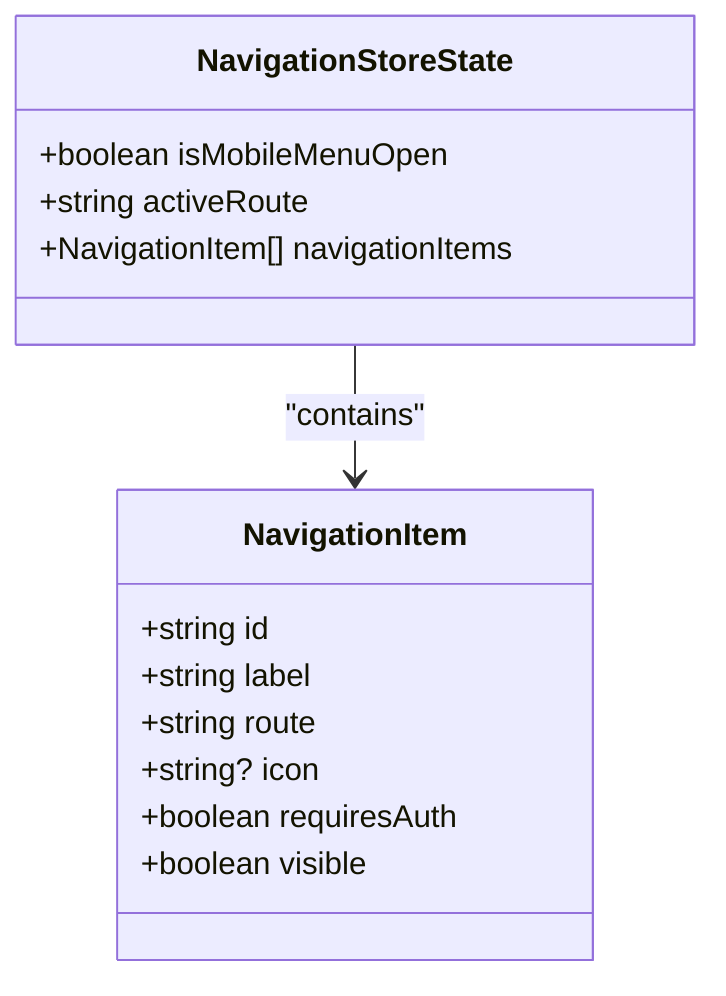
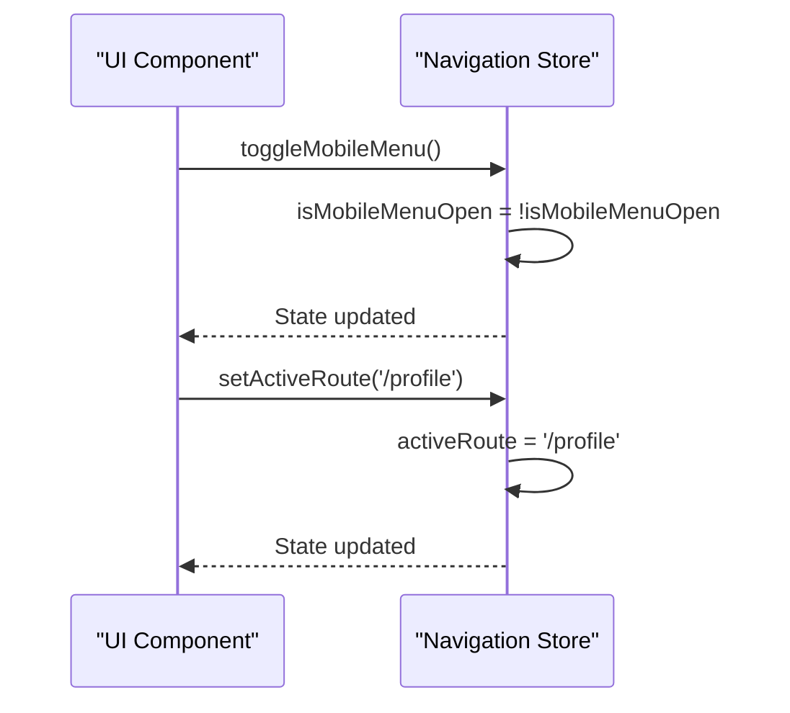
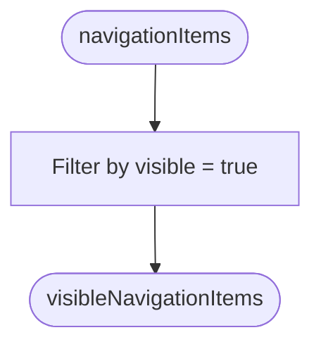
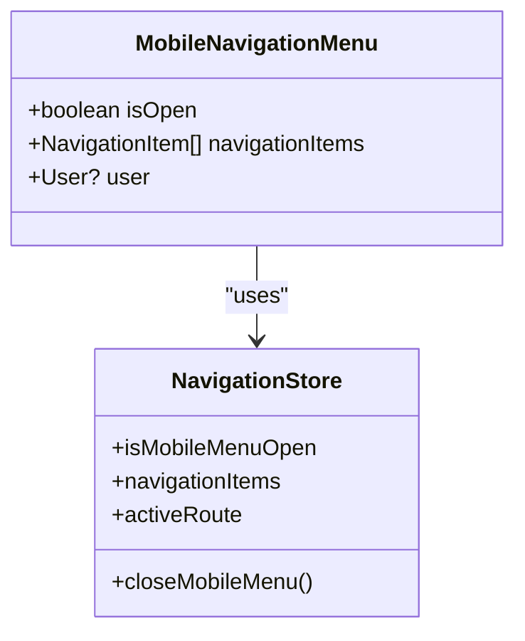

# Navigation State Management

<cite>
**Referenced Files in This Document**   
- [navigation.ts](file://src/stores/navigation.ts#L1-L75)
- [MobileNavigationMenu.vue](file://src/components/common/MobileNavigationMenu.vue#L1-L160)
- [AppNavigation.vue](file://src/components/common/AppNavigation.vue#L1-L84)
- [index.ts](file://src/types/index.ts#L70-L97)
</cite>

## Table of Contents
1. [Introduction](#introduction)
2. [State Properties](#state-properties)
3. [Actions](#actions)
4. [Computed Properties](#computed-properties)
5. [Integration with UI Components](#integration-with-ui-components)
6. [Usage Examples](#usage-examples)
7. [Lifecycle and Route Integration](#lifecycle-and-route-integration)
8. [Best Practices](#best-practices)

## Introduction
The navigation Pinia store manages the application's navigation state, including mobile menu visibility and active route tracking. It provides a centralized way to control navigation behavior across different components, ensuring consistency in user experience. This document details the store's structure, functionality, and integration with UI components.

**Section sources**
- [navigation.ts](file://src/stores/navigation.ts#L1-L75)

## State Properties
The navigation store maintains several reactive state properties that control navigation behavior:

:isMobileMenuOpen  
Boolean flag indicating whether the mobile navigation menu is currently open. Initialized to `false`.

:activeRoute  
String representing the currently active route path. Initialized to an empty string.

:navigationItems  
Array of `NavigationItem` objects defining the available navigation options. Each item includes:
- `id`: Unique identifier for the navigation item
- `label`: Display text (currently in Russian)
- `route`: Target route path
- `icon`: Icon identifier
- `requiresAuth`: Boolean indicating if authentication is required
- `visible`: Boolean indicating if the item should be displayed



**Diagram sources**
- [index.ts](file://src/types/index.ts#L70-L75)
- [navigation.ts](file://src/stores/navigation.ts#L1-L75)

**Section sources**
- [navigation.ts](file://src/stores/navigation.ts#L1-L75)
- [index.ts](file://src/types/index.ts#L50-L68)

## Actions
The navigation store exposes several actions to modify the state:

:toggleMobileMenu  
Toggles the `isMobileMenuOpen` state between `true` and `false`. This action is typically triggered by a button click in the UI.

:closeMobileMenu  
Explicitly sets `isMobileMenuOpen` to `false`, closing the mobile menu. This provides a direct way to close the menu without toggling.

:setActiveRoute  
Sets the `activeRoute` property to the specified route string. This allows components to programmatically update the active route indicator.

:getVisibleNavigationItems  
Returns a computed array of navigation items where `visible` is `true`. This action leverages the store's computed property.

:updateActiveRoute  
Updates the `activeRoute` based on the current Vue Router route. This action uses `useRoute()` to access the current route path.



**Diagram sources**
- [navigation.ts](file://src/stores/navigation.ts#L50-L75)

**Section sources**
- [navigation.ts](file://src/stores/navigation.ts#L50-L75)

## Computed Properties
The store utilizes computed properties to derive data from the state:

:visibleNavigationItems  
Computed property that filters the `navigationItems` array to include only items where `visible` is `true`. This ensures that only relevant navigation options are displayed to users.



**Diagram sources**
- [navigation.ts](file://src/stores/navigation.ts#L45-L49)

**Section sources**
- [navigation.ts](file://src/stores/navigation.ts#L45-L49)

## Integration with UI Components
The navigation store is integrated with key UI components to provide a cohesive navigation experience.

### MobileNavigationMenu.vue
The mobile navigation menu component uses the store to control visibility and display navigation items:

- Binds to `isMobileMenuOpen` via the `isOpen` prop
- Displays `navigationItems` from the store
- Calls `closeMobileMenu` when navigation items are clicked
- Highlights the active route based on `activeRoute`



**Diagram sources**
- [MobileNavigationMenu.vue](file://src/components/common/MobileNavigationMenu.vue#L1-L160)
- [navigation.ts](file://src/stores/navigation.ts#L1-L75)

**Section sources**
- [MobileNavigationMenu.vue](file://src/components/common/MobileNavigationMenu.vue#L1-L160)
- [navigation.ts](file://src/stores/navigation.ts#L1-L75)

### AppNavigation.vue
The main navigation component uses a different navigation structure but follows similar principles for route activation and user state management.

**Section sources**
- [AppNavigation.vue](file://src/components/common/AppNavigation.vue#L1-L84)

## Usage Examples
### Basic Store Usage
```typescript
import { useNavigationStore } from '@/stores/navigation'

// Get the navigation store instance
const navStore = useNavigationStore()

// Toggle mobile menu
navStore.toggleMobileMenu()

// Set active route manually
navStore.setActiveRoute('/profile')

// Access navigation items
const items = navStore.getVisibleNavigationItems()
```

### In a Vue Component
```vue
<script setup lang="ts">
import { useNavigationStore } from '@/stores/navigation'

const navStore = useNavigationStore()

const handleNavigation = (route: string) => {
  navStore.setActiveRoute(route)
  navStore.closeMobileMenu()
}
</script>

<template>
  <button @click="navStore.toggleMobileMenu">
    {{ navStore.isMobileMenuOpen ? 'Close' : 'Menu' }}
  </button>
</template>
```

**Section sources**
- [navigation.ts](file://src/stores/navigation.ts#L1-L75)

## Lifecycle and Route Integration
The navigation store integrates with Vue Router to automatically update the active route:

:updateActiveRoute Function  
This function uses `useRoute()` from Vue Router to access the current route and update the `activeRoute` state accordingly. It should be called when the route changes to keep the navigation state synchronized.

Route Change Handling  
The store does not automatically subscribe to route changes. Components or higher-level logic must call `updateActiveRoute()` when navigation occurs to ensure the active route indicator remains accurate.

**Section sources**
- [navigation.ts](file://src/stores/navigation.ts#L65-L70)

## Best Practices
1. **Always use actions to modify state** - Never directly mutate store properties
2. **Call updateActiveRoute on route changes** - Ensure the active route indicator stays current
3. **Use closeMobileMenu after navigation** - Provides better UX on mobile devices
4. **Check authentication requirements** - Use the `requiresAuth` property to conditionally display items
5. **Keep navigationItems updated** - Modify the array as needed based on user permissions or application state

**Section sources**
- [navigation.ts](file://src/stores/navigation.ts#L1-L75)
- [index.ts](file://src/types/index.ts#L70-L97)