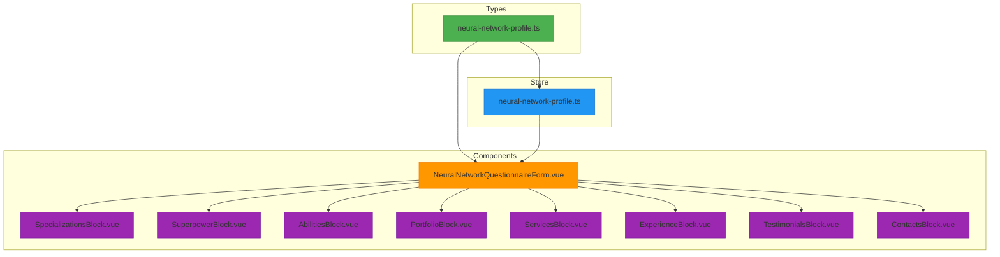
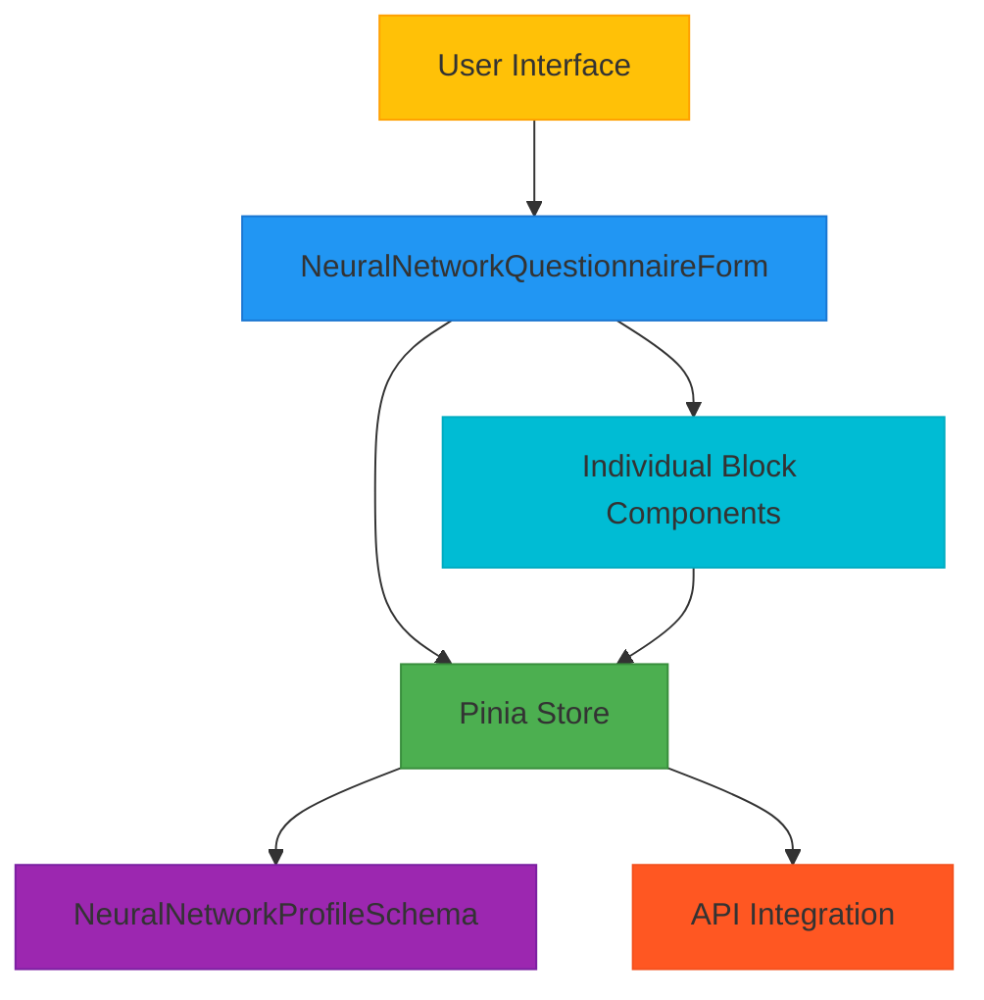
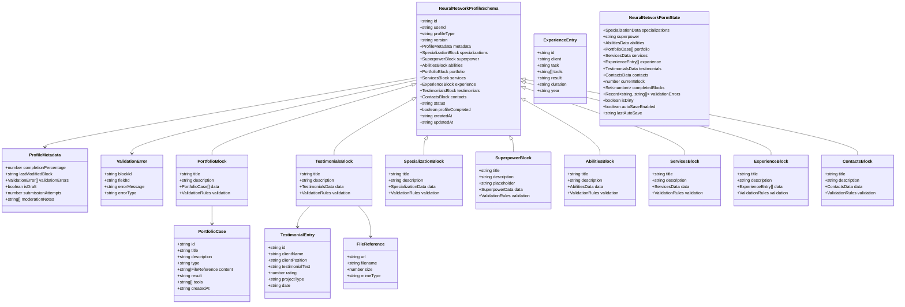
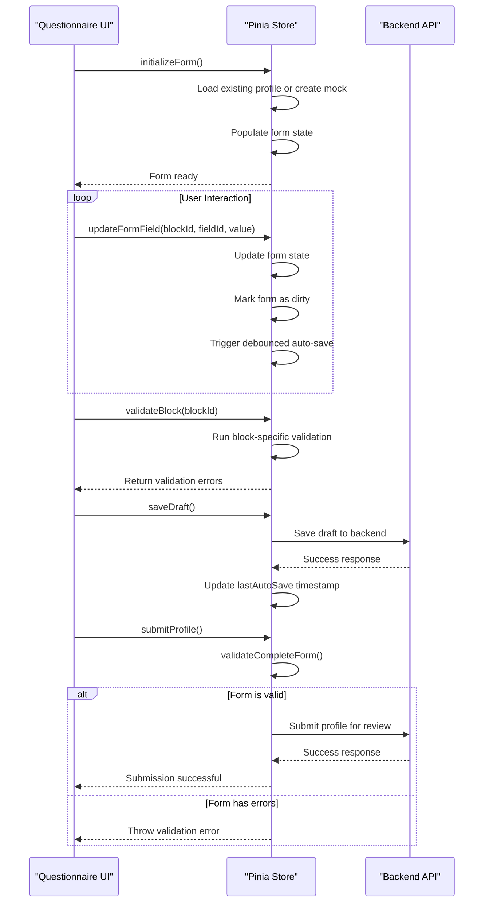
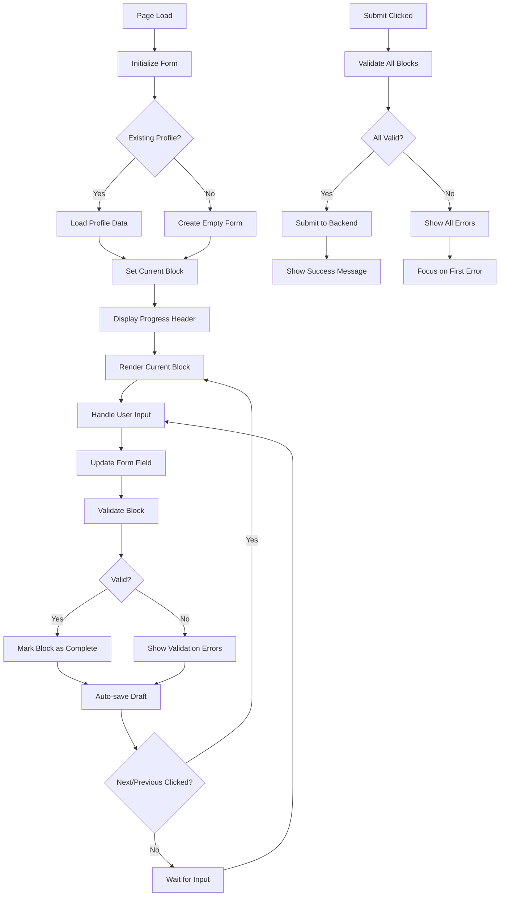
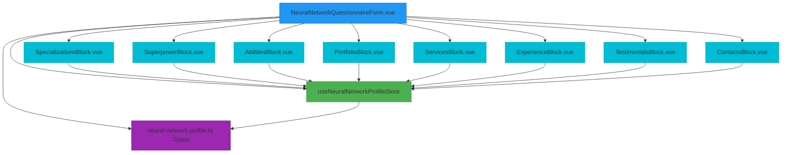
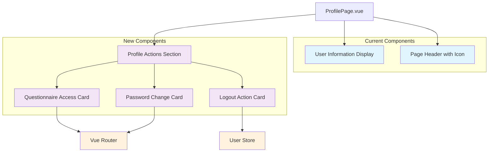

# Neural Network Profile Schema

<cite>
**Referenced Files in This Document**   
- [neural-network-profile.ts](file://src/types/neural-network-profile.ts) - *Updated in recent commit*
- [NeuralNetworkQuestionnaireForm.vue](file://src/components/profile/NeuralNetworkQuestionnaireForm.vue) - *Updated in recent commit*
- [ProfilePage.vue](file://src/pages/ProfilePage.vue) - *Added in recent commit*
- [ActionCard.vue](file://src/components/ui/ActionCard.vue) - *Added in recent commit*
</cite>

## Update Summary
**Changes Made**   
- Updated documentation to reflect the enhanced profile page with user action cards
- Added new section on Profile Page Enhancement with Action Cards
- Updated component hierarchy and interface details
- Added new file references and sources
- Translated all content to English as per language conversion rules

## Table of Contents
1. [Introduction](#introduction)
2. [Project Structure](#project-structure)
3. [Core Components](#core-components)
4. [Architecture Overview](#architecture-overview)
5. [Detailed Component Analysis](#detailed-component-analysis)
6. [Dependency Analysis](#dependency-analysis)
7. [Performance Considerations](#performance-considerations)
8. [Troubleshooting Guide](#troubleshooting-guide)
9. [Profile Page Enhancement with Action Cards](#profile-page-enhancement-with-action-cards)
10. [Conclusion](#conclusion)

## Introduction
The Neural Network Profile Schema is a comprehensive data structure designed for specialists in AI and neural network services. It enables professionals to create detailed profiles showcasing their expertise, skills, portfolio, services, and contact information. The schema supports a multi-block questionnaire interface with validation, progress tracking, and draft management. Built using Vue 3 and Pinia for state management, it follows a modular architecture with clear separation between data models, business logic, and UI components.

## Project Structure
The Neural Network Profile functionality is organized within the frontend application's component and type system. Key files are located in dedicated directories for types, stores, and components, following a feature-based organization pattern.

**Diagram sources**
- [neural-network-profile.ts](file://src/types/neural-network-profile.ts)
- [neural-network-profile.ts](file://src/stores/neural-network-profile.ts)
- [NeuralNetworkQuestionnaireForm.vue](file://src/components/profile/NeuralNetworkQuestionnaireForm.vue)

**Section sources**
- [neural-network-profile.ts](file://src/types/neural-network-profile.ts)
- [neural-network-profile.ts](file://src/stores/neural-network-profile.ts)
- [NeuralNetworkQuestionnaireForm.vue](file://src/components/profile/NeuralNetworkQuestionnaireForm.vue)

## Core Components
The Neural Network Profile system consists of three core components: the data schema, the state store, and the questionnaire UI. The schema defines the complete structure of a specialist's profile, including eight distinct blocks of information. The Pinia store manages form state, validation, and persistence. The questionnaire component provides a step-by-step interface for completing the profile with progress tracking and navigation.

**Section sources**
- [neural-network-profile.ts](file://src/types/neural-network-profile.ts#L1-L325)
- [neural-network-profile.ts](file://src/stores/neural-network-profile.ts#L1-L719)
- [NeuralNetworkQuestionnaireForm.vue](file://src/components/profile/NeuralNetworkQuestionnaireForm.vue#L1-L283)

## Architecture Overview
The Neural Network Profile follows a clean architecture pattern with clear separation between data models, business logic, and presentation. The system is built around a central schema that defines the complete profile structure. The Pinia store acts as the single source of truth, managing both the current profile data and form state. The questionnaire UI component orchestrates the user experience, providing navigation between blocks and handling user interactions.

**Diagram sources**
- [neural-network-profile.ts](file://src/types/neural-network-profile.ts)
- [neural-network-profile.ts](file://src/stores/neural-network-profile.ts)
- [NeuralNetworkQuestionnaireForm.vue](file://src/components/profile/NeuralNetworkQuestionnaireForm.vue)

## Detailed Component Analysis

### Data Schema Analysis
The Neural Network Profile Schema is a TypeScript interface that defines the complete structure of a specialist's profile. It consists of eight distinct blocks, each with specific data fields and validation rules.

**Diagram sources**
- [neural-network-profile.ts](file://src/types/neural-network-profile.ts#L1-L325)

**Section sources**
- [neural-network-profile.ts](file://src/types/neural-network-profile.ts#L1-L325)

### State Management Analysis
The Neural Network Profile Store uses Pinia for state management, providing a reactive store that manages both the current profile data and form state. The store handles initialization, form updates, validation, and persistence operations.

**Diagram sources**
- [neural-network-profile.ts](file://src/stores/neural-network-profile.ts#L1-L719)

**Section sources**
- [neural-network-profile.ts](file://src/stores/neural-network-profile.ts#L1-L719)

### User Interface Analysis
The Neural Network Questionnaire Form provides a step-by-step interface for completing the profile. It features progress tracking, block navigation, validation feedback, and auto-save functionality. The form is divided into eight blocks, each focusing on a specific aspect of the specialist's profile.

**Diagram sources**
- [NeuralNetworkQuestionnaireForm.vue](file://src/components/profile/NeuralNetworkQuestionnaireForm.vue#L1-L283)

**Section sources**
- [NeuralNetworkQuestionnaireForm.vue](file://src/components/profile/NeuralNetworkQuestionnaireForm.vue#L1-L283)

## Dependency Analysis
The Neural Network Profile system has a clear dependency hierarchy. The questionnaire UI component depends on both the data schema and the Pinia store. The store depends on the schema for type definitions. Individual block components depend on the store for state management and the schema for data structure.

**Diagram sources**
- [NeuralNetworkQuestionnaireForm.vue](file://src/components/profile/NeuralNetworkQuestionnaireForm.vue)
- [neural-network-profile.ts](file://src/types/neural-network-profile.ts)
- [neural-network-profile.ts](file://src/stores/neural-network-profile.ts)

**Section sources**
- [NeuralNetworkQuestionnaireForm.vue](file://src/components/profile/NeuralNetworkQuestionnaireForm.vue)
- [neural-network-profile.ts](file://src/types/neural-network-profile.ts)
- [neural-network-profile.ts](file://src/stores/neural-network-profile.ts)

## Performance Considerations
The Neural Network Profile system implements several performance optimizations. The auto-save functionality uses debouncing to prevent excessive API calls, saving only after 2 seconds of user inactivity. The form validation is performed at the block level, allowing for incremental validation rather than validating the entire form on every change. The use of Pinia's reactive state management ensures efficient updates to the UI when form data changes. The component structure follows Vue's best practices for reactivity, with proper use of refs and reactive properties.

## Troubleshooting Guide
Common issues with the Neural Network Profile system and their solutions:

**Form not saving changes**: Ensure the `isDirty` flag is being set correctly when fields are updated. Check that the `updateFormField` action is properly called from all block components.

**Validation errors not clearing**: Verify that validation errors are being removed from the `validationErrors` object when fields are updated. The `updateFormField` action should delete the corresponding error entry.

**Progress percentage not updating**: Confirm that the `completedBlocks` Set is being updated correctly in the `validateBlock` action. The `getCompletionPercentage` getter calculates based on the size of this Set.

**Auto-save not working**: Check that the `debouncedAutoSave` function is being called from `updateFormField` and that the timeout is properly cleared and reset. Ensure `autoSaveEnabled` is true.

**Navigation issues between blocks**: Verify that `currentBlock` is being updated correctly in the `previousBlock` and `nextBlock` methods. The `nextBlock` method should validate the current block before proceeding.

**Section sources**
- [neural-network-profile.ts](file://src/stores/neural-network-profile.ts#L1-L719)
- [NeuralNetworkQuestionnaireForm.vue](file://src/components/profile/NeuralNetworkQuestionnaireForm.vue#L1-L283)

## Profile Page Enhancement with Action Cards
The profile page has been enhanced with a new user interface that includes action cards for improved navigation and user experience. This enhancement provides users with clear pathways to access different profile-related functionalities.

**Diagram sources**
- [ProfilePage.vue](file://src/pages/ProfilePage.vue#L1-L100)
- [ActionCard.vue](file://src/components/ui/ActionCard.vue#L1-L50)

The enhanced profile page includes three main action cards:
- **Questionnaire Access Card**: Provides direct access to the neural network specialist questionnaire
- **Password Change Card**: Allows users to change their account password
- **Logout Action Card**: Enables users to log out of their current session

The ActionCard component interface includes the following properties:
- **title**: String - The title displayed on the card
- **description**: String - A brief description of the action
- **icon**: String - The icon to display on the card
- **route**: String (optional) - The route to navigate to when the card is clicked
- **color**: 'purple' | 'green' | 'red' - The color theme of the card
- **isAction**: Boolean (optional) - Indicates if the card triggers an action rather than navigation

**Section sources**
- [ProfilePage.vue](file://src/pages/ProfilePage.vue#L1-L100)
- [ActionCard.vue](file://src/components/ui/ActionCard.vue#L1-L50)

## Conclusion
The Neural Network Profile Schema provides a comprehensive framework for AI specialists to create detailed professional profiles. Its modular design with eight distinct blocks allows for structured data collection while maintaining user-friendly navigation. The implementation leverages Vue 3's reactivity system and Pinia for efficient state management. The schema's validation rules ensure data quality, while the auto-save and progress tracking features enhance the user experience. This system effectively balances comprehensive data collection with an intuitive interface, making it easy for specialists to showcase their expertise in the AI field.