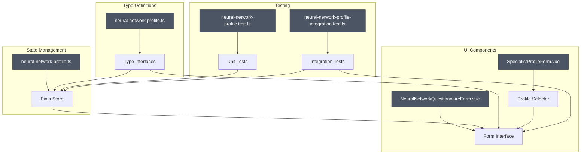
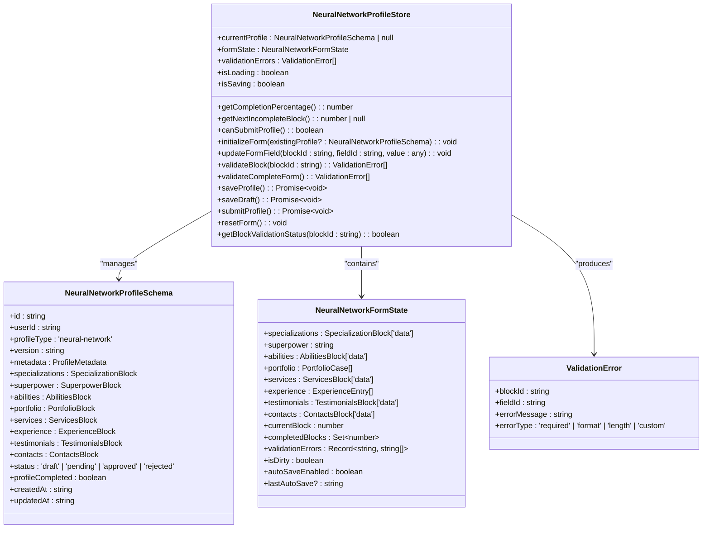
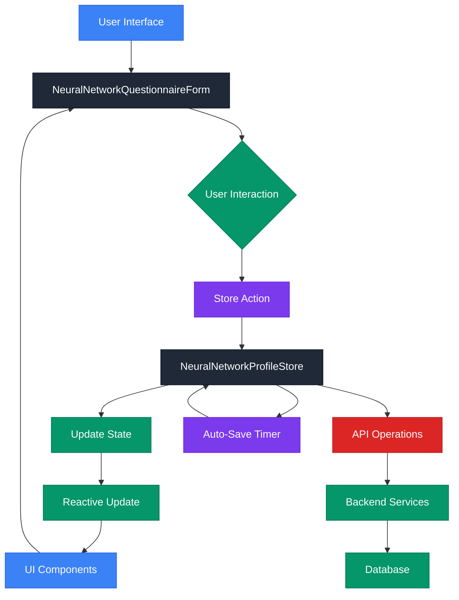
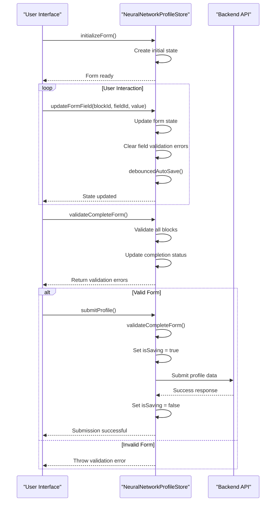
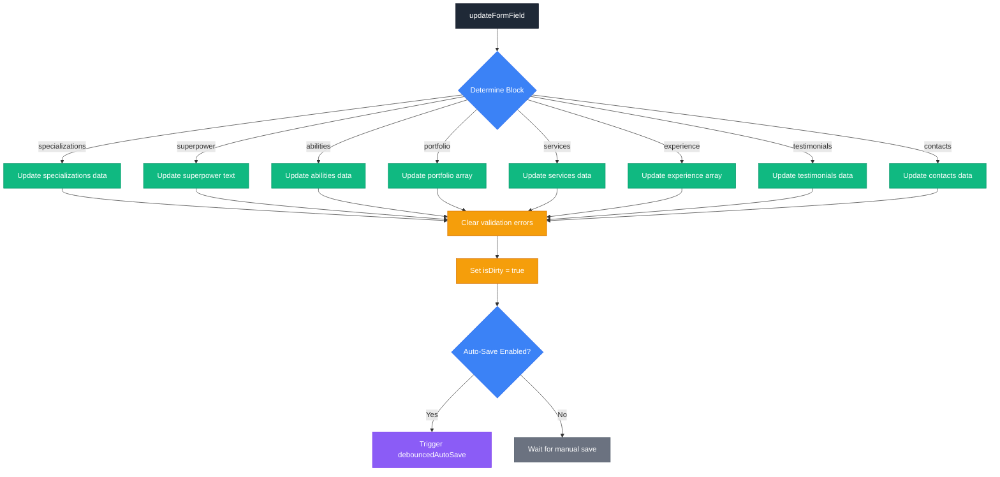
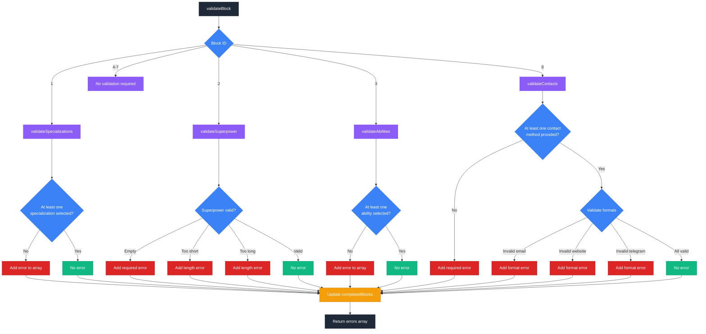
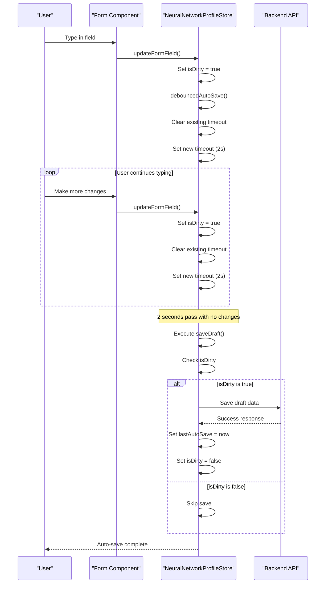
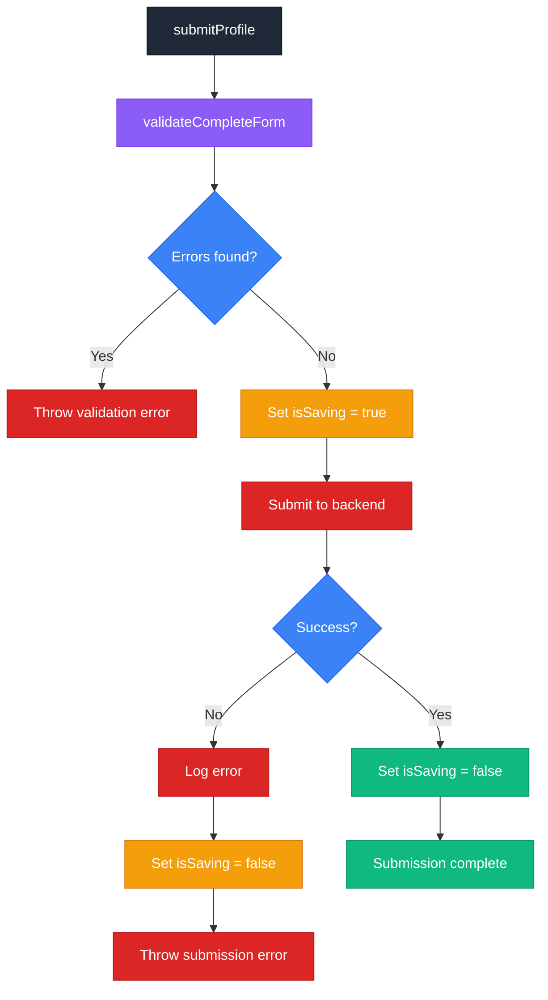
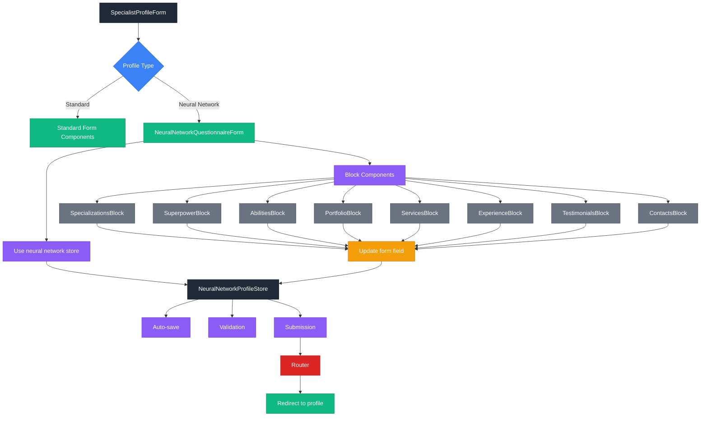

# Neural Network Profile Store

<cite>
**Referenced Files in This Document**   
- [neural-network-profile.ts](file://src/stores/neural-network-profile.ts)
- [neural-network-profile.test.ts](file://tests/stores/neural-network-profile.test.ts)
- [neural-network-profile-integration.test.ts](file://tests/integration/neural-network-profile-integration.test.ts)
- [neural-network-profile.ts](file://src/types/neural-network-profile.ts)
- [SpecialistProfileForm.vue](file://src/components/profile/SpecialistProfileForm.vue)
- [NeuralNetworkQuestionnaireForm.vue](file://src/components/profile/NeuralNetworkQuestionnaireForm.vue)
</cite>

## Table of Contents
1. [Introduction](#introduction)
2. [Project Structure](#project-structure)
3. [Core Components](#core-components)
4. [Architecture Overview](#architecture-overview)
5. [Detailed Component Analysis](#detailed-component-analysis)
6. [Form State Management](#form-state-management)
7. [Validation System](#validation-system)
8. [Auto-Save and Persistence](#auto-save-and-persistence)
9. [Completion Tracking](#completion-tracking)
10. [Submission Workflow](#submission-workflow)
11. [Integration Patterns](#integration-patterns)
12. [Testing Strategy](#testing-strategy)
13. [Troubleshooting Guide](#troubleshooting-guide)
14. [Conclusion](#conclusion)

## Introduction

The Neural Network Profile Store is a Pinia-based state management system designed to handle the creation and management of specialized profiles for AI and neural network experts within the Maya Platform. This store provides a comprehensive solution for form state management, validation, auto-save functionality, completion tracking, and submission workflows.

The system is specifically tailored for specialists in artificial intelligence, machine learning, and neural network technologies, offering a structured questionnaire with eight distinct blocks that capture expertise, services, portfolio, and contact information. The store manages both the data model and user interaction state, ensuring a seamless experience for profile creation and editing.

This documentation provides a comprehensive analysis of the Neural Network Profile Store, covering its architecture, state structure, getters, actions, validation rules, auto-save functionality, completion tracking, and integration patterns. It also includes practical examples and troubleshooting guidance for common issues encountered during implementation and usage.

**Section sources**
- [neural-network-profile.ts](file://src/stores/neural-network-profile.ts#L1-L719)

## Project Structure

The Neural Network Profile Store is organized within the Vue.js application following a feature-based architecture pattern. The core store implementation resides in the `src/stores` directory, while related type definitions are located in the `src/types` directory. Component implementations that utilize this store are organized under the `src/components/profile` directory.

The store follows Vue 3's Composition API pattern with Pinia for state management, leveraging reactive primitives like `ref`, `computed`, and `reactive` to manage state. The project structure demonstrates a clear separation of concerns between state management, type definitions, and UI components.

The testing strategy is implemented with a combination of unit tests in the `tests/stores` directory and integration tests in the `tests/integration` directory, ensuring both isolated functionality and end-to-end workflow validation.



**Diagram sources**
- [neural-network-profile.ts](file://src/stores/neural-network-profile.ts)
- [neural-network-profile.ts](file://src/types/neural-network-profile.ts)
- [NeuralNetworkQuestionnaireForm.vue](file://src/components/profile/NeuralNetworkQuestionnaireForm.vue)
- [SpecialistProfileForm.vue](file://src/components/profile/SpecialistProfileForm.vue)
- [neural-network-profile.test.ts](file://tests/stores/neural-network-profile.test.ts)
- [neural-network-profile-integration.test.ts](file://tests/integration/neural-network-profile-integration.test.ts)

**Section sources**
- [neural-network-profile.ts](file://src/stores/neural-network-profile.ts#L1-L719)
- [neural-network-profile.ts](file://src/types/neural-network-profile.ts#L1-L325)
- [NeuralNetworkQuestionnaireForm.vue](file://src/components/profile/NeuralNetworkQuestionnaireForm.vue#L1-L283)
- [SpecialistProfileForm.vue](file://src/components/profile/SpecialistProfileForm.vue#L1-L741)

## Core Components

The Neural Network Profile Store consists of several core components that work together to provide a complete profile management solution. The primary component is the Pinia store defined in `neural-network-profile.ts`, which manages the application state for neural network specialist profiles.

The store exposes a well-defined API through its returned object, providing access to state, getters, and actions. The state includes the current profile data, loading and saving status indicators, validation errors, and the form state object. Getters provide computed values such as completion percentage and submission eligibility, while actions handle all state mutations and business logic operations.

The type definitions in `neural-network-profile.ts` within the types directory provide a comprehensive schema for the neural network profile, defining interfaces for each of the eight profile blocks: specializations, superpower, abilities, portfolio, services, experience, testimonials, and contacts. These types ensure type safety throughout the application and provide clear documentation of the data structure.



**Diagram sources**
- [neural-network-profile.ts](file://src/stores/neural-network-profile.ts#L1-L719)
- [neural-network-profile.ts](file://src/types/neural-network-profile.ts#L1-L325)

**Section sources**
- [neural-network-profile.ts](file://src/stores/neural-network-profile.ts#L1-L719)
- [neural-network-profile.ts](file://src/types/neural-network-profile.ts#L1-L325)

## Architecture Overview

The Neural Network Profile Store follows a state management architecture pattern that separates concerns between data storage, business logic, and UI presentation. The architecture is built on Vue 3's reactivity system with Pinia as the state management library, providing a clean and scalable solution for managing complex form state.

At the core of the architecture is the Pinia store, which encapsulates all state and business logic related to neural network profile management. The store maintains both the raw profile data and derived state such as validation status and completion percentage. This centralized state management approach ensures consistency and simplifies data flow throughout the application.

The architecture implements a unidirectional data flow pattern, where user interactions trigger actions on the store, which then update the state, causing reactive updates to the UI components. This pattern makes the application's behavior predictable and easier to debug. The store also handles side effects such as API calls for saving and submitting profiles, abstracting these concerns from the UI components.



**Diagram sources**
- [neural-network-profile.ts](file://src/stores/neural-network-profile.ts#L1-L719)
- [NeuralNetworkQuestionnaireForm.vue](file://src/components/profile/NeuralNetworkQuestionnaireForm.vue#L1-L283)

**Section sources**
- [neural-network-profile.ts](file://src/stores/neural-network-profile.ts#L1-L719)
- [NeuralNetworkQuestionnaireForm.vue](file://src/components/profile/NeuralNetworkQuestionnaireForm.vue#L1-L283)

## Detailed Component Analysis

### Neural Network Profile Store Analysis

The Neural Network Profile Store is implemented as a Pinia store using the `defineStore` function, following Vue 3's Composition API pattern. The store manages the complete lifecycle of a neural network specialist's profile, from initialization to submission.

The store's state is divided into several key areas: the current profile data, loading and saving status flags, validation errors, and the form state object. The form state is particularly comprehensive, containing both the form data and metadata about the form's state, such as the current block, completed blocks, and dirty status.

The store's actions follow a clear pattern of separation between data manipulation and persistence operations. Data manipulation actions like `updateFormField` handle changes to the form state, while persistence actions like `saveProfile`, `saveDraft`, and `submitProfile` handle the saving of data to the backend. This separation of concerns makes the code more maintainable and testable.



**Diagram sources**
- [neural-network-profile.ts](file://src/stores/neural-network-profile.ts#L1-L719)

**Section sources**
- [neural-network-profile.ts](file://src/stores/neural-network-profile.ts#L1-L719)

## Form State Management

The form state management system in the Neural Network Profile Store is designed to handle the complex requirements of a multi-block questionnaire. The form state is managed through a reactive object that contains both the form data and metadata about the form's state.

The form state object includes properties for each of the eight profile blocks: specializations, superpower, abilities, portfolio, services, experience, testimonials, and contacts. Each property corresponds to the data structure defined in the type definitions, ensuring type safety and consistency.

In addition to the form data, the state object includes metadata properties that track the user's progress through the form. The `currentBlock` property indicates which block the user is currently viewing, while the `completedBlocks` Set tracks which blocks have been completed based on validation. The `isDirty` flag indicates whether the form has been modified since the last save, enabling efficient auto-save functionality.

The store provides the `updateFormField` action to modify the form state, which accepts parameters for the block ID, field ID, and new value. This action handles the nested structure of the form state, using a switch statement to route updates to the appropriate property. After updating the field, the action clears any validation errors for that field and triggers auto-save if enabled.



**Diagram sources**
- [neural-network-profile.ts](file://src/stores/neural-network-profile.ts#L1-L719)

**Section sources**
- [neural-network-profile.ts](file://src/stores/neural-network-profile.ts#L1-L719)

## Validation System

The validation system in the Neural Network Profile Store is designed to provide real-time feedback to users as they complete their profile. The system implements block-level validation, where each of the eight profile blocks has its own validation rules and can be validated independently.

The validation process is triggered by the `validateBlock` action, which accepts a block ID and returns an array of validation errors. The action uses a switch statement to route validation to the appropriate validation function based on the block ID. For each block, the corresponding validation function checks the form data against the defined rules and returns any errors found.

The validation rules are defined in the type interfaces and implemented in the store. For example, the specializations block requires at least one specialization to be selected, the superpower block has minimum and maximum length requirements, and the contacts block requires at least one contact method to be provided.

When validation is performed, the system updates the `completedBlocks` Set based on whether errors were found. If a block passes validation, its ID is added to the Set; if it fails, the ID is removed. This approach provides a simple way to track which blocks have been completed and enables the calculation of overall completion percentage.



**Diagram sources**
- [neural-network-profile.ts](file://src/stores/neural-network-profile.ts#L1-L719)

**Section sources**
- [neural-network-profile.ts](file://src/stores/neural-network-profile.ts#L1-L719)

## Auto-Save and Persistence

The auto-save functionality in the Neural Network Profile Store provides a seamless user experience by automatically saving changes to the profile as the user works. This feature prevents data loss and reduces the need for manual saving, while still allowing users to control when they want to explicitly save their work.

The auto-save system is implemented using a debounce pattern, where changes to the form trigger a timer that delays the actual save operation. When a field is updated via the `updateFormField` action, the `debouncedAutoSave` function is called, which clears any existing timeout and sets a new one for 2 seconds in the future. If the user continues to make changes within this 2-second window, the timer is reset, ensuring that saves only occur after the user has paused their input.

The `saveDraft` action handles the actual persistence of the draft data. It first checks if the form is dirty (has unsaved changes) and only proceeds if changes exist. The action then attempts to save the draft data, updates the `lastAutoSave` timestamp, and resets the `isDirty` flag. Error handling is implemented to catch and log any issues that occur during the save process, preventing the application from crashing.



**Diagram sources**
- [neural-network-profile.ts](file://src/stores/neural-network-profile.ts#L1-L719)

**Section sources**
- [neural-network-profile.ts](file://src/stores/neural-network-profile.ts#L1-L719)

## Completion Tracking

The completion tracking system in the Neural Network Profile Store provides users with real-time feedback on their progress through the profile creation process. This system calculates both block-level and overall completion status, enabling features like progress indicators and conditional navigation.

The system is centered around the `completedBlocks` Set in the form state, which stores the IDs of blocks that have passed validation. When a block is validated, the system adds or removes its ID from this Set based on whether validation errors were found. This approach provides a simple and efficient way to track which sections of the profile have been successfully completed.

The store exposes two key getters for completion tracking: `getCompletionPercentage` and `getNextIncompleteBlock`. The `getCompletionPercentage` getter calculates the overall completion percentage by dividing the number of completed blocks by the total number of blocks (8) and multiplying by 100. The `getNextIncompleteBlock` getter returns the ID of the next block that has not been completed, enabling intelligent navigation that guides users to incomplete sections.

```mermaid
flowchart TD
A[validateBlock] --> B{Validation successful?}
B --> |Yes| C[Add block ID to completedBlocks]
B --> |No| D[Remove block ID from completedBlocks]
C --> E[Update completion status]
D --> E
E --> F[getCompletionPercentage]
F --> G[Calculate: (completed / 8) * 100]
G --> H[Return percentage]
E --> I[getNextIncompleteBlock]
I --> J[Loop through blocks 1-8]
J --> K{Block in completedBlocks?}
K --> |No| L[Return block ID]
K --> |Yes| M{Next block?}
M --> |Yes| J
M --> |No| N[Return null]
style A fill:#1F2937,stroke:#111827,color:white
style B fill:#3B82F6,stroke:#2563EB,color:white
style C fill:#10B981,stroke:#059669,color:white
style D fill:#DC2626,stroke:#B91C1C,color:white
style E fill:#F59E0B,stroke:#D97706,color:white
style F fill:#8B5CF6,stroke:#7C3AED,color:white
style G fill:#8B5CF6,stroke:#7C3AED,color:white
style H fill:#8B5CF6,stroke:#7C3AED,color:white
style I fill:#8B5CF6,stroke:#7C3AED,color:white
style J fill:#3B82F6,stroke:#2563EB,color:white
style K fill:#3B82F6,stroke:#2563EB,color:white
style L fill:#10B981,stroke:#059669,color:white
style M fill:#3B82F6,stroke:#2563EB,color:white
style N fill:#6B7280,stroke:#4B5563,color:white
```

**Diagram sources**
- [neural-network-profile.ts](file://src/stores/neural-network-profile.ts#L1-L719)

**Section sources**
- [neural-network-profile.ts](file://src/stores/neural-network-profile.ts#L1-L719)

## Submission Workflow

The submission workflow in the Neural Network Profile Store manages the process of submitting a completed profile for review. This workflow ensures that profiles meet all requirements before submission and provides appropriate feedback to users when issues are detected.

The submission process begins with the `submitProfile` action, which first calls `validateCompleteForm` to validate all blocks of the profile. This comprehensive validation checks each block for errors and returns an array of all validation issues found. If any errors are present, the action throws an error with a descriptive message, preventing the submission from proceeding.

When the profile passes validation, the action sets the `isSaving` flag to true, indicating that a submission is in progress. This flag is used by UI components to display loading states and prevent multiple submissions. The action then attempts to submit the profile data to the backend API. Upon successful submission, the `isSaving` flag is reset to false, and the process completes.

The `canSubmitProfile` getter determines whether a profile is eligible for submission by checking if all required blocks have been completed. Currently, blocks 1 (Specializations), 2 (Superpower), 3 (Abilities), and 8 (Contacts) are required for submission. This getter is used by UI components to enable or disable the submission button based on the profile's completion status.



**Diagram sources**
- [neural-network-profile.ts](file://src/stores/neural-network-profile.ts#L1-L719)

**Section sources**
- [neural-network-profile.ts](file://src/stores/neural-network-profile.ts#L1-L719)

## Integration Patterns

The Neural Network Profile Store is integrated into the application through several key patterns that connect the state management system with UI components and other application features. The primary integration point is the `NeuralNetworkQuestionnaireForm` component, which provides the user interface for completing the profile.

The integration follows a container-component pattern, where the `NeuralNetworkQuestionnaireForm` acts as a container that manages the store connection and passes down state and actions to presentational components for each profile block. These presentational components (e.g., `SpecializationsBlock`, `SuperpowerBlock`) receive the form state and emit events when fields are updated, which the container routes to the appropriate store actions.

Another key integration pattern is the profile type selection in the `SpecialistProfileForm` component, which allows users to choose between a standard profile and a neural network specialist profile. This component conditionally renders the appropriate form based on the user's selection, demonstrating a flexible form architecture that can accommodate different profile types.

The store is also integrated with the application's routing and navigation system, with components using Vue Router to redirect users after profile submission. This integration ensures a smooth user experience as users move through the profile creation and submission process.



**Diagram sources**
- [NeuralNetworkQuestionnaireForm.vue](file://src/components/profile/NeuralNetworkQuestionnaireForm.vue#L1-L283)
- [SpecialistProfileForm.vue](file://src/components/profile/SpecialistProfileForm.vue#L1-L741)

**Section sources**
- [NeuralNetworkQuestionnaireForm.vue](file://src/components/profile/NeuralNetworkQuestionnaireForm.vue#L1-L283)
- [SpecialistProfileForm.vue](file://src/components/profile/SpecialistProfileForm.vue#L1-L741)

## Testing Strategy

The testing strategy for the Neural Network Profile Store includes both unit tests and integration tests to ensure the reliability and correctness of the implementation. The tests are organized in separate directories: unit tests in `tests/stores` and integration tests in `tests/integration`.

The unit tests focus on verifying the isolated functionality of the store's actions and getters. These tests use Vitest with Pinia's testing utilities to create a testing pinia instance and verify that store methods behave as expected. Key aspects tested include initialization, form field updates, validation logic, and state mutations.

The integration tests verify the end-to-end workflow of creating and submitting a neural network profile. These tests simulate user interactions across multiple blocks of the profile, ensuring that the completion tracking, validation, and submission processes work correctly when used together. The tests validate that users can progress through the form, that completion status is updated appropriately, and that submission only occurs when all required blocks are completed.

```mermaid
flowchart TD
A[Testing Strategy] --> B[Unit Tests]
A --> C[Integration Tests]
B --> D[Initialize store]
D --> E[Test default state]
B --> F[Test actions]
F --> G[initializeForm]
F --> H[updateFormField]
F --> I[validateBlock]
F --> J[saveProfile]
F --> K[saveDraft]
F --> L[submitProfile]
F --> M[resetForm]
B --> N[Test getters]
N --> O[getCompletionPercentage]
N --> P[getNextIncompleteBlock]
N --> Q[canSubmitProfile]
C --> R[Complete workflow]
R --> S[Fill specializations]
R --> T[Fill superpower]
R --> U[Fill abilities]
R --> V[Fill contacts]
R --> W[Submit profile]
W --> X[Verify submission]
style A fill:#1F2937,stroke:#111827,color:white
style B fill:#3B82F6,stroke:#2563EB,color:white
style C fill:#3B82F6,stroke:#2563EB,color:white
style D fill:#8B5CF6,stroke:#7C3AED,color:white
style E fill:#8B5CF6,stroke:#7C3AED,color:white
style F fill:#8B5CF6,stroke:#7C3AED,color:white
style G fill:#6B7280,stroke:#4B5563,color:white
style H fill:#6B7280,stroke:#4B5563,color:white
style I fill:#6B7280,stroke:#4B5563,color:white
style J fill:#6B7280,stroke:#4B5563,color:white
style K fill:#6B7280,stroke:#4B5563,color:white
style L fill:#6B7280,stroke:#4B5563,color:white
style M fill:#6B7280,stroke:#4B5563,color:white
style N fill:#8B5CF6,stroke:#7C3AED,color:white
style O fill:#6B7280,stroke:#4B5563,color:white
style P fill:#6B7280,stroke:#4B5563,color:white
style Q fill:#6B7280,stroke:#4B5563,color:white
style R fill:#8B5CF6,stroke:#7C3AED,color:white
style S fill:#6B7280,stroke:#4B5563,color:white
style T fill:#6B7280,stroke:#4B5563,color:white
style U fill:#6B7280,stroke:#4B5563,color:white
style V fill:#6B7280,stroke:#4B5563,color:white
style W fill:#6B7280,stroke:#4B5563,color:white
style X fill:#6B7280,stroke:#4B5563,color:white
```



**Diagram sources**
- [neural-network-profile.test.ts](file://tests/stores/neural-network-profile.test.ts#L1-L347)
- [neural-network-profile-integration.test.ts](file://tests/integration/neural-network-profile-integration.test.ts#L1-L35)

**Section sources**
- [neural-network-profile.test.ts](file://tests/stores/neural-network-profile.test.ts#L1-L347)
- [neural-network-profile-integration.test.ts](file://tests/integration/neural-network-profile-integration.test.ts#L1-L35)

## Troubleshooting Guide

This troubleshooting guide addresses common issues encountered when working with the Neural Network Profile Store, providing solutions and workarounds for various scenarios.

### Issue: Form changes not triggering auto-save
**Symptom**: Changes to form fields are not being automatically saved.
**Solution**: Verify that the `autoSaveEnabled` flag in the form state is set to `true`. Check that the `updateFormField` action is being called correctly with the proper parameters. Ensure that the debounce timer (2 seconds) is not being continuously reset by rapid input.

### Issue: Validation errors not clearing
**Symptom**: Validation errors persist even after correcting the input.
**Solution**: The `updateFormField` action should automatically clear validation errors for the updated field. Verify that the field ID passed to the action matches the expected format. Check that the validation error object structure is correct and that the field path is properly addressed.

### Issue: Completion percentage not updating
**Symptom**: The completion percentage does not reflect completed blocks.
**Solution**: Ensure that `validateBlock` is called after making changes to a block. The completion status is updated only when validation is performed. Check that the `completedBlocks` Set is being modified correctly based on validation results.

### Issue: Submission failing despite valid form
**Symptom**: The profile cannot be submitted even when all required fields appear to be filled.
**Solution**: Check the `canSubmitProfile` getter requirements. Currently, blocks 1, 2, 3, and 8 are required for submission. Verify that these blocks have passed validation and that their IDs are present in the `completedBlocks` Set.

### Issue: Mock profile not initializing correctly
**Symptom**: The `createMockProfile` function does not populate the form as expected.
**Solution**: The mock profile sets specific specializations, superpower, and abilities to true. Verify that the `initializeForm` function is called with no parameters to trigger mock profile creation. Check that the form state is being populated from the mock profile data.

### Issue: Navigation not working between blocks
**Symptom**: The "Next" button does not advance to the next block.
**Solution**: The navigation checks validation before proceeding. Ensure that the current block passes validation before attempting to move to the next block. Check that the `currentBlock` value is being updated correctly in the component state.

**Section sources**
- [neural-network-profile.ts](file://src/stores/neural-network-profile.ts#L1-L719)
- [NeuralNetworkQuestionnaireForm.vue](file://src/components/profile/NeuralNetworkQuestionnaireForm.vue#L1-L283)

## Conclusion

The Neural Network Profile Store provides a robust and comprehensive solution for managing profiles of AI and neural network specialists within the Maya Platform. The store's architecture effectively separates concerns between state management, business logic, and UI presentation, following Vue 3 and Pinia best practices.

Key strengths of the implementation include its comprehensive form state management, real-time validation system, auto-save functionality, and completion tracking. The store provides a seamless user experience by automatically saving changes, providing immediate feedback on validation, and guiding users through the profile creation process with clear progress indicators.

The integration patterns demonstrate a flexible approach to form management, allowing for different profile types while maintaining a consistent user experience. The testing strategy ensures reliability through both unit and integration tests that validate both isolated functionality and end-to-end workflows.

For future improvements, consider implementing more sophisticated error handling with user-friendly messages, enhancing the auto-save system with conflict resolution for concurrent edits, and expanding the validation system to include more complex business rules. Additionally, the store could benefit from more comprehensive documentation of its API and better type safety in the action parameters.

Overall, the Neural Network Profile Store is a well-designed and effective solution that meets the needs of neural network specialists creating profiles on the platform, providing a user-friendly interface backed by a robust state management system.