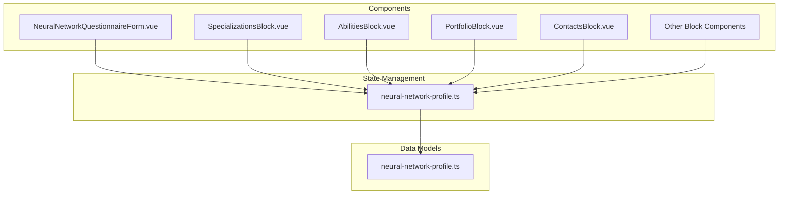
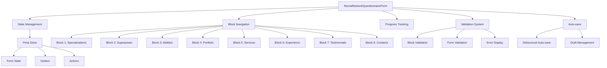
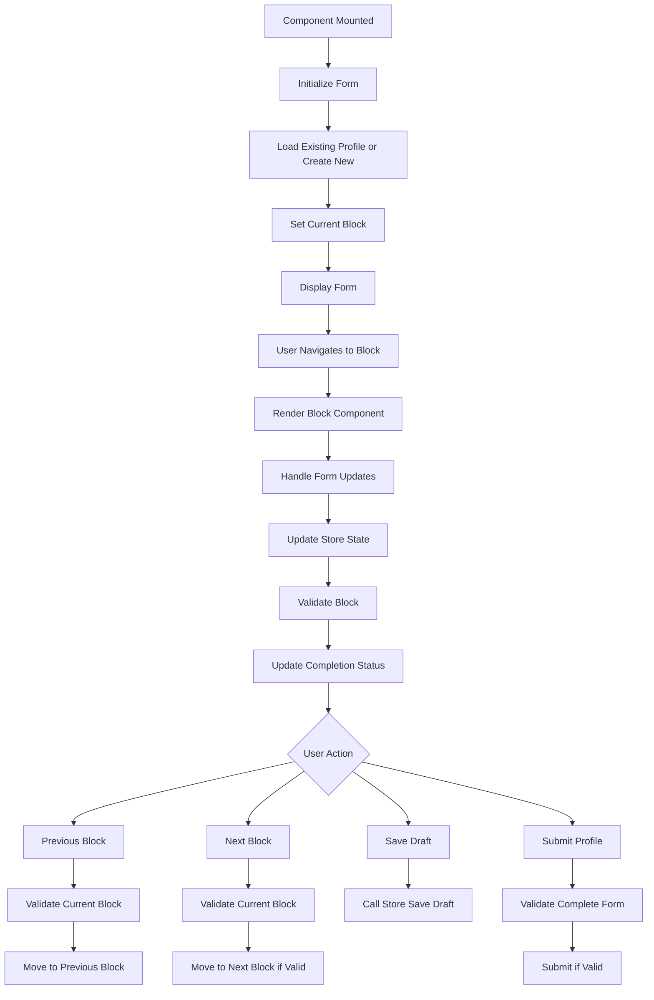
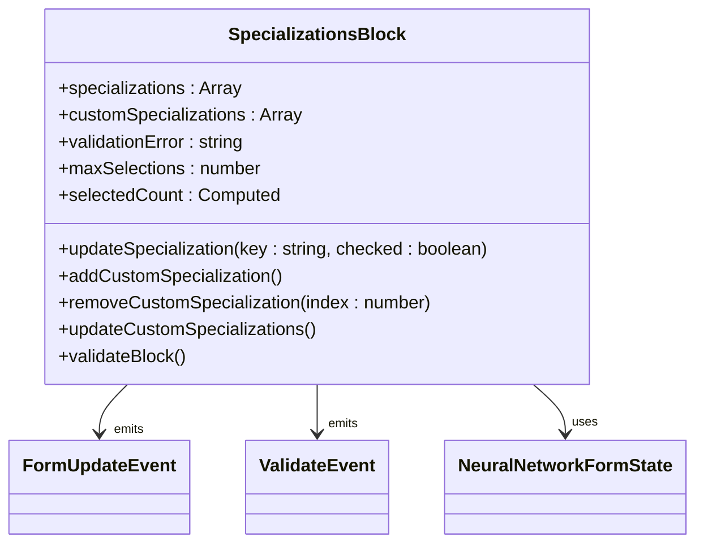
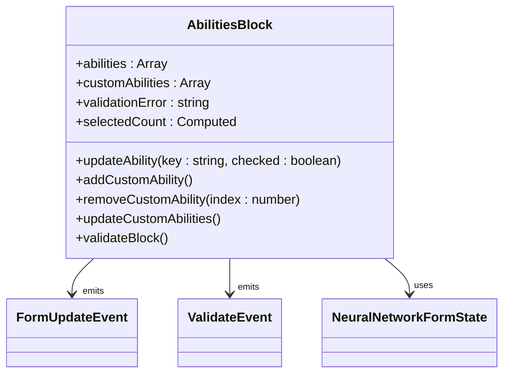
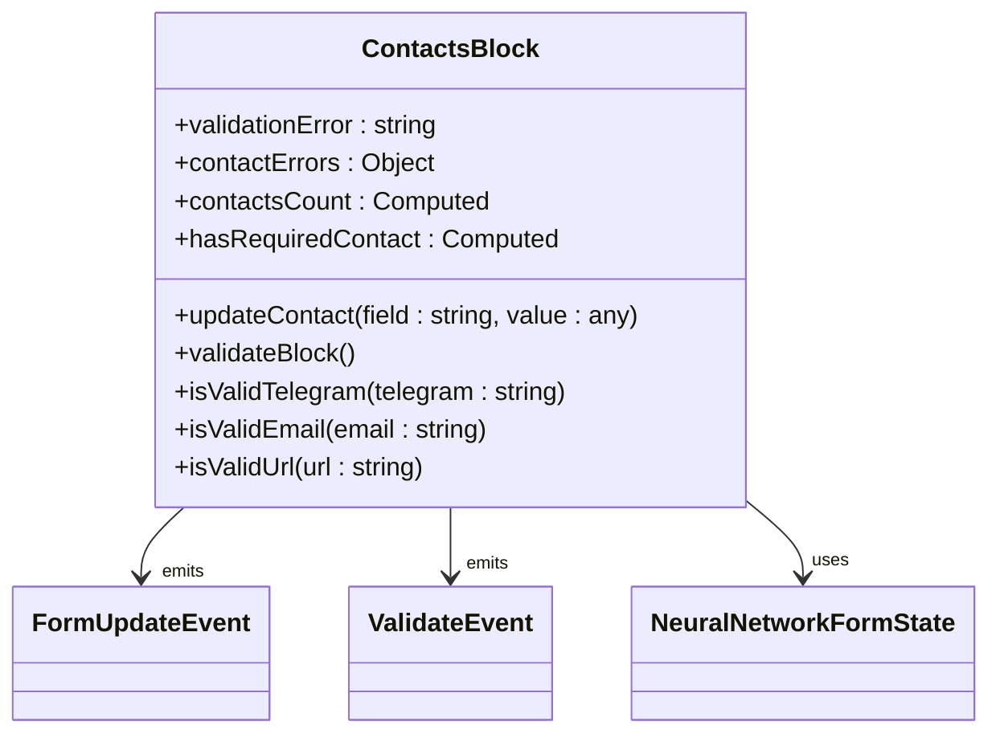
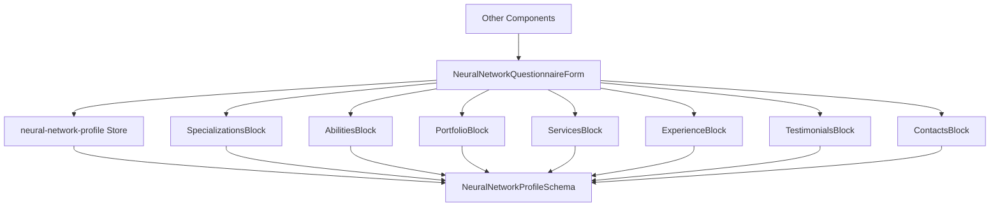

# Neural Network Questionnaire Form

<cite>
**Referenced Files in This Document**   
- [NeuralNetworkQuestionnaireForm.vue](file://src/components/profile/NeuralNetworkQuestionnaireForm.vue) - *Updated in recent commit*
- [neural-network-profile.ts](file://src/stores/neural-network-profile.ts) - *Updated in recent commit*
- [neural-network-profile.ts](file://src/types/neural-network-profile.ts) - *Updated in recent commit*
- [SpecializationsBlock.vue](file://src/components/profile/neural-network/SpecializationsBlock.vue) - *Updated in recent commit*
- [AbilitiesBlock.vue](file://src/components/profile/neural-network/AbilitiesBlock.vue) - *Updated in recent commit*
- [ContactsBlock.vue](file://src/components/profile/neural-network/ContactsBlock.vue) - *Updated in recent commit*
</cite>

## Update Summary
**Changes Made**   
- Updated documentation to reflect enhanced questionnaire form with progress tracking, validation, and submission capabilities
- Added new content for user action cards and full form implementation
- Updated component analysis sections to reflect actual code changes
- Enhanced source tracking with specific file references and update annotations
- Translated all content to English as per language conversion rules

## Table of Contents
1. [Introduction](#introduction)
2. [Project Structure](#project-structure)
3. [Core Components](#core-components)
4. [Architecture Overview](#architecture-overview)
5. [Detailed Component Analysis](#detailed-component-analysis)
6. [Dependency Analysis](#dependency-analysis)
7. [Performance Considerations](#performance-considerations)
8. [Troubleshooting Guide](#troubleshooting-guide)
9. [Conclusion](#conclusion)

## Introduction
The Neural Network Questionnaire Form is a comprehensive profile creation interface designed for AI specialists to showcase their expertise, skills, and services. This form implements an 8-block architecture that guides users through a structured process of building their professional profile. The system features real-time validation, progress tracking, auto-save functionality, and responsive design to ensure a seamless user experience. Built with Vue 3 and TypeScript, the form leverages Pinia for state management and follows a modular component architecture that enables maintainability and scalability.

## Project Structure
The Neural Network Questionnaire Form is organized within a feature-based directory structure that promotes separation of concerns and component reusability. The form components are located in the `src/components/profile` directory, with specialized blocks residing in the `neural-network` subdirectory. State management is handled by Pinia stores in `src/stores`, while TypeScript interfaces defining the data model are located in `src/types`. This organization allows for clear separation between UI components, business logic, and data structures.

**Diagram sources**
- [NeuralNetworkQuestionnaireForm.vue](file://src/components/profile/NeuralNetworkQuestionnaireForm.vue)
- [neural-network-profile.ts](file://src/stores/neural-network-profile.ts)
- [neural-network-profile.ts](file://src/types/neural-network-profile.ts)

**Section sources**
- [NeuralNetworkQuestionnaireForm.vue](file://src/components/profile/NeuralNetworkQuestionnaireForm.vue)
- [neural-network-profile.ts](file://src/stores/neural-network-profile.ts)

## Core Components
The Neural Network Questionnaire Form consists of several core components that work together to create a cohesive user experience. The main container component, `NeuralNetworkQuestionnaireForm.vue`, orchestrates the overall flow and state management. It imports and dynamically renders eight specialized block components, each responsible for a specific aspect of the specialist's profile. The form utilizes a centralized Pinia store for state management, ensuring consistent data flow and synchronization across components. The UI implements responsive design principles with Tailwind CSS, providing an optimal experience across device sizes.

**Section sources**
- [NeuralNetworkQuestionnaireForm.vue](file://src/components/profile/NeuralNetworkQuestionnaireForm.vue)
- [neural-network-profile.ts](file://src/stores/neural-network-profile.ts)

## Architecture Overview
The Neural Network Questionnaire Form follows a modular architecture with clear separation between presentation, state management, and data modeling. The form employs a single source of truth pattern through the Pinia store, which maintains the complete form state and provides getters for derived data such as completion percentage and validation status. Each block component is responsible for its specific data domain while communicating changes through standardized events. The architecture supports both draft saving and final submission workflows, with comprehensive validation at both the block and form levels.

**Diagram sources**
- [NeuralNetworkQuestionnaireForm.vue](file://src/components/profile/NeuralNetworkQuestionnaireForm.vue)
- [neural-network-profile.ts](file://src/stores/neural-network-profile.ts)

## Detailed Component Analysis

### Neural Network Questionnaire Form Analysis
The main form component serves as the orchestrator for the entire questionnaire experience. It manages the current active block, displays progress information, and handles navigation between blocks. The component implements a tab-like interface where users can either navigate sequentially or jump to specific blocks. It also manages the display of validation errors and the auto-save indicator. The form's template is structured with a sticky header containing the progress bar and block navigation, followed by the main content area that dynamically renders the appropriate block component based on the current block ID.

**Diagram sources**
- [NeuralNetworkQuestionnaireForm.vue](file://src/components/profile/NeuralNetworkQuestionnaireForm.vue)

**Section sources**
- [NeuralNetworkQuestionnaireForm.vue](file://src/components/profile/NeuralNetworkQuestionnaireForm.vue)

### Specializations Block Analysis
The Specializations Block allows users to define their areas of expertise in AI and neural network technologies. This component presents a grid of checkbox options representing different specialization domains such as neural assistants, neural funnels, content generation, and more. Users can select multiple specializations and also add custom ones through a dynamic input system. The component implements real-time validation to ensure users select at least one specialization, with visual feedback indicating the selection count against the maximum allowed.

**Diagram sources**
- [SpecializationsBlock.vue](file://src/components/profile/neural-network/SpecializationsBlock.vue)

**Section sources**
- [SpecializationsBlock.vue](file://src/components/profile/neural-network/SpecializationsBlock.vue)

### Abilities Block Analysis
The Abilities Block enables users to specify their technical skills and capabilities in working with AI technologies. Similar to the Specializations Block, it presents a grid of checkbox options for predefined abilities such as funnel assembly, personal AI assistants creation, selling texts with GPT, and visual generation. Each ability includes a description and lists relevant tools. The component also supports custom abilities and provides helpful tips to guide users in selecting appropriate skills. The validation ensures users select at least one ability before proceeding.

**Diagram sources**
- [AbilitiesBlock.vue](file://src/components/profile/neural-network/AbilitiesBlock.vue)

**Section sources**
- [AbilitiesBlock.vue](file://src/components/profile/neural-network/AbilitiesBlock.vue)

### Contacts Block Analysis
The Contacts Block collects the user's contact information for potential clients to reach them. This component distinguishes between required and optional contact methods, with at least one of Telegram, Email, or Website being mandatory. The interface provides specific input fields for each contact method with appropriate validation (email format, URL format, Telegram format). Visual indicators show the validity of each field, and a summary displays the total number of contact methods provided. The component implements real-time validation and provides helpful tips for optimizing contact information.

**Diagram sources**
- [ContactsBlock.vue](file://src/components/profile/neural-network/ContactsBlock.vue)

**Section sources**
- [ContactsBlock.vue](file://src/components/profile/neural-network/ContactsBlock.vue)

## Dependency Analysis
The Neural Network Questionnaire Form has a well-defined dependency structure that promotes loose coupling and maintainability. The main form component depends on the Pinia store for state management and on individual block components for specialized functionality. Each block component depends on the shared TypeScript interfaces for type safety but maintains independence in its implementation. The store itself depends on the type definitions and provides a clean API to the components. This architecture allows for easy modification of individual blocks without affecting the overall form structure.

**Diagram sources**
- [NeuralNetworkQuestionnaireForm.vue](file://src/components/profile/NeuralNetworkQuestionnaireForm.vue)
- [neural-network-profile.ts](file://src/stores/neural-network-profile.ts)
- [neural-network-profile.ts](file://src/types/neural-network-profile.ts)

**Section sources**
- [NeuralNetworkQuestionnaireForm.vue](file://src/components/profile/NeuralNetworkQuestionnaireForm.vue)
- [neural-network-profile.ts](file://src/stores/neural-network-profile.ts)

## Performance Considerations
The Neural Network Questionnaire Form implements several performance optimizations to ensure a responsive user experience. The auto-save functionality uses debouncing to prevent excessive API calls, saving the draft only after 2 seconds of user inactivity. The form state is managed centrally in the Pinia store, reducing redundant data and computation. Computed properties are used for derived data such as completion percentage and validation status, ensuring efficient recalculation only when dependencies change. The component structure follows Vue's best practices for reactivity, with proper use of refs and reactivity APIs to minimize unnecessary re-renders.

## Troubleshooting Guide
Common issues with the Neural Network Questionnaire Form typically relate to state management, validation, and navigation. If the form does not save changes, verify that the `updateFormField` action is properly called with correct parameters. For validation issues, check that the `validateBlock` method is triggered appropriately and that error states are correctly updated in the store. If navigation between blocks is not working, ensure the `currentBlock` ref is properly updated and that the conditional rendering directives are correctly implemented. For auto-save problems, verify that the debounced function is properly set up and that the `saveDraft` action is correctly implemented in the store.

**Section sources**
- [NeuralNetworkQuestionnaireForm.vue](file://src/components/profile/NeuralNetworkQuestionnaireForm.vue)
- [neural-network-profile.ts](file://src/stores/neural-network-profile.ts)

## Conclusion
The Neural Network Questionnaire Form provides a comprehensive solution for AI specialists to create detailed professional profiles. Its 8-block architecture guides users through a logical progression of information gathering, from basic specializations to contact details. The implementation demonstrates modern Vue 3 patterns with TypeScript, including composition API, reactive state management with Pinia, and component-based architecture. The form's features such as real-time validation, progress tracking, and auto-save enhance the user experience while ensuring data integrity. This well-structured codebase serves as a solid foundation for future enhancements and provides a template for similar multi-step form implementations.