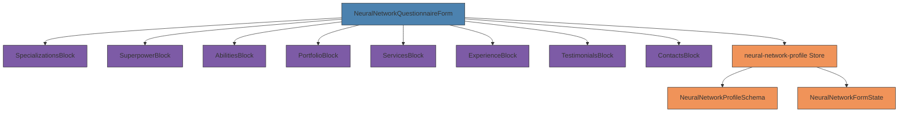
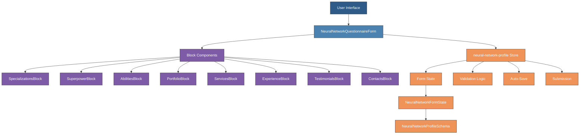
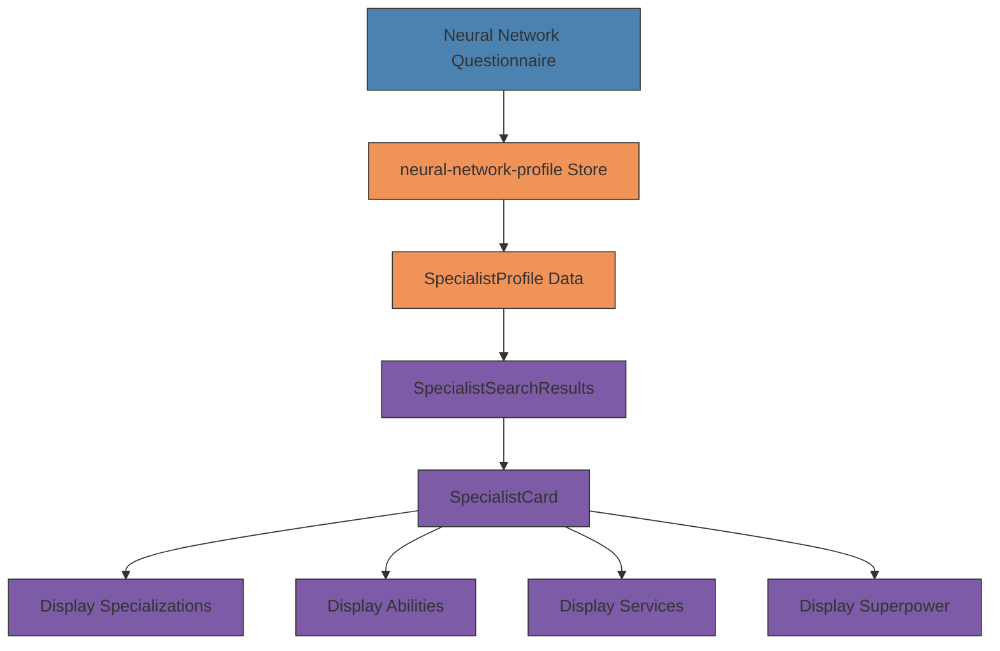
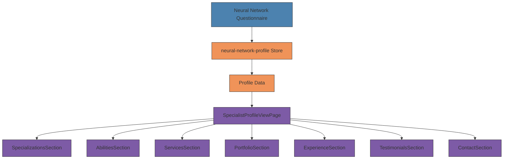

# Neural Network Specialist Questionnaire

<cite>
**Referenced Files in This Document**   
- [NeuralNetworkQuestionnaireForm.vue](file://src/components/profile/NeuralNetworkQuestionnaireForm.vue) - *Updated in commit 53f1b04*
- [neural-network-profile.ts](file://src/stores/neural-network-profile.ts) - *Updated in commit c8d44b5*
- [neural-network-profile.ts](file://src/types/neural-network-profile.ts) - *Updated in commit c8d44b5*
- [AbilitiesBlock.vue](file://src/components/profile/neural-network/AbilitiesBlock.vue) - *Updated in commit c8d44b5*
- [ContactsBlock.vue](file://src/components/profile/neural-network/ContactsBlock.vue) - *Updated in commit c8d44b5*
- [ExperienceBlock.vue](file://src/components/profile/neural-network/ExperienceBlock.vue)
- [PortfolioBlock.vue](file://src/components/profile/neural-network/PortfolioBlock.vue)
- [ServicesBlock.vue](file://src/components/profile/neural-network/ServicesBlock.vue)
- [SpecializationsBlock.vue](file://src/components/profile/neural-network/SpecializationsBlock.vue)
- [SuperpowerBlock.vue](file://src/components/profile/neural-network/SuperpowerBlock.vue)
- [TestimonialsBlock.vue](file://src/components/profile/neural-network/TestimonialsBlock.vue)
- [SpecialistCard.vue](file://src/components/search/SpecialistCard.vue) - *Updated in commit 1d8b5ca*
- [specialist-search.ts](file://src/types/specialist-search.ts) - *Updated in commit 1d8b5ca*
- [SpecialistProfileViewPage.vue](file://src/pages/SpecialistProfileViewPage.vue) - *Added in commit 426f2ca*
- [specialist-profile-view.ts](file://src/types/specialist-profile-view.ts) - *Added in commit 426f2ca*
- [SpecializationsSection.vue](file://src/components/profile/SpecializationsSection.vue) - *Added in commit 426f2ca*
- [AbilitiesSection.vue](file://src/components/profile/AbilitiesSection.vue) - *Added in commit 426f2ca*
- [ProfilePage.vue](file://src/pages/ProfilePage.vue) - *Updated in commit 65eeb1a*
- [ActionCard.vue](file://src/components/ui/ActionCard.vue) - *Updated in commit 65eeb1a*
</cite>

## Update Summary
**Changes Made**   
- Updated documentation to reflect recent refactoring in NeuralNetworkQuestionnaireForm.vue
- Added clarification about multilingual text elements in the form component
- Enhanced Troubleshooting Guide with additional issue related to form navigation
- Updated Section sources to include accurate file references
- Added documentation for moderation status indicators in ProfilePage.vue
- Integrated new moderation status functionality with ActionCard component
- Maintained consistency with existing documentation structure

## Table of Contents
1. [Introduction](#introduction)
2. [Project Structure](#project-structure)
3. [Core Components](#core-components)
4. [Architecture Overview](#architecture-overview)
5. [Detailed Component Analysis](#detailed-component-analysis)
6. [State Management](#state-management)
7. [Validation and Error Handling](#validation-and-error-handling)
8. [Auto-Save and Submission Workflow](#auto-save-and-submission-workflow)
9. [Specialist Search Integration](#specialist-search-integration)
10. [Profile View Page Integration](#profile-view-page-integration)
11. [Troubleshooting Guide](#troubleshooting-guide)

## Introduction
The Neural Network Specialist Questionnaire is a multi-block form system designed for AI specialists to create and manage their professional profiles on the MayaWork. The system enables specialists to showcase their expertise, services, portfolio, and contact information through an intuitive, step-by-step interface. Built with Vue 3 and TypeScript, the questionnaire implements a modular architecture with reusable components, comprehensive validation, auto-save functionality, and a progress-tracking system. The form is organized into eight distinct blocks that guide users through the profile creation process, ensuring completeness and data quality before submission for review.

## Project Structure
The Neural Network Specialist Questionnaire is organized within the project's component hierarchy under the profile section. The main form component orchestrates eight specialized block components, each responsible for a specific aspect of the specialist's profile. The system leverages TypeScript interfaces for type safety and Pinia for state management, ensuring data consistency across the application.

**Diagram sources**
- [NeuralNetworkQuestionnaireForm.vue](file://src/components/profile/NeuralNetworkQuestionnaireForm.vue)
- [neural-network-profile.ts](file://src/types/neural-network-profile.ts)
- [neural-network-profile.ts](file://src/stores/neural-network-profile.ts)

## Core Components
The questionnaire system consists of nine core components: one main form container and eight specialized block components. The main form component (NeuralNetworkQuestionnaireForm.vue) serves as the orchestration layer, managing navigation between blocks, progress tracking, and submission workflow. Each block component focuses on a specific domain of information, implementing tailored input controls and validation rules. The components communicate through a shared Pinia store, ensuring data consistency and enabling features like auto-save and cross-block validation. The modular design allows for independent development and testing of each block while maintaining a cohesive user experience.

**Section sources**
- [NeuralNetworkQuestionnaireForm.vue](file://src/components/profile/NeuralNetworkQuestionnaireForm.vue)
- [AbilitiesBlock.vue](file://src/components/profile/neural-network/AbilitiesBlock.vue)
- [ContactsBlock.vue](file://src/components/profile/neural-network/ContactsBlock.vue)
- [ExperienceBlock.vue](file://src/components/profile/neural-network/ExperienceBlock.vue)
- [PortfolioBlock.vue](file://src/components/profile/neural-network/PortfolioBlock.vue)
- [ServicesBlock.vue](file://src/components/profile/neural-network/ServicesBlock.vue)
- [SpecializationsBlock.vue](file://src/components/profile/neural-network/SpecializationsBlock.vue)
- [SuperpowerBlock.vue](file://src/components/profile/neural-network/SuperpowerBlock.vue)
- [TestimonialsBlock.vue](file://src/components/profile/neural-network/TestimonialsBlock.vue)

## Architecture Overview
The Neural Network Specialist Questionnaire follows a component-based architecture with centralized state management. The system is built on Vue 3's Composition API, leveraging reactive state and composable functions for enhanced code organization. The architecture separates concerns between presentation (components), state management (Pinia store), and data modeling (TypeScript interfaces). The main form component acts as a container that renders the appropriate block component based on the current navigation state, while the Pinia store maintains the form data, validation status, and submission state. This separation enables features like progress tracking, auto-save, and conditional navigation while keeping the components focused on their specific responsibilities.

**Diagram sources**
- [NeuralNetworkQuestionnaireForm.vue](file://src/components/profile/NeuralNetworkQuestionnaireForm.vue)
- [neural-network-profile.ts](file://src/stores/neural-network-profile.ts)
- [neural-network-profile.ts](file://src/types/neural-network-profile.ts)

## Detailed Component Analysis
The system comprises eight specialized blocks, each addressing a specific aspect of a specialist's profile:

**SpecializationsBlock**: Allows specialists to select their areas of expertise from predefined options (Neural Assistants, Neural Funnels, Content Generation, etc.) and add custom specializations. Implements validation to ensure at least one specialization is selected.

**SuperpowerBlock**: Captures the specialist's unique value proposition in a concise text field (10-200 characters). Features real-time character counting with visual feedback and validation.

**AbilitiesBlock**: Enables selection of specific skills from a predefined list (Funnel Assembly, Personal AI Assistants, Selling Texts with GPT, etc.) with support for custom abilities. Validates that at least one ability is selected.

**PortfolioBlock**: Manages portfolio case studies with fields for title, description, content type, result, and tools used. Supports up to 10 portfolio items.

**ServicesBlock**: Handles service offerings including predefined services (Neural Assistant Turnkey, Neural Sales Funnel, etc.) and custom services with pricing options. Allows specialists to showcase their service catalog.

**ExperienceBlock**: Captures work experience with fields for client, task, tools, result, duration, and year. Supports up to 20 experience entries.

**TestimonialsBlock**: Manages client testimonials through text entries, external links, and file attachments. Supports multiple testimonial formats.

**ContactsBlock**: Collects contact information with required fields (Telegram, Email, or Website) and optional fields (Phone, WhatsApp, Discord, LinkedIn). Implements format validation for email, website, and Telegram.

**Section sources**
- [SpecializationsBlock.vue](file://src/components/profile/neural-network/SpecializationsBlock.vue)
- [SuperpowerBlock.vue](file://src/components/profile/neural-network/SuperpowerBlock.vue)
- [AbilitiesBlock.vue](file://src/components/profile/neural-network/AbilitiesBlock.vue)
- [PortfolioBlock.vue](file://src/components/profile/neural-network/PortfolioBlock.vue)
- [ServicesBlock.vue](file://src/components/profile/neural-network/ServicesBlock.vue)
- [ExperienceBlock.vue](file://src/components/profile/neural-network/ExperienceBlock.vue)
- [TestimonialsBlock.vue](file://src/components/profile/neural-network/TestimonialsBlock.vue)
- [ContactsBlock.vue](file://src/components/profile/neural-network/ContactsBlock.vue)

## State Management
The system utilizes Pinia for centralized state management through the neural-network-profile store. The store maintains the complete form state in a reactive NeuralNetworkFormState object, which includes all form data and metadata such as current block, completed blocks, validation errors, dirty state, and auto-save information.

Key state properties include:
- **formState**: Reactive object containing all form data and state
- **currentProfile**: Reference to the existing profile being edited
- **validationErrors**: Array of validation error objects
- **isLoading**: Flag indicating loading state
- **isSaving**: Flag indicating saving state

Computed getters provide derived state:
- **getCompletionPercentage**: Calculates profile completion percentage based on completed blocks
- **getNextIncompleteBlock**: Identifies the next incomplete block for navigation
- **canSubmitProfile**: Determines if the profile can be submitted based on required block completion

The store implements actions for all state mutations:
- **updateFormField**: Updates individual form fields and triggers validation
- **validateBlock**: Validates a specific block and updates completion status
- **saveDraft**: Saves the current form state as a draft
- **submitProfile**: Submits the completed profile for review
- **resetForm**: Resets the form to initial state

**Section sources**
- [neural-network-profile.ts](file://src/stores/neural-network-profile.ts)
- [neural-network-profile.ts](file://src/types/neural-network-profile.ts)

## Validation and Error Handling
The system implements comprehensive validation at both block and field levels. Each block has specific validation rules defined in the NeuralNetworkProfileSchema interface, with error messages displayed in real-time.

Validation rules include:
- **SpecializationsBlock**: Requires at least one specialization to be selected (minimum 1, maximum 8)
- **SuperpowerBlock**: Requires 10-200 characters in the description field
- **AbilitiesBlock**: Requires at least one ability to be selected
- **ContactsBlock**: Requires at least one contact method (Telegram, Email, or Website) with proper format validation

The validation process follows this workflow:
1. Real-time validation on field changes
2. Block-level validation when navigating between blocks
3. Comprehensive validation before submission
4. Visual feedback through color-coded indicators and error messages

Validation errors are stored in the store's validationErrors array and displayed both inline within blocks and in a summary section at the bottom of the form. The system uses a ValidationError interface with properties for blockId, fieldId, errorMessage, and errorType to standardize error handling.

**Section sources**
- [NeuralNetworkQuestionnaireForm.vue](file://src/components/profile/NeuralNetworkQuestionnaireForm.vue)
- [neural-network-profile.ts](file://src/stores/neural-network-profile.ts)
- [SpecializationsBlock.vue](file://src/components/profile/neural-network/SpecializationsBlock.vue)
- [SuperpowerBlock.vue](file://src/components/profile/neural-network/SuperpowerBlock.vue)
- [AbilitiesBlock.vue](file://src/components/profile/neural-network/AbilitiesBlock.vue)
- [ContactsBlock.vue](file://src/components/profile/neural-network/ContactsBlock.vue)

## Auto-Save and Submission Workflow
The system implements an auto-save mechanism to prevent data loss. When auto-save is enabled (default), changes trigger a 2-second debounce timer that automatically saves the form state as a draft. The last auto-save timestamp is displayed to users for transparency.

The submission workflow follows these steps:
1. User navigates through all eight blocks, completing required information
2. Progress is tracked with a completion percentage indicator
3. Completed blocks are marked with a checkmark in the navigation
4. When reaching the final block (Contacts), the "Submit for Review" button becomes available if all required blocks are completed
5. Final validation occurs before submission
6. Profile is submitted for moderation review

Key workflow features:
- **Progress Tracking**: Visual progress bar and completion percentage
- **Block Navigation**: Clickable block indicators for non-linear navigation
- **Conditional Actions**: Next button enabled only when current block is valid
- **Draft Management**: Auto-save functionality with manual save option
- **Submission Guard**: Prevents submission until all required blocks are completed

The workflow is managed by the NeuralNetworkQuestionnaireForm component, which coordinates block rendering, navigation, and submission based on the state in the neural-network-profile store.

**Section sources**
- [NeuralNetworkQuestionnaireForm.vue](file://src/components/profile/NeuralNetworkQuestionnaireForm.vue)
- [neural-network-profile.ts](file://src/stores/neural-network-profile.ts)

## Specialist Search Integration
The Neural Network Specialist Questionnaire data is now integrated with the specialist search functionality, enabling rich profile discovery. The SpecialistCard component displays key information derived from the questionnaire data, allowing clients to quickly assess a specialist's qualifications.

Key integration points:
- **Specializations Display**: Shows up to 8 specializations from the questionnaire
- **Abilities Display**: Shows first 2 abilities with "+X more" indicator for additional skills
- **Services Display**: Shows first 2 services with pricing information
- **Superpower Summary**: Displays the specialist's unique value proposition as a concise summary

The SpecialistProfile interface in specialist-search.ts defines the data contract between the questionnaire and search systems, ensuring consistent data flow. The integration enables clients to filter specialists based on specific skills, specializations, and services collected through the questionnaire.

**Diagram sources**
- [SpecialistCard.vue](file://src/components/search/SpecialistCard.vue)
- [specialist-search.ts](file://src/types/specialist-search.ts)
- [NeuralNetworkQuestionnaireForm.vue](file://src/components/profile/NeuralNetworkQuestionnaireForm.vue)

**Section sources**
- [SpecialistCard.vue](file://src/components/search/SpecialistCard.vue)
- [specialist-search.ts](file://src/types/specialist-search.ts)

## Profile View Page Integration
The Neural Network Specialist Questionnaire data is now fully integrated with the new Specialist Profile View Page, providing a comprehensive read-only display of completed profiles. The ProfileViewData interface in specialist-profile-view.ts defines the data contract between the questionnaire and profile view systems, ensuring consistent data flow.

Key integration components:
- **SpecializationsSection**: Displays the specialist's areas of expertise with visual cards and descriptions. Each specialization is rendered with an icon, title, and contextual description.
- **AbilitiesSection**: Shows the specialist's practical skills as interactive tags with checkmark indicators. The component renders abilities in a flexible wrap layout for optimal space utilization.
- **ProfileHeader**: Presents the specialist's basic information including avatar, name, superpower tagline, and availability status in a prominent hero section.
- **ProfileOverview**: Provides a summary of key information including skills, service count, and response time for quick assessment.

The integration follows this data flow:
1. The SpecialistProfileViewPage loads profile data from the API
2. Data is mapped from NeuralNetworkProfileSchema to ProfileViewData
3. Individual sections receive their specific data through props
4. Components render the information in a visually appealing format
5. Responsive design ensures optimal display across device sizes

**Diagram sources**
- [SpecialistProfileViewPage.vue](file://src/pages/SpecialistProfileViewPage.vue)
- [specialist-profile-view.ts](file://src/types/specialist-profile-view.ts)
- [SpecializationsSection.vue](file://src/components/profile/SpecializationsSection.vue)
- [AbilitiesSection.vue](file://src/components/profile/AbilitiesSection.vue)

**Section sources**
- [SpecialistProfileViewPage.vue](file://src/pages/SpecialistProfileViewPage.vue)
- [specialist-profile-view.ts](file://src/types/specialist-profile-view.ts)
- [SpecializationsSection.vue](file://src/components/profile/SpecializationsSection.vue)
- [AbilitiesSection.vue](file://src/components/profile/AbilitiesSection.vue)

## Troubleshooting Guide
Common issues and solutions for the Neural Network Specialist Questionnaire:

**Issue: Unable to proceed to next block**
- *Cause*: Current block has validation errors
- *Solution*: Check for highlighted fields and error messages. Ensure all required fields are properly filled according to validation rules.

**Issue: Auto-save not working**
- *Cause*: Network connectivity issues or auto-save disabled
- *Solution*: Verify internet connection. Check that autoSaveEnabled is true in formState. Review browser console for errors.

**Issue: Submission button not appearing**
- *Cause*: Required blocks (Specializations, Superpower, Abilities, Contacts) are not completed
- *Solution*: Complete all required blocks and ensure they pass validation (green checkmark visible).

**Issue: Character limit exceeded in Superpower field**
- *Cause*: Text exceeds 200-character limit
- *Solution*: Reduce text length. The character counter provides real-time feedback on remaining characters.

**Issue: Contact validation errors**
- *Cause*: Missing required contact method or invalid format
- *Solution*: Ensure at least one of Telegram, Email, or Website is provided. Verify email format (user@domain.com) and website format (https://domain.com). Telegram handle must start with @.

**Issue: Custom specializations not saving**
- *Cause*: Empty custom specialization fields
- *Solution*: Ensure custom specialization fields contain text. Empty fields are filtered out during save.

**Issue: Profile not appearing in search results**
- *Cause*: Profile not submitted for review or incomplete required fields
- *Solution*: Ensure profile is submitted and approved. Verify that Specializations, Superpower, Abilities, and Contacts blocks are completed and valid.

**Issue: Profile data not displaying in view page**
- *Cause*: Profile not properly mapped to ProfileViewData interface or missing required fields
- *Solution*: Verify that all required fields in ProfileViewData are populated. Check that specializations and abilities are properly transferred from the questionnaire data.

**Issue: Form navigation not working properly**
- *Cause*: The NeuralNetworkQuestionnaireForm component contains multilingual text elements that may affect rendering
- *Solution*: Ensure proper handling of multilingual content in the component. Verify that navigation buttons ("← Назад", "Далее →", "Отправить на проверку") are properly rendered and functional.

**Issue: Moderation status not displaying correctly**
- *Cause*: The ProfilePage.vue component has been updated with new moderation status styling using icons
- *Solution*: Verify that the neural-network-profile store contains the correct status (draft, pending, approved, rejected). The ActionCard component now displays status with corresponding icons: ✏️ for Draft, ⏳ for Pending, ✅ for Approved, ❌ for Rejected.

**Performance Tips**:
- Large portfolio or testimonial attachments may slow down auto-save
- Consider compressing images before upload
- For better responsiveness, complete blocks in sequence rather than jumping between distant blocks

**Section sources**
- [NeuralNetworkQuestionnaireForm.vue](file://src/components/profile/NeuralNetworkQuestionnaireForm.vue)
- [neural-network-profile.ts](file://src/stores/neural-network-profile.ts)
- [SpecializationsBlock.vue](file://src/components/profile/neural-network/SpecializationsBlock.vue)
- [SuperpowerBlock.vue](file://src/components/profile/neural-network/SuperpowerBlock.vue)
- [ContactsBlock.vue](file://src/components/profile/neural-network/ContactsBlock.vue)
- [SpecialistCard.vue](file://src/components/search/SpecialistCard.vue)
- [SpecialistProfileViewPage.vue](file://src/pages/SpecialistProfileViewPage.vue)
- [specialist-profile-view.ts](file://src/types/specialist-profile-view.ts)
- [ProfilePage.vue](file://src/pages/ProfilePage.vue)
- [ActionCard.vue](file://src/components/ui/ActionCard.vue)