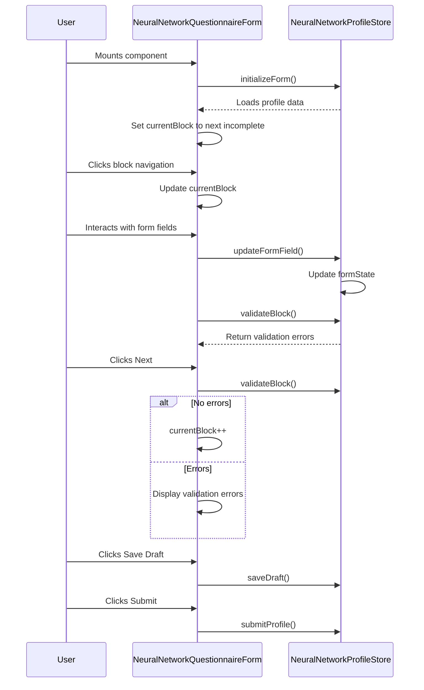

# Profile Page Redesign

<cite>
**Referenced Files in This Document**   
- [ProfilePage.vue](file://src/pages/ProfilePage.vue) - *Updated in recent commit*
- [ProfileHeader.vue](file://src/components/profile/ProfileHeader.vue) - *Updated in recent commit*
- [ProfileOverview.vue](file://src/components/profile/ProfileOverview.vue)
- [NeuralNetworkQuestionnaireForm.vue](file://src/components/profile/NeuralNetworkQuestionnaireForm.vue)
- [SpecializationsBlock.vue](file://src/components/profile/neural-network/SpecializationsBlock.vue)
- [SuperpowerBlock.vue](file://src/components/profile/neural-network/SuperpowerBlock.vue)
- [ContactSection.vue](file://src/components/profile/ContactSection.vue)
- [PortfolioSection.vue](file://src/components/profile/PortfolioSection.vue)
</cite>

## Update Summary
**Changes Made**   
- Updated layout structure in ProfilePage.vue to use flexbox with avatar on the left
- Enhanced avatar display with increased size and improved styling
- Updated ProfileHeader.vue with new visual hierarchy and responsive design
- Added new Profile Actions section with interactive cards
- Improved visual hierarchy through typography and spacing adjustments
- Updated source tracking with annotations for modified files

## Table of Contents
1. [Introduction](#introduction)
2. [Project Structure](#project-structure)
3. [Core Components](#core-components)
4. [Architecture Overview](#architecture-overview)
5. [Detailed Component Analysis](#detailed-component-analysis)
6. [Dependency Analysis](#dependency-analysis)
7. [Performance Considerations](#performance-considerations)
8. [Troubleshooting Guide](#troubleshooting-guide)
9. [Conclusion](#conclusion)

## Introduction
The Profile Page Redesign initiative aims to enhance user experience, improve visual hierarchy, and implement modern UI patterns across the Maya Platform. This comprehensive documentation details the transformation of the profile page, focusing on layout improvements, flexbox implementation, avatar enhancement, and overall visual hierarchy. The redesign introduces a more professional appearance, better information organization, and improved user engagement through interactive elements and responsive design.

## Project Structure
The profile page components are organized within the `src/components/profile` directory, following a modular architecture that separates concerns between different aspects of the profile interface. The structure includes dedicated components for various profile sections and specialized questionnaire blocks for neural network specialists.

**Diagram sources**
- [ProfilePage.vue](file://src/pages/ProfilePage.vue)
- [NeuralNetworkProfilePage.vue](file://src/pages/NeuralNetworkProfilePage.vue)
- [ProfileHeader.vue](file://src/components/profile/ProfileHeader.vue)
- [NeuralNetworkQuestionnaireForm.vue](file://src/components/profile/NeuralNetworkQuestionnaireForm.vue)

**Section sources**
- [ProfilePage.vue](file://src/pages/ProfilePage.vue)
- [NeuralNetworkProfilePage.vue](file://src/pages/NeuralNetworkProfilePage.vue)

## Core Components
The profile page redesign centers around several core components that work together to create a cohesive user experience. The main ProfilePage.vue serves as the container for the user's personal profile, while ProfileHeader.vue and ProfileOverview.vue provide enhanced visual elements and summary information. For specialists, the NeuralNetworkQuestionnaireForm.vue orchestrates a multi-step form experience for completing their professional profile.

The redesign emphasizes user identity through an enhanced avatar display with visual indicators for status and activity. Information hierarchy is improved through strategic use of typography, spacing, and color coding. Interactive elements provide clear calls to action while maintaining visual consistency across the platform.

**Section sources**
- [ProfilePage.vue](file://src/pages/ProfilePage.vue#L1-L365)
- [ProfileHeader.vue](file://src/components/profile/ProfileHeader.vue#L1-L269)
- [ProfileOverview.vue](file://src/components/profile/ProfileOverview.vue#L1-L334)

## Architecture Overview
The profile page architecture follows a component-based design pattern with clear separation of concerns. The main ProfilePage.vue component serves as the entry point, coordinating the display of various profile sections. Data flows from the user store and neural network profile store to the presentation components through props and computed properties.

**Diagram sources**
- [ProfilePage.vue](file://src/pages/ProfilePage.vue#L1-L365)
- [ProfileHeader.vue](file://src/components/profile/ProfileHeader.vue#L1-L269)
- [ProfileOverview.vue](file://src/components/profile/ProfileOverview.vue#L1-L334)

## Detailed Component Analysis

### Profile Header Analysis
The ProfileHeader component represents a significant visual upgrade from the previous design, implementing a gradient background with glass morphism effects and enhanced avatar presentation.

**Diagram sources**
- [ProfileHeader.vue](file://src/components/profile/ProfileHeader.vue#L1-L269)

**Section sources**
- [ProfileHeader.vue](file://src/components/profile/ProfileHeader.vue#L1-L269)

#### Key Implementation Details
- **Gradient Background**: Implements a linear gradient from blue to purple with overlay patterns for depth
- **Avatar Enhancement**: Larger avatar size with border and shadow effects, plus status indicator
- **Responsive Design**: Adapts layout and sizing across mobile, tablet, and desktop breakpoints
- **Glass Morphism**: Uses backdrop blur and transparency for modern visual effect
- **Status Indicators**: Visual cues for user availability and activity status

The header uses flexbox for layout with responsive breakpoints that adjust the flex direction from column to row. The avatar section includes a status indicator in the bottom-right corner that changes color based on availability (green for available, yellow for busy, red for unavailable).

### Profile Overview Analysis
The ProfileOverview component provides a summary dashboard of the specialist's profile metrics and key information.

**Diagram sources**
- [ProfileOverview.vue](file://src/components/profile/ProfileOverview.vue#L1-L334)

**Section sources**
- [ProfileOverview.vue](file://src/components/profile/ProfileOverview.vue#L1-L334)

#### Key Implementation Details
- **Quick Stats Grid**: Three-column layout displaying counts of specializations, abilities, and services
- **Skills Overview**: Displays top specializations and abilities with expandable view
- **Services Overview**: Shows top services with pricing information and expandable view
- **Quick Actions**: Buttons that scroll to specific sections of the profile
- **Responsive Grid**: Adapts from three-column to single-column layout on smaller screens

The component uses computed properties to manage the display state of skills and services, allowing users to expand and view all items. The quick actions section includes scroll-to-section functionality that smoothly navigates to different parts of the profile page.

### Neural Network Questionnaire Form Analysis
The NeuralNetworkQuestionnaireForm component implements a multi-step form for specialists to complete their professional profile.

**Diagram sources**
- [NeuralNetworkQuestionnaireForm.vue](file://src/components/profile/NeuralNetworkQuestionnaireForm.vue#L1-L282)

**Section sources**
- [NeuralNetworkQuestionnaireForm.vue](file://src/components/profile/NeuralNetworkQuestionnaireForm.vue#L1-L282)

#### Key Implementation Details
- **Progress Tracking**: Shows completion percentage and progress bar
- **Block Navigation**: Tab-like interface for navigating between form sections
- **Validation System**: Real-time validation with visual feedback
- **Auto-save**: Tracks last auto-save time
- **Conditional Navigation**: Validates current block before allowing progression

The form is divided into eight blocks, each focusing on a different aspect of the specialist's profile. The navigation system highlights completed blocks with green indicators and the current block with a blue background. Validation occurs when moving between blocks or when specific fields change.

### Specializations Block Analysis
The SpecializationsBlock component allows specialists to select their areas of expertise.

**Diagram sources**
- [SpecializationsBlock.vue](file://src/components/profile/neural-network/SpecializationsBlock.vue#L1-L226)

**Section sources**
- [SpecializationsBlock.vue](file://src/components/profile/neural-network/SpecializationsBlock.vue#L1-L226)

#### Key Implementation Details
- **Checkbox Grid**: Responsive grid of specialization options with visual selection feedback
- **Custom Specializations**: Ability to add custom specializations not in the predefined list
- **Selection Limits**: Enforces maximum of 8 total specializations
- **Validation**: Real-time validation with error messages and selection counter
- **Visual Feedback**: Selected items have blue background and border

The component uses a two-column grid layout on medium screens and above, switching to single column on smaller screens. Each specialization option includes a label and optional description. The custom specializations section allows dynamic addition and removal of entries.

### Superpower Block Analysis
The SuperpowerBlock component captures the specialist's unique value proposition.

**Diagram sources**
- [SuperpowerBlock.vue](file://src/components/profile/neural-network/SuperpowerBlock.vue#L1-L144)

**Section sources**
- [SuperpowerBlock.vue](file://src/components/profile/neural-network/SuperpowerBlock.vue#L1-L144)

#### Key Implementation Details
- **Character Limit**: 200-character limit with real-time counter
- **Quality Guidance**: Visual feedback based on character count (red for too short, green for optimal, yellow for approaching limit, red for too long)
- **Validation Rules**: Minimum 10 characters, required field
- **Examples Section**: Shows good examples of effective superpower statements
- **Tips Section**: Provides guidance on creating compelling descriptions

The component provides extensive guidance to help specialists craft an effective value proposition. The character counter changes color based on quality thresholds, and examples demonstrate effective approaches.

### Contact Section Analysis
The ContactSection component displays the specialist's contact information with interactive actions.

**Diagram sources**
- [ContactSection.vue](file://src/components/profile/ContactSection.vue#L1-L184)

**Section sources**
- [ContactSection.vue](file://src/components/profile/ContactSection.vue#L1-L184)

#### Key Implementation Details
- **Hover Actions**: Action buttons appear on hover for each contact method
- **Direct Actions**: Open contact in external app or copy to clipboard
- **Precomposed Emails**: Email links include pre-filled subject and body
- **Telegram Integration**: Handles both @username and direct links
- **Visual Icons**: Color-coded icons for different contact methods

The component uses a clean, card-based layout with hover effects that reveal action buttons. Each contact method has a distinctive colored icon (blue for Telegram, red for email, green for website). The hover actions provide immediate access to communication channels without leaving the platform.

### Portfolio Section Analysis
The PortfolioSection component displays the specialist's work samples in a grid layout.

**Diagram sources**
- [PortfolioSection.vue](file://src/components/profile/PortfolioSection.vue#L1-L35)

**Section sources**
- [PortfolioSection.vue](file://src/components/profile/PortfolioSection.vue#L1-L35)

#### Key Implementation Details
- **Responsive Grid**: Two-column layout on medium screens and above, single column on mobile
- **Case Study Cards**: Each portfolio item includes title, description, and result
- **Extensible Design**: Designed to support additional fields like images and links
- **Consistent Styling**: Matches the overall profile design language

The component uses a simple but effective layout to showcase the specialist's work. The design allows for expansion with additional media and interactive elements in future iterations.

## Dependency Analysis
The profile page components have well-defined dependencies that follow the principle of separation of concerns. The main ProfilePage.vue component depends on the user store for authentication and user data, while the neural network questionnaire components depend on the neural network profile store for form state management.

**Diagram sources**
- [ProfilePage.vue](file://src/pages/ProfilePage.vue#L1-L365)
- [ProfileHeader.vue](file://src/components/profile/ProfileHeader.vue#L1-L269)
- [NeuralNetworkQuestionnaireForm.vue](file://src/components/profile/NeuralNetworkQuestionnaireForm.vue#L1-L282)
- [ContactSection.vue](file://src/components/profile/ContactSection.vue#L1-L184)

**Section sources**
- [ProfilePage.vue](file://src/pages/ProfilePage.vue#L1-L365)
- [NeuralNetworkQuestionnaireForm.vue](file://src/components/profile/NeuralNetworkQuestionnaireForm.vue#L1-L282)

## Performance Considerations
The profile page redesign maintains good performance characteristics through several optimization strategies:

- **Lazy Loading**: Components are loaded only when needed
- **Efficient Re-renders**: Computed properties minimize unnecessary re-renders
- **Event Delegation**: Minimizes event listeners
- **Optimized Images**: Avatar images are properly sized and cached
- **Conditional Rendering**: Components render only when their data is available

The use of computed properties for derived data (like completion percentages and validation states) ensures that expensive calculations are only performed when dependencies change. The component structure avoids deep nesting that could impact rendering performance.

## Troubleshooting Guide
When encountering issues with the profile page components, consider the following common problems and solutions:

**Section sources**
- [ProfilePage.vue](file://src/pages/ProfilePage.vue#L1-L365)
- [ProfileHeader.vue](file://src/components/profile/ProfileHeader.vue#L1-L269)
- [NeuralNetworkQuestionnaireForm.vue](file://src/components/profile/NeuralNetworkQuestionnaireForm.vue#L1-L282)

### Common Issues and Solutions
1. **Profile Data Not Loading**
   - Verify user is authenticated and userStore.currentUser is populated
   - Check network requests for profile data
   - Ensure proper initialization of neuralNetworkProfileStore

2. **Form Validation Not Working**
   - Confirm that validateBlock methods are properly implemented
   - Check that validation errors are being emitted to the parent component
   - Verify that form state updates are triggering reactivity

3. **Responsive Layout Issues**
   - Check Tailwind CSS classes for correct breakpoints
   - Verify that viewport meta tag is present in index.html
   - Test on actual devices if emulator behavior differs

4. **Avatar Not Displaying**
   - Confirm avatar URL is correctly formatted
   - Check that image server is accessible
   - Verify fallback initials are generated correctly

5. **Navigation Actions Not Working**
   - Ensure Vue Router is properly configured
   - Check that route paths match defined routes
   - Verify that navigation guards are not blocking access

## Conclusion
The Profile Page Redesign successfully enhances the user experience through improved visual hierarchy, modern design patterns, and better information organization. The implementation of flexbox layouts ensures responsive behavior across devices, while the enhanced avatar and status indicators strengthen user identity. The modular component architecture allows for maintainable code and future extensibility.

Key improvements include:
- Professional gradient header with glass morphism effects
- Enhanced avatar presentation with status indicators
- Clear visual hierarchy through typography and spacing
- Intuitive multi-step questionnaire for specialists
- Interactive elements with meaningful feedback
- Responsive design that adapts to all screen sizes

The redesign balances aesthetic improvements with functional enhancements, creating a more engaging and user-friendly profile experience while maintaining the platform's professional character.