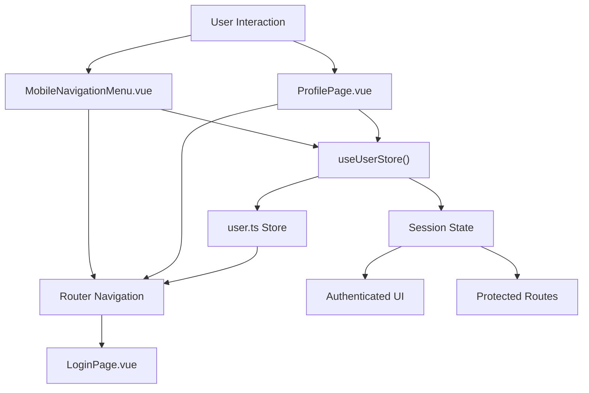
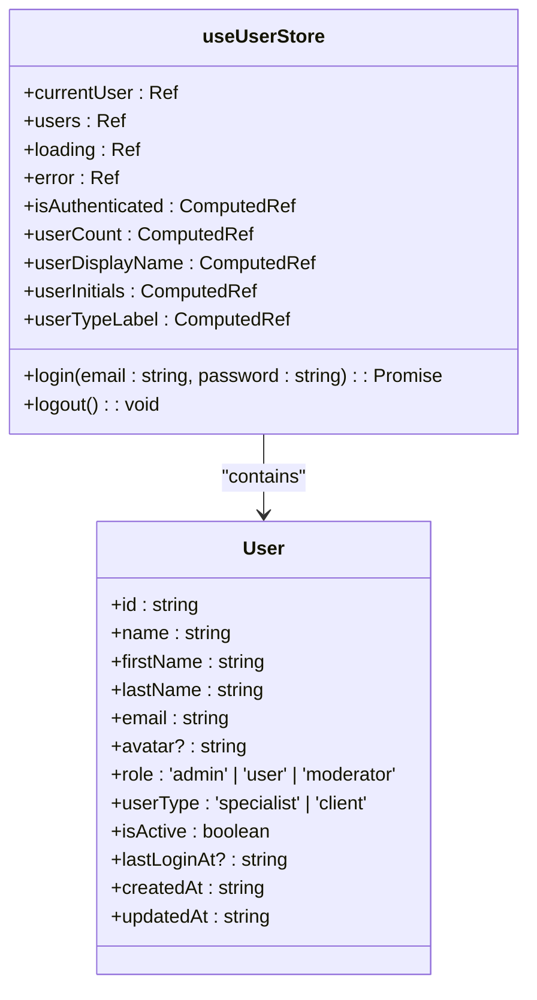
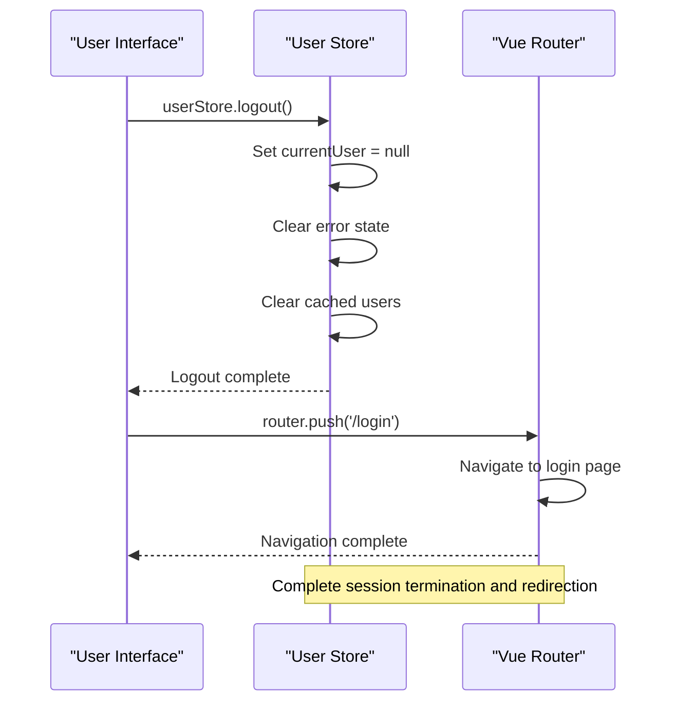
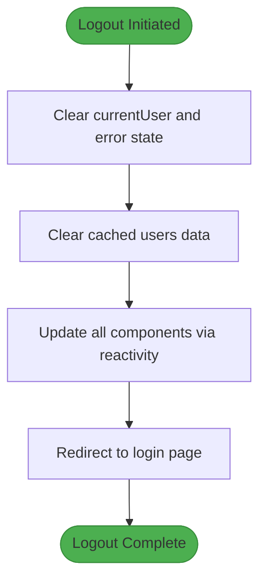

# Profile Page User Store Integration

<cite>
**Referenced Files in This Document**   
- [user.ts](file://src/stores/user.ts#L1-L97) - *Updated in recent commit*
- [ProfilePage.vue](file://src/pages/ProfilePage.vue#L1-L387) - *Updated in recent commit*
- [MobileNavigationMenu.vue](file://src/components/common/MobileNavigationMenu.vue#L66-L121)
- [router/index.ts](file://src/router/index.ts#L15-L84)
- [LoginPage.vue](file://src/pages/LoginPage.vue#L1-L144)
</cite>

## Update Summary
**Changes Made**   
- Updated documentation to reflect new computed properties in ProfilePage.vue
- Added details about user display name and initials computation
- Enhanced state management section with new reactive patterns
- Updated logout implementation details to match current code
- Added clarification on user type labels and display logic

## Table of Contents
1. [Introduction](#introduction)
2. [Project Structure](#project-structure)
3. [Core Components](#core-components)
4. [Architecture Overview](#architecture-overview)
5. [Detailed Component Analysis](#detailed-component-analysis)
6. [Logout Implementation and Navigation Flow](#logout-implementation-and-navigation-flow)
7. [State Management Patterns](#state-management-patterns)
8. [Error Handling and Session Termination](#error-handling-and-session-termination)
9. [Redirection Patterns](#redirection-patterns)
10. [Conclusion](#conclusion)

## Introduction
This document provides a comprehensive analysis of the Profile Page User Store Integration within the MayaWork frontend application. It focuses on the logout implementation, state management patterns, navigation flow, error handling, session termination, and redirection mechanisms. The documentation is designed to be accessible to both technical and non-technical stakeholders while providing in-depth insights into the codebase.

## Project Structure
The project follows a feature-based organization with clearly defined directories for components, pages, stores, and services. The key directories relevant to this documentation are:
- `src/pages`: Contains page-level components including ProfilePage.vue and LoginPage.vue
- `src/stores`: Houses Pinia stores for state management, particularly user.ts
- `src/components`: Includes reusable UI components like MobileNavigationMenu.vue
- `src/router`: Manages application routing and navigation guards

```mermaid
graph TB
subgraph "Pages"
ProfilePage["ProfilePage.vue"]
LoginPage["LoginPage.vue"]
end
subgraph "Stores"
UserStore["user.ts"]
end
subgraph "Components"
MobileNav["MobileNavigationMenu.vue"]
end
subgraph "Router"
Router["index.ts"]
end
ProfilePage --> UserStore
LoginPage --> UserStore
MobileNav --> UserStore
Router --> UserStore
ProfilePage --> Router
MobileNav --> Router
```

**Diagram sources**
- [ProfilePage.vue](file://src/pages/ProfilePage.vue)
- [user.ts](file://src/stores/user.ts)
- [MobileNavigationMenu.vue](file://src/components/common/MobileNavigationMenu.vue)
- [router/index.ts](file://src/router/index.ts)

**Section sources**
- [ProfilePage.vue](file://src/pages/ProfilePage.vue)
- [user.ts](file://src/stores/user.ts)

## Core Components
The core components involved in the Profile Page User Store Integration are:
- **User Store (user.ts)**: Centralized state management for user authentication and profile data
- **Profile Page (ProfilePage.vue)**: Primary interface for user profile management and logout functionality
- **Mobile Navigation Menu (MobileNavigationMenu.vue)**: Secondary interface providing logout capability on mobile devices
- **Router (index.ts)**: Handles navigation flow and route protection

These components work together to manage user sessions, display profile information, and handle logout operations.

**Section sources**
- [user.ts](file://src/stores/user.ts#L1-L97)
- [ProfilePage.vue](file://src/pages/ProfilePage.vue#L1-L387)

## Architecture Overview
The application follows a Vue 3 composition API pattern with Pinia for state management. The architecture is component-driven with clear separation of concerns between presentation (components), state (stores), and navigation (router). Authentication state is centralized in the user store, which is consumed by various components throughout the application.



**Diagram sources**
- [user.ts](file://src/stores/user.ts#L1-L97)
- [ProfilePage.vue](file://src/pages/ProfilePage.vue#L1-L387)
- [MobileNavigationMenu.vue](file://src/components/common/MobileNavigationMenu.vue#L66-L121)
- [router/index.ts](file://src/router/index.ts#L15-L84)

## Detailed Component Analysis

### User Store Analysis
The user store implements a centralized state management pattern using Pinia, providing reactive user state across the application.



**Diagram sources**
- [user.ts](file://src/stores/user.ts#L1-L97)
- [types/index.ts](file://src/types/index.ts#L1-L75)

**Section sources**
- [user.ts](file://src/stores/user.ts#L1-L97)

## Logout Implementation and Navigation Flow
The logout functionality is implemented through a coordinated flow between the user interface, state management store, and router. Two primary interfaces trigger logout: the Profile Page and the Mobile Navigation Menu.



**Diagram sources**
- [user.ts](file://src/stores/user.ts#L85-L95)
- [ProfilePage.vue](file://src/pages/ProfilePage.vue#L370-L385)
- [MobileNavigationMenu.vue](file://src/components/common/MobileNavigationMenu.vue#L108-L121)

**Section sources**
- [user.ts](file://src/stores/user.ts#L85-L95)
- [ProfilePage.vue](file://src/pages/ProfilePage.vue#L370-L385)

## State Management Patterns
The application uses Pinia for state management with a reactive store pattern. The user store maintains several key state properties:

**State Properties:**
- `currentUser`: Reactive reference to the currently authenticated user
- `users`: Array of users for potential future use
- `loading`: Boolean flag indicating authentication state
- `error`: String value for error messages

**Computed Properties:**
- `isAuthenticated`: Derived from currentUser presence
- `userDisplayName`: Formatted full name using firstName and lastName
- `userInitials`: First letters of first and last name
- `userTypeLabel`: Translated user type label (Specialist/Client)

The store follows Vue 3's composition API pattern with `ref` for reactive state and `computed` for derived state. This pattern ensures that components automatically update when state changes. The computed properties `userDisplayName` and `userInitials` are now implemented in both the user store and ProfilePage.vue for consistent display across the application.

**Section sources**
- [user.ts](file://src/stores/user.ts#L1-L97)
- [ProfilePage.vue](file://src/pages/ProfilePage.vue#L350-L365)

## Error Handling and Session Termination
The logout implementation includes robust error handling and complete session termination:

**Error Handling:**
- The logout method itself does not throw errors but clears any existing error state
- Try-catch blocks are used in the login method to handle authentication failures
- Error messages are stored in the user store for display in the UI

**Session Termination:**
- `currentUser` is set to null, immediately invalidating authentication
- Error state is cleared to prevent carryover to the next session
- Cached user data is cleared to prevent data leakage
- The operation is synchronous, ensuring immediate state change

The logout process is designed to be fail-safe, with no possibility of partial logout states. Even if navigation fails, the authentication state is already terminated.



**Diagram sources**
- [user.ts](file://src/stores/user.ts#L85-L95)
- [ProfilePage.vue](file://src/pages/ProfilePage.vue#L370-L385)

**Section sources**
- [user.ts](file://src/stores/user.ts#L85-L95)

## Redirection Patterns
The application implements consistent redirection patterns after logout:

**Primary Redirection Flow:**
1. User triggers logout from Profile Page or Mobile Navigation Menu
2. User store logout method is called
3. Router pushes to '/login' route
4. Navigation guard allows access to login page

**Route Configuration:**
- Login route: `/login` with meta flag `hideForAuth`
- Navigation guards prevent authenticated users from accessing login
- After logout, users can always access the login page

**Secondary Considerations:**
- No redirect parameter is passed after logout (unlike login which accepts redirect)
- The pattern ensures users always return to the login page after logout
- Mobile navigation menu also emits a 'close' event after logout to close the menu

**Section sources**
- [router/index.ts](file://src/router/index.ts#L15-L84)
- [ProfilePage.vue](file://src/pages/ProfilePage.vue#L370-L385)
- [MobileNavigationMenu.vue](file://src/components/common/MobileNavigationMenu.vue#L108-L121)

## Conclusion
The Profile Page User Store Integration demonstrates a well-architected approach to authentication state management and logout functionality. Key strengths include:
- Centralized state management with Pinia
- Reactive data binding across components
- Clean separation of concerns between UI and state
- Robust session termination with complete state cleanup
- Consistent redirection patterns
- Comprehensive error handling

The implementation follows Vue 3 best practices and provides a reliable user experience for authentication workflows. The recent updates have enhanced user display capabilities with computed properties for display name and initials in both the store and profile page. Future enhancements could include logout confirmation dialogs or analytics tracking for logout events, but the current implementation is solid and production-ready.