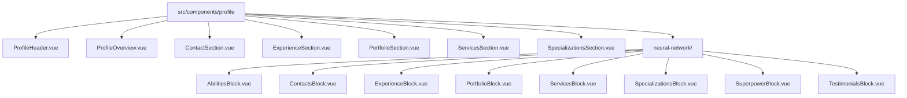
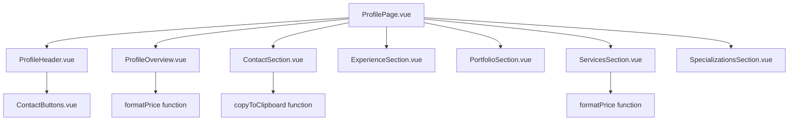
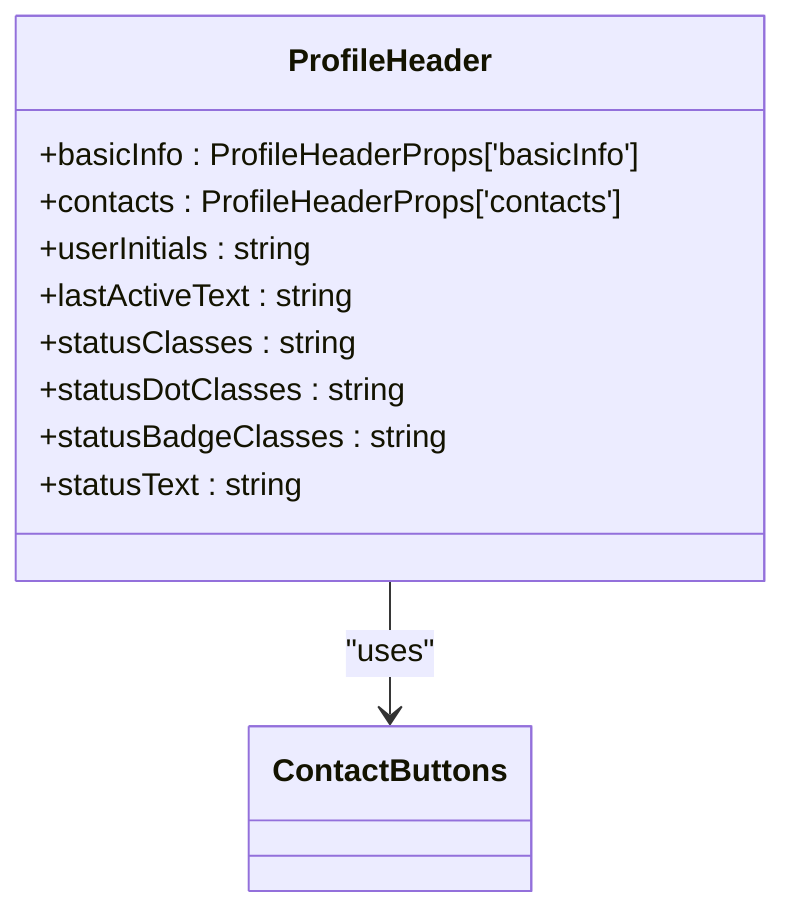
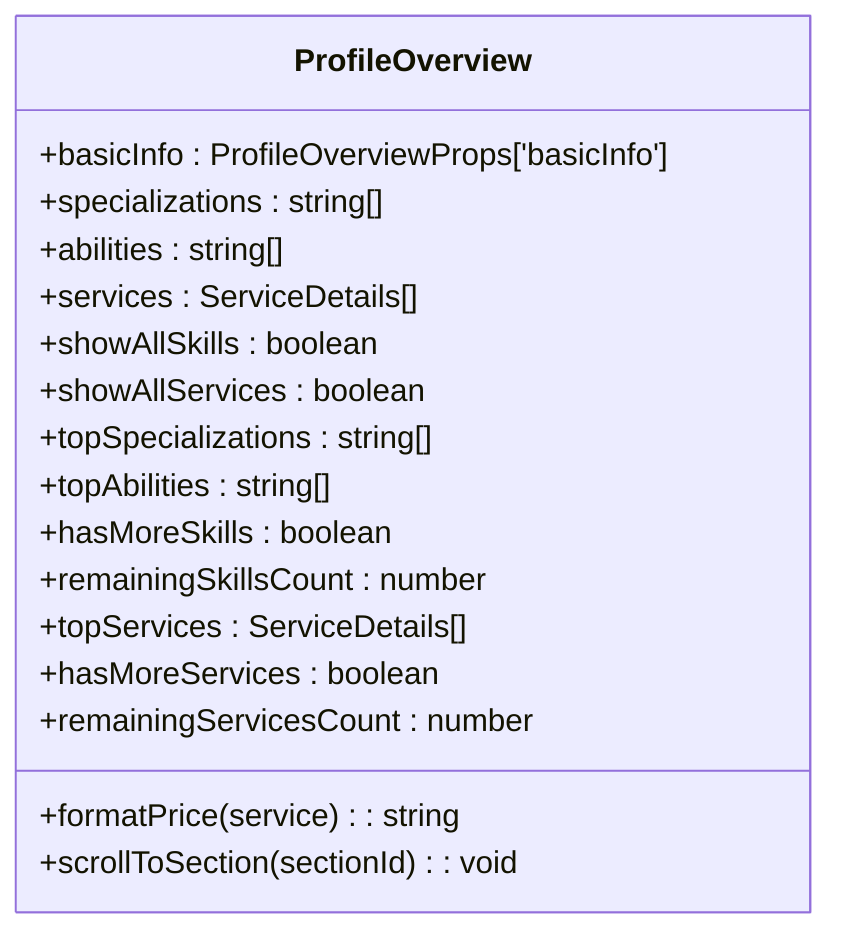
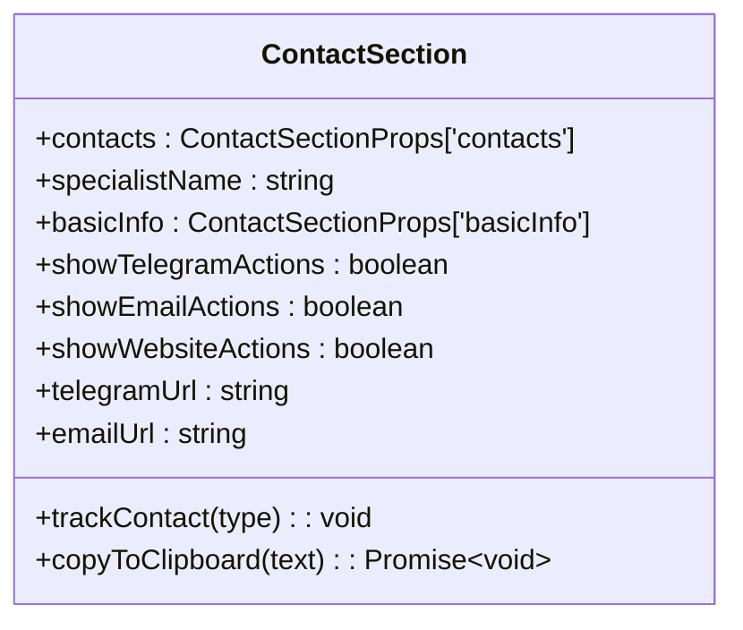
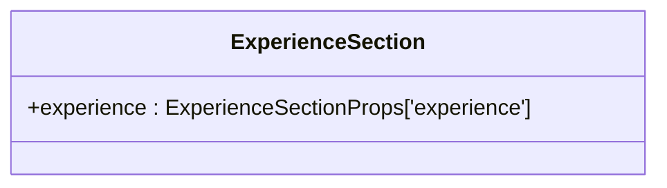
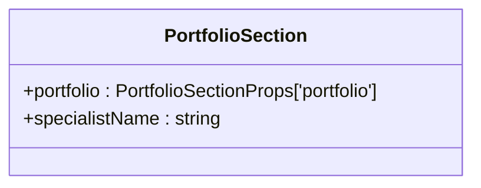
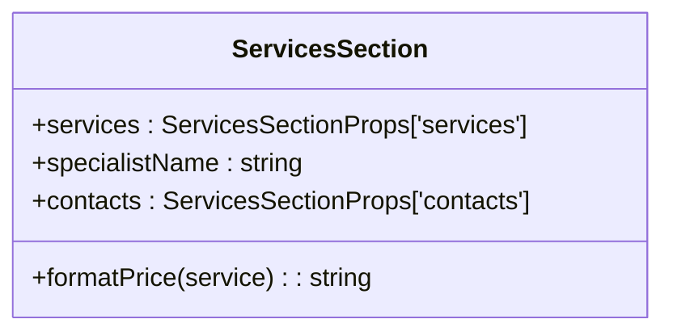
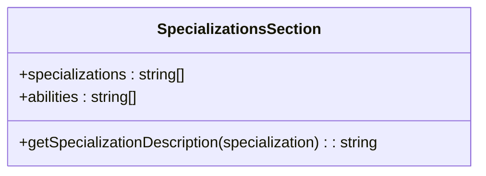
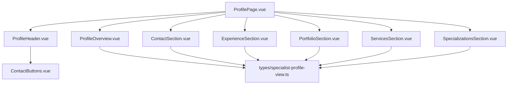

# Profile Section Components

<cite>
**Referenced Files in This Document**   
- [ProfilePage.vue](file://src/pages/ProfilePage.vue)
- [ProfileHeader.vue](file://src/components/profile/ProfileHeader.vue) - *Updated in recent commit*
- [ProfileOverview.vue](file://src/components/profile/ProfileOverview.vue)
- [ContactSection.vue](file://src/components/profile/ContactSection.vue)
- [ExperienceSection.vue](file://src/components/profile/ExperienceSection.vue)
- [PortfolioSection.vue](file://src/components/profile/PortfolioSection.vue)
- [ServicesSection.vue](file://src/components/profile/ServicesSection.vue)
- [SpecializationsSection.vue](file://src/components/profile/SpecializationsSection.vue)
- [SpecialistProfileViewPage.vue](file://src/pages/SpecialistProfileViewPage.vue)
- [specialist-profile-view.ts](file://src/types/specialist-profile-view.ts)
</cite>

## Update Summary
**Changes Made**   
- Updated ProfileHeader component documentation to reflect layout redesign and enhanced avatar display
- Added information about responsive behavior and visual improvements in ProfileHeader
- Updated diagram sources to reflect changes in ProfileHeader.vue
- Enhanced source tracking with annotations for updated files
- Maintained all other sections as they remain accurate with current implementation

## Table of Contents
1. [Introduction](#introduction)
2. [Project Structure](#project-structure)
3. [Core Components](#core-components)
4. [Architecture Overview](#architecture-overview)
5. [Detailed Component Analysis](#detailed-component-analysis)
6. [Dependency Analysis](#dependency-analysis)
7. [Performance Considerations](#performance-considerations)
8. [Troubleshooting Guide](#troubleshooting-guide)
9. [Conclusion](#conclusion)

## Introduction
This document provides comprehensive documentation for the profile section components in the Maya Platform frontend application. It details the purpose, props, usage patterns, and composition of components that form the complete profile view. The documentation includes implementation examples and styling customization options, making it accessible to both technical and non-technical users.

## Project Structure
The profile section components are organized within the `src/components/profile` directory, with a clear separation between high-level sections and specialized blocks. The structure follows a feature-based organization pattern, grouping related components together.

**Diagram sources**
- [ProfileHeader.vue](file://src/components/profile/ProfileHeader.vue)
- [ProfileOverview.vue](file://src/components/profile/ProfileOverview.vue)
- [ContactSection.vue](file://src/components/profile/ContactSection.vue)
- [ExperienceSection.vue](file://src/components/profile/ExperienceSection.vue)
- [PortfolioSection.vue](file://src/components/profile/PortfolioSection.vue)
- [ServicesSection.vue](file://src/components/profile/ServicesSection.vue)
- [SpecializationsSection.vue](file://src/components/profile/SpecializationsSection.vue)

**Section sources**
- [ProfileHeader.vue](file://src/components/profile/ProfileHeader.vue)
- [ProfileOverview.vue](file://src/components/profile/ProfileOverview.vue)

## Core Components
The profile section consists of several core components that work together to display a specialist's profile information. These components include the ProfileHeader, ProfileOverview, ContactSection, ExperienceSection, PortfolioSection, ServicesSection, and SpecializationsSection. Each component is designed to be reusable and composable, allowing for flexible profile layouts.

**Section sources**
- [ProfileHeader.vue](file://src/components/profile/ProfileHeader.vue#L1-L269) - *Updated in recent commit*
- [ProfileOverview.vue](file://src/components/profile/ProfileOverview.vue#L1-L335)

## Architecture Overview
The profile section architecture follows a modular component-based design pattern. The main ProfilePage.vue serves as the container that orchestrates the composition of individual profile components. Data flows from the parent component to child components through props, with each component responsible for rendering specific aspects of the profile.

**Diagram sources**
- [ProfilePage.vue](file://src/pages/ProfilePage.vue#L1-L188)
- [ProfileHeader.vue](file://src/components/profile/ProfileHeader.vue#L1-L269) - *Updated in recent commit*
- [ProfileOverview.vue](file://src/components/profile/ProfileOverview.vue#L1-L335)
- [ContactSection.vue](file://src/components/profile/ContactSection.vue#L1-L185)
- [ExperienceSection.vue](file://src/components/profile/ExperienceSection.vue#L1-L35)
- [PortfolioSection.vue](file://src/components/profile/PortfolioSection.vue#L1-L36)
- [ServicesSection.vue](file://src/components/profile/ServicesSection.vue#L1-L60)
- [SpecializationsSection.vue](file://src/components/profile/SpecializationsSection.vue#L1-L148)

## Detailed Component Analysis

### ProfileHeader Component Analysis
The ProfileHeader component displays the specialist's basic information at the top of the profile page, including avatar, name, superpower, status, and contact actions. The component has been redesigned with enhanced avatar styling, improved layout structure, and better responsive behavior.

**Diagram sources**
- [ProfileHeader.vue](file://src/components/profile/ProfileHeader.vue#L1-L269) - *Updated in recent commit*

**Section sources**
- [ProfileHeader.vue](file://src/components/profile/ProfileHeader.vue#L1-L269) - *Updated in recent commit*

### ProfileOverview Component Analysis
The ProfileOverview component provides a summary of the specialist's profile with quick stats, key skills, services overview, and quick action buttons.

**Diagram sources**
- [ProfileOverview.vue](file://src/components/profile/ProfileOverview.vue#L1-L335)

**Section sources**
- [ProfileOverview.vue](file://src/components/profile/ProfileOverview.vue#L1-L335)

### ContactSection Component Analysis
The ContactSection component displays the specialist's contact information with interactive actions for copying to clipboard or opening external links.

**Diagram sources**
- [ContactSection.vue](file://src/components/profile/ContactSection.vue#L1-L185)

**Section sources**
- [ContactSection.vue](file://src/components/profile/ContactSection.vue#L1-L185)

### ExperienceSection Component Analysis
The ExperienceSection component displays the specialist's work experience with client information, tasks, and results.

**Diagram sources**
- [ExperienceSection.vue](file://src/components/profile/ExperienceSection.vue#L1-L35)

**Section sources**
- [ExperienceSection.vue](file://src/components/profile/ExperienceSection.vue#L1-L35)

### PortfolioSection Component Analysis
The PortfolioSection component displays the specialist's portfolio cases with titles, descriptions, and results.

**Diagram sources**
- [PortfolioSection.vue](file://src/components/profile/PortfolioSection.vue#L1-L36)

**Section sources**
- [PortfolioSection.vue](file://src/components/profile/PortfolioSection.vue#L1-L36)

### ServicesSection Component Analysis
The ServicesSection component displays the specialist's services with pricing information and descriptions.

**Diagram sources**
- [ServicesSection.vue](file://src/components/profile/ServicesSection.vue#L1-L60)

**Section sources**
- [ServicesSection.vue](file://src/components/profile/ServicesSection.vue#L1-L60)

### SpecializationsSection Component Analysis
The SpecializationsSection component displays the specialist's specializations and abilities with descriptions and visual indicators.

**Diagram sources**
- [SpecializationsSection.vue](file://src/components/profile/SpecializationsSection.vue#L1-L148)

**Section sources**
- [SpecializationsSection.vue](file://src/components/profile/SpecializationsSection.vue#L1-L148)

## Dependency Analysis
The profile section components have a clear dependency hierarchy, with the ProfilePage.vue serving as the parent component that composes all other profile components. The components depend on type definitions from the types/specialist-profile-view module and use shared UI components like ContactButtons.

**Diagram sources**
- [ProfilePage.vue](file://src/pages/ProfilePage.vue#L1-L188)
- [ProfileHeader.vue](file://src/components/profile/ProfileHeader.vue#L1-L269) - *Updated in recent commit*
- [ProfileOverview.vue](file://src/components/profile/ProfileOverview.vue#L1-L335)
- [ContactSection.vue](file://src/components/profile/ContactSection.vue#L1-L185)
- [ExperienceSection.vue](file://src/components/profile/ExperienceSection.vue#L1-L35)
- [PortfolioSection.vue](file://src/components/profile/PortfolioSection.vue#L1-L36)
- [ServicesSection.vue](file://src/components/profile/ServicesSection.vue#L1-L60)
- [SpecializationsSection.vue](file://src/components/profile/SpecializationsSection.vue#L1-L148)
- [types/specialist-profile-view.ts](file://src/types/specialist-profile-view.ts)

**Section sources**
- [ProfilePage.vue](file://src/pages/ProfilePage.vue#L1-L188)
- [types/specialist-profile-view.ts](file://src/types/specialist-profile-view.ts)

## Performance Considerations
The profile section components are optimized for performance with several key considerations:
- Computed properties are used extensively to avoid redundant calculations
- Event listeners are properly scoped to prevent memory leaks
- Images are loaded with appropriate sizing to minimize bandwidth usage
- Hover effects use CSS transitions rather than JavaScript for smooth animations
- The components use Vue's reactivity system efficiently with minimal re-renders

## Troubleshooting Guide
Common issues and solutions for the profile section components:

**Section sources**
- [ProfileHeader.vue](file://src/components/profile/ProfileHeader.vue#L1-L269) - *Updated in recent commit*
- [ProfileOverview.vue](file://src/components/profile/ProfileOverview.vue#L1-L335)
- [ContactSection.vue](file://src/components/profile/ContactSection.vue#L1-L185)

## Conclusion
The profile section components in the Maya Platform frontend application provide a comprehensive and modular system for displaying specialist profiles. The components are well-structured, reusable, and follow Vue.js best practices. They offer a rich user experience with interactive elements, responsive design, and clear information architecture. The separation of concerns between components makes the codebase maintainable and extensible for future enhancements.