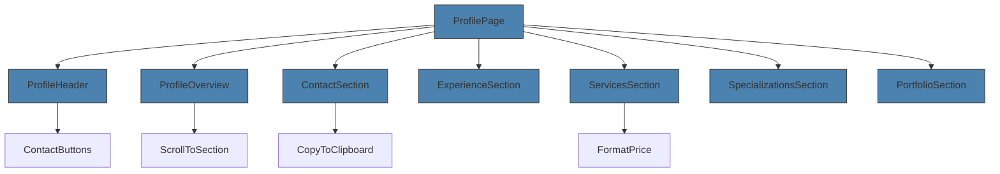
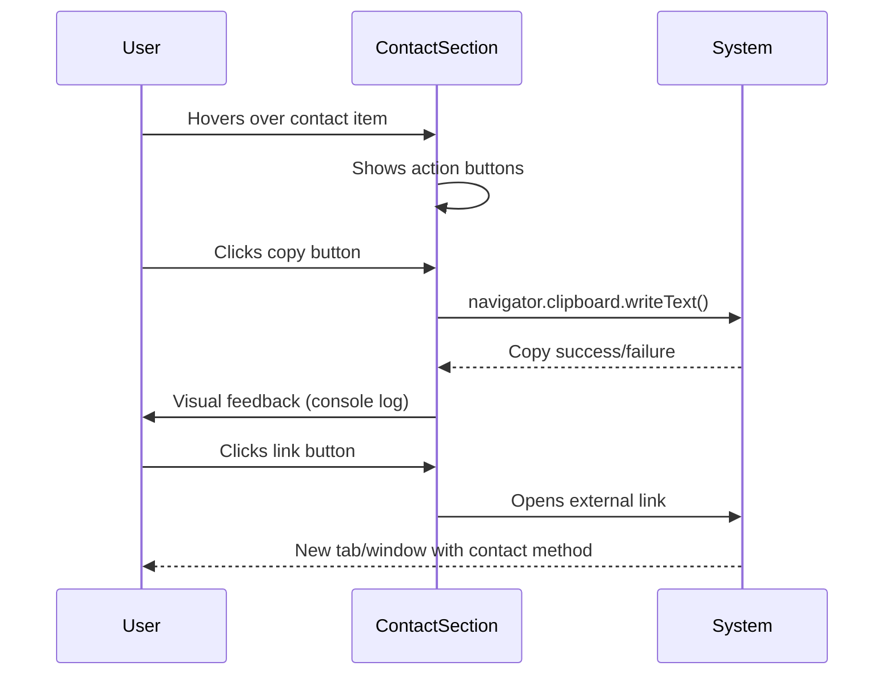
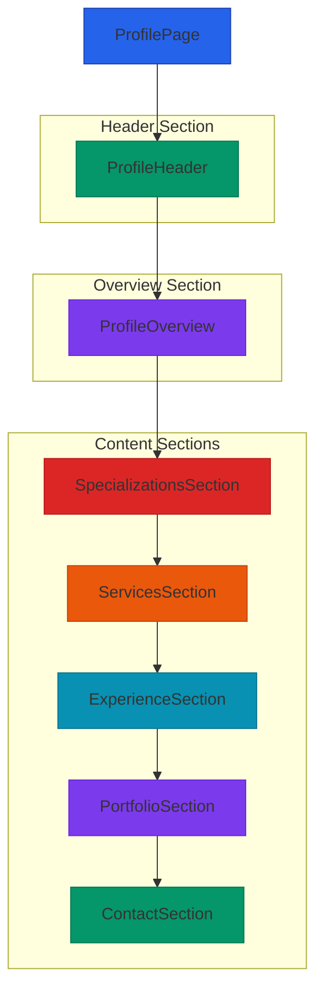

# Profile View Components

<cite>
**Referenced Files in This Document**   
- [ProfileHeader.vue](file://src/components/profile/ProfileHeader.vue#L1-L259) - *Updated in recent commit*
- [ProfileOverview.vue](file://src/components/profile/ProfileOverview.vue#L1-L335)
- [ContactSection.vue](file://src/components/profile/ContactSection.vue#L1-L185)
- [ExperienceSection.vue](file://src/components/profile/ExperienceSection.vue#L1-L35)
- [ServicesSection.vue](file://src/components/profile/ServicesSection.vue#L1-L60)
- [SpecializationsSection.vue](file://src/components/profile/SpecializationsSection.vue#L1-L148)
- [PortfolioSection.vue](file://src/components/profile/PortfolioSection.vue#L1-L36)
- [specialist-profile-view.ts](file://src/types/specialist-profile-view.ts#L1-L100)
</cite>

## Update Summary
**Changes Made**   
- Updated ProfileHeader component documentation to reflect avatar styling and layout redesign
- Added new "Open to Offers" indicator feature in ProfileHeader
- Updated status text and last active time formatting in ProfileHeader
- Enhanced source tracking with updated file annotations
- Maintained all other sections as they remain accurate

## Table of Contents
1. [Introduction](#introduction)
2. [Core Components Overview](#core-components-overview)
3. [ProfileHeader Component](#profileheader-component)
4. [ProfileOverview Component](#profileoverview-component)
5. [ContactSection Component](#contactsection-component)
6. [ExperienceSection Component](#experiencesection-component)
7. [ServicesSection Component](#servicessection-component)
8. [SpecializationsSection Component](#specializationssection-component)
9. [PortfolioSection Component](#portfoliocomponent)
10. [Component Composition and Integration](#component-composition-and-integration)

## Introduction
The Profile View Components form the core UI structure for displaying specialist profiles within the Maya Platform. These components are designed to present comprehensive information about specialists in a structured, visually appealing, and user-friendly manner. The system follows a modular architecture where each component handles a specific aspect of the profile, allowing for flexible composition and reuse across different views.

The components leverage Vue 3's Composition API with TypeScript support, ensuring type safety and maintainable code. They are styled using Tailwind CSS with dark mode support and responsive design principles. The components work together to create a cohesive profile experience that includes basic information, skills overview, contact details, services, experience, and portfolio.

**Section sources**
- [ProfileHeader.vue](file://src/components/profile/ProfileHeader.vue#L1-L259) - *Updated in recent commit*
- [ProfileOverview.vue](file://src/components/profile/ProfileOverview.vue#L1-L335)

## Core Components Overview
The profile view is composed of several key components that work together to display specialist information:

- **ProfileHeader**: Displays the specialist's avatar, name, superpower, status, and primary contact actions
- **ProfileOverview**: Provides a summary of key statistics, skills, services, and quick navigation actions
- **ContactSection**: Shows contact information with interactive actions (copy, open)
- **ExperienceSection**: Displays work experience cases
- **ServicesSection**: Lists available services with pricing information
- **SpecializationsSection**: Shows specializations and abilities with descriptions
- **PortfolioSection**: Displays portfolio cases

These components share a consistent design language with card-based layouts, proper spacing, and responsive behavior. They are designed to be composable and can be used individually or together in a profile page.



**Diagram sources**
- [ProfileHeader.vue](file://src/components/profile/ProfileHeader.vue#L1-L259) - *Updated in recent commit*
- [ProfileOverview.vue](file://src/components/profile/ProfileOverview.vue#L1-L335)
- [ContactSection.vue](file://src/components/profile/ContactSection.vue#L1-L185)
- [ExperienceSection.vue](file://src/components/profile/ExperienceSection.vue#L1-L35)
- [ServicesSection.vue](file://src/components/profile/ServicesSection.vue#L1-L60)
- [SpecializationsSection.vue](file://src/components/profile/SpecializationsSection.vue#L1-L148)
- [PortfolioSection.vue](file://src/components/profile/PortfolioSection.vue#L1-L36)

**Section sources**
- [ProfileHeader.vue](file://src/components/profile/ProfileHeader.vue#L1-L259) - *Updated in recent commit*
- [ProfileOverview.vue](file://src/components/profile/ProfileOverview.vue#L1-L335)
- [ContactSection.vue](file://src/components/profile/ContactSection.vue#L1-L185)

## ProfileHeader Component

The ProfileHeader component displays the specialist's primary information at the top of the profile page. It features a gradient background with decorative elements and presents key information in a clean, visually appealing layout.

### Props Interface
```typescript
interface ProfileHeaderProps {
  basicInfo: {
    displayName: string
    superpower: string
    lastActive: string
    status: 'available' | 'busy' | 'unavailable'
    isOpenToOffers?: boolean
    avatarUrl?: string
  }
  contacts: {
    telegram?: string
    email?: string
    website?: string
  }
}
```

### Key Features
- **Avatar Display**: Shows the specialist's avatar with fallback to initials if no image is available, with enhanced styling and responsive sizing
- **Status Indicator**: Visual status indicator with color coding (green = available, yellow = busy, red = unavailable) and improved positioning
- **Responsive Design**: Adapts layout for mobile and desktop views with optimized spacing
- **Contact Actions**: Integrated ContactButtons component for quick communication
- **Gradient Background**: Modern gradient background with subtle patterns and decorative elements
- **Open to Offers Indicator**: New feature that displays when a specialist is open to new project offers

### Styling and Customization
The component uses Tailwind CSS classes for styling with several customization options:

```html
<!-- Example with custom styling -->
<ProfileHeader 
  :basicInfo="specialistInfo" 
  :contacts="specialistContacts"
  class="bg-gradient-to-r from-indigo-600 to-purple-600"
/>
```

The component can be customized by:
- Modifying the gradient colors in the `bg-gradient-to-r` classes
- Adjusting avatar size by changing the `w-24 h-24` classes
- Changing text colors by updating the `text-white` classes
- Customizing the status badge appearance through the computed `statusBadgeClasses`
- Adding or removing the "Open to Offers" indicator by setting the `isOpenToOffers` property in basicInfo

**Section sources**
- [ProfileHeader.vue](file://src/components/profile/ProfileHeader.vue#L1-L259) - *Updated in recent commit*

## ProfileOverview Component

The ProfileOverview component provides a concise summary of the specialist's profile, including key statistics, skills, services, and quick action buttons.

### Props Interface
```typescript
interface ProfileOverviewProps {
  basicInfo: {
    displayName: string
  }
  specializations: string[]
  abilities: string[]
  services: ServiceDetails[]
}

interface ServiceDetails {
  name: string
  description?: string
  price: number | string
  priceType: 'hourly' | 'project' | 'fixed' | 'negotiable'
}
```

### Key Features
- **Statistics Grid**: Displays counts of specializations, abilities, and services
- **Skills Overview**: Shows top specializations and abilities with expandable view
- **Services Preview**: Displays top services with pricing information
- **Quick Actions**: Navigation buttons that scroll to specific sections
- **Price Formatting**: Automatically formats prices based on type (hourly, project, etc.)

### Usage Patterns
The component is designed to be placed immediately after the ProfileHeader and serves as a "table of contents" for the profile:

```html
<ProfileOverview 
  :basicInfo="specialist.basicInfo"
  :specializations="specialist.specializations"
  :abilities="specialist.abilities"
  :services="specialist.services"
/>
```

### Styling and Customization
The component uses a card-based design with several customization options:

```html
<!-- Customized with additional classes -->
<ProfileOverview 
  :basicInfo="info"
  :specializations="specs"
  :abilities="abilities"
  :services="services"
  class="border-l-4 border-blue-500"
/>
```

Customization options include:
- Changing card colors by modifying the `bg-blue-50`, `bg-green-50`, etc. classes
- Adjusting spacing by changing the `gap-6`, `mb-8` classes
- Modifying button styles by updating the `bg-blue-600`, `hover:bg-blue-700` classes
- Customizing the responsive behavior by adjusting the `md:grid-cols-3` breakpoint

**Section sources**
- [ProfileOverview.vue](file://src/components/profile/ProfileOverview.vue#L1-L335)

## ContactSection Component

The ContactSection component displays the specialist's contact information with interactive actions for each contact method.

### Props Interface
```typescript
interface ContactSectionProps {
  contacts: {
    telegram?: string
    email?: string
    website?: string
  }
  specialistName: string
  basicInfo: {
    displayName: string
  }
}
```

### Key Features
- **Hover Actions**: Action buttons appear on hover for each contact method
- **Copy to Clipboard**: Allows users to copy contact information
- **Direct Links**: Provides direct links to open Telegram, email, or websites
- **Pre-filled Email**: Email links include pre-filled subject and body
- **Visual Icons**: Color-coded icons for different contact methods

### Interaction Flow


**Diagram sources**
- [ContactSection.vue](file://src/components/profile/ContactSection.vue#L1-L185)

### Styling and Customization
The component uses a clean, card-based design with several customization options:

```html
<!-- Example with custom styling -->
<ContactSection 
  :contacts="specialist.contacts"
  :specialistName="specialist.basicInfo.displayName"
  :basicInfo="specialist.basicInfo"
  class="shadow-lg rounded-xl"
/>
```

Customization options include:
- Changing icon colors by modifying the `bg-blue-500`, `bg-red-500` classes
- Adjusting hover effect timing by changing the `transition-colors` classes
- Modifying the action button appearance by updating the `bg-white`, `shadow-md` classes
- Customizing the responsive behavior by adjusting the `space-x-3`, `space-y-4` classes

**Section sources**
- [ContactSection.vue](file://src/components/profile/ContactSection.vue#L1-L185)

## ExperienceSection Component

The ExperienceSection component displays the specialist's work experience in a clean, card-based layout.

### Props Interface
```typescript
interface ExperienceSectionProps {
  experience: {
    id: string
    client: string
    task: string
    result: string
  }[]
}
```

### Key Features
- **Card Layout**: Each experience is displayed in a separate card
- **Structured Information**: Clear separation of client, task, and result
- **Responsive Design**: Grid layout adapts to screen size
- **Minimal Styling**: Clean design that focuses on content

### Usage Example
```html
<ExperienceSection :experience="specialist.experience"/>
```

The component expects an array of experience objects, each containing:
- **id**: Unique identifier for the experience
- **client**: Name of the client or company
- **task**: Description of the work performed
- **result**: Outcome or impact of the work

### Styling and Customization
The component uses a simple card-based design that can be easily customized:

```html
<!-- Customized with additional classes -->
<ExperienceSection 
  :experience="experience"
  class="bg-gradient-to-b from-gray-50 to-white dark:from-gray-800 dark:to-gray-900"
/>
```

Customization options include:
- Changing card background by modifying the `bg-gray-50`, `dark:bg-gray-700` classes
- Adjusting spacing by changing the `space-y-6`, `p-6` classes
- Modifying text colors by updating the `text-gray-900`, `dark:text-white` classes
- Customizing the responsive behavior by adjusting the `md:grid-cols-2` classes

**Section sources**
- [ExperienceSection.vue](file://src/components/profile/ExperienceSection.vue#L1-L35)

## ServicesSection Component

The ServicesSection component displays the specialist's available services with pricing information.

### Props Interface
```typescript
interface ServicesSectionProps {
  services: {
    name: string
    description?: string
    price: number | string
    priceType: 'hourly' | 'project' | 'fixed' | 'negotiable'
  }[]
  specialistName: string
  contacts: {
    telegram?: string
    email?: string
    website?: string
  }
}
```

### Key Features
- **Price Formatting**: Automatically formats prices based on type
- **Currency Support**: Handles Russian ruble (₽) formatting
- **Grid Layout**: Responsive grid that adapts to screen size
- **Service Details**: Includes name, description, and price for each service

### Price Formatting Logic
The component includes a `formatPrice` method that handles different pricing models:

```typescript
const formatPrice = (service: ServiceDetails): string => {
  if (typeof service.price === 'string') {
    return service.price
  }

  const formattedPrice = service.price.toLocaleString('ru-RU')

  switch (service.priceType) {
    case 'hourly':
      return `${formattedPrice} ₽/час`
    case 'project':
      return `${formattedPrice} ₽/проект`
    case 'fixed':
      return `${formattedPrice} ₽`
    case 'negotiable':
      return 'Договорная'
    default:
      return `${formattedPrice} ₽`
  }
}
```

### Usage and Customization
```html
<ServicesSection 
  :services="specialist.services"
  :specialistName="specialist.basicInfo.displayName"
  :contacts="specialist.contacts"
/>
```

The component can be customized by:
- Changing card colors by modifying the `bg-gray-50`, `dark:bg-gray-700` classes
- Adjusting price text color by updating the `text-purple-600`, `dark:text-purple-400` classes
- Modifying grid behavior by changing the `md:grid-cols-2`, `gap-6` classes
- Customizing the responsive breakpoints by adjusting the Tailwind classes

**Section sources**
- [ServicesSection.vue](file://src/components/profile/ServicesSection.vue#L1-L60)

## SpecializationsSection Component

The SpecializationsSection component displays the specialist's specializations and abilities in a structured format.

### Props Interface
```typescript
interface SpecializationsSectionProps {
  specializations: string[]
  abilities: string[]
}
```

### Key Features
- **Dual Section Layout**: Separates specializations and abilities
- **Icon Integration**: Uses SVG icons to visually distinguish sections
- **Description Support**: Provides descriptions for specializations
- **Interactive Tags**: Ability tags have hover effects
- **Responsive Grid**: Specializations displayed in a responsive grid

### Specialization Descriptions
The component includes a `getSpecializationDescription` method that provides contextual descriptions:

```typescript
const getSpecializationDescription = (specialization: string): string => {
  const descriptions: Record<string, string> = {
    'Нейроассистенты (AI-боты)': 'Создание умных чат-ботов и виртуальных помощников',
    'Нейроворонки (продажи + автоматизация)': 'Автоматизация процессов продаж с помощью ИИ',
    'Контент с помощью нейросетей': 'Генерация текстового и визуального контента',
    // ... other descriptions
  }
  
  return descriptions[specialization] || 'Экспертиза в данной области'
}
```

### Visual Design
The component uses a card-based design for specializations and tag-based design for abilities:

```html
<SpecializationsSection 
  :specializations="specialist.specializations"
  :abilities="specialist.abilities"
/>
```

Customization options include:
- Changing specialization card colors by modifying the `bg-blue-50`, `border-blue-200` classes
- Adjusting ability tag colors by updating the `bg-green-100`, `text-green-800` classes
- Modifying icon colors by changing the `text-blue-500`, `text-green-500` classes
- Customizing hover effects by adjusting the `hover:bg-blue-100`, `transition-colors` classes

**Section sources**
- [SpecializationsSection.vue](file://src/components/profile/SpecializationsSection.vue#L1-L148)

## PortfolioSection Component

The PortfolioSection component displays the specialist's portfolio cases in a grid layout.

### Props Interface
```typescript
interface PortfolioSectionProps {
  portfolio: {
    id: string
    title: string
    description: string
    result: string
  }[]
  specialistName: string
}
```

### Key Features
- **Grid Layout**: Responsive grid that displays portfolio cases
- **Structured Information**: Clear separation of title, description, and result
- **Consistent Styling**: Matches the design language of other profile components
- **Minimal Interaction**: Focuses on content presentation

### Usage Example
```html
<PortfolioSection 
  :portfolio="specialist.portfolio"
  :specialistName="specialist.basicInfo.displayName"
/>
```

The component expects an array of portfolio objects, each containing:
- **id**: Unique identifier for the portfolio case
- **title**: Title of the portfolio case
- **description**: Detailed description of the work
- **result**: Outcome or impact of the project

### Styling and Customization
The component uses a simple card-based design that can be easily customized:

```html
<!-- Customized with additional classes -->
<PortfolioSection 
  :portfolio="portfolio"
  :specialistName="name"
  class="border-t-4 border-purple-500"
/>
```

Customization options include:
- Changing card background by modifying the `bg-gray-50`, `dark:bg-gray-700` classes
- Adjusting spacing by changing the `space-y-6`, `p-6` classes
- Modifying text colors by updating the `text-gray-900`, `dark:text-white` classes
- Customizing the responsive behavior by adjusting the `md:grid-cols-2`, `gap-6` classes

**Section sources**
- [PortfolioSection.vue](file://src/components/profile/PortfolioSection.vue#L1-L36)

## Component Composition and Integration

The profile components are designed to work together seamlessly to create a complete profile view. They follow a consistent design system and share common patterns for props, styling, and behavior.

### Complete Profile Layout


**Diagram sources**
- [ProfileHeader.vue](file://src/components/profile/ProfileHeader.vue#L1-L259) - *Updated in recent commit*
- [ProfileOverview.vue](file://src/components/profile/ProfileOverview.vue#L1-L335)
- [SpecializationsSection.vue](file://src/components/profile/SpecializationsSection.vue#L1-L148)
- [ServicesSection.vue](file://src/components/profile/ServicesSection.vue#L1-L60)
- [ExperienceSection.vue](file://src/components/profile/ExperienceSection.vue#L1-L35)
- [PortfolioSection.vue](file://src/components/profile/PortfolioSection.vue#L1-L36)
- [ContactSection.vue](file://src/components/profile/ContactSection.vue#L1-L185)

### Integration Example
```html
<template>
  <div class="profile-view container mx-auto px-4 py-8">
    <!-- Header with basic information -->
    <ProfileHeader 
      :basicInfo="specialist.basicInfo"
      :contacts="specialist.contacts"
    />
    
    <!-- Overview with key statistics -->
    <ProfileOverview 
      :basicInfo="specialist.basicInfo"
      :specializations="specialist.specializations"
      :abilities="specialist.abilities"
      :services="specialist.services"
      class="mt-8"
    />
    
    <!-- Content sections -->
    <div class="grid grid-cols-1 gap-8 mt-8">
      <SpecializationsSection 
        :specializations="specialist.specializations"
        :abilities="specialist.abilities"
      />
      
      <ServicesSection 
        :services="specialist.services"
        :specialistName="specialist.basicInfo.displayName"
        :contacts="specialist.contacts"
      />
      
      <ExperienceSection :experience="specialist.experience" />
      
      <PortfolioSection 
        :portfolio="specialist.portfolio"
        :specialistName="specialist.basicInfo.displayName"
      />
      
      <ContactSection 
        :contacts="specialist.contacts"
        :specialistName="specialist.basicInfo.displayName"
        :basicInfo="specialist.basicInfo"
      />
    </div>
  </div>
</template>
```

### Best Practices
1. **Consistent Data Flow**: Pass data from parent to child components in a predictable manner
2. **Type Safety**: Use TypeScript interfaces to ensure type safety across components
3. **Responsive Design**: Ensure all components work well on mobile and desktop
4. **Accessibility**: Maintain proper contrast ratios and semantic HTML
5. **Performance**: Use Vue's reactivity system efficiently, avoiding unnecessary computations

The components are designed to be reusable and can be composed in different ways depending on the specific use case, while maintaining a consistent user experience across the platform.

**Section sources**
- [ProfileHeader.vue](file://src/components/profile/ProfileHeader.vue#L1-L259) - *Updated in recent commit*
- [ProfileOverview.vue](file://src/components/profile/ProfileOverview.vue#L1-L335)
- [ContactSection.vue](file://src/components/profile/ContactSection.vue#L1-L185)
- [ExperienceSection.vue](file://src/components/profile/ExperienceSection.vue#L1-L35)
- [ServicesSection.vue](file://src/components/profile/ServicesSection.vue#L1-L60)
- [SpecializationsSection.vue](file://src/components/profile/SpecializationsSection.vue#L1-L148)
- [PortfolioSection.vue](file://src/components/profile/PortfolioSection.vue#L1-L36)