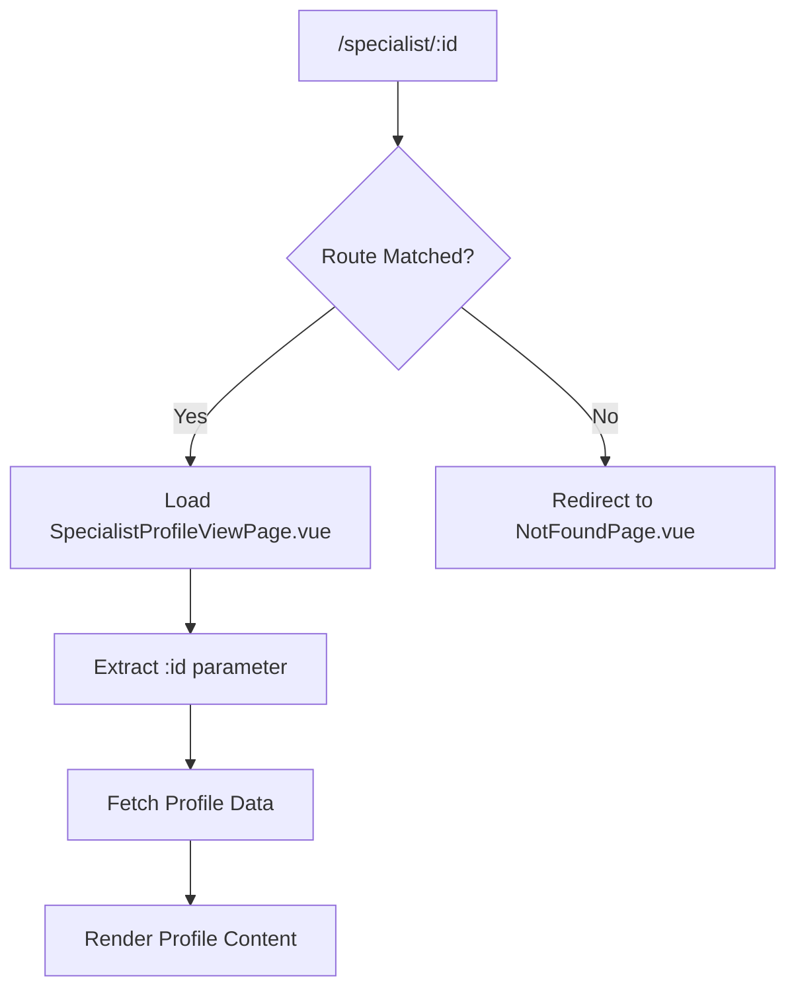
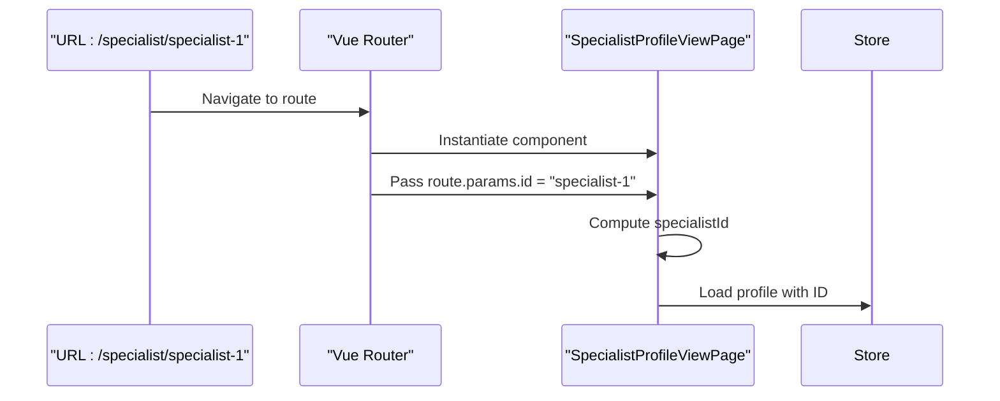
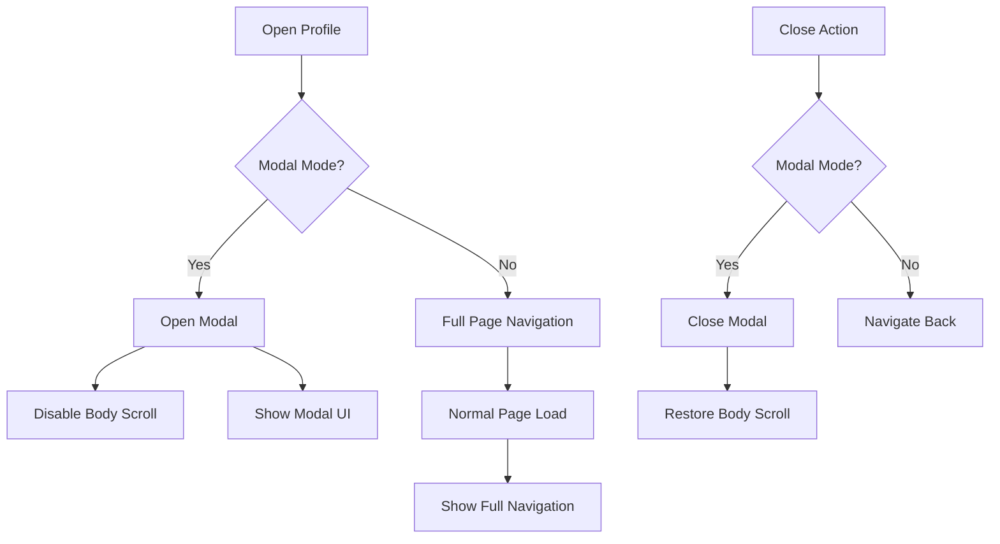
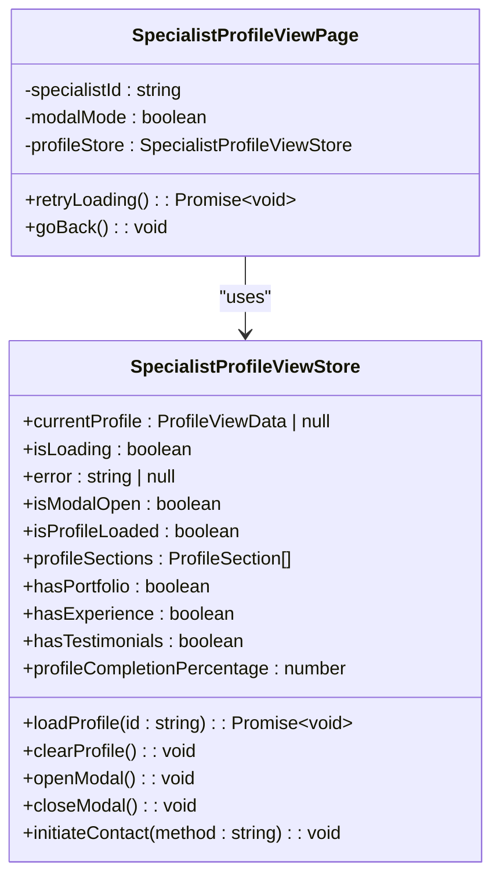
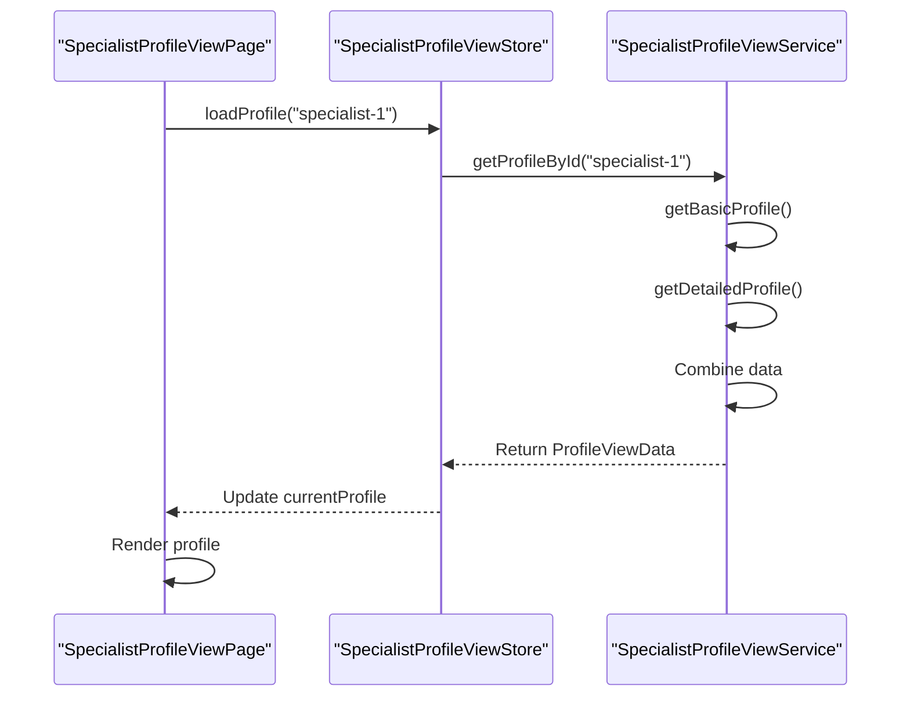
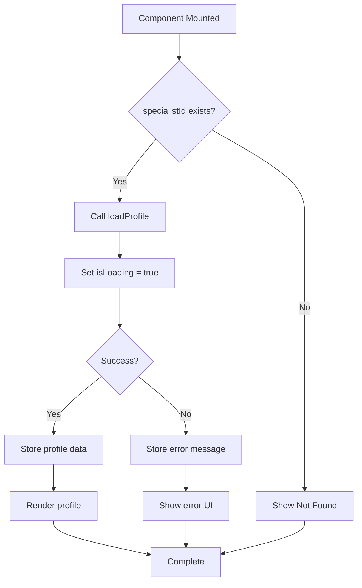
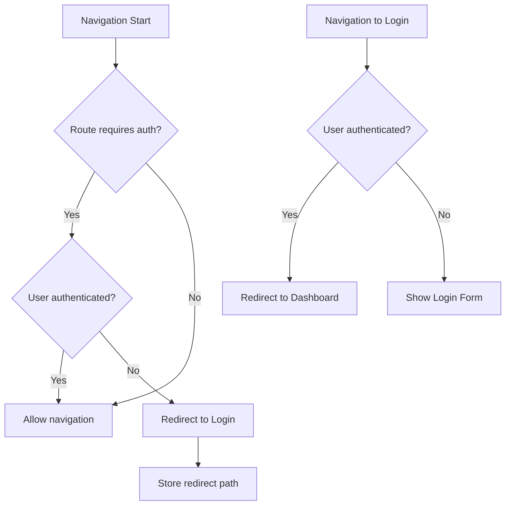

# Profile View Routing

<cite>
**Referenced Files in This Document**   
- [index.ts](file://src/router/index.ts#L1-L163)
- [SpecialistProfileViewPage.vue](file://src/pages/SpecialistProfileViewPage.vue#L1-L401)
- [specialist-profile-view.ts](file://src/stores/specialist-profile-view.ts#L1-L344)
- [specialist-profile-view.ts](file://src/services/specialist-profile-view.ts#L1-L470)
- [specialist-profile-view.ts](file://src/types/specialist-profile-view.ts#L1-L200)
</cite>

## Table of Contents
1. [Route Configuration](#route-configuration)
2. [Parameter Handling](#parameter-handling)
3. [Modal Navigation Patterns](#modal-navigation-patterns)
4. [Profile Store Integration](#profile-store-integration)
5. [Data Flow and Service Layer](#data-flow-and-service-layer)
6. [Error and Loading States](#error-and-loading-states)
7. [Navigation Guards and Route Protection](#navigation-guards-and-route-protection)

## Route Configuration

The profile view routing system is configured in the Vue Router instance located in `src/router/index.ts`. The route for viewing specialist profiles is defined with dynamic parameter support and proper metadata for authentication and page title handling.

The Specialist Profile route is configured as follows:
- **Path**: `/specialist/:id`
- **Name**: `SpecialistProfile`
- **Component**: `SpecialistProfileViewPage.vue`
- **Props**: Enabled to pass route parameters as component props
- **Meta**: Contains title and authentication requirements

This route allows users to access a specific specialist's public profile using their unique identifier in the URL path.



**Diagram sources**
- [index.ts](file://src/router/index.ts#L85-L95)
- [SpecialistProfileViewPage.vue](file://src/pages/SpecialistProfileViewPage.vue#L1-L401)

**Section sources**
- [index.ts](file://src/router/index.ts#L85-L95)

## Parameter Handling

The Specialist Profile route uses dynamic routing with parameter binding to handle specialist identification. The `:id` parameter in the route path captures the specialist's unique identifier from the URL.

In the `SpecialistProfileViewPage.vue` component, the parameter is accessed through both route parameters and component props:

```typescript
const specialistId = computed(() => {
  return props.specialistId || (route.params.id as string)
})
```

This implementation provides flexibility by allowing the component to receive the specialist ID either through:
1. Route parameter (`route.params.id`) - when accessed directly via URL
2. Component prop (`props.specialistId`) - when used in modal mode

The computed property ensures that the component can work in both navigation contexts while maintaining a single source of truth for the specialist identifier.



**Diagram sources**
- [SpecialistProfileViewPage.vue](file://src/pages/SpecialistProfileViewPage.vue#L100-L105)
- [index.ts](file://src/router/index.ts#L85-L95)

**Section sources**
- [SpecialistProfileViewPage.vue](file://src/pages/SpecialistProfileViewPage.vue#L100-L105)

## Modal Navigation Patterns

The Specialist Profile implementation supports both standalone page navigation and modal-based presentation through the `modalMode` prop. This dual-mode capability enables consistent profile viewing experiences across different application contexts.

When `modalMode` is enabled:
- The component is typically opened from another view (e.g., search results)
- Navigation back closes the modal instead of navigating to a different page
- Body scrolling is disabled to prevent background content movement
- UI elements like the back navigation bar are hidden

The modal state is managed through the store's `openModal()` and `closeModal()` actions, which also handle DOM-level changes like preventing body scroll:

```typescript
const goBack = (): void => {
  if (props.modalMode) {
    profileStore.closeModal()
  } else {
    // Normal navigation logic
    router.go(-1)
  }
}
```

Lifecycle hooks ensure proper modal state management:
- `onMounted`: Calls `openModal()` when in modal mode
- `onUnmounted`: Calls `closeModal()` to clean up and restore body scroll



**Diagram sources**
- [SpecialistProfileViewPage.vue](file://src/pages/SpecialistProfileViewPage.vue#L150-L170)
- [specialist-profile-view.ts](file://src/stores/specialist-profile-view.ts#L150-L170)

**Section sources**
- [SpecialistProfileViewPage.vue](file://src/pages/SpecialistProfileViewPage.vue#L150-L170)
- [specialist-profile-view.ts](file://src/stores/specialist-profile-view.ts#L150-L170)

## Profile Store Integration

The Specialist Profile View integrates with a dedicated Pinia store (`specialist-profile-view.ts`) to manage profile state, loading status, and user interactions. This store serves as the single source of truth for profile data throughout the application.

Key store properties:
- `currentProfile`: Stores the loaded profile data
- `isLoading`: Tracks loading state for UI feedback
- `error`: Captures any errors during profile loading
- `isModalOpen`: Manages modal presentation state

The component establishes a reactive connection to the store:

```typescript
const profileStore = useSpecialistProfileViewStore()
```

Upon component mount, it triggers profile loading:

```typescript
onMounted(async () => {
  if (specialistId.value) {
    await profileStore.loadProfile(specialistId.value)
  }
})
```

The store also provides computed properties that enhance the user experience:
- `hasPortfolio`: Determines if portfolio section should be displayed
- `hasExperience`: Controls experience section visibility
- `profileCompletionPercentage`: Shows profile completeness in the sidebar
- `profileSections`: Dynamically calculates visible sections based on data availability



**Diagram sources**
- [specialist-profile-view.ts](file://src/stores/specialist-profile-view.ts#L10-L344)
- [SpecialistProfileViewPage.vue](file://src/pages/SpecialistProfileViewPage.vue#L1-L401)

**Section sources**
- [specialist-profile-view.ts](file://src/stores/specialist-profile-view.ts#L10-L344)
- [SpecialistProfileViewPage.vue](file://src/pages/SpecialistProfileViewPage.vue#L1-L401)

## Data Flow and Service Layer

The profile data flow follows a clean architecture pattern, with the component accessing data through the store, which in turn uses a dedicated service layer for data retrieval.

The `SpecialistProfileViewService` class implements the `SpecialistProfileViewAPI` interface and handles all data operations:

1. **Data Aggregation**: Combines basic profile information (from search service) with detailed profile data
2. **Data Transformation**: Maps raw service data to UI-friendly structures
3. **Error Handling**: Wraps API calls with try-catch blocks and meaningful error messages
4. **Mock Data Support**: Contains mock profiles for development and demonstration

The `getProfileById` method orchestrates the data loading process:

```typescript
async getProfileById(id: string): Promise<ProfileViewData> {
  const [basicProfile, detailedProfile] = await Promise.all([
    this.getBasicProfile(id),
    this.getDetailedProfile(id)
  ])
  
  // Transform and combine data
  return profileViewData
}
```

This parallel execution optimizes loading performance by fetching basic and detailed profile information simultaneously.



**Diagram sources**
- [specialist-profile-view.ts](file://src/stores/specialist-profile-view.ts#L100-L130)
- [specialist-profile-view.ts](file://src/services/specialist-profile-view.ts#L1-L470)

**Section sources**
- [specialist-profile-view.ts](file://src/stores/specialist-profile-view.ts#L100-L130)
- [specialist-profile-view.ts](file://src/services/specialist-profile-view.ts#L1-L470)

## Error and Loading States

The Specialist Profile implementation includes comprehensive state management for various loading scenarios and error conditions.

Three primary states are handled in the component template:
1. **Loading State**: Displayed when `profileStore.isLoading` is true
2. **Error State**: Shown when `profileStore.error` contains a message
3. **Not Found State**: Rendered when no profile data is available

The loading state uses a dedicated `LoadingOverlay` component to provide visual feedback during data retrieval. The error state displays the specific error message and provides recovery options:

```vue
<div v-else-if="profileStore.error" class="min-h-screen flex items-center justify-center">
  <div class="text-center">
    <h1>Profile Loading Error</h1>
    <p>{{ profileStore.error }}</p>
    <button @click="retryLoading">Try Again</button>
    <button @click="goBack">Back</button>
  </div>
</div>
```

The `retryLoading` method allows users to attempt profile loading again without navigating away:

```typescript
const retryLoading = async (): Promise<void> => {
  await profileStore.loadProfile(specialistId.value)
}
```

For the not-found state, users are presented with a clear message and navigation option back to the search page.



**Diagram sources**
- [SpecialistProfileViewPage.vue](file://src/pages/SpecialistProfileViewPage.vue#L10-L80)
- [specialist-profile-view.ts](file://src/stores/specialist-profile-view.ts#L100-L130)

**Section sources**
- [SpecialistProfileViewPage.vue](file://src/pages/SpecialistProfileViewPage.vue#L10-L80)

## Navigation Guards and Route Protection

The routing configuration includes navigation guards to enforce authentication requirements and prevent unauthorized access to protected routes.

The `beforeEach` guard in `src/router/index.ts` implements two key security checks:

1. **Authentication Protection**: Prevents access to routes requiring authentication when the user is not logged in
2. **Redirect Logic**: Sends unauthenticated users to the login page with a redirect parameter

```typescript
router.beforeEach((to, from, next) => {
  const userStore = useUserStore()

  // Check if route requires authentication
  if (to.meta.requiresAuth && !userStore.isAuthenticated) {
    next({ name: 'Login', query: { redirect: to.fullPath } })
    return
  }

  // Redirect authenticated users away from login
  if (to.meta.hideForAuth && userStore.isAuthenticated) {
    next({ name: 'Dashboard' })
    return
  }

  next()
})
```

For the Specialist Profile route specifically:
- `requiresAuth: false` - The profile can be viewed by both authenticated and non-authenticated users
- No special redirect rules apply

The guard also handles the reverse scenario, preventing authenticated users from accessing the login page by redirecting them to the dashboard.

Additionally, the `afterEach` guard updates the document title based on the route meta information:

```typescript
router.afterEach(to => {
  const title = to.meta.title as string
  if (title) {
    document.title = `${title} | ${import.meta.env.VITE_APP_TITLE || 'Maya Platform'}`
  }
})
```

This ensures proper page titles for SEO and user experience, though the Specialist Profile route's title is currently in Russian ("Профиль специалиста") and may need localization.



**Diagram sources**
- [index.ts](file://src/router/index.ts#L130-L160)

**Section sources**
- [index.ts](file://src/router/index.ts#L130-L160)