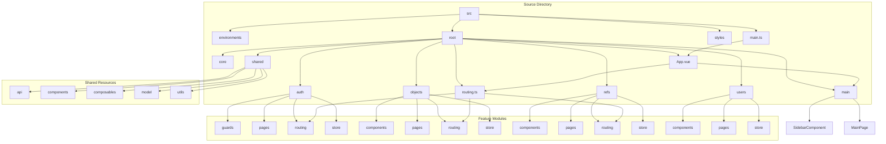
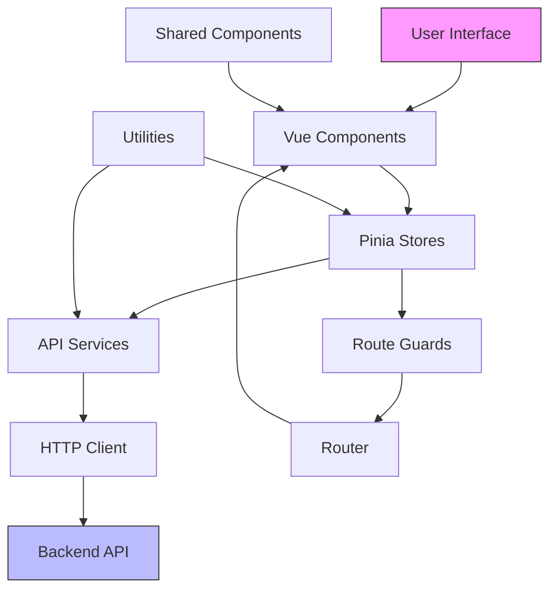
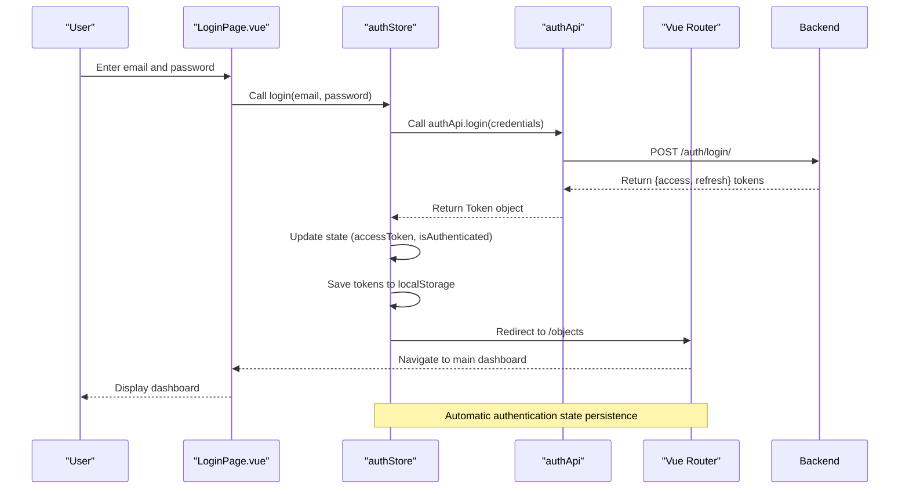

# Project Overview

<cite>
**Referenced Files in This Document**   
- [main.ts](file://src/main.ts)
- [routing.ts](file://src/root/routing.ts)
- [authStore.ts](file://src/root/auth/store/authStore.ts)
- [auth.routes.ts](file://src/root/auth/routing/auth.routes.ts)
- [authGuard.ts](file://src/root/auth/guards/authGuard.ts)
- [LoginPage.vue](file://src/root/auth/pages/LoginPage.vue)
- [authApi.ts](file://src/root/shared/api/authApi.ts)
- [store.interface.ts](file://src/root/shared/model/interface/auth/store.interface.ts)
- [forms.interface.ts](file://src/root/shared/model/interface/auth/forms.interface.ts)
- [auth.interface.ts](file://src/root/shared/model/interface/auth/auth.interface.ts)
- [App.vue](file://src/root/App.vue)
- [MainPage.vue](file://src/root/main/pages/MainPage.vue)
- [objects.routes.ts](file://src/root/objects/routing/objects.routes.ts)
- [refs.routes.ts](file://src/root/refs/routing/refs.routes.ts)
</cite>

## Table of Contents
1. [Project Overview](#project-overview)
2. [Project Structure](#project-structure)
3. [Core Components](#core-components)
4. [Architecture Overview](#architecture-overview)
5. [Authentication Flow](#authentication-flow)
6. [State Management](#state-management)
7. [Routing and Navigation](#routing-and-navigation)
8. [Shared Resources and Utilities](#shared-resources-and-utilities)
9. [System Context Diagram](#system-context-diagram)

## Project Structure

The **maya-platform-frontend** project is a construction project management dashboard built with modern frontend technologies. The application follows a modular, feature-based architecture with clear separation of concerns. The source code is organized under the `src` directory, which contains feature modules (`auth`, `objects`, `users`, `refs`), shared resources, core framework integrations, and global styles.

Key structural characteristics:
- **Feature modules**: Each major domain (e.g., auth, objects, users, refs) has its own directory with components, pages, routing, and store.
- **Shared resources**: Common components, APIs, models, and utilities are centralized in the `shared` module.
- **Core integrations**: Vue 3, Pinia, and HTTP client configurations are abstracted in the `core` directory.
- **Environment configuration**: Development, staging, and production settings are managed in the `environments` directory.



**Diagram sources**
- [main.ts](file://src/main.ts#L1-L15)
- [routing.ts](file://src/root/routing.ts#L1-L41)
- [App.vue](file://src/root/App.vue)

**Section sources**
- [main.ts](file://src/main.ts#L1-L15)
- [routing.ts](file://src/root/routing.ts#L1-L41)

## Core Components

The application is built on a modern tech stack:
- **Vue 3**: Composition API for reactive component development
- **TypeScript**: Strong typing for enhanced code quality and developer experience
- **Pinia**: State management with type-safe stores
- **Vite**: Fast development server and build tool
- **Naive UI**: Component library for consistent UI design

The core entry point `main.ts` initializes the Vue application, integrates Pinia for state management, and configures the Vue Router. This setup enables a scalable architecture where features can be developed and maintained independently.

```typescript
// src/main.ts
import './styles/main.scss'
import App from '@/root/App.vue'
import router from '@/root/routing'
import { createApp } from 'vue'
import { createPinia } from 'pinia'

const app = createApp(App)
app.use(createPinia())
app.use(router)
app.mount('#app')
```

The `App.vue` component serves as the root component, rendering the main layout and router view. The `MainPage.vue` provides the primary dashboard layout with navigation sidebar and content area.

**Section sources**
- [main.ts](file://src/main.ts#L1-L15)
- [App.vue](file://src/root/App.vue)
- [MainPage.vue](file://src/root/main/pages/MainPage.vue)

## Architecture Overview

The application follows a modular architecture with clear separation between concerns. The high-level architecture consists of:

1. **Presentation Layer**: Vue components that render the UI and handle user interactions
2. **State Management Layer**: Pinia stores that manage application state in a centralized manner
3. **Service Layer**: API services that handle HTTP communication with the backend
4. **Routing Layer**: Vue Router for navigation and URL management
5. **Core Infrastructure**: Shared utilities, interceptors, and configuration

The architecture enables role-based access control through route guards and centralized authentication state. Feature modules are self-contained with their own components, routes, and state management, promoting maintainability and scalability.



**Diagram sources**
- [main.ts](file://src/main.ts#L1-L15)
- [routing.ts](file://src/root/routing.ts#L1-L41)
- [authStore.ts](file://src/root/auth/store/authStore.ts#L1-L115)

## Authentication Flow

The authentication system implements secure user login with token-based authentication and automatic session persistence. The flow begins with the `LoginPage.vue` component, which collects user credentials and invokes the authentication service.



**Diagram sources**
- [LoginPage.vue](file://src/root/auth/pages/LoginPage.vue)
- [authStore.ts](file://src/root/auth/store/authStore.ts#L1-L115)
- [authApi.ts](file://src/root/shared/api/authApi.ts#L1-L31)

**Section sources**
- [LoginPage.vue](file://src/root/auth/pages/LoginPage.vue)
- [authStore.ts](file://src/root/auth/store/authStore.ts#L1-L115)
- [authApi.ts](file://src/root/shared/api/authApi.ts#L1-L31)

## State Management

The application uses Pinia for state management, providing a centralized store for authentication state and other domain data. The `authStore` manages user authentication state including access tokens, refresh tokens, and authentication status.

Key state properties:
- **accessToken**: JWT token for authenticated API requests
- **refreshTokenValue**: Token used to obtain new access tokens
- **isAuthenticated**: Boolean indicating current authentication status
- **isLoading**: Loading state during authentication operations
- **error**: Error message from failed authentication attempts

The store implements key actions:
- **login**: Authenticates user credentials and stores tokens
- **logout**: Clears authentication state and redirects to login
- **refreshToken**: Obtains new access token using refresh token
- **initFromStorage**: Restores authentication state from localStorage

```typescript
// src/root/shared/model/interface/auth/store.interface.ts
export interface AuthState {
  accessToken: Ref<string | null>
  refreshTokenValue: Ref<string | null>
  isAuthenticated: Ref<boolean>
  isLoading: Ref<boolean>
  error: Ref<string | null>
}

export interface AuthActions {
  login: (email: string, password: string) => Promise<void>
  logout: () => Promise<void>
  refreshToken: () => Promise<string | null>
  clearError: () => void
}
```

The store automatically initializes from localStorage on application startup, enabling persistent authentication across browser sessions.

**Section sources**
- [authStore.ts](file://src/root/auth/store/authStore.ts#L1-L115)
- [store.interface.ts](file://src/root/shared/model/interface/auth/store.interface.ts#L1-L17)

## Routing and Navigation

The application uses Vue Router for navigation with a hierarchical route structure. The main routing configuration in `routing.ts` defines the application's navigation structure with protected routes and route guards.

Key routing features:
- **Protected routes**: Most routes require authentication via `requiresAuth: true` meta flag
- **Route guards**: `authGuard` intercepts navigation to enforce authentication
- **Modular route registration**: Feature routes are imported and spread into the main route configuration
- **Automatic redirection**: Unmatched routes redirect to the main dashboard

```typescript
// src/root/routing.ts
const router = createRouter({
  history: createWebHistory(import.meta.env.BASE_URL),
  routes: [
    {
      path: '/',
      name: 'main',
      component: () => import('@main/pages/MainPage.vue'),
      meta: { requiresAuth: true },
      children: [
        { path: '', redirect: 'objects' },
        { path: 'users', name: 'users', component: () => import('@users/pages/UsersPage.vue') },
        ...objectsRoutes,
        ...refsRoutes,
      ],
    },
    ...authRoutes,
    { path: '/:catchAll(.*)', redirect: '/' },
  ],
})

router.beforeEach(authGuard)
```

The `authGuard` ensures that users must be authenticated to access protected routes, redirecting unauthenticated users to the login page.

**Section sources**
- [routing.ts](file://src/root/routing.ts#L1-L41)
- [authGuard.ts](file://src/root/auth/guards/authGuard.ts)

## Shared Resources and Utilities

The `shared` module contains reusable resources across the application:
- **API services**: Type-safe API clients for authentication, users, roles, customers, and reference data
- **Components**: Reusable UI components like modals, tables, and form elements
- **Composables**: Custom Vue composables for pagination, sidebar state, and other reusable logic
- **Models**: Type definitions and interfaces for domain entities
- **Utilities**: Helper functions for data transformation, validation, and formatting

The API services follow a consistent pattern, using the core HTTP client to make requests and returning typed responses. This approach ensures type safety and consistency across API interactions.

```typescript
// src/root/shared/api/authApi.ts
export function useAuthApi() {
  const baseUrl = 'auth'

  const login = async (credentials: LoginFormData): Promise<Token> => {
    const response = await http.post<Token>(`${baseUrl}/login/`, credentials)
    return response.data
  }

  return {
    login,
    logout,
    refreshToken,
  }
}
```

The model interfaces provide type safety for data structures:
- **LoginFormData**: { email: string, password: string }
- **Token**: { access: string, refresh: string }

**Section sources**
- [authApi.ts](file://src/root/shared/api/authApi.ts#L1-L31)
- [forms.interface.ts](file://src/root/shared/model/interface/auth/forms.interface.ts#L1-L5)
- [auth.interface.ts](file://src/root/shared/model/interface/auth/auth.interface.ts#L1-L5)

## System Context Diagram

The system context diagram illustrates the user interaction flow from login to feature usage, showing the relationship between the user, frontend application, and backend services.

```mermaid
graph TD
A[User] --> B[Login Page]
B --> C{Enter Credentials}
C --> D[Authentication Service]
D --> E[Backend API]
E --> F[Tokens]
F --> G[State Management]
G --> H[Main Dashboard]
H --> I[Objects Module]
H --> J[Users Module]
H --> K[References Module]
I --> L[Object Management]
J --> M[User Management]
K --> N[Reference Data]
G --> O[Route Guard]
O --> P[Protected Routes]
P --> H
style A fill:#f9f,stroke:#333
style E fill:#bbf,stroke:#333
style H fill:#ffcc00,stroke:#333
Note over D,E: Secure token-based authentication
Note over G,H: Centralized state management with Pinia
Note over O,P: Role-based access control enforcement
```

**Diagram sources**
- [LoginPage.vue](file://src/root/auth/pages/LoginPage.vue)
- [authStore.ts](file://src/root/auth/store/authStore.ts#L1-L115)
- [authApi.ts](file://src/root/shared/api/authApi.ts#L1-L31)
- [routing.ts](file://src/root/routing.ts#L1-L41)
- [authGuard.ts](file://src/root/auth/guards/authGuard.ts)