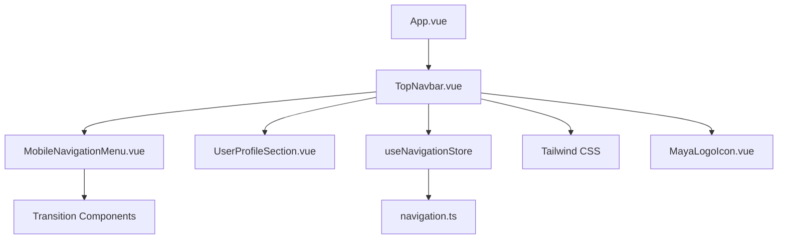
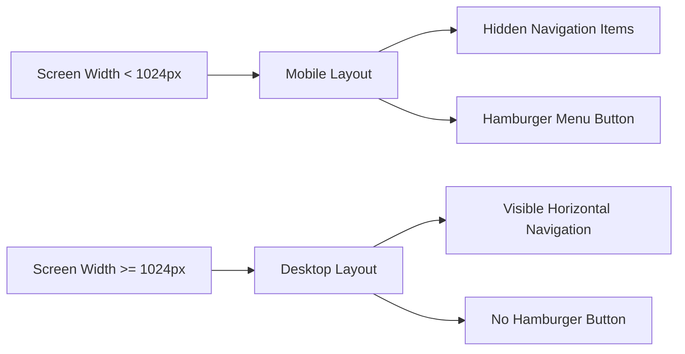
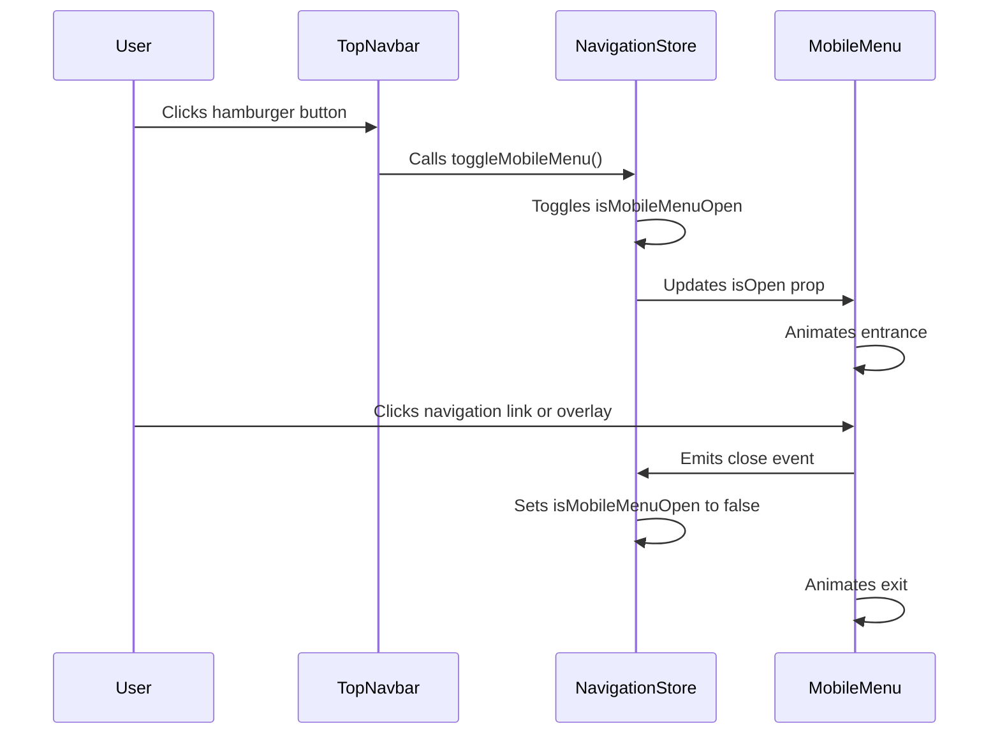
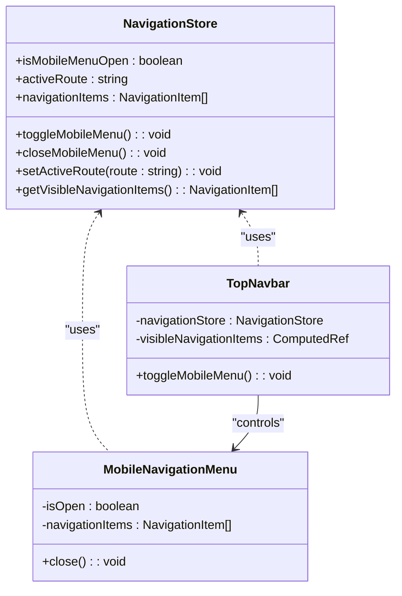

# Responsive Navigation Patterns

<cite>
**Referenced Files in This Document**   
- [App.vue](file://src/App.vue)
- [TopNavbar.vue](file://src/components/common/TopNavbar.vue) - *Updated in commit 2144fba8b871d499f44ffa407e9ba7b3ea4efb35*
- [MobileNavigationMenu.vue](file://src/components/common/MobileNavigationMenu.vue) - *Updated in commit f3550a3*
- [UserProfileSection.vue](file://src/components/common/UserProfileSection.vue) - *Updated in commit f3550a3*
- [navigation.ts](file://src/stores/navigation.ts)
- [MayaLogoIcon.vue](file://src/components/icons/MayaLogoIcon.vue) - *Added in commit 6aeb6b04*
- [tailwind.config.js](file://tailwind.config.js)
- [user.ts](file://src/stores/user.ts) - *Updated in commit 2144fba8b871d499f44ffa407e9ba7b3ea4efb35*
</cite>

## Update Summary
**Changes Made**   
- Added documentation for the new "Create Vacancy" button in TopNavbar.vue
- Updated Core Components section to include information about client-specific functionality
- Enhanced Breakpoint Usage section with details about conditional rendering for client users
- Updated Accessibility and UX Considerations with new interaction details
- Added user store reference to document user type detection
- Verified all existing documentation remains accurate after recent changes
- Updated file references to reflect current state of TopNavbar.vue and user.ts

## Table of Contents
1. [Introduction](#introduction)
2. [Project Structure](#project-structure)
3. [Core Components](#core-components)
4. [Responsive Layout Strategy](#responsive-layout-strategy)
5. [Breakpoint Usage and Conditional Rendering](#breakpoint-usage-and-conditional-rendering)
6. [Hamburger Menu Interaction and Transitions](#hamburger-menu-interaction-and-transitions)
7. [Dark Mode Support](#dark-mode-support)
8. [Navigation State Management](#navigation-state-management)
9. [Accessibility and UX Considerations](#accessibility-and-ux-considerations)
10. [Conclusion](#conclusion)

## Introduction
This document provides a comprehensive analysis of the responsive navigation implementation in the Maya Platform frontend application. The system leverages Vue.js, Vue Router, Pinia for state management, and Tailwind CSS for styling and responsive design. The navigation adapts seamlessly between mobile and desktop layouts using Tailwind's breakpoint system, with smooth transitions and dark mode support. Recent updates have enhanced the functionality with a client-specific "Create Vacancy" button and improved user type detection.

## Project Structure
The navigation system is composed of several key components organized under the `src/components/common` directory. The main navigation logic is coordinated through the `TopNavbar.vue` component, which conditionally renders desktop navigation or a mobile hamburger menu based on screen size.



**Diagram sources**
- [App.vue](file://src/App.vue#L1-L5)
- [TopNavbar.vue](file://src/components/common/TopNavbar.vue#L1-L130)
- [MobileNavigationMenu.vue](file://src/components/common/MobileNavigationMenu.vue#L1-L122)

**Section sources**
- [App.vue](file://src/App.vue#L1-L10)
- [TopNavbar.vue](file://src/components/common/TopNavbar.vue#L1-L130)

## Core Components
The responsive navigation system consists of three primary components working in concert:

- **TopNavbar.vue**: Main navigation bar that displays logo, desktop navigation links, user profile, and mobile menu toggle. Now includes a client-specific "Create Vacancy" button that emits a `create-vacancy` event.
- **MobileNavigationMenu.vue**: Slide-in panel that appears on mobile devices when the hamburger menu is activated
- **UserProfileSection.vue**: User profile display with dropdown menu on desktop and simplified display on mobile
- **navigation.ts**: Pinia store that manages navigation state including mobile menu visibility and active route
- **MayaLogoIcon.vue**: SVG component for the Maya Platform logo, recently implemented to replace text-based branding
- **user.ts**: Pinia store that manages user authentication state and user type (specialist or client)

These components use Vue's composition API and leverage Tailwind CSS utility classes for responsive behavior and visual styling.

**Section sources**
- [TopNavbar.vue](file://src/components/common/TopNavbar.vue#L1-L130)
- [MobileNavigationMenu.vue](file://src/components/common/MobileNavigationMenu.vue#L1-L122)
- [UserProfileSection.vue](file://src/components/common/UserProfileSection.vue#L1-L186)
- [navigation.ts](file://src/stores/navigation.ts#L1-L76)
- [MayaLogoIcon.vue](file://src/components/icons/MayaLogoIcon.vue#L1-L29)
- [user.ts](file://src/stores/user.ts#L1-L103)

## Responsive Layout Strategy
The navigation system implements a mobile-first responsive design that switches between two distinct layouts based on screen width. The desktop layout displays navigation items horizontally, while the mobile layout hides these items behind a hamburger menu.

### Desktop vs Mobile Layout
The layout switching is controlled by Tailwind's responsive prefixes, particularly the `lg:` breakpoint (1024px and above). On large screens, the desktop navigation is displayed using the `hidden lg:flex` class combination, which hides the element by default and only displays it on large screens and above.



**Diagram sources**
- [TopNavbar.vue](file://src/components/common/TopNavbar.vue#L25-L30)
- [MobileNavigationMenu.vue](file://src/components/common/MobileNavigationMenu.vue#L1-L10)

**Section sources**
- [TopNavbar.vue](file://src/components/common/TopNavbar.vue#L25-L30)
- [MobileNavigationMenu.vue](file://src/components/common/MobileNavigationMenu.vue#L1-L122)

## Breakpoint Usage and Conditional Rendering
The implementation makes extensive use of Tailwind CSS breakpoints to control layout and visibility across different screen sizes.

### Breakpoint Implementation
The `lg:` prefix is used throughout the navigation components to specify styles that should only apply on large screens and above:

- `hidden lg:flex`: Hides element on small screens, displays as flex container on large screens
- `lg:hidden`: Hides element on large screens and above
- `sm:ml-6 sm:flex sm:space-x-8`: Applies margin, display, and spacing on small screens and above

```html
<!-- Desktop navigation visible only on large screens -->
<div class="hidden lg:flex space-x-8">
  <router-link v-for="item in visibleNavigationItems" :key="item.id" :to="item.route">
    {{ item.label }}
  </router-link>
</div>

<!-- Mobile menu button visible only on small screens -->
<button class="lg:hidden p-2 rounded-md" @click="navigationStore.toggleMobileMenu">
  <Bars3Icon v-if="!navigationStore.isMobileMenuOpen" class="h-6 w-6" />
  <XMarkIcon v-else class="h-6 w-6" />
</button>
```

### Conditional Rendering Classes
The navigation also uses conditional classes to modify appearance based on state:

- Authentication status: Navigation items are filtered based on whether the user is authenticated
- Active route: Visual styling changes to indicate the currently active page
- Dark mode: Color schemes automatically adjust based on user preference
- User profile display: Different rendering for desktop (dropdown menu) and mobile (simplified display)
- Client-specific functionality: The "Create Vacancy" button is conditionally rendered only for authenticated users with userType 'client'
- Logo implementation: Custom SVG logo with stacked text layout replaces previous text-only branding

**Section sources**
- [TopNavbar.vue](file://src/components/common/TopNavbar.vue#L25-L70)
- [UserProfileSection.vue](file://src/components/common/UserProfileSection.vue#L1-L186)
- [tailwind.config.js](file://tailwind.config.js#L1-L21)
- [user.ts](file://src/stores/user.ts#L1-L103)

## Hamburger Menu Interaction and Transitions
The mobile navigation menu implements a slide-in drawer pattern with smooth transitions and proper accessibility features.

### Interaction Flow


**Diagram sources**
- [TopNavbar.vue](file://src/components/common/TopNavbar.vue#L65-L70)
- [MobileNavigationMenu.vue](file://src/components/common/MobileNavigationMenu.vue#L1-L44)
- [navigation.ts](file://src/stores/navigation.ts#L40-L45)

**Section sources**
- [TopNavbar.vue](file://src/components/common/TopNavbar.vue#L65-L70)
- [MobileNavigationMenu.vue](file://src/components/common/MobileNavigationMenu.vue#L1-L122)

### Transition Effects
The mobile menu uses Vue's built-in `<Transition>` component to create smooth entrance and exit animations:

- **Overlay Transition**: Fades in/out with opacity transition
- **Panel Transition**: Slides in from left using transform translate

```html
<Transition
  enter-active-class="transition-opacity duration-300"
  enter-from-class="opacity-0"
  enter-to-class="opacity-100"
  leave-active-class="transition-opacity duration-300"
  leave-from-class="opacity-100"
  leave-to-class="opacity-0"
>
  <div v-if="isOpen" class="fixed inset-0 z-40 bg-black bg-opacity-25 lg:hidden" />
</Transition>

<Transition
  enter-active-class="transition-transform duration-300 ease-in-out"
  enter-from-class="-translate-x-full"
  enter-to-class="translate-x-0"
  leave-active-class="transition-transform duration-300 ease-in-out"
  leave-from-class="translate-x-0"
  leave-to-class="-translate-x-full"
>
  <div v-if="isOpen" class="fixed top-0 left-0 z-50 h-full w-64 bg-white dark:bg-gray-800 transform lg:hidden">
    <!-- Menu content -->
  </div>
</Transition>
```

The transitions provide visual feedback and improve the user experience by making the interface feel more responsive and polished.

**Section sources**
- [MobileNavigationMenu.vue](file://src/components/common/MobileNavigationMenu.vue#L1-L122)

## Dark Mode Support
The navigation system fully supports dark mode through Tailwind's dark variant system and CSS custom properties.

### Implementation Approach
The dark mode functionality is implemented using:

1. **Tailwind's dark variant**: Classes prefixed with `dark:` are applied when dark mode is active
2. **System preference detection**: Respects the user's operating system dark mode setting
3. **Consistent color scheme**: Maintains visual hierarchy across both light and dark modes

```html
<div class="fixed top-0 left-0 z-50 h-full w-64 bg-white dark:bg-gray-800 shadow-xl transform lg:hidden">
  <div class="flex items-center justify-between p-4 border-b border-gray-200 dark:border-gray-700">
    <span class="text-lg font-semibold text-gray-900 dark:text-white">Menu</span>
    <button class="p-2 rounded-md text-gray-400 hover:text-gray-500 dark:text-gray-300 dark:hover:text-gray-200 hover:bg-gray-100 dark:hover:bg-gray-700 transition-colors">
      <XMarkIcon class="h-5 w-5" />
    </button>
  </div>
</div>
```

The `dark:` variant classes automatically apply when the user has dark mode enabled in their browser or operating system, providing a comfortable viewing experience in low-light environments.

**Section sources**
- [MobileNavigationMenu.vue](file://src/components/common/MobileNavigationMenu.vue#L1-L122)
- [base.css](file://src/assets/base.css#L1-L50)

## Navigation State Management
The navigation system uses Pinia for centralized state management, ensuring consistent behavior across components.

### Store Architecture


**Diagram sources**
- [navigation.ts](file://src/stores/navigation.ts#L1-L76)
- [TopNavbar.vue](file://src/components/common/TopNavbar.vue#L1-L130)

**Section sources**
- [navigation.ts](file://src/stores/navigation.ts#L1-L76)
- [TopNavbar.vue](file://src/components/common/TopNavbar.vue#L1-L130)

### State Management Features
The `useNavigationStore` provides several key functions:

- **Mobile menu state**: Centralized control of the mobile menu open/closed state
- **Active route tracking**: Maintains awareness of the current route for visual feedback
- **Navigation item management**: Stores and filters navigation items based on authentication requirements
- **Reactive updates**: Automatically closes the mobile menu when the route changes

The store uses Vue's reactivity system with `ref` and `computed` to ensure that all components stay in sync with the current navigation state.

## Accessibility and UX Considerations
The navigation implementation includes several accessibility and user experience enhancements.

### Accessibility Features
- **ARIA attributes**: The mobile menu button includes `aria-expanded` to indicate its state
- **Keyboard navigation**: Focus management allows users to navigate with keyboard
- **Semantic HTML**: Uses appropriate elements like `<nav>` for screen readers
- **Visual feedback**: Hover and focus states provide clear interaction cues
- **Dropdown accessibility**: User profile dropdown includes proper ARIA roles, labels, and keyboard handling (Escape key closes menu)
- **Client-specific interactions**: The "Create Vacancy" button emits an event that can be handled by parent components for modal display or navigation

### User Experience Enhancements
- **Smooth transitions**: Animations provide visual continuity during state changes
- **Touch targets**: Adequate sizing for mobile touch interactions
- **Context preservation**: Menu automatically closes when navigating to a new page
- **Performance optimization**: Computed properties prevent unnecessary re-renders
- **Desktop dropdown menu**: Enhanced user profile interaction with visual feedback and smooth transitions
- **Mobile simplification**: Streamlined user profile display for smaller screens
- **Branding enhancement**: Custom SVG logo improves visual identity and scalability across devices
- **Role-based UI**: Client users see a "Create Vacancy" button that enables vacancy management functionality, while specialists do not see this option

The implementation balances aesthetic design with functional usability, ensuring that the navigation is both visually appealing and easy to use across different devices and user preferences.

**Section sources**
- [TopNavbar.vue](file://src/components/common/TopNavbar.vue#L65-L70)
- [MobileNavigationMenu.vue](file://src/components/common/MobileNavigationMenu.vue#L1-L122)
- [UserProfileSection.vue](file://src/components/common/UserProfileSection.vue#L1-L186)
- [user.ts](file://src/stores/user.ts#L1-L103)

## Conclusion
The responsive navigation system in the Maya Platform frontend demonstrates a robust implementation of modern web development practices. By leveraging Tailwind CSS's utility-first approach, the system achieves responsive behavior through strategic use of breakpoint prefixes like `lg:` and `sm:`. The mobile/desktop layout switching is seamless, with the hamburger menu providing an intuitive interface for smaller screens.

Key strengths of the implementation include:
- Clean separation of concerns between components
- Effective use of Pinia for centralized state management
- Smooth transition effects that enhance user experience
- Full dark mode support that respects system preferences
- Accessibility features that make the interface usable for all users
- Enhanced desktop user experience with dropdown menu for user profile actions
- Simplified mobile navigation with streamlined logout functionality
- Improved branding with custom SVG logo implementation that maintains responsive behavior
- Role-based functionality with client-specific "Create Vacancy" button that emits events for parent component handling
- User type detection that enables conditional rendering based on authentication and user role

The navigation system serves as a model for responsive design in Vue.js applications, demonstrating how utility classes, component composition, and state management can work together to create a polished user interface that adapts gracefully across different devices and user preferences.