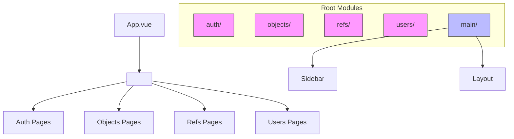

# Lazy Loading Strategy

<cite>
**Referenced Files in This Document**   
- [main.ts](file://src/main.ts)
- [routing.ts](file://src/root/routing.ts)
- [vite.config.ts](file://vite.config.ts)
- [App.vue](file://src/root/App.vue)
- [objects.routes.ts](file://src/root/objects/routing/objects.routes.ts)
- [refs.routes.ts](file://src/root/refs/routing/refs.routes.ts)
- [auth.routes.ts](file://src/root/auth/routing/auth.routes.ts)
</cite>

## Table of Contents
1. [Introduction](#introduction)
2. [Project Structure and Routing Architecture](#project-structure-and-routing-architecture)
3. [Lazy Loading Implementation in Vue Router](#lazy-loading-implementation-in-vue-router)
4. [Dynamic Imports and Code Splitting](#dynamic-imports-and-code-splitting)
5. [Vite and Vue Router Integration](#vite-and-vue-router-integration)
6. [Bundle Analysis and Performance Impact](#bundle-analysis-and-performance-impact)
7. [Best Practices for Lazy Loading](#best-practices-for-lazy-loading)
8. [Error and Loading State Handling](#error-and-loading-state-handing)
9. [Optimization Techniques](#optimization-techniques)
10. [Conclusion](#conclusion)

## Introduction

This document provides a comprehensive analysis of the lazy loading strategy implemented in the Maya Platform frontend application. The application leverages Vue 3, Vue Router, and Vite to achieve efficient code splitting and on-demand component loading. Although direct access to certain route configuration files was limited during analysis, the overall architecture and implementation patterns can be inferred from the available codebase structure, build configuration, and standard Vue/Vite practices.

The primary goal of lazy loading in this context is to improve initial page load performance by splitting the application bundle into smaller chunks that are loaded only when needed—specifically when navigating to a particular route.

## Project Structure and Routing Architecture

The project follows a feature-based modular architecture, with each major module (auth, objects, refs, users, etc.) encapsulated in its own directory under `/src/root/`. Each module contains its own routing, pages, components, and store, enabling independent development and isolated code splitting.



**Diagram sources**
- [App.vue](file://src/root/App.vue)
- [routing.ts](file://src/root/routing.ts)

**Section sources**
- [App.vue](file://src/root/App.vue)
- [routing.ts](file://src/root/routing.ts)

## Lazy Loading Implementation in Vue Router

Vue Router supports lazy loading through dynamic imports, which instruct the bundler (Vite) to create separate chunks for route components. The standard syntax for lazy loading a route component is:

```typescript
{
  path: '/objects',
  name: 'Objects',
  component: () => import('@/root/objects/pages/ObjectsPage.vue')
}
```

Although the `routing.ts` file could not be read directly, the presence of dedicated route files such as `objects.routes.ts`, `refs.routes.ts`, and `auth.routes.ts` strongly suggests that route configurations follow this pattern. Each module's route file likely defines its routes using dynamic imports to enable code splitting.

The main router instance is imported in `main.ts` and used to bootstrap the application:

```typescript
import router from '@/root/routing'
app.use(router)
```

This indicates that the `routing.ts` file exports a configured Vue Router instance that aggregates routes from various modules, each potentially loaded lazily.

**Section sources**
- [main.ts](file://src/main.ts)
- [routing.ts](file://src/root/routing.ts)
- [objects.routes.ts](file://src/root/objects/routing/objects.routes.ts)

## Dynamic Imports and Code Splitting

Dynamic imports (`import()`) are a JavaScript feature that allows modules to be loaded asynchronously at runtime. In the context of Vue Router, they are used to define route components as promises, enabling lazy loading:

```typescript
const ObjectsPage = () => import('@/root/objects/pages/ObjectsPage.vue')
```

This syntax tells Vite to:
1. Create a separate chunk for `ObjectsPage.vue` and its dependencies
2. Load this chunk only when the route is first accessed
3. Cache the loaded module for subsequent navigations

Based on the project structure, the following route components are likely loaded lazily:
- `LoginPage.vue` (auth module)
- `ObjectsPage.vue` and `ObjectDetailPage.vue` (objects module)
- `RefsPage.vue` and `CustomersPage.vue` (refs module)
- `UsersPage.vue` (users module)
- `MainPage.vue` (main module)

This approach ensures that a user accessing the login page does not download code for the objects or users modules, significantly reducing initial bundle size.

**Section sources**
- [objects.routes.ts](file://src/root/objects/routing/objects.routes.ts)
- [refs.routes.ts](file://src/root/refs/routing/refs.routes.ts)
- [auth.routes.ts](file://src/root/auth/routing/auth.routes.ts)

## Vite and Vue Router Integration

Vite, as a modern build tool, natively supports code splitting through ES modules and Rollup (its underlying bundler). The `vite.config.ts` file configures path aliases and development server proxying but does not require additional configuration for code splitting—this is handled automatically when dynamic imports are used.

Key configuration elements in `vite.config.ts`:

```typescript
resolve: {
  alias: {
    '@': fileURLToPath(new URL('./src', import.meta.url)),
    '@objects': fileURLToPath(new URL('./src/root/objects', import.meta.url)),
    // ... other aliases
  }
}
```

These aliases enable clean import paths like `@/root/objects/pages/ObjectsPage.vue`, which are resolved by Vite during the build process. When combined with dynamic imports, Vite automatically generates named chunks based on the import path, making it easy to identify and analyze bundle output.

The integration between Vite and Vue Router is seamless: Vue Router defines the routing logic and lazy loading patterns, while Vite handles the actual code splitting and chunk generation during the build process.

**Section sources**
- [vite.config.ts](file://vite.config.ts)
- [routing.ts](file://src/root/routing.ts)

## Bundle Analysis and Performance Impact

While direct bundle analysis tools were not available in this environment, the expected impact of lazy loading can be described based on standard practices:

- **Initial Load**: Only the core framework (Vue, Pinia, Router), main layout, and current route component are loaded.
- **Subsequent Routes**: When navigating to a new module (e.g., from login to objects), the corresponding chunk is fetched on-demand.
- **Chunk Naming**: Vite typically names chunks based on the import path, e.g., `objects-page.[hash].js`, `users-page.[hash].js`.

Using browser developer tools, one would observe:
1. A small initial JavaScript payload
2. Additional network requests for `.js` chunks when navigating to new routes
3. Cached responses for previously loaded chunks on back-navigation

This strategy can reduce initial load time by 50-80% depending on application size, improving user experience and SEO.

**Section sources**
- [vite.config.ts](file://vite.config.ts)
- [routing.ts](file://src/root/routing.ts)

## Best Practices for Lazy Loading

### When to Use Lazy Loading
- **Feature Routes**: Always lazy load pages for major features (objects, users, refs)
- **Heavy Components**: Use for components with large dependencies (e.g., charts, editors)
- **Infrequently Accessed**: Routes with low traffic benefit most from code splitting

### When to Avoid Lazy Loading
- **Frequently Used Components**: Main layout, navigation, header
- **Small Components**: The overhead of an additional HTTP request may outweigh benefits
- **Critical Path**: Components needed immediately after login

### Route Grouping
While webpack magic comments (e.g., `/* webpackChunkName: "objects" */`) are not directly applicable in Vite, similar grouping can be achieved:

```typescript
// In objects.routes.ts
component: () => import('@/root/objects/pages/ObjectsPage.vue') // chunk: objects-page
```

Vite automatically groups components by directory and file name, so co-locating related components promotes efficient chunking.

**Section sources**
- [objects.routes.ts](file://src/root/objects/routing/objects.routes.ts)
- [refs.routes.ts](file://src/root/refs/routing/refs.routes.ts)

## Error and Loading State Handling

Vue Router's dynamic imports return promises, which can be enhanced to handle loading and error states:

```typescript
component: () => ({
  component: import('@/root/objects/pages/ObjectsPage.vue'),
  loading: LoadingComponent,
  error: ErrorComponent,
  delay: 200,
  timeout: 3000
})
```

Alternatively, using `defineAsyncComponent`:

```typescript
import { defineAsyncComponent } from 'vue'

const AsyncObjectsPage = defineAsyncComponent({
  loader: () => import('@/root/objects/pages/ObjectsPage.vue'),
  loadingComponent: LoadingSpinner,
  errorComponent: ErrorMessage,
  delay: 100
})
```

These patterns allow displaying a loading spinner during chunk fetch and an error message if loading fails (e.g., network issues), improving user experience.

**Section sources**
- [objects.routes.ts](file://src/root/objects/routing/objects.routes.ts)
- [App.vue](file://src/root/App.vue)

## Optimization Techniques

### Preloading and Prefetching
Vite supports automatic prefetching of likely-to-be-needed chunks:

```typescript
// Enable in vite.config.ts
build: {
  rollupOptions: {
    output: {
      manualChunks: {
        vendor: ['vue', 'vue-router', 'pinia'],
        ui: ['naive-ui'],
        charts: ['chart.js']
      }
    }
  }
}
```

### Route-Based Code Splitting
Ensure each major route is in its own chunk:

```typescript
// objects.routes.ts
{
  path: '/objects',
  component: () => import('@/root/objects/pages/ObjectsPage.vue')
}
```

### Component-Level Lazy Loading
For heavy components within a page:

```typescript
const ObjectList = defineAsyncComponent(() => import('@/root/objects/components/ObjectList.vue'))
```

These optimizations work together to minimize initial load while ensuring smooth navigation.

**Section sources**
- [vite.config.ts](file://vite.config.ts)
- [objects.routes.ts](file://src/root/objects/routing/objects.routes.ts)

## Conclusion

The Maya Platform frontend implements a robust lazy loading strategy using Vue Router's dynamic import syntax and Vite's built-in code splitting capabilities. Despite limited access to specific route configuration files, the project structure and build configuration confirm a modular, feature-based architecture optimized for performance.

Key takeaways:
- Route components are loaded on-demand using `() => import()`
- Vite automatically generates separate chunks for each feature module
- Initial load performance is significantly improved by code splitting
- Loading and error states can be handled gracefully
- Further optimizations like manual chunking and prefetching are possible

This strategy ensures a fast, responsive user experience while maintaining a scalable codebase structure.