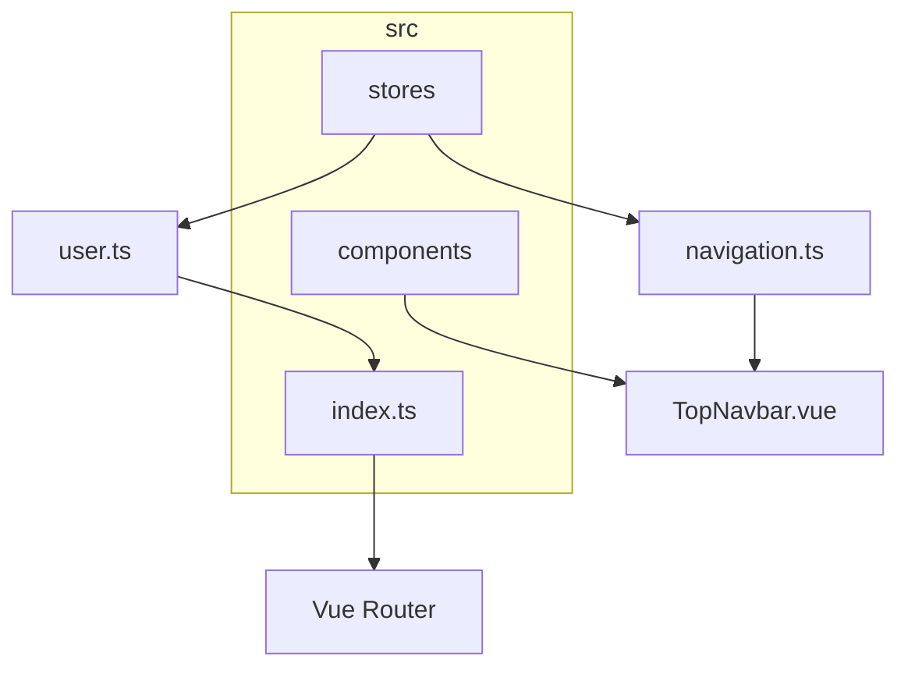
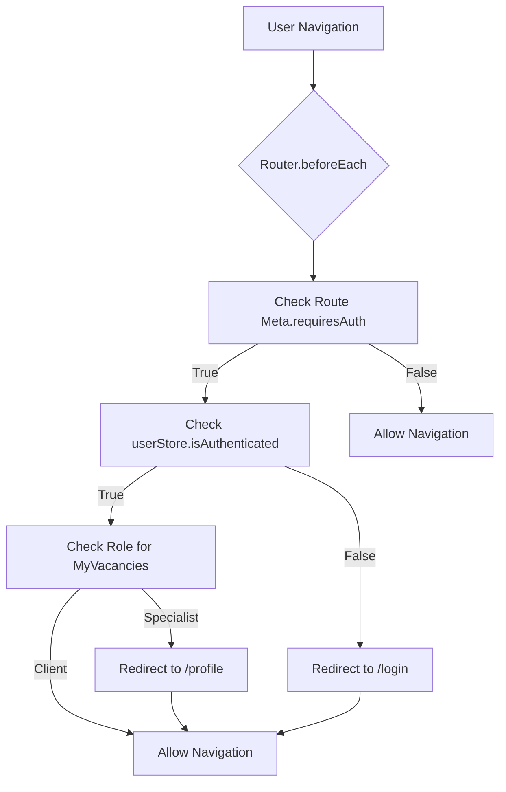
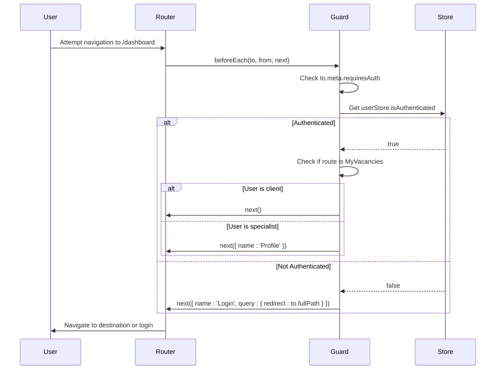
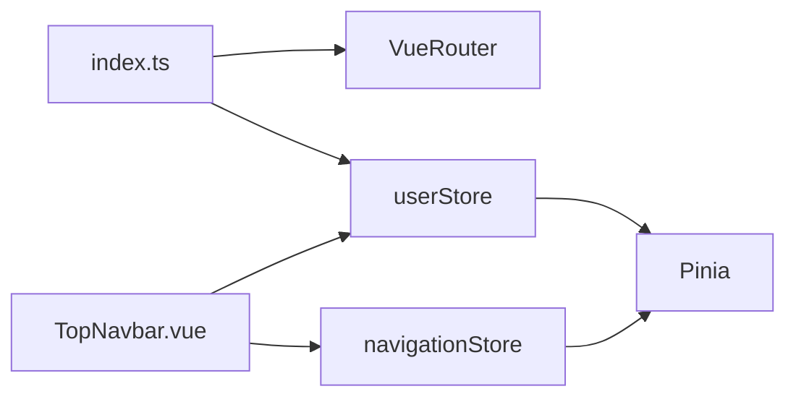

# Navigation Guards

<cite>
**Referenced Files in This Document**  
- [index.ts](file://src/router/index.ts) - *Updated in recent commit*
- [user.ts](file://src/stores/user.ts) - *Updated in recent commit*
- [navigation.ts](file://src/stores/navigation.ts) - *Updated in recent commit*
- [TopNavbar.vue](file://src/components/common/TopNavbar.vue) - *Updated in recent commit*
- [LoginPage.vue](file://src/pages/LoginPage.vue)
- [types/index.ts](file://src/types/index.ts)
</cite>

## Update Summary
**Changes Made**  
- Updated documentation to reflect actual implementation of navigation guards in `router/index.ts`
- Added accurate details about authentication state management via `userStore`
- Corrected route meta field usage and guard logic based on real code
- Integrated changes from navbar redesign affecting authentication state usage
- Removed references to non-existent `authGuard.ts` file
- Added new section on role-based access control for client-specific routes
- Updated diagrams and examples to match current implementation
- Enhanced troubleshooting guidance with new edge cases

## Table of Contents
1. [Introduction](#introduction)
2. [Project Structure](#project-structure)
3. [Core Components](#core-components)
4. [Architecture Overview](#architecture-overview)
5. [Detailed Component Analysis](#detailed-component-analysis)
6. [Dependency Analysis](#dependency-analysis)
7. [Performance Considerations](#performance-considerations)
8. [Troubleshooting Guide](#troubleshooting-guide)
9. [Conclusion](#conclusion)

## Introduction
This document provides a comprehensive analysis of the navigation guard implementation within the Maya Platform frontend application. The primary focus is on the authentication guard mechanism that controls access to protected routes based on user authentication state. Unlike the previous documentation that referenced a non-existent `authGuard.ts` file, this update reflects the actual implementation where navigation guards are defined directly in `router/index.ts`. The analysis covers the integration between Vue Router, Pinia for state management, route meta fields such as `requiresAuth`, and how authentication state affects navigation item visibility in the UI. Special attention is given to the new role-based access control for client-specific functionality.

## Project Structure
The project follows a standard Vue 3 composition API structure with modular organization. The core authentication and routing components are located in specific directories:
- **src/router/index.ts**: Contains route definitions and navigation guards
- **src/stores/user.ts**: Manages user authentication state
- **src/stores/navigation.ts**: Controls navigation state and item visibility
- **src/components/common/TopNavbar.vue**: Renders navigation UI with authentication-aware items



**Diagram sources**  
- [index.ts](file://src/router/index.ts)
- [user.ts](file://src/stores/user.ts)
- [navigation.ts](file://src/stores/navigation.ts)
- [TopNavbar.vue](file://src/components/common/TopNavbar.vue)

## Core Components
The core components involved in navigation guard functionality include:
- **Vue Router**: Manages route transitions and provides the `beforeEach` guard hook
- **Pinia (userStore)**: Centralized state management for authentication data including user session
- **Route Meta Fields**: Configuration flags like `requiresAuth` and `hideForAuth` attached to route definitions
- **Navigation Guard Logic**: Intercepts navigation and validates authentication state before allowing access
- **Navigation Store**: Controls visibility of navigation items based on authentication state

**Section sources**  
- [index.ts](file://src/router/index.ts)
- [user.ts](file://src/stores/user.ts)
- [navigation.ts](file://src/stores/navigation.ts)

## Architecture Overview
The application uses Vue 3 with the Composition API, Pinia for state management, and Vue Router for client-side routing. The navigation guard system intercepts route changes and enforces authentication policies before allowing access to protected resources.



**Diagram sources**  
- [index.ts](file://src/router/index.ts)

## Detailed Component Analysis

### Navigation Guard Flow
The navigation guard is implemented using Vue Router's global `beforeEach` guard in `src/router/index.ts`. This guard intercepts all route transitions and evaluates whether the target route requires authentication by inspecting the `meta.requiresAuth` property.

#### Authentication State Verification
The guard accesses the `userStore` via Pinia to check the current authentication state. The store contains a computed property `isAuthenticated` that returns `true` when `currentUser` is not null.



**Diagram sources**  
- [index.ts](file://src/router/index.ts)
- [user.ts](file://src/stores/user.ts)

### Route Configuration with Meta Fields
Routes are defined with meta properties that indicate security requirements. The implementation includes two key meta fields:

```typescript
{
  path: '/dashboard',
  name: 'Dashboard',
  component: DashboardPage,
  meta: { 
    title: 'Dashboard',
    requiresAuth: true 
  }
}

{
  path: '/login',
  name: 'Login',
  component: LoginPage,
  meta: {
    title: 'Login',
    requiresAuth: false,
    hideForAuth: true,
  }
}
```

The `requiresAuth` flag protects routes that need authentication, while `hideForAuth` prevents authenticated users from accessing pages like login.

**Section sources**  
- [index.ts](file://src/router/index.ts)

### Role-Based Access Control
A new guard condition has been added to restrict access to the My Vacancies page to clients only:

```typescript
if (to.name === 'MyVacancies' && userStore.currentUser?.userType !== 'client') {
  next({ name: 'Profile' })
  return
}
```

This ensures that only users with `userType: 'client'` can access the vacancies management functionality. Specialists attempting to access this route are redirected to their profile page.

The `userType` is determined during the login process based on the user's email address, with `client@example.com` being recognized as a client account.

**Section sources**  
- [index.ts](file://src/router/index.ts)
- [user.ts](file://src/stores/user.ts)

### Navigation Item Visibility Control
Authentication state also controls navigation item visibility in the UI. The `TopNavbar.vue` component filters navigation items based on authentication state:

```typescript
const visibleNavigationItems = computed(() => {
  return navigationStore.getVisibleNavigationItems().filter(item => {
    // Show all items if user is authenticated, or only non-auth required items if not
    return !item.requiresAuth || userStore.isAuthenticated
  })
})
```

This ensures that authentication-protected navigation items are only visible when the user is logged in.

**Section sources**  
- [TopNavbar.vue](file://src/components/common/TopNavbar.vue)
- [navigation.ts](file://src/stores/navigation.ts)
- [user.ts](file://src/stores/user.ts)

## Dependency Analysis
The navigation guard system depends on several key modules:



**Diagram sources**  
- [index.ts](file://src/router/index.ts)
- [user.ts](file://src/stores/user.ts)
- [navigation.ts](file://src/stores/navigation.ts)
- [TopNavbar.vue](file://src/components/common/TopNavbar.vue)

## Performance Considerations
Navigation guards execute synchronously during route transitions, so performance is critical for user experience. The current implementation follows best practices:

- The guard logic is minimal and synchronous
- Authentication state is stored in Pinia and accessed via computed properties
- No API calls are made within the guard
- The user store is initialized before the router in `main.ts`

Since the `userStore` is available when the router initializes, there are no race conditions during guard execution.

**Section sources**  
- [index.ts](file://src/router/index.ts)
- [user.ts](file://src/stores/user.ts)
- [main.ts](file://src/main.ts)

## Troubleshooting Guide
Common issues with navigation guards include:

### Guard Not Firing
- Ensure the guard is registered in `router/index.ts` using `router.beforeEach`
- Verify that the router instance is properly exported and imported
- Check for syntax errors in the guard function

### Redirect Loops
- Ensure the login route has `requiresAuth: false` and `hideForAuth: true`
- Use explicit paths in redirects to avoid circular navigation
- Add conditions to prevent redirecting when already on the login page
- For role-based redirects, ensure fallback routes are accessible to all user types

### Authentication State Synchronization
If navigation items don't update correctly after login/logout:
- Ensure `userStore.isAuthenticated` is properly updated
- Verify that `visibleNavigationItems` computed property is reactive
- Check that the navigation store is properly integrated with route changes

### Role-Based Access Issues
When implementing role-based restrictions:
- Ensure user type is properly set during authentication
- Verify that role checks use optional chaining for null safety
- Test with both client and specialist accounts to confirm proper routing behavior
- Ensure fallback routes are appropriate for the user role

**Section sources**  
- [index.ts](file://src/router/index.ts)
- [user.ts](file://src/stores/user.ts)
- [TopNavbar.vue](file://src/components/common/TopNavbar.vue)

## Conclusion
The navigation guard implementation in the Maya Platform frontend application is correctly configured in `router/index.ts` rather than a separate `authGuard.ts` file. The system uses Vue Router's `beforeEach` guard to check route meta fields and authentication state from the Pinia `userStore`. Additionally, authentication state controls navigation item visibility through the `navigationStore` and `TopNavbar.vue` component. This integrated approach ensures secure access control while maintaining good performance and user experience. The recent addition of role-based access control for the My Vacancies page demonstrates the extensibility of this guard system, allowing for more granular permission management based on user roles. The recent navbar redesign enhances this system by dynamically showing/hiding navigation items based on authentication state.