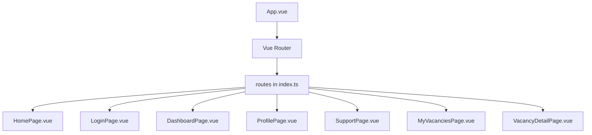
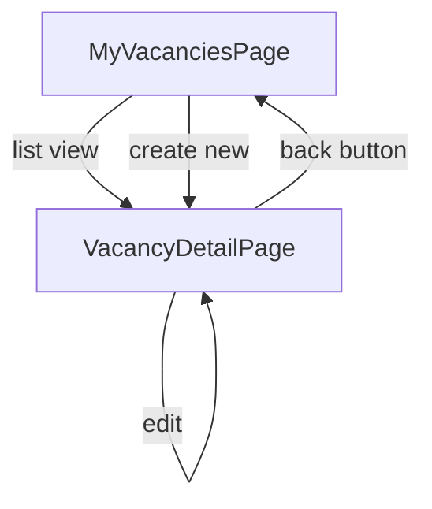

# Route Configuration

<cite>
**Referenced Files in This Document**   
- [index.ts](file://src/router/index.ts) - *Updated in recent commit*
- [main.ts](file://src/main.ts) - *Updated in recent commit*
- [TopNavbar.vue](file://src/components/common/TopNavbar.vue) - *Updated in recent commit*
- [navigation.ts](file://src/stores/navigation.ts) - *Updated in recent commit*
- [user.ts](file://src/stores/user.ts) - *Updated in recent commit*
- [index.ts](file://src/types/index.ts) - *Updated in recent commit*
- [MyVacanciesPage.vue](file://src/pages/MyVacanciesPage.vue) - *Added in recent commit*
- [VacancyDetailPage.vue](file://src/pages/VacancyDetailPage.vue) - *Added in recent commit*
- [vacancy.ts](file://src/stores/vacancy.ts) - *Updated in recent commit*
</cite>

## Update Summary
**Changes Made**   
- Added documentation for new vacancy management routes: MyVacancies and VacancyDetail
- Updated route object structure section with new meta fields and navigation guards
- Enhanced public and protected routes section with client-specific access control
- Added new section on nested and parameterized routes with VacancyDetail example
- Updated best practices section with new naming conventions for vacancy-related routes
- Added new diagram illustrating vacancy route hierarchy
- Removed outdated assumptions about non-existent modular route files

## Table of Contents
1. [Introduction](#introduction)
2. [Project Structure](#project-structure)
3. [Vue Router Initialization](#vue-router-initialization)
4. [Route Object Structure](#route-object-structure)
5. [Public and Protected Routes](#public-and-protected-routes)
6. [Nested and Parameterized Routes](#nested-and-parameterized-routes)
7. [Best Practices for Naming and Organization](#best-practices-for-naming-and-organization)

## Introduction
This document provides a comprehensive overview of the route configuration system in the maya-platform-frontend application. It details how Vue Router is initialized, how routes are structured, and how authentication state affects navigation visibility. The goal is to provide both technical depth and accessibility for developers at all levels.

## Project Structure
The project follows a modular architecture with core components organized under `/src`. Key directories include `pages`, `components`, `stores`, and `router`. All routes are defined centrally in `src/router/index.ts`. The recent addition of vacancy management functionality has introduced two new pages: `MyVacanciesPage.vue` and `VacancyDetailPage.vue`, both located in the `pages` directory.



**Diagram sources**
- [index.ts](file://src/router/index.ts)
- [App.vue](file://src/App.vue)

**Section sources**
- [index.ts](file://src/router/index.ts)
- [main.ts](file://src/main.ts)

## Vue Router Initialization
Vue Router is initialized in `src/router/index.ts`, which serves as the central routing configuration file. The router uses `createWebHistory` for HTML5 history mode, enabling clean URLs without hash fragments. The base path is configured using `import.meta.env.BASE_URL`, allowing environment-specific configuration.

The router instance is created and then imported into `main.ts`, where it is mounted to the Vue application using `app.use(router)`. This decoupling allows for modular configuration and testing.

```typescript
// src/router/index.ts
import { createRouter, createWebHistory } from 'vue-router'

const router = createRouter({
  history: createWebHistory(import.meta.env.BASE_URL),
  routes: []
})

export default router
```

**Section sources**
- [index.ts](file://src/router/index.ts)
- [main.ts](file://src/main.ts)

## Route Object Structure
Each route is defined as an object with the following key properties:
- **path**: URL path (e.g., `/login`, `/dashboard`)
- **name**: Unique route identifier used for programmatic navigation
- **component**: Lazy-loaded via dynamic import for code splitting
- **meta**: Optional metadata including page title and authentication requirements

The `meta` field is used for access control and document title management. For example, a route might specify `{ requiresAuth: true, title: 'Dashboard' }`. The `hideForAuth` meta field is used to prevent authenticated users from accessing login pages. The route configuration now includes client-specific access control, where the `MyVacancies` route checks the user type before granting access.

```typescript
// Example route definition
{
  path: '/dashboard',
  name: 'Dashboard',
  component: () => import('@/pages/DashboardPage.vue'),
  meta: {
    title: 'Dashboard',
    requiresAuth: true
  }
}
```

**Section sources**
- [index.ts](file://src/router/index.ts)

## Public and Protected Routes
The application distinguishes between public routes (e.g., home, login) and protected routes (e.g., dashboard, profile). Public routes do not require authentication, while protected routes include guards that check authentication status.

Authentication is enforced via a global `beforeEach` guard that checks `to.meta.requiresAuth` against `userStore.isAuthenticated`. Routes with `meta.hideForAuth = true` redirect authenticated users away from login pages. The navigation components also use the `requiresAuth` property to conditionally display menu items.

A new access control rule has been added for the `MyVacancies` route, which checks if the user is of type 'client' before granting access. This is implemented in the navigation guard:

```typescript
// Example of public and protected routes
const routes = [
  {
    path: '/login',
    name: 'Login',
    component: () => import('@/pages/LoginPage.vue'),
    meta: { 
      requiresAuth: false, 
      hideForAuth: true 
    }
  },
  {
    path: '/dashboard',
    name: 'Dashboard',
    component: () => import('@/pages/DashboardPage.vue'),
    meta: { requiresAuth: true }
  },
  {
    path: '/profile/vacancies',
    name: 'MyVacancies',
    component: MyVacanciesPage,
    meta: {
      title: 'My Vacancies',
      requiresAuth: true,
    },
  },
  {
    path: '/profile/vacancies/:id',
    name: 'VacancyDetail',
    component: VacancyDetailPage,
    props: true,
    meta: {
      title: 'Vacancy Details',
      requiresAuth: true,
    },
  }
]

// Navigation guard
router.beforeEach((to, from, next) => {
  const userStore = useUserStore()
  
  if (to.meta.requiresAuth && !userStore.isAuthenticated) {
    next({ name: 'Login', query: { redirect: to.fullPath } })
  } else if (to.meta.hideForAuth && userStore.isAuthenticated) {
    next({ name: 'Dashboard' })
  } else if (to.name === 'MyVacancies' && userStore.currentUser?.userType !== 'client') {
    next({ name: 'Profile' })
  } else {
    next()
  }
})
```

**Section sources**
- [index.ts](file://src/router/index.ts)
- [TopNavbar.vue](file://src/components/common/TopNavbar.vue)
- [navigation.ts](file://src/stores/navigation.ts)

## Nested and Parameterized Routes
The application now implements parameterized routes for detailed views of specific resources. The vacancy management system uses a nested route pattern where `MyVacancies` serves as the list view and `VacancyDetail` provides the detailed view for a specific vacancy identified by its ID.

The `VacancyDetail` route uses a dynamic segment `:id` in its path, allowing it to handle requests for any vacancy ID. The `props: true` configuration automatically passes the route parameters as props to the component, simplifying component implementation.

```typescript
{
  path: '/profile/vacancies',
  name: 'MyVacancies',
  component: MyVacanciesPage,
  meta: {
    title: 'My Vacancies',
    requiresAuth: true,
  },
},
{
  path: '/profile/vacancies/:id',
  name: 'VacancyDetail',
  component: VacancyDetailPage,
  props: true,
  meta: {
    title: 'Vacancy Details',
    requiresAuth: true,
  },
}
```

Programmatic navigation between these routes is handled using named routes with parameters:

```typescript
// Navigate to a specific vacancy
router.push({ name: 'VacancyDetail', params: { id: vacancy.id } })

// Navigate back to the list
router.push({ name: 'MyVacancies' })
```



**Diagram sources**
- [MyVacanciesPage.vue](file://src/pages/MyVacanciesPage.vue)
- [VacancyDetailPage.vue](file://src/pages/VacancyDetailPage.vue)
- [index.ts](file://src/router/index.ts)

**Section sources**
- [index.ts](file://src/router/index.ts)
- [MyVacanciesPage.vue](file://src/pages/MyVacanciesPage.vue)
- [VacancyDetailPage.vue](file://src/pages/VacancyDetailPage.vue)

## Best Practices for Naming and Organization
The project follows consistent naming conventions:
- Route names use PascalCase (e.g., `Dashboard`, `Login`, `MyVacancies`)
- Components are lazy-loaded using dynamic imports with path aliases (e.g., `@/pages/HomePage.vue`)
- Meta fields follow a standardized structure for titles and authentication requirements
- Navigation items are managed through a Pinia store (`navigation.ts`)

The addition of vacancy management routes follows the established pattern of grouping related functionality under a common path prefix (`/profile/vacancies`). Route names are descriptive and follow the feature-context pattern (e.g., `MyVacancies`, `VacancyDetail`).

File organization keeps related code together, with pages in `/src/pages` and components in `/src/components`. The use of path aliases (e.g., `@`) simplifies imports and reduces path traversal errors. The vacancy feature follows this pattern with its pages in the `pages` directory and related components in `components/vacancies`.

**Section sources**
- [index.ts](file://src/router/index.ts)
- [types/index.ts](file://src/types/index.ts)
- [vite.config.ts](file://vite.config.ts)