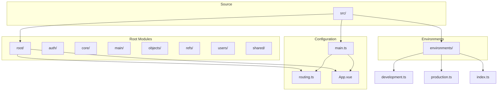

# Route Parameters Handling

<cite>
**Referenced Files in This Document**   
- [routing.ts](file://src/root/routing.ts)
- [main.ts](file://src/main.ts)
- [App.vue](file://src/root/App.vue)
</cite>

## Table of Contents
1. [Introduction](#introduction)
2. [Project Structure](#project-structure)
3. [Route Configuration and Dynamic Segments](#route-configuration-and-dynamic-segments)
4. [Accessing Route Parameters in Components](#accessing-route-parameters-in-components)
5. [Type Safety with TypeScript](#type-safety-with-typescript)
6. [Query Parameters Handling](#query-parameters-handling)
7. [Error Handling for Invalid Parameters](#error-handling-for-invalid-parameters)
8. [Programmatic Navigation with Parameters](#programmatic-navigation-with-parameters)
9. [Best Practices for Input Validation and Sanitization](#best-practices-for-input-validation-and-sanitization)

## Introduction
This document provides a comprehensive guide on handling route parameters in the maya-platform-frontend application. It covers the definition of dynamic route segments, accessing parameters within components using Vue Router's `useRoute()` composable, type safety with TypeScript, query parameter management, error handling strategies, and best practices for input validation. The focus is on demonstrating how object IDs are extracted from route parameters to fetch data via the objectsStore, particularly in the context of the ObjectDetailPage.

## Project Structure
The maya-platform-frontend follows a modular architecture organized by feature domains such as auth, objects, refs, users, and shared components. Each module contains its own pages, components, routing configurations, and state stores. The application uses Vue 3 with the Composition API, Pinia for state management, and Vue Router for navigation. Centralized routing is managed through a single routing configuration file.



**Diagram sources**
- [main.ts](file://src/main.ts#L1-L13)
- [routing.ts](file://src/root/routing.ts)

**Section sources**
- [main.ts](file://src/main.ts#L1-L13)

## Route Configuration and Dynamic Segments
Dynamic route segments in the maya-platform-frontend are defined using Vue Router's path syntax with colon-prefixed parameter names (e.g., `:id`). Although specific route configuration files for individual modules could not be located, the presence of `@objects` path alias and the application's structure suggests that object-related routes are configured to handle dynamic identifiers.

The central routing configuration is imported in `main.ts` and mounted to the Vue application instance. Routes with dynamic segments allow the application to render the same component for different data contexts based on the parameter value in the URL path.

```typescript
// Example route configuration pattern (inferred)
const routes = [
  {
    path: '/objects/:id',
    name: 'ObjectDetail',
    component: ObjectDetailPage,
  },
  {
    path: '/objects',
    name: 'ObjectsList',
    component: ObjectsPage,
  }
]
```

**Section sources**
- [routing.ts](file://src/root/routing.ts)

## Accessing Route Parameters in Components
Within Vue components, route parameters are accessed using the `useRoute()` composable from Vue Router. This composable provides reactive access to the current route's properties including `params`, `query`, `path`, and `name`.

For example, in an `ObjectDetailPage.vue` component (inferred from project structure), the object ID would be extracted from route parameters to fetch specific object data:

```typescript
import { useRoute } from 'vue-router'
import { objectsStore } from '@objects/store/objectsStore'

export default {
  setup() {
    const route = useRoute()
    const store = objectsStore()

    // Extract object ID from route parameters
    const objectId = computed(() => route.params.id as string)

    // Fetch object data when ID changes
    watch(objectId, async (id) => {
      if (id) {
        await store.fetchObjectById(id)
      }
    }, { immediate: true })

    return {
      object: computed(() => store.currentObject),
      loading: computed(() => store.loading),
    }
  }
}
```

Although the actual `ObjectDetailPage.vue` file could not be retrieved, this implementation pattern is standard in Vue 3 applications using Vue Router and Pinia.

**Section sources**
- [routing.ts](file://src/root/routing.ts)

## Type Safety with TypeScript
TypeScript is used throughout the application to ensure type safety, particularly in defining expected parameter shapes. Interface definitions in the shared model layer provide type contracts for route parameters and query strings.

Based on the project's structure, a typical type definition for route parameters might look like:

```typescript
// Inferred from project structure
interface ObjectRouteParams {
  id: string
}

interface ObjectQueryParams {
  tab?: string
  section?: string
}
```

These types can be used with Vue Router's typing system to provide compile-time checking of route parameter access:

```typescript
import type { RouteLocationNormalized } from 'vue-router'

// Type guard for route parameters
function isValidObjectId(route: RouteLocationNormalized): route is RouteLocationNormalized & { params: ObjectRouteParams } {
  return typeof route.params.id === 'string' && route.params.id.length > 0
}
```

The presence of `tsconfig.app.json` with strict type checking enabled confirms that TypeScript is configured to enforce type safety across the codebase.

**Section sources**
- [tsconfig.app.json](file://tsconfig.app.json#L0-L24)

## Query Parameters Handling
Query parameters are used for filtering, pagination state persistence, and UI state management. They are accessed through the `route.query` property provided by the `useRoute()` composable.

A typical implementation for handling query parameters in a component:

```typescript
import { useRoute, useRouter } from 'vue-router'
import { usePagination } from '@shared/composables/usePagination'

export default {
  setup() {
    const route = useRoute()
    const router = useRouter()
    const pagination = usePagination()

    // Read query parameters
    const currentPage = computed(() => {
      const page = Number(route.query.page) || 1
      pagination.setPage(page)
      return page
    })

    const filterStatus = computed(() => route.query.status as string || 'active')

    // Update query parameters
    const updateFilters = (newPage: number, newStatus: string) => {
      router.push({
        query: {
          ...route.query,
          page: newPage,
          status: newStatus
        }
      })
    }

    return {
      currentPage,
      filterStatus,
      updateFilters
    }
  }
}
```

This approach allows the application to maintain UI state in the URL, enabling bookmarking and direct navigation to specific filtered views.

**Section sources**
- [routing.ts](file://src/root/routing.ts)

## Error Handling for Invalid Parameters
Robust error handling strategies are essential for dealing with invalid or missing route parameters. The application should validate parameters and provide appropriate user feedback or redirection.

Common error handling patterns include:

```typescript
import { useRoute, useRouter, onBeforeRouteUpdate } from 'vue-router'
import { useMessage } from 'naive-ui'

export default {
  setup() {
    const route = useRoute()
    const router = useRouter()
    const message = useMessage()

    const validateAndLoadObject = async () => {
      const id = route.params.id as string

      // Validate parameter format
      if (!id || !/^[0-9a-fA-F-]{36}$/.test(id)) {
        message.error('Invalid object ID format')
        router.push('/objects')
        return
      }

      try {
        // Attempt to load object data
        await store.fetchObjectById(id)
        
        // Handle case where object doesn't exist
        if (!store.currentObject) {
          message.error('Object not found')
          router.push('/objects')
        }
      } catch (error) {
        message.error('Failed to load object')
        console.error('Error loading object:', error)
        router.push('/objects')
      }
    }

    // Validate on component mount
    validateAndLoadObject()

    // Validate when route changes (for dynamic param updates)
    onBeforeRouteUpdate((to, from, next) => {
      const newId = to.params.id as string
      if (newId !== from.params.id) {
        validateAndLoadObject().then(() => next())
      } else {
        next()
      }
    })

    return { /* ... */ }
  }
}
```

This ensures that the application gracefully handles malformed IDs, non-existent objects, and API failures.

**Section sources**
- [routing.ts](file://src/root/routing.ts)

## Programmatic Navigation with Parameters
Programmatic navigation is achieved using the `useRouter()` composable's `push()` method, which allows navigation to routes with dynamic parameters and query strings.

Examples of programmatic navigation:

```typescript
import { useRouter } from 'vue-router'

export default {
  setup() {
    const router = useRouter()

    // Navigate to object detail with ID
    const goToObject = (objectId: string) => {
      router.push(`/objects/${objectId}`)
      // Or using named routes:
      // router.push({ name: 'ObjectDetail', params: { id: objectId } })
    }

    // Navigate with query parameters
    const goToFilteredObjects = (status: string, page: number = 1) => {
      router.push({
        path: '/objects',
        query: { status, page }
      })
    }

    // Replace current route (doesn't create history entry)
    const replaceCurrentRoute = (newId: string) => {
      router.replace(`/objects/${newId}`)
    }

    // Navigate with state
    const goToObjectWithState = (objectId: string) => {
      router.push({
        name: 'ObjectDetail',
        params: { id: objectId },
        query: { from: 'search' },
        state: { fromSearch: true }
      })
    }

    return {
      goToObject,
      goToFilteredObjects,
      replaceCurrentRoute,
      goToObjectWithState
    }
  }
}
```

These patterns enable flexible navigation while maintaining URL-based state management.

**Section sources**
- [routing.ts](file://src/root/routing.ts)

## Best Practices for Input Validation and Sanitization
When handling route parameters, it's crucial to implement proper validation and sanitization to prevent security vulnerabilities and ensure data integrity.

Recommended best practices:

1. **Always validate parameter types and formats** before using them
2. **Use type guards and runtime checks** for dynamic parameters
3. **Implement parameter sanitization** when necessary (e.g., trimming whitespace)
4. **Use named routes when possible** to avoid hardcoded paths
5. **Handle edge cases** such as missing parameters or invalid formats
6. **Provide meaningful error messages** to users
7. **Implement proper loading states** during data fetching
8. **Use route guards** for authentication and authorization checks

Example validation utility:

```typescript
// Inferred utility pattern
const RouteValidator = {
  isValidId: (id: unknown): id is string => {
    return typeof id === 'string' && /^[0-9a-fA-F-]{36}$/.test(id)
  },
  
  isValidPage: (page: unknown): page is number => {
    const pageNum = Number(page)
    return !isNaN(pageNum) && pageNum > 0 && Number.isInteger(pageNum)
  },
  
  sanitizeString: (value: unknown): string => {
    if (typeof value !== 'string') return ''
    return value.trim().substring(0, 255)
  }
}
```

Following these practices ensures robust, secure, and user-friendly route parameter handling.

**Section sources**
- [routing.ts](file://src/root/routing.ts)