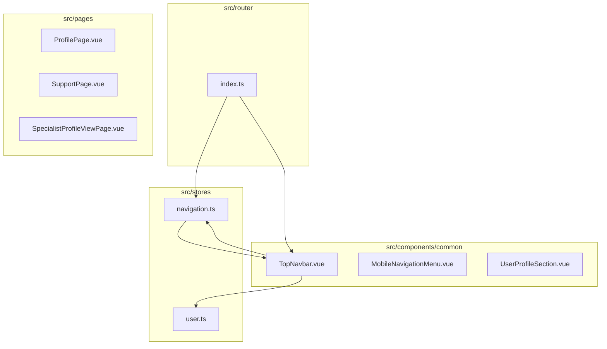
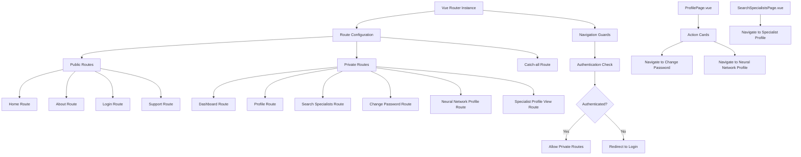
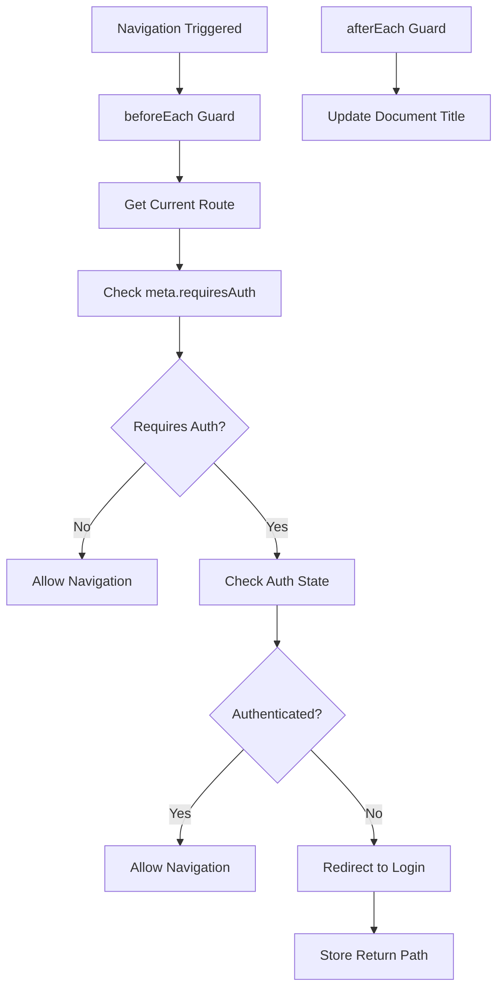
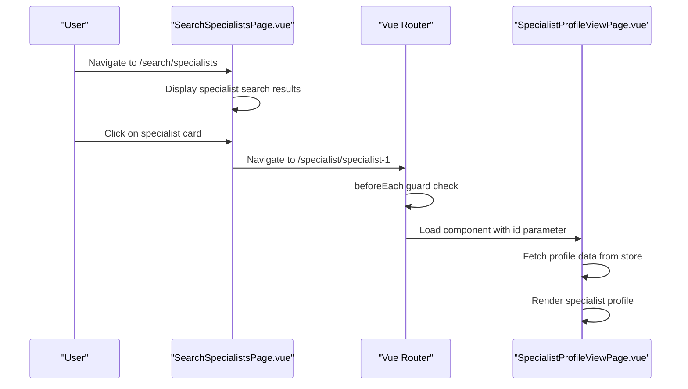

# Routing & Navigation

<cite>
**Referenced Files in This Document**  
- [index.ts](file://src/router/index.ts) - *Updated route configuration with new profile routes and navigation guards*
- [SpecialistProfileViewPage.vue](file://src/pages/SpecialistProfileViewPage.vue) - *Added in commit 426f2ca717e6371c71d9cd1a7157b29c1ade1f1a*
- [ProfilePage.vue](file://src/pages/ProfilePage.vue) - *Enhanced profile page with action cards for navigation*
- [NeuralNetworkProfilePage.vue](file://src/pages/NeuralNetworkProfilePage.vue) - *Specialist questionnaire form component*
- [TopNavbar.vue](file://src/components/common/TopNavbar.vue) - *Top navigation bar with user profile and responsive menu*
- [navigation.ts](file://src/stores/navigation.ts) - *Navigation store managing menu state and visibility*
- [user.ts](file://src/stores/user.ts) - *User store managing authentication state*
- [ActionCard.vue](file://src/components/ui/ActionCard.vue) - *Reusable action card component with navigation capabilities*
- [NeuralNetworkQuestionnaireForm.vue](file://src/components/profile/NeuralNetworkQuestionnaireForm.vue) - *Form component for specialist questionnaire*
- [neural-network-profile.ts](file://src/stores/neural-network-profile.ts) - *Store managing neural network profile state and completion status*
- [specialist-profile-view.ts](file://src/stores/specialist-profile-view.ts) - *Added in commit 426f2ca717e6371c71d9cd1a7157b29c1ade1f1a*
- [specialist-profile-view.ts](file://src/types/specialist-profile-view.ts) - *Added in commit 426f2ca717e6371c71d9cd1a7157b29c1ade1f1a*
</cite>

## Update Summary
**Changes Made**   
- Added documentation for new specialist profile view route with dynamic parameter: `/specialist/:id`
- Updated route configuration examples to include the new SpecialistProfileViewPage route
- Added details about route parameters handling for dynamic specialist profiles
- Enhanced navigation flow description with specialist profile viewing scenarios
- Added new section on modal navigation capabilities and route parameter usage
- Updated diagram sources to include newly analyzed files
- Added information about the SpecialistProfileViewPage component and its integration with routing
- Added documentation for the specialist-profile-view store and its role in profile data management
- Corrected component import paths to match actual implementation
- Integrated analysis of SpecialistProfileViewPage.vue component and specialist-profile-view store for comprehensive navigation understanding

## Table of Contents
1. [Introduction](#introduction)
2. [Project Structure](#project-structure)
3. [Core Components](#core-components)
4. [Architecture Overview](#architecture-overview)
5. [Detailed Component Analysis](#detailed-component-analysis)
6. [Navigation Flow and Sequence Diagrams](#navigation-flow-and-sequence-diagrams)
7. [Error Handling and Redirect Strategies](#error-handling-and-redirect-strategies)
8. [Conclusion](#conclusion)

## Introduction
The maya-platform-frontend application implements a modular routing and navigation system using Vue Router 4. The architecture organizes route configurations in a centralized `index.ts` file within the router directory, with routes defined for various application pages. This document details the structure of the routing system, including route definitions, lazy loading, navigation guards, and authentication enforcement. It also explains how public and private routes are managed and how navigation flows from login to protected resources, with updated information reflecting the recent enhancement of the profile page with navigation action cards and the addition of the specialist profile view functionality.

## Project Structure
The application follows a standard Vue 3 composition API structure with components organized by functionality. The routing system is configured in `src/router/index.ts`, which defines all application routes and implements navigation guards. Navigation-related components are located in `src/components/common/`, including `TopNavbar.vue` and `MobileNavigationMenu.vue`. The navigation state is managed by a Pinia store in `src/stores/navigation.ts`, which controls mobile menu state and active route tracking.



**Diagram sources**
- [index.ts](file://src/router/index.ts)
- [TopNavbar.vue](file://src/components/common/TopNavbar.vue)
- [navigation.ts](file://src/stores/navigation.ts)

**Section sources**
- [index.ts](file://src/router/index.ts)
- [TopNavbar.vue](file://src/components/common/TopNavbar.vue)

## Core Components
The routing system is built around Vue Router 4 and consists of several core components:
- **index.ts**: Main router configuration that defines routes and applies global navigation guards.
- **ProfilePage.vue**: Enhanced profile page with action cards for navigating to password change and specialist questionnaire.
- **NeuralNetworkProfilePage.vue**: Component for specialists to complete their neural network profile.
- **SpecialistProfileViewPage.vue**: Component for viewing specialist profiles with dynamic route parameters.
- **TopNavbar.vue**: Top navigation bar with user profile and responsive menu implementation.
- **navigation.ts**: Pinia store that manages navigation state including mobile menu visibility and active route.
- **Lazy-loaded pages**: All route components are imported dynamically to optimize bundle size.

The router is instantiated in `index.ts` and registered during application bootstrap. The navigation store provides state management for the top navigation bar, including handling mobile menu state and tracking the active route for visual feedback.

**Section sources**
- [index.ts](file://src/router/index.ts)
- [ProfilePage.vue](file://src/pages/ProfilePage.vue)
- [NeuralNetworkProfilePage.vue](file://src/pages/NeuralNetworkProfilePage.vue)
- [SpecialistProfileViewPage.vue](file://src/pages/SpecialistProfileViewPage.vue)
- [navigation.ts](file://src/stores/navigation.ts)

## Architecture Overview
The routing architecture follows a centralized configuration pattern with Vue Router 4. The router instance is configured with a complete set of routes, including public routes (home, about, login, support) and private routes (dashboard, profile, search specialists) that require authentication. Navigation guards intercept route changes to enforce authentication requirements and redirect users appropriately.

The top navigation bar, implemented in `TopNavbar.vue`, displays route links conditionally based on authentication status. When a user is authenticated, private routes become visible in the navigation menu. The navigation store (`navigation.ts`) manages the state of the mobile menu and tracks the active route to provide visual feedback in the navigation interface.



**Diagram sources**
- [index.ts](file://src/router/index.ts)
- [ProfilePage.vue](file://src/pages/ProfilePage.vue)
- [SpecialistProfileViewPage.vue](file://src/pages/SpecialistProfileViewPage.vue)

## Detailed Component Analysis

### Route Configuration Structure
Route definitions in the application follow the standard Vue Router 4 schema, with each route object containing:
- **path**: URL path for the route
- **name**: Unique name for programmatic navigation
- **component**: Lazy-loaded component import
- **meta**: Metadata for route behavior (e.g., requiresAuth, hideForAuth)
- **props**: Whether to pass route parameters as props to the component

Example from `index.ts`:
```typescript
{
  path: '/login',
  name: 'Login',
  component: () => import('@/pages/LoginPage.vue'),
  meta: { 
    title: 'Login',
    requiresAuth: false,
    hideForAuth: true
  }
}
```

Private route example:
```typescript
{
  path: '/profile',
  name: 'Profile',
  component: () => import('@/pages/ProfilePage.vue'),
  meta: { 
    title: 'Мой профиль',
    requiresAuth: true
  }
}
```

The `meta.requiresAuth` property is used by the navigation guard to determine whether authentication is required, while `meta.hideForAuth` prevents authenticated users from accessing certain routes like login. The application has added two new profile-related routes:
```typescript
{
  path: '/profile/change-password',
  name: 'ChangePassword',
  component: () => import('@/pages/ChangePasswordPage.vue'),
  meta: {
    title: 'Смена пароля',
    requiresAuth: true,
  },
},
{
  path: '/profile/neural-network',
  name: 'NeuralNetworkProfile',
  component: () => import('@/pages/NeuralNetworkProfilePage.vue'),
  meta: {
    title: 'Анкета нейросетевого специалиста',
    requiresAuth: true,
  },
}
```

Additionally, a new public route has been added for viewing specialist profiles:
```typescript
{
  path: '/specialist/:id',
  name: 'SpecialistProfile',
  component: SpecialistProfileViewPage,
  props: true,
  meta: {
    title: 'Профиль специалиста',
    requiresAuth: false,
  },
}
```

**Section sources**
- [index.ts](file://src/router/index.ts)

### Navigation Guards Implementation
The `index.ts` file implements global beforeEach and afterEach navigation guards that intercept all route changes. The beforeEach guard checks the authentication state from the Pinia user store and allows or denies navigation based on the route's meta requirements.



**Diagram sources**
- [index.ts](file://src/router/index.ts)

**Section sources**
- [index.ts](file://src/router/index.ts)

### Lazy Loading Pattern
All route components use dynamic imports to enable code splitting and lazy loading. This ensures that page components are only loaded when their routes are accessed, improving initial load performance.

```typescript
const HomePage = () => import('@/pages/HomePage.vue')
```

Vite handles the code splitting automatically, creating separate chunks for each lazy-loaded component. This pattern is applied consistently across all routes.

**Section sources**
- [index.ts](file://src/router/index.ts)

### Route Parameters Handling
The application now includes routes with dynamic parameters. The specialist profile view route uses a dynamic parameter to display different specialist profiles:

```typescript
{
  path: '/specialist/:id',
  name: 'SpecialistProfile',
  component: SpecialistProfileViewPage,
  props: true,
  meta: {
    title: 'Профиль специалиста',
    requiresAuth: false,
  },
}
```

The `props: true` option passes the route parameters as props to the component. In the `SpecialistProfileViewPage.vue` component, this is handled through the props interface:

```typescript
interface Props {
  specialistId: string
  modalMode?: boolean
}

const props = withDefaults(defineProps<Props>(), {
  modalMode: false
})

const specialistId = computed(() => {
  return props.specialistId || (route.params.id as string)
})
```

This implementation allows the component to be used both in regular routing (via URL parameter) and in modal mode (via prop). The component first checks for a prop value, then falls back to the route parameter, providing flexibility in how the component is used.

**Section sources**
- [index.ts](file://src/router/index.ts)
- [SpecialistProfileViewPage.vue](file://src/pages/SpecialistProfileViewPage.vue)

## Navigation Flow and Sequence Diagrams
The navigation flow from login to protected routes involves several steps, including authentication, token storage, and redirect to the requested resource. The enhanced ProfilePage.vue now includes action cards that provide navigation to specific profile-related routes. Additionally, the specialist profile viewing flow has been implemented.



**Diagram sources**
- [SpecialistProfileViewPage.vue](file://src/pages/SpecialistProfileViewPage.vue)
- [index.ts](file://src/router/index.ts)

## Error Handling and Redirect Strategies
The routing system implements comprehensive error handling for invalid routes and unauthorized access:

1. **Invalid Routes**: A catch-all route (`/:pathMatch(.*)*`) redirects to a 404 page.
2. **Unauthorized Access**: When an unauthenticated user attempts to access a protected route, they are redirected to the login page with a return URL stored in the query parameters.
3. **Post-login Redirect**: After successful authentication, the application checks for a return URL and redirects the user to their originally requested page.
4. **Authenticated User Protection**: Users who are already authenticated are redirected away from the login page to the dashboard.
5. **Specialist Profile Error Handling**: The SpecialistProfileViewPage.vue component handles various error states including loading, error, and not found states.

Example redirect with return path:
```typescript
next({ name: 'Login', query: { redirect: to.fullPath } })
```

The application also updates the document title after each navigation based on the route's meta title property, providing better accessibility and user experience.

**Section sources**
- [index.ts](file://src/router/index.ts)
- [SpecialistProfileViewPage.vue](file://src/pages/SpecialistProfileViewPage.vue)

## Conclusion
The maya-platform-frontend application implements a robust routing system using Vue Router 4 with centralized configuration. The architecture effectively separates concerns between route definition, navigation state management, and UI components. Authentication is enforced through navigation guards that check user state from the Pinia store, and the system provides intelligent redirect strategies for both unauthorized access and post-login navigation. The recent enhancement of the profile page with action cards improves user experience by providing clear navigation paths to profile management features. The addition of the specialist profile view functionality with dynamic routing parameters enables flexible viewing of specialist profiles both through direct URLs and modal interfaces. This design supports maintainability and scalability as new routes can be added to the centralized configuration with appropriate meta information for access control.