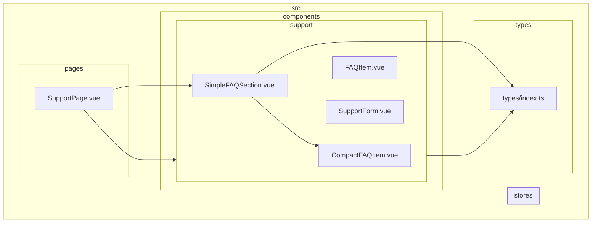
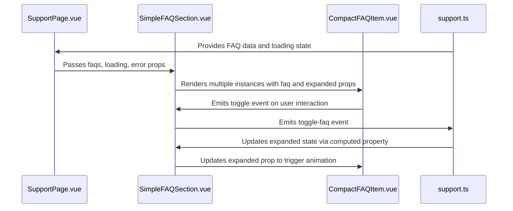
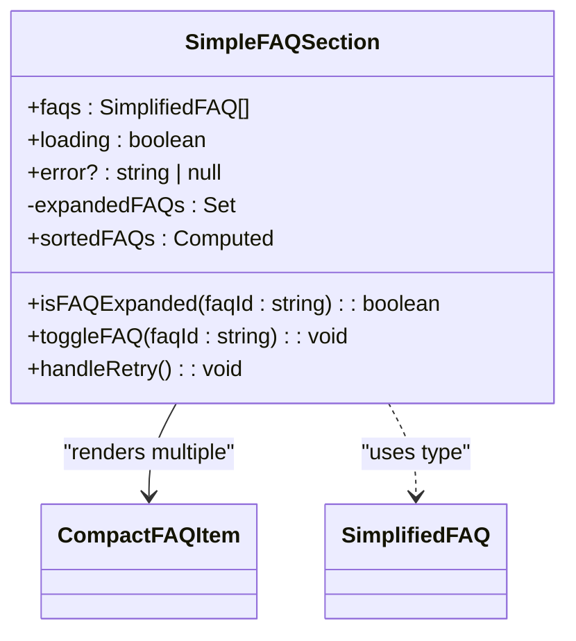
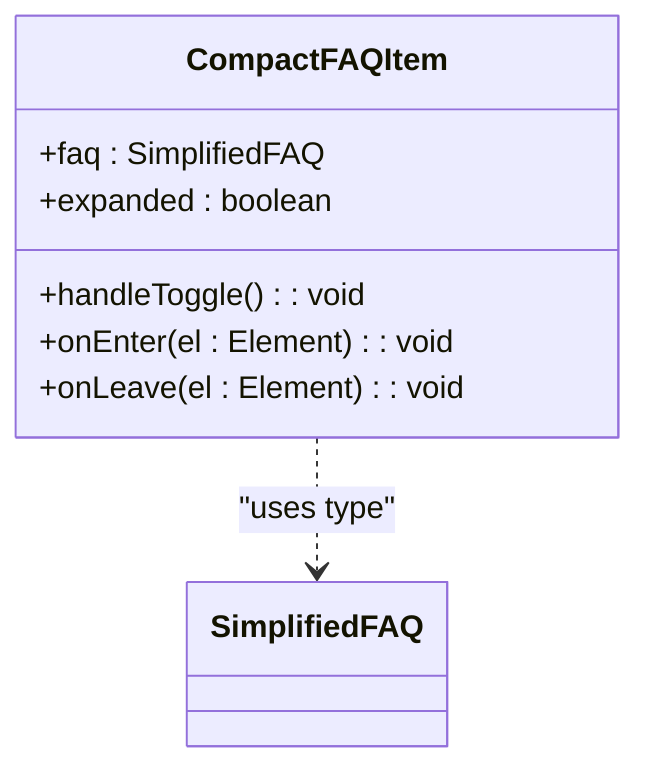
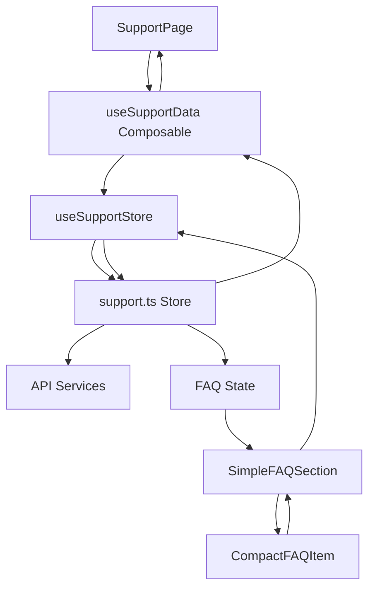

# Simple FAQ Components

<cite>
**Referenced Files in This Document**   
- [SimpleFAQSection.vue](file://src/components/support/SimpleFAQSection.vue)
- [CompactFAQItem.vue](file://src/components/support/CompactFAQItem.vue)
- [index.ts](file://src/types/index.ts)
- [support.ts](file://src/stores/support.ts)
- [SupportPage.vue](file://src/pages/SupportPage.vue)
</cite>

## Table of Contents
1. [Introduction](#introduction)
2. [Project Structure](#project-structure)
3. [Core Components](#core-components)
4. [Architecture Overview](#architecture-overview)
5. [Detailed Component Analysis](#detailed-component-analysis)
6. [State Management and Data Flow](#state-management-and-data-flow)
7. [Accessibility Features](#accessibility-features)
8. [Usage Examples](#usage-examples)
9. [Integration Patterns](#integration-patterns)
10. [Troubleshooting Guide](#troubleshooting-guide)

## Introduction
This document provides comprehensive documentation for the SimpleFAQSection and CompactFAQItem components in the Maya Platform frontend application. These components form a modern, accessible FAQ system designed to display frequently asked questions with smooth animations and responsive interactions. The documentation covers implementation details, props, events, accessibility features, and integration patterns.

## Project Structure
The FAQ components are located within the support module of the components directory, following a feature-based organization pattern. This structure groups related components together based on their functional domain.



**Diagram sources**
- [SimpleFAQSection.vue](file://src/components/support/SimpleFAQSection.vue)
- [CompactFAQItem.vue](file://src/components/support/CompactFAQItem.vue)
- [index.ts](file://src/types/index.ts)
- [support.ts](file://src/stores/support.ts)
- [SupportPage.vue](file://src/pages/SupportPage.vue)

**Section sources**
- [SimpleFAQSection.vue](file://src/components/support/SimpleFAQSection.vue)
- [CompactFAQItem.vue](file://src/components/support/CompactFAQItem.vue)

## Core Components
The SimpleFAQSection and CompactFAQItem components work together to create a streamlined FAQ experience. SimpleFAQSection serves as the container that manages the list of questions and their expanded states, while CompactFAQItem represents individual FAQ entries with interactive toggle functionality.

**Section sources**
- [SimpleFAQSection.vue](file://src/components/support/SimpleFAQSection.vue#L1-L129)
- [CompactFAQItem.vue](file://src/components/support/CompactFAQItem.vue#L1-L99)

## Architecture Overview
The FAQ system follows a parent-child component architecture with unidirectional data flow. The parent component (SimpleFAQSection) manages the state and passes down props to child components (CompactFAQItem), which emit events to communicate user interactions back to the parent.



**Diagram sources**
- [SimpleFAQSection.vue](file://src/components/support/SimpleFAQSection.vue)
- [CompactFAQItem.vue](file://src/components/support/CompactFAQItem.vue)
- [support.ts](file://src/stores/support.ts)
- [SupportPage.vue](file://src/pages/SupportPage.vue)

## Detailed Component Analysis

### SimpleFAQSection Analysis
The SimpleFAQSection component serves as the main container for displaying a list of frequently asked questions. It handles various states including loading, error, empty, and normal display modes.

#### Component Structure


**Diagram sources**
- [SimpleFAQSection.vue](file://src/components/support/SimpleFAQSection.vue#L1-L129)

#### Props
- **faqs**: Array of SimplifiedFAQ objects to display
- **loading**: Boolean indicating whether data is being loaded
- **error**: Optional string containing error message if loading failed

#### Events
- **toggle-faq**: Emitted when a user toggles the expansion state of a FAQ item
- **refresh**: Emitted when the user requests to retry loading data

#### State Management
The component maintains local state for tracking which FAQ items are expanded using a Set data structure for O(1) lookup performance. The sortedFAQs computed property ensures questions are displayed in priority order.

```typescript
const sortedFAQs = computed(() => {
  return [...props.faqs].sort((a, b) => a.priority - b.priority)
})
```

**Section sources**
- [SimpleFAQSection.vue](file://src/components/support/SimpleFAQSection.vue#L1-L129)

### CompactFAQItem Analysis
The CompactFAQItem component represents an individual FAQ entry with a collapsible answer section. It implements smooth height animations using Vue's transition hooks.

#### Component Structure


**Diagram sources**
- [CompactFAQItem.vue](file://src/components/support/CompactFAQItem.vue#L1-L99)

#### Props
- **faq**: SimplifiedFAQ object containing question and answer text
- **expanded**: Boolean indicating whether the answer should be visible

#### Events
- **toggle**: Emitted when the user clicks or uses keyboard navigation to toggle the item

#### Animation Implementation
The component uses Vue's Transition component with JavaScript hooks to create smooth height animations. The onEnter and onLeave methods handle the animation logic:

```typescript
const onEnter = (el: Element): void => {
  const htmlEl = el as HTMLElement
  htmlEl.style.height = '0'
  htmlEl.offsetHeight // trigger reflow
  htmlEl.style.height = htmlEl.scrollHeight + 'px'
}

const onLeave = (el: Element): void => {
  const htmlEl = el as HTMLElement
  htmlEl.style.height = htmlEl.scrollHeight + 'px'
  htmlEl.offsetHeight // trigger reflow
  htmlEl.style.height = '0'
}
```

The CSS ensures a smooth transition:
```css
.faq-answer-enter-active,
.faq-answer-leave-active {
  transition: height 0.3s ease-in-out;
}
```

**Section sources**
- [CompactFAQItem.vue](file://src/components/support/CompactFAQItem.vue#L1-L99)

## State Management and Data Flow
The FAQ system integrates with Pinia for state management, following a clean separation of concerns between components and store.



**Diagram sources**
- [support.ts](file://src/stores/support.ts#L1-L151)
- [SupportPage.vue](file://src/pages/SupportPage.vue#L1-L173)
- [SimpleFAQSection.vue](file://src/components/support/SimpleFAQSection.vue)
- [CompactFAQItem.vue](file://src/components/support/CompactFAQItem.vue)

The data flow follows these steps:
1. SupportPage.vue uses the useSupportData composable to access store data
2. The composable exposes simplified FAQ data to the template
3. SimpleFAQSection receives the simplified data as props
4. When a user interacts with a FAQ item, events propagate back through the component hierarchy
5. The store updates the expanded state accordingly

## Accessibility Features
Both components implement comprehensive accessibility features to ensure usability for all users.

### Keyboard Navigation
CompactFAQItem supports keyboard interaction through:
- **Enter key**: Triggers the toggle action
- **Space key**: Triggers the toggle action (with prevent default)
- **Focus management**: Visual focus indicator through focus:outline-none and focus:ring classes

### ARIA Attributes
The components use appropriate ARIA roles and attributes:
- **aria-expanded**: Indicates the expanded state of each FAQ item
- **aria-controls**: References the ID of the answer element
- **role="region"**: Applied to the answer content for screen readers
- **aria-labelledby**: Connects the answer region to its question

### Semantic HTML
The components use semantic elements:
- **button element**: For the toggle control, ensuring proper keyboard and screen reader support
- **h3 element**: For questions, maintaining proper document outline
- **div elements**: With appropriate roles for dynamic content

**Section sources**
- [CompactFAQItem.vue](file://src/components/support/CompactFAQItem.vue#L1-L99)
- [SimpleFAQSection.vue](file://src/components/support/SimpleFAQSection.vue#L1-L129)

## Usage Examples

### Basic Integration
```vue
<template>
  <SimpleFAQSection
    :faqs="faqs"
    :loading="loading"
    :error="error"
    @toggle-faq="handleToggleFAQ"
    @refresh="handleRefresh"
  />
</template>

<script setup lang="ts">
import { ref } from 'vue'
import SimpleFAQSection from '@/components/support/SimpleFAQSection.vue'
import type { SimplifiedFAQ } from '@/types'

const faqs = ref<SimplifiedifiedFAQ[]>([
  {
    id: '1',
    question: 'How do I reset my password?',
    answer: 'You can reset your password by clicking the "Forgot Password" link on the login page.',
    priority: 1
  },
  {
    id: '2',
    question: 'What are your business hours?',
    answer: 'Our support team is available Monday through Friday, 9 AM to 5 PM EST.',
    priority: 2
  }
])

const loading = ref(false)
const error = ref<string | null>(null)

const handleToggleFAQ = (faqId: string) => {
  console.log('Toggled FAQ:', faqId)
}

const handleRefresh = () => {
  // Refresh data logic
}
</script>
```

### Advanced Integration with Store
```vue
<template>
  <SimpleFAQSection
    :faqs="simplifiedFAQs"
    :loading="loading.faqs"
    :error="error"
    @toggle-faq="toggleFAQ"
    @refresh="refreshFAQs"
  />
</template>

<script setup lang="ts">
import { computed } from 'vue'
import { useSupportStore } from '@/stores/support'
import SimpleFAQSection from '@/components/support/SimpleFAQSection.vue'
import type { SimplifiedFAQ } from '@/types'

const supportStore = useSupportStore()

const simplifiedFAQs = computed((): SimplifiedFAQ[] => {
  return supportStore.faqs.map(faq => ({
    id: faq.id,
    question: faq.question,
    answer: faq.answer,
    priority: faq.priority,
    isPopular: faq.isPopular
  }))
})

const { loading, error, toggleFAQ, refreshFAQs } = supportStore
</script>
```

**Section sources**
- [SupportPage.vue](file://src/pages/SupportPage.vue#L1-L173)
- [SimpleFAQSection.vue](file://src/components/support/SimpleFAQSection.vue)

## Integration Patterns

### Data Transformation Pattern
The system uses a data transformation pattern to convert the full FAQ interface to a simplified version:

```typescript
export interface FAQ {
  id: string
  question: string
  answer: string
  category: 'general' | 'technical' | 'billing' | 'account'
  priority: number
  isPopular: boolean
  createdAt: string
  updatedAt: string
}

export interface SimplifiedFAQ {
  id: string
  question: string
  answer: string
  priority: number
  isPopular?: boolean
}
```

This pattern allows the components to receive only the data they need while maintaining flexibility for future enhancements.

### Error Handling Pattern
The components implement a comprehensive error handling pattern with multiple states:
- **Loading state**: Visual indication with skeleton loaders
- **Error state**: Clear error message with retry button
- **Empty state**: Friendly message when no data is available

### Responsive Design
The components use Tailwind CSS for responsive design:
- **Mobile-first approach**: Styles start from mobile and scale up
- **Dark mode support**: Uses dark: variants for dark theme
- **Hover states**: Subtle visual feedback on interactive elements

**Section sources**
- [SimpleFAQSection.vue](file://src/components/support/SimpleFAQSection.vue)
- [CompactFAQItem.vue](file://src/components/support/CompactFAQItem.vue)
- [index.ts](file://src/types/index.ts)

## Troubleshooting Guide

### Common Issues and Solutions

#### FAQ Items Not Expanding
**Symptoms**: Clicking on FAQ items does not expand them.

**Causes and Solutions**:
- Ensure the parent component is properly handling the `toggle-faq` event
- Verify that the `expanded` prop is being updated in response to the event
- Check that the FAQ IDs are unique and consistent across components

#### Animation Not Working
**Symptoms**: The answer section appears/disappears without animation.

**Causes and Solutions**:
- Ensure the `Transition` component is properly configured
- Verify that the CSS classes for enter/leave transitions are present
- Check that the `onEnter` and `onLeave` methods are correctly implemented

#### Accessibility Issues
**Symptoms**: Screen readers don't announce expanded state correctly.

**Causes and Solutions**:
- Verify that `aria-expanded` attribute is properly bound to the expanded state
- Ensure `aria-controls` references the correct answer element ID
- Check that the button element has proper focus management

#### Data Not Displaying
**Symptoms**: FAQ list appears empty even when data is available.

**Causes and Solutions**:
- Verify that the `faqs` prop contains data
- Check that the `sortedFAQs` computed property is working correctly
- Ensure the data structure matches the SimplifiedFAQ interface

**Section sources**
- [SimpleFAQSection.vue](file://src/components/support/SimpleFAQSection.vue)
- [CompactFAQItem.vue](file://src/components/support/CompactFAQItem.vue)
- [support.ts](file://src/stores/support.ts)