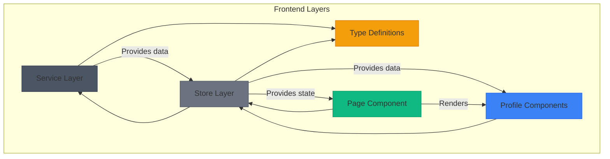
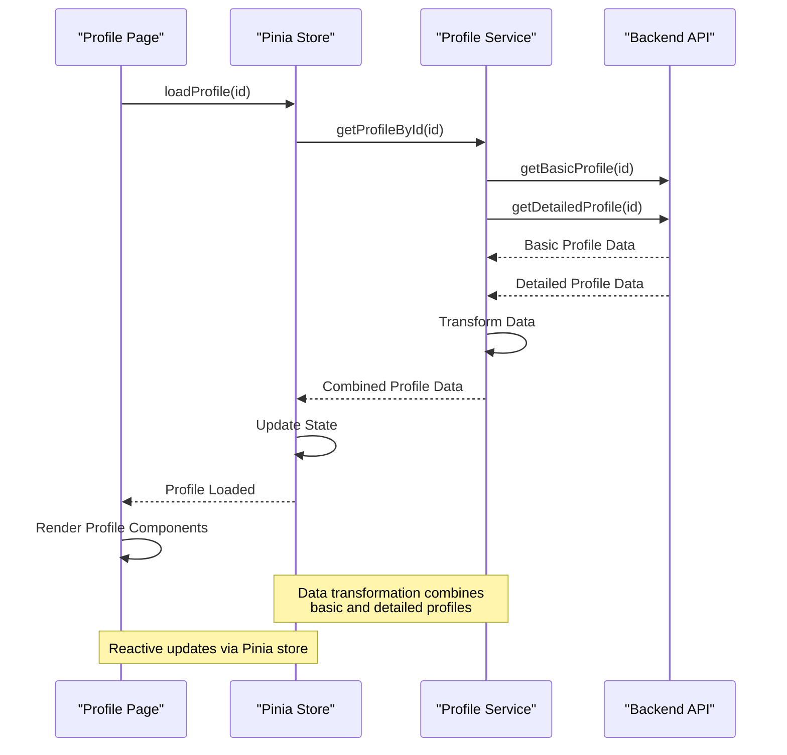
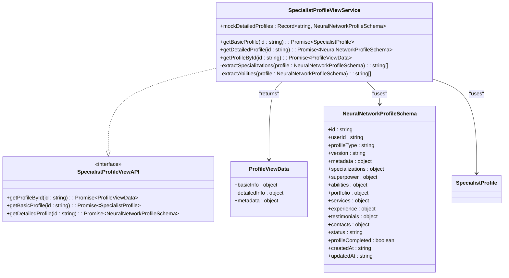
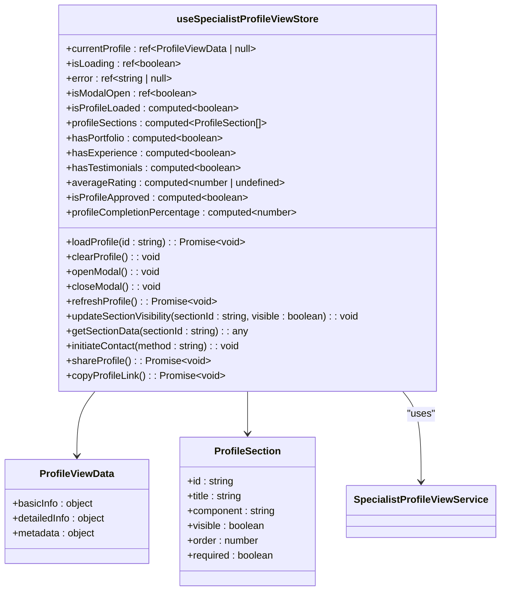
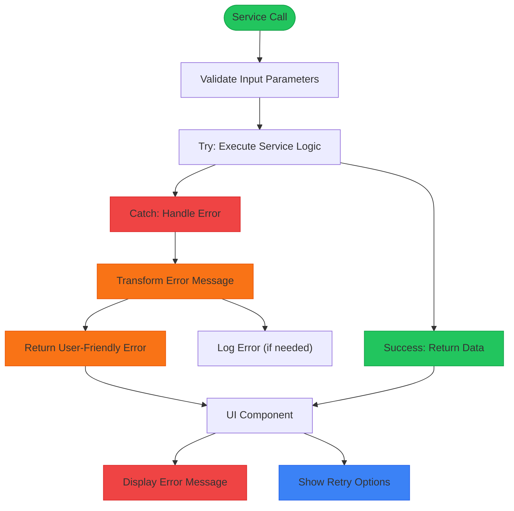
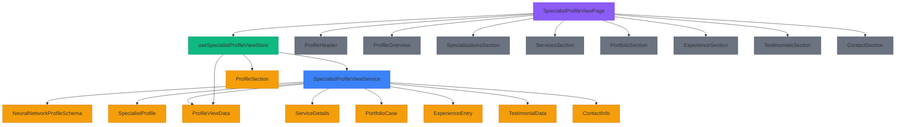

# Specialist Profile API Service

<cite>
**Referenced Files in This Document**   
- [specialist-profile-view.ts](file://src/services/specialist-profile-view.ts)
- [specialist-profile-view.ts](file://src/stores/specialist-profile-view.ts)
- [specialist-profile-view.ts](file://src/types/specialist-profile-view.ts)
- [SpecialistProfileViewPage.vue](file://src/pages/SpecialistProfileViewPage.vue)
</cite>

## Table of Contents
1. [Introduction](#introduction)
2. [Project Structure](#project-structure)
3. [Core Components](#core-components)
4. [Architecture Overview](#architecture-overview)
5. [Detailed Component Analysis](#detailed-component-analysis)
6. [Dependency Analysis](#dependency-analysis)
7. [Performance Considerations](#performance-considerations)
8. [Troubleshooting Guide](#troubleshooting-guide)
9. [Conclusion](#conclusion)

## Introduction

The Specialist Profile API Service is a frontend implementation responsible for retrieving, aggregating, and displaying comprehensive specialist profile information in the MayaWork. This service integrates data from multiple sources to provide a unified view of specialist profiles, combining basic search data with detailed neural network profile information. The service supports both direct profile viewing and modal-based interactions, with robust error handling and state management.

## Project Structure

The Specialist Profile API Service is organized within the frontend repository using a modular architecture that separates concerns across services, stores, types, and components. The key directories involved in this service are:

- `src/services`: Contains the core business logic and API service implementation
- `src/stores`: Manages application state using Pinia
- `src/types`: Defines TypeScript interfaces and types for type safety
- `src/pages`: Contains the main page component that renders the profile view
- `src/components/profile`: Houses reusable UI components for different sections of the profile



**Diagram sources**
- [specialist-profile-view.ts](file://src/services/specialist-profile-view.ts)
- [specialist-profile-view.ts](file://src/stores/specialist-profile-view.ts)
- [specialist-profile-view.ts](file://src/types/specialist-profile-view.ts)
- [SpecialistProfileViewPage.vue](file://src/pages/SpecialistProfileViewPage.vue)

**Section sources**
- [specialist-profile-view.ts](file://src/services/specialist-profile-view.ts)
- [specialist-profile-view.ts](file://src/stores/specialist-profile-view.ts)
- [specialist-profile-view.ts](file://src/types/specialist-profile-view.ts)
- [SpecialistProfileViewPage.vue](file://src/pages/SpecialistProfileViewPage.vue)

## Core Components

The Specialist Profile API Service consists of four main components that work together to deliver profile data to the user interface:

1. **SpecialistProfileViewService**: The core service class that handles data retrieval and aggregation
2. **useSpecialistProfileViewStore**: The Pinia store that manages application state
3. **SpecialistProfileViewPage**: The main page component that orchestrates the UI
4. **Profile Section Components**: Reusable components for different sections of the profile

The service follows a clean architecture pattern, with clear separation between data access, state management, and presentation layers. The service implementation uses TypeScript interfaces to ensure type safety throughout the application.

**Section sources**
- [specialist-profile-view.ts](file://src/services/specialist-profile-view.ts)
- [specialist-profile-view.ts](file://src/stores/specialist-profile-view.ts)
- [specialist-profile-view.ts](file://src/types/specialist-profile-view.ts)
- [SpecialistProfileViewPage.vue](file://src/pages/SpecialistProfileViewPage.vue)

## Architecture Overview

The Specialist Profile API Service follows a layered architecture that separates concerns and promotes reusability. The service retrieves data from multiple sources, transforms it into a unified format, and makes it available to the UI components through a centralized store.



**Diagram sources**
- [specialist-profile-view.ts](file://src/services/specialist-profile-view.ts)
- [specialist-profile-view.ts](file://src/stores/specialist-profile-view.ts)
- [SpecialistProfileViewPage.vue](file://src/pages/SpecialistProfileViewPage.vue)

## Detailed Component Analysis

### Specialist Profile View Service Analysis

The SpecialistProfileViewService is the core business logic component responsible for retrieving and aggregating specialist profile data from multiple sources. It implements the SpecialistProfileViewAPI interface and provides methods for fetching both basic and detailed profile information.

#### Service Implementation


**Diagram sources**
- [specialist-profile-view.ts](file://src/services/specialist-profile-view.ts)
- [specialist-profile-view.ts](file://src/types/specialist-profile-view.ts)

**Section sources**
- [specialist-profile-view.ts](file://src/services/specialist-profile-view.ts#L1-L470)

### State Management Store Analysis

The useSpecialistProfileViewStore is a Pinia store that manages the application state for the specialist profile view. It provides a reactive interface for components to access profile data and perform actions.

#### Store Implementation


**Diagram sources**
- [specialist-profile-view.ts](file://src/stores/specialist-profile-view.ts)
- [specialist-profile-view.ts](file://src/types/specialist-profile-view.ts)

**Section sources**
- [specialist-profile-view.ts](file://src/stores/specialist-profile-view.ts#L1-L344)

### API Endpoints and Request/Response Structures

The Specialist Profile API Service exposes several endpoints for retrieving profile data. These endpoints follow a consistent pattern for request and response structures.

#### Endpoint: GET /profile/{id}
Retrieves a complete specialist profile by ID, combining data from multiple sources.

**Request Structure**
```json
{
  "id": "specialist-1"
}
```

**Response Structure**
```json
{
  "basicInfo": {
    "id": "string",
    "userId": "string",
    "displayName": "string",
    "superpower": "string",
    "avatarUrl": "string | undefined",
    "status": "available | busy | unavailable",
    "lastActive": "string"
  },
  "detailedInfo": {
    "specializations": ["string"],
    "abilities": ["string"],
    "services": [
      {
        "name": "string",
        "description": "string",
        "price": "number | string",
        "priceType": "fixed | hourly | project | negotiable",
        "category": "string",
        "isCustom": "boolean"
      }
    ],
    "portfolio": [
      {
        "id": "string",
        "title": "string",
        "description": "string",
        "type": "text | link | visual | bot | landing",
        "content": "string | FileReference",
        "result": "string",
        "tools": ["string"],
        "createdAt": "string"
      }
    ],
    "experience": [
      {
        "id": "string",
        "client": "string",
        "task": "string",
        "tools": ["string"],
        "result": "string",
        "duration": "string",
        "year": "string"
      }
    ],
    "testimonials": {
      "textTestimonials": [
        {
          "id": "string",
          "clientName": "string",
          "clientPosition": "string",
          "testimonialText": "string",
          "rating": "number",
          "projectType": "string",
          "date": "string"
        }
      ],
      "externalLinks": ["string"],
      "files": ["FileReference"],
      "averageRating": "number",
      "totalCount": "number"
    },
    "contacts": {
      "telegram": "string",
      "email": "string",
      "website": "string",
      "phone": "string",
      "whatsapp": "string",
      "discord": "string",
      "linkedin": "string",
      "preferredContact": "string",
      "responseTime": "string",
      "availability": "string"
    }
  },
  "metadata": {
    "profileCompleted": "boolean",
    "completionPercentage": "number",
    "moderationStatus": "draft | pending | approved | rejected",
    "lastUpdated": "string"
  }
}
```

**Section sources**
- [specialist-profile-view.ts](file://src/services/specialist-profile-view.ts#L1-L470)
- [specialist-profile-view.ts](file://src/types/specialist-profile-view.ts#L1-L282)

### Error Handling Patterns

The Specialist Profile API Service implements comprehensive error handling to ensure a robust user experience. Errors are handled at multiple levels, from service implementation to UI presentation.

#### Error Handling Flow


The service uses a try-catch block in the `getProfileById` method to catch any errors that occur during data retrieval. Errors are transformed into user-friendly messages and stored in the Pinia store for display in the UI. The UI component displays an error state with options to retry or navigate back.

**Section sources**
- [specialist-profile-view.ts](file://src/services/specialist-profile-view.ts#L1-L470)
- [SpecialistProfileViewPage.vue](file://src/pages/SpecialistProfileViewPage.vue#L1-L401)

## Dependency Analysis

The Specialist Profile API Service has a well-defined dependency structure that promotes loose coupling and testability. The service depends on type definitions and interfaces but has no direct dependencies on UI components.



**Diagram sources**
- [specialist-profile-view.ts](file://src/services/specialist-profile-view.ts)
- [specialist-profile-view.ts](file://src/stores/specialist-profile-view.ts)
- [specialist-profile-view.ts](file://src/types/specialist-profile-view.ts)
- [SpecialistProfileViewPage.vue](file://src/pages/SpecialistProfileViewPage.vue)

**Section sources**
- [specialist-profile-view.ts](file://src/services/specialist-profile-view.ts)
- [specialist-profile-view.ts](file://src/stores/specialist-profile-view.ts)
- [specialist-profile-view.ts](file://src/types/specialist-profile-view.ts)
- [SpecialistProfileViewPage.vue](file://src/pages/SpecialistProfileViewPage.vue)

## Performance Considerations

The Specialist Profile API Service implements several performance optimizations to ensure a responsive user experience:

1. **Parallel Data Loading**: The service uses `Promise.all` to fetch basic and detailed profile data simultaneously, reducing overall load time.

2. **State Caching**: The Pinia store caches the loaded profile data, preventing unnecessary re-fetching when navigating back to the same profile.

3. **Conditional Rendering**: The UI components conditionally render sections based on data availability, reducing the rendering workload.

4. **Efficient Data Transformation**: The service performs data transformation only once when loading the profile, rather than on each render.

5. **Lazy Loading**: Optional sections (portfolio, experience, testimonials) are only rendered when they contain data.

The service currently uses mock data with artificial delays to simulate API calls. In a production environment, these delays would be replaced with actual network requests, and additional optimizations such as data caching and pagination might be necessary for large datasets.

## Troubleshooting Guide

### Common Issues and Solutions

**Issue: Profile fails to load**
- **Possible Causes**: Invalid specialist ID, network connectivity issues, server errors
- **Solutions**: Verify the specialist ID, check network connection, retry the request

**Issue: Missing profile sections**
- **Possible Causes**: Data not available in the detailed profile, conditional rendering logic
- **Solutions**: Check if the specialist has added data to the section, verify the store's computed properties

**Issue: Incorrect data display**
- **Possible Causes**: Data transformation errors, type mismatches
- **Solutions**: Verify the data transformation logic in the service, check TypeScript interfaces for consistency

**Issue: Modal not closing properly**
- **Possible Causes**: Event listeners not cleaned up, body scroll not restored
- **Solutions**: Ensure onUnmounted lifecycle hook is called, verify closeModal action

### Debugging Tips

1. Check the browser console for error messages
2. Verify the specialist ID being passed to the service
3. Inspect the Pinia store state using Vue DevTools
4. Check network requests in the browser's developer tools
5. Verify that all required dependencies are properly imported

**Section sources**
- [specialist-profile-view.ts](file://src/services/specialist-profile-view.ts)
- [specialist-profile-view.ts](file://src/stores/specialist-profile-view.ts)
- [SpecialistProfileViewPage.vue](file://src/pages/SpecialistProfileViewPage.vue)

## Conclusion

The Specialist Profile API Service provides a robust and scalable solution for displaying specialist profiles in the MayaWork. By combining data from multiple sources and using a clean architecture with proper separation of concerns, the service delivers a rich user experience with comprehensive profile information. The implementation follows best practices for state management, error handling, and performance optimization, making it maintainable and extensible. The service could be further enhanced with features like data caching, pagination for large datasets, and improved loading states for better user experience.