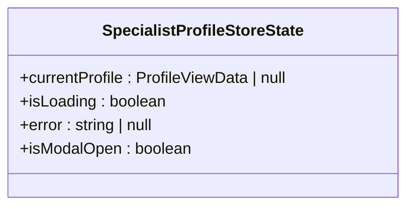
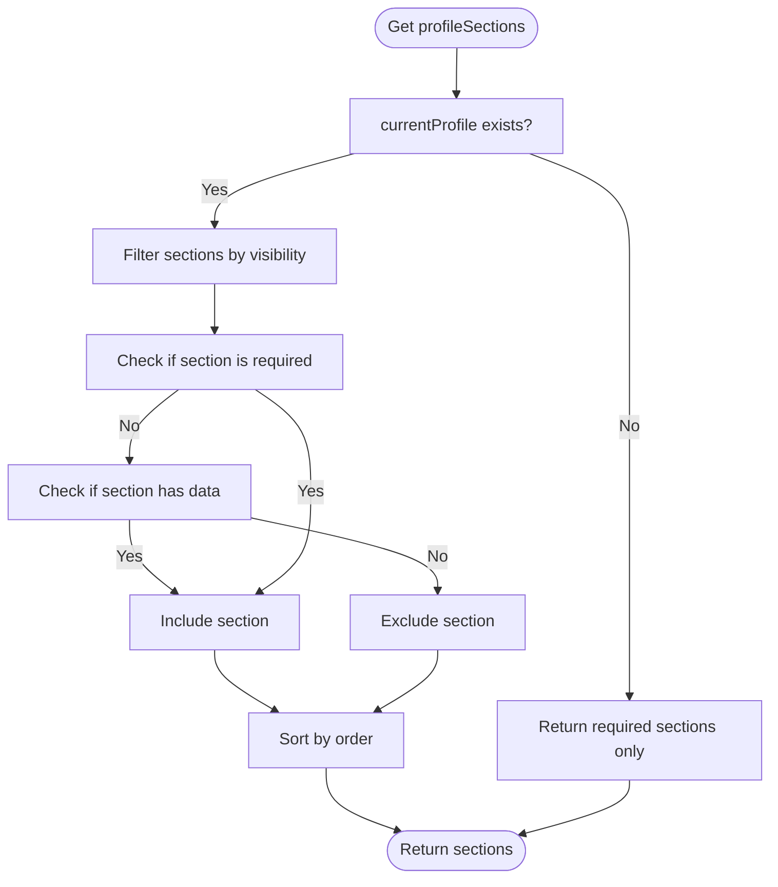
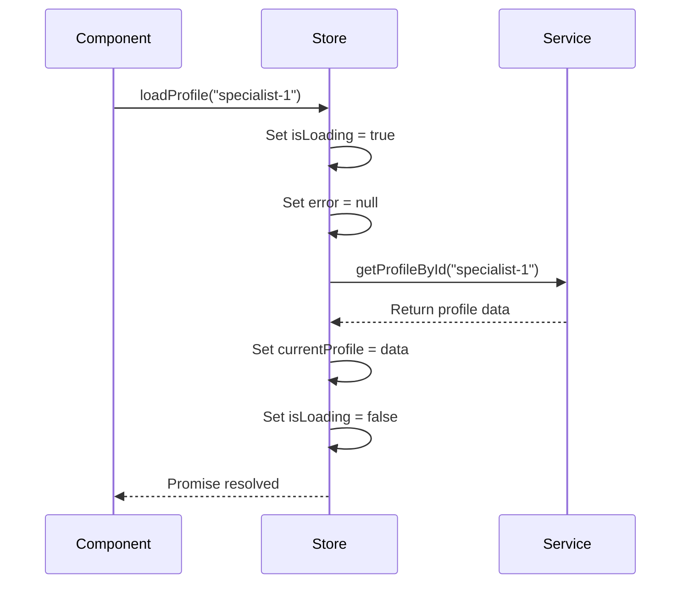
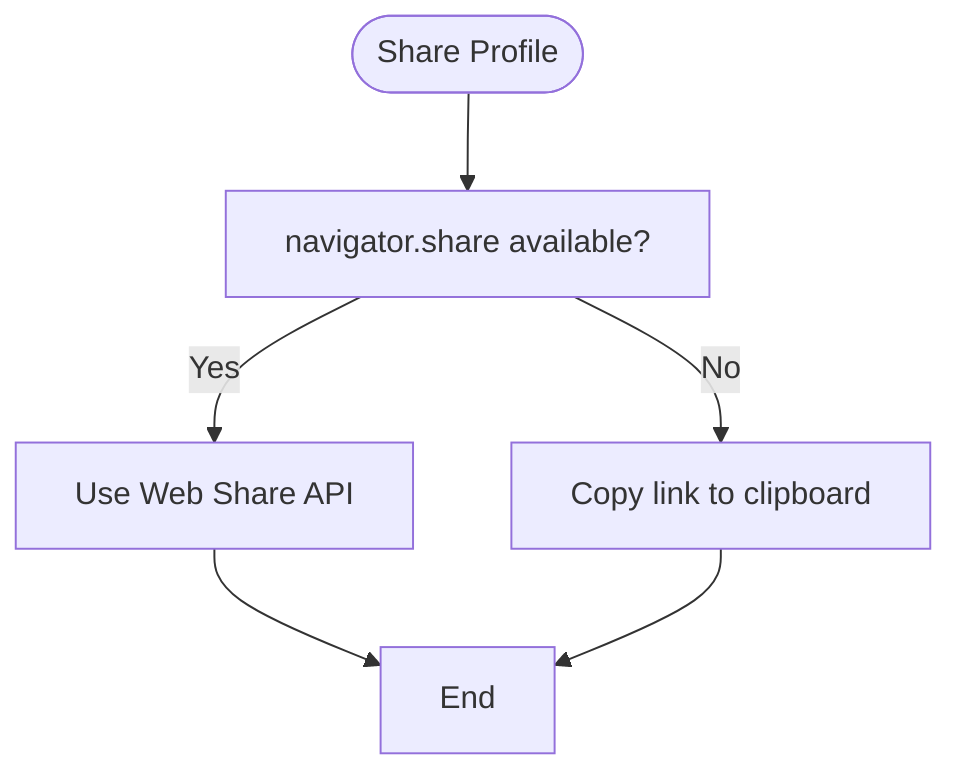
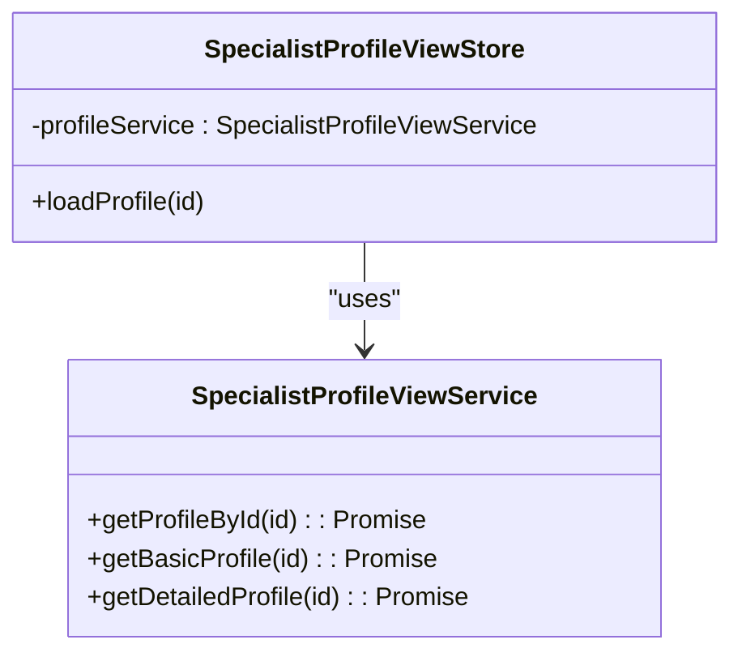
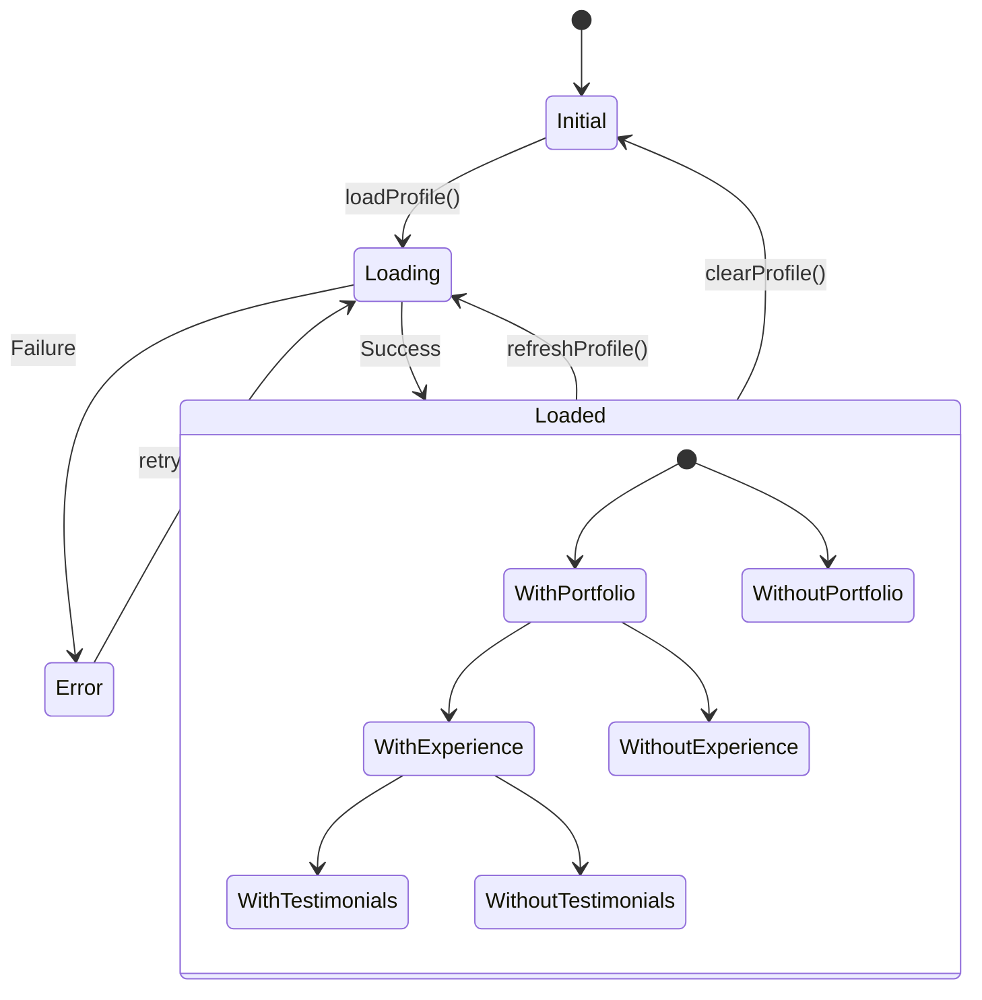
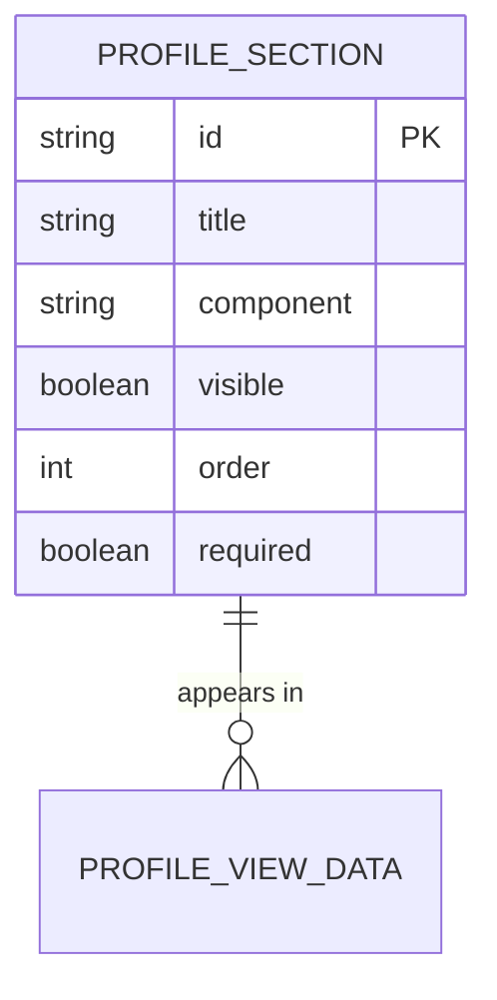
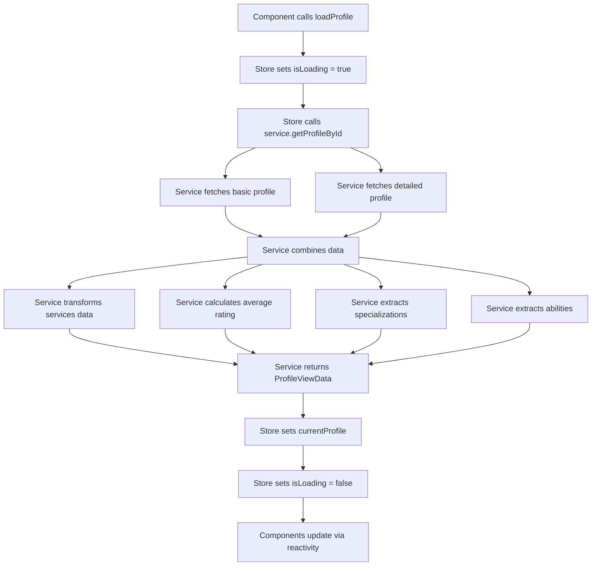
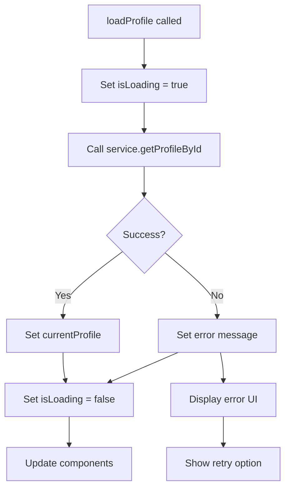

# Specialist Profile Store

<cite>
**Referenced Files in This Document**   
- [specialist-profile-view.ts](file://src/stores/specialist-profile-view.ts)
- [specialist-profile-view.ts](file://src/types/specialist-profile-view.ts)
- [specialist-profile-view.ts](file://src/services/specialist-profile-view.ts)
- [SpecialistProfileViewPage.vue](file://src/pages/SpecialistProfileViewPage.vue)
</cite>

## Table of Contents
1. [Introduction](#introduction)
2. [State Properties](#state-properties)
3. [Getters](#getters)
4. [Actions](#actions)
5. [Helper Methods](#helper-methods)
6. [Integration with API Service](#integration-with-api-service)
7. [Component State Management](#component-state-management)
8. [Profile Sections Configuration](#profile-sections-configuration)
9. [Data Flow and Processing Logic](#data-flow-and-processing-logic)
10. [Error Handling](#error-handling)

## Introduction
The Specialist Profile Store is a Pinia-based state management module responsible for managing the state of specialist profiles within the application. It handles loading, storing, and providing access to specialist profile data, as well as managing UI state such as modal visibility and loading states. The store integrates with the SpecialistProfileViewService to fetch data from the backend and provides a clean interface for components to interact with profile information.

**Section sources**
- [specialist-profile-view.ts](file://src/stores/specialist-profile-view.ts#L1-L344)

## State Properties
The store maintains several reactive state properties that represent the current state of the specialist profile view:

- **currentProfile**: Stores the complete profile data of the currently viewed specialist, or null if no profile is loaded
- **isLoading**: Boolean flag indicating whether a profile is currently being loaded
- **error**: String containing error message if profile loading fails, or null if no error occurred
- **isModalOpen**: Boolean flag tracking whether the profile view modal is currently open

These properties are defined using Vue's ref function to ensure reactivity, allowing components to automatically update when the state changes.

**Diagram sources**
- [specialist-profile-view.ts](file://src/stores/specialist-profile-view.ts#L9-L15)

**Section sources**
- [specialist-profile-view.ts](file://src/stores/specialist-profile-view.ts#L9-L15)

## Getters
The store provides computed getters that derive information from the state, enabling efficient data access and conditional rendering in components:

- **isProfileLoaded**: Returns true if currentProfile is not null, indicating a profile has been successfully loaded
- **profileSections**: Computes the list of visible profile sections based on the current profile data and section configuration
- **hasPortfolio**: Indicates whether the current profile has portfolio items
- **hasExperience**: Indicates whether the current profile has experience entries
- **hasTestimonials**: Indicates whether the current profile has testimonials
- **averageRating**: Returns the average rating from testimonials, if available
- **isProfileApproved**: Checks if the profile's moderation status is 'approved'
- **profileCompletionPercentage**: Returns the percentage completion of the profile

The profileSections getter is particularly sophisticated, filtering sections based on visibility, requirements, and data availability, then sorting them by order.

**Diagram sources**
- [specialist-profile-view.ts](file://src/stores/specialist-profile-view.ts#L58-L104)

**Section sources**
- [specialist-profile-view.ts](file://src/stores/specialist-profile-view.ts#L58-L104)

## Actions
The store exposes several actions that can be called by components to modify state or perform operations:

- **loadProfile(id)**: Asynchronously loads a profile by ID, setting loading state and handling errors
- **clearProfile()**: Resets all state properties to their initial values
- **openModal()**: Sets isModalOpen to true and prevents body scrolling
- **closeModal()**: Sets isModalOpen to false and restores body scrolling
- **refreshProfile()**: Reloads the currently displayed profile
- **updateSectionVisibility(sectionId, visible)**: Updates the visibility of a specific section
- **getSectionData(sectionId)**: Returns data specific to a section for component consumption

The loadProfile action implements proper loading state management and error handling, ensuring the UI reflects the current operation status.

**Diagram sources**
- [specialist-profile-view.ts](file://src/stores/specialist-profile-view.ts#L110-L140)

**Section sources**
- [specialist-profile-view.ts](file://src/stores/specialist-profile-view.ts#L110-L140)

## Helper Methods
The store includes several helper methods that facilitate user interactions and common operations:

- **initiateContact(method)**: Opens external applications for contacting the specialist via specified method (telegram, email, website, phone, whatsapp)
- **shareProfile()**: Attempts to use the Web Share API to share the profile, falling back to clipboard copying
- **copyProfileLink()**: Copies the current page URL to the clipboard

These methods handle the construction of appropriate URLs for different contact methods and manage browser API availability gracefully.

**Diagram sources**
- [specialist-profile-view.ts](file://src/stores/specialist-profile-view.ts#L280-L344)

**Section sources**
- [specialist-profile-view.ts](file://src/stores/specialist-profile-view.ts#L280-L344)

## Integration with API Service
The store integrates with the SpecialistProfileViewService to fetch profile data from the backend. It creates an instance of the service and uses it in the loadProfile action to retrieve profile information.

The service implements the SpecialistProfileViewAPI interface and provides methods to fetch both basic and detailed profile information. The getProfileById method combines data from multiple sources to create a comprehensive ProfileViewData object.

**Diagram sources**
- [specialist-profile-view.ts](file://src/stores/specialist-profile-view.ts#L17-L19)
- [specialist-profile-view.ts](file://src/services/specialist-profile-view.ts#L1-L471)

**Section sources**
- [specialist-profile-view.ts](file://src/stores/specialist-profile-view.ts#L17-L19)
- [specialist-profile-view.ts](file://src/services/specialist-profile-view.ts#L1-L471)

## Component State Management
The store manages component state through its reactive properties and getters, enabling components to respond to state changes automatically. The SpecialistProfileViewPage component uses the store to manage its rendering states:

- **Loading state**: Displayed when isLoading is true
- **Error state**: Displayed when error is not null
- **Profile content**: Displayed when currentProfile is not null
- **Not found state**: Displayed when no profile is loaded and no error exists

The component also uses computed getters like hasPortfolio, hasExperience, and hasTestimonials to conditionally render sections only when they contain data.

**Diagram sources**
- [SpecialistProfileViewPage.vue](file://src/pages/SpecialistProfileViewPage.vue#L1-L402)

**Section sources**
- [SpecialistProfileViewPage.vue](file://src/pages/SpecialistProfileViewPage.vue#L1-L402)

## Profile Sections Configuration
The store defines a default configuration for profile sections, specifying their properties and rendering order:

- **id**: Unique identifier for the section
- **title**: Display title (currently in Russian, needs translation)
- **component**: Name of the component used to render the section
- **visible**: Boolean indicating if the section should be displayed
- **order**: Number determining the rendering order
- **required**: Boolean indicating if the section must always be shown

The configuration enables dynamic section management, allowing visibility to be toggled and sections to be automatically hidden when they lack data (for non-required sections).

**Diagram sources**
- [specialist-profile-view.ts](file://src/stores/specialist-profile-view.ts#L21-L56)

**Section sources**
- [specialist-profile-view.ts](file://src/stores/specialist-profile-view.ts#L21-L56)

## Data Flow and Processing Logic
The data flow begins when a component calls loadProfile with a specialist ID. The store sets loading state, calls the service's getProfileById method, and processes the response by transforming the data into the appropriate structure for the UI.

The service combines data from basic and detailed profiles, transforms service pricing information, calculates average ratings, and extracts specializations and abilities from the neural network profile schema.

**Diagram sources**
- [specialist-profile-view.ts](file://src/stores/specialist-profile-view.ts#L110-L140)
- [specialist-profile-view.ts](file://src/services/specialist-profile-view.ts#L200-L471)

**Section sources**
- [specialist-profile-view.ts](file://src/stores/specialist-profile-view.ts#L110-L140)
- [specialist-profile-view.ts](file://src/services/specialist-profile-view.ts#L200-L471)

## Error Handling
The store implements comprehensive error handling to ensure a robust user experience:

- **Loading errors**: Caught in the loadProfile action, setting the error property with a descriptive message
- **Network errors**: Handled by the service and propagated to the store
- **Validation errors**: Managed by the service when processing profile data
- **API errors**: Translated into user-friendly messages

The error state is exposed through the error getter, allowing components to display appropriate error messages and recovery options like retry buttons.

**Diagram sources**
- [specialist-profile-view.ts](file://src/stores/specialist-profile-view.ts#L110-L140)

**Section sources**
- [specialist-profile-view.ts](file://src/stores/specialist-profile-view.ts#L110-L140)