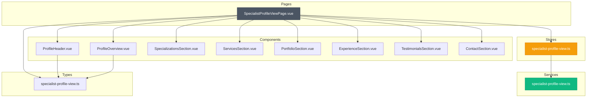
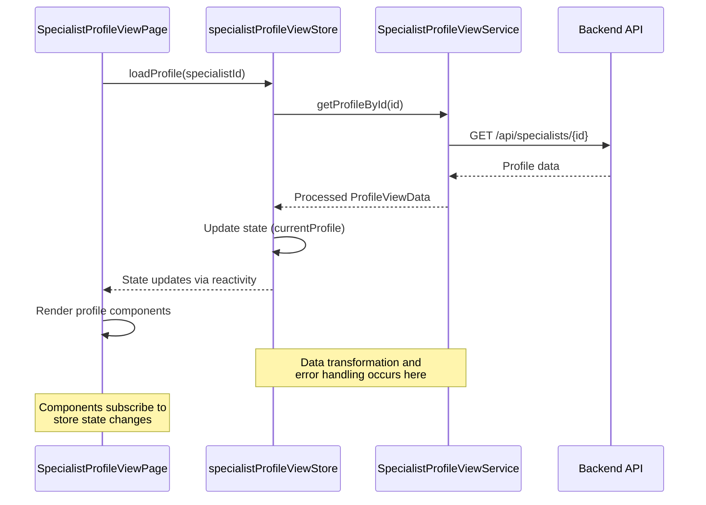
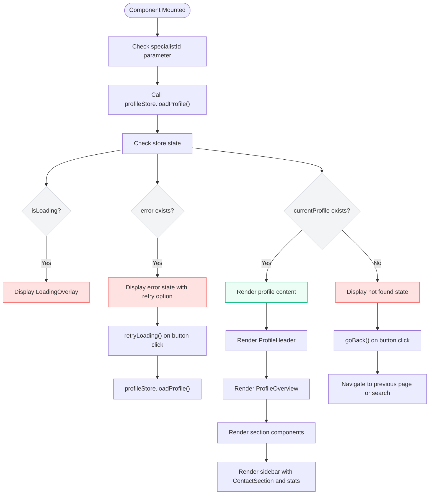
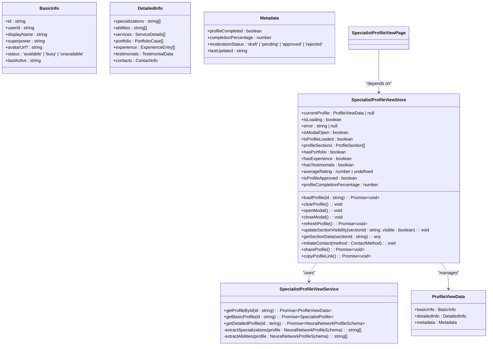

# Specialist Profile View Implementation

<cite>
**Referenced Files in This Document**   
- [SpecialistProfileViewPage.vue](file://src/pages/SpecialistProfileViewPage.vue)
- [specialist-profile-view.ts](file://src/services/specialist-profile-view.ts)
- [specialist-profile-view.ts](file://src/stores/specialist-profile-view.ts)
- [specialist-profile-view.ts](file://src/types/specialist-profile-view.ts)
- [ProfileHeader.vue](file://src/components/profile/ProfileHeader.vue)
- [ProfileOverview.vue](file://src/components/profile/ProfileOverview.vue)
</cite>

## Table of Contents
1. [Introduction](#introduction)
2. [Project Structure](#project-structure)
3. [Core Components](#core-components)
4. [Architecture Overview](#architecture-overview)
5. [Detailed Component Analysis](#detailed-component-analysis)
6. [Dependency Analysis](#dependency-analysis)
7. [Performance Considerations](#performance-considerations)
8. [Troubleshooting Guide](#troubleshooting-guide)
9. [Conclusion](#conclusion)

## Introduction
The Specialist Profile View Implementation provides a comprehensive solution for displaying detailed specialist profiles within the MayaWork. This documentation covers the implementation of the SpecialistProfileViewPage and related components, detailing their purpose, architecture, and integration patterns. The system enables users to view comprehensive specialist information including specializations, services, portfolio, experience, and testimonials, with support for both standalone page views and modal presentations.

## Project Structure
The Specialist Profile View functionality is organized within the Vue.js application structure following a feature-based organization pattern. The core components are located in specific directories based on their functionality, with clear separation between pages, components, services, stores, and types.



**Diagram sources**
- [SpecialistProfileViewPage.vue](file://src/pages/SpecialistProfileViewPage.vue)
- [ProfileHeader.vue](file://src/components/profile/ProfileHeader.vue)
- [ProfileOverview.vue](file://src/components/profile/ProfileOverview.vue)
- [specialist-profile-view.ts](file://src/services/specialist-profile-view.ts)
- [specialist-profile-view.ts](file://src/stores/specialist-profile-view.ts)
- [specialist-profile-view.ts](file://src/types/specialist-profile-view.ts)

**Section sources**
- [SpecialistProfileViewPage.vue](file://src/pages/SpecialistProfileViewPage.vue)
- [specialist-profile-view.ts](file://src/services/specialist-profile-view.ts)
- [specialist-profile-view.ts](file://src/stores/specialist-profile-view.ts)
- [specialist-profile-view.ts](file://src/types/specialist-profile-view.ts)

## Core Components
The Specialist Profile View system consists of several core components that work together to display comprehensive specialist information. The main entry point is the SpecialistProfileViewPage.vue, which orchestrates the display of various profile sections through specialized components. The system uses a store pattern with Pinia for state management, separating concerns between data retrieval, state management, and presentation.

The implementation follows Vue 3's Composition API with TypeScript, providing type safety and reactivity. The components are designed to be reusable in both standalone page contexts and modal presentations, with responsive layouts that adapt to different screen sizes.

**Section sources**
- [SpecialistProfileViewPage.vue](file://src/pages/SpecialistProfileViewPage.vue)
- [specialist-profile-view.ts](file://src/stores/specialist-profile-view.ts)
- [specialist-profile-view.ts](file://src/types/specialist-profile-view.ts)

## Architecture Overview
The Specialist Profile View follows a layered architecture with clear separation of concerns between presentation, state management, and data services. The system uses a store-driven approach where the Pinia store manages the application state, fetches data through the service layer, and exposes getters and actions to the presentation components.



**Diagram sources**
- [SpecialistProfileViewPage.vue](file://src/pages/SpecialistProfileViewPage.vue#L120-L140)
- [specialist-profile-view.ts](file://src/stores/specialist-profile-view.ts#L100-L150)
- [specialist-profile-view.ts](file://src/services/specialist-profile-view.ts#L200-L300)

## Detailed Component Analysis

### SpecialistProfileViewPage Analysis
The SpecialistProfileViewPage serves as the main container for displaying specialist profiles, handling various states including loading, error, and successful data retrieval. It supports both standalone page views and modal presentations through the modalMode prop.



**Diagram sources**
- [SpecialistProfileViewPage.vue](file://src/pages/SpecialistProfileViewPage.vue)

**Section sources**
- [SpecialistProfileViewPage.vue](file://src/pages/SpecialistProfileViewPage.vue)

### Profile Data Management Analysis
The profile data management system uses a Pinia store to handle state, data retrieval, and business logic. The store provides a clean API for loading profiles, handling errors, and exposing computed properties for derived data.



**Diagram sources**
- [specialist-profile-view.ts](file://src/stores/specialist-profile-view.ts)
- [specialist-profile-view.ts](file://src/services/specialist-profile-view.ts)
- [specialist-profile-view.ts](file://src/types/specialist-profile-view.ts)

**Section sources**
- [specialist-profile-view.ts](file://src/stores/specialist-profile-view.ts)
- [specialist-profile-view.ts](file://src/services/specialist-profile-view.ts)
- [specialist-profile-view.ts](file://src/types/specialist-profile-view.ts)

### ProfileHeader Component Analysis
The ProfileHeader component displays the specialist's basic information in a visually prominent manner, including avatar, name, superpower, status, and contact actions. It uses computed properties to transform raw data into user-friendly formats.

```mermaid
flowchart TD
A([ProfileHeader Component]) --> B["Display avatar with fallback"]
B --> C["Show user initials if no avatar"]
C --> D["Display status indicator"]
D --> E["Format last active time"]
E --> F["Show status badge"]
F --> G["Render contact buttons"]
subgraph "Computed Properties"
H[userInitials: string]
I[lastActiveText: string]
J[statusClasses: string]
K[statusDotClasses: string]
L[statusBadgeClasses: string]
M[statusText: string]
end
A --> H
A --> I
A --> J
A --> K
A --> L
A --> M
style H fill:#DBEAFE,stroke:#3B82F6
style I fill:#DBEAFE,stroke:#3B82F6
style J fill:#DBEAFE,stroke:#3B82F6
style K fill:#DBEAFE,stroke:#3B82F6
style L fill:#DBEAFE,stroke:#3B82F6
style M fill:#DBEAFE,stroke:#3B82F6
Note over A: Header uses gradient background<br/>and decorative elements for visual appeal
```

**Diagram sources**
- [ProfileHeader.vue](file://src/components/profile/ProfileHeader.vue)

**Section sources**
- [ProfileHeader.vue](file://src/components/profile/ProfileHeader.vue)

### ProfileOverview Component Analysis
The ProfileOverview component provides a summary of the specialist's key information, including statistics, skills, services, and quick actions. It implements progressive disclosure patterns to avoid overwhelming users with too much information at once.

```mermaid
flowchart TD
A([ProfileOverview Component]) --> B["Display statistics grid"]
B --> C["Show specializations count"]
C --> D["Show abilities count"]
D --> E["Show services count"]
E --> F["Display skills overview"]
F --> G["Show top specializations"]
G --> H["Show top abilities"]
H --> I["Show 'Show more' button if needed"]
I --> J["Display services overview"]
J --> K["Show top services with prices"]
K --> L["Show 'Show more' button if needed"]
L --> M["Display quick actions"]
M --> N["Scroll to services"]
N --> O["Scroll to portfolio"]
O --> P["Scroll to contacts"]
subgraph "State Management"
Q[showAllSkills: boolean]
R[showAllServices: boolean]
end
A --> Q
A --> R
subgraph "Computed Properties"
S[topSpecializations: string[]]
T[topAbilities: string[]]
U[hasMoreSkills: boolean]
V[remainingSkillsCount: number]
W[topServices: ServiceDetails[]]
X[hasMoreServices: boolean]
Y[remainingServicesCount: number]
end
A --> S
A --> T
A --> U
A --> V
A --> W
A --> X
A --> Y
style Q fill:#DBEAFE,stroke:#3B82F6
style R fill:#DBEAFE,stroke:#3B82F6
style S fill:#DBEAFE,stroke:#3B82F6
style T fill:#DBEAFE,stroke:#3B82F6
style U fill:#DBEAFE,stroke:#3B82F6
style V fill:#DBEAFE,stroke:#3B82F6
style W fill:#DBEAFE,stroke:#3B82F6
style X fill:#DBEAFE,stroke:#3B82F6
style Y fill:#DBEAFE,stroke:#3B82F6
Note over A: Component uses responsive<br/>grid layout and hover effects
```

**Diagram sources**
- [ProfileOverview.vue](file://src/components/profile/ProfileOverview.vue)

**Section sources**
- [ProfileOverview.vue](file://src/components/profile/ProfileOverview.vue)

## Dependency Analysis
The Specialist Profile View system has a well-defined dependency structure with clear boundaries between components, stores, services, and types. The dependency graph shows a unidirectional flow of data from services to stores to components.

```mermaid
graph TD
A[SpecialistProfileViewPage] --> B[specialistProfileViewStore]
B --> C[SpecialistProfileViewService]
C --> D[Backend API]
A --> E[ProfileHeader]
A --> F[ProfileOverview]
A --> G[SpecializationsSection]
A --> H[ServicesSection]
A --> I[PortfolioSection]
A --> J[ExperienceSection]
A --> K[TestimonialsSection]
A --> L[ContactSection]
A --> M[LoadingOverlay]
E --> N[ContactButtons]
F --> O[BaseButton]
G --> P[BaseCard]
H --> Q[ServiceCard]
I --> R[PortfolioCard]
J --> S[ExperienceCard]
K --> T[TestimonialCard]
L --> U[ContactButtons]
style A fill:#4B5563,stroke:#374151,color:white
style B fill:#F59E0B,stroke:#D97706,color:white
style C fill:#10B981,stroke:#059669,color:white
style D fill:#8B5CF6,stroke:#7C3AED,color:white
style E fill:#06B6D4,stroke:#0E7490,color:white
style F fill:#06B6D4,stroke:#0E7490,color:white
style G fill:#06B6D4,stroke:#0E7490,color:white
style H fill:#06B6D4,stroke:#0E7490,color:white
style I fill:#06B6D4,stroke:#0E7490,color:white
style J fill:#06B6D4,stroke:#0E7490,color:white
style K fill:#06B6D4,stroke:#0E7490,color:white
style L fill:#06B6D4,stroke:#0E7490,color:white
style M fill:#06B6D4,stroke:#0E7490,color:white
style N fill:#10B981,stroke:#059669,color:white
style O fill:#10B981,stroke:#059669,color:white
style P fill:#10B981,stroke:#059669,color:white
style Q fill:#10B981,stroke:#059669,color:white
style R fill:#10B981,stroke:#059669,color:white
style S fill:#10B981,stroke:#059669,color:white
style T fill:#10B981,stroke:#059669,color:white
style U fill:#10B981,stroke:#059669,color:white
classDef page fill:#4B5563,stroke:#374151,color:white;
classDef store fill:#F59E0B,stroke:#D97706,color:white;
classDef service fill:#10B981,stroke:#059669,color:white;
classDef api fill:#8B5CF6,stroke:#7C3AED,color:white;
classDef component fill:#06B6D4,stroke:#0E7490,color:white;
classDef ui fill:#10B981,stroke:#059669,color:white;
class A page
class B store
class C service
class D api
class E,F,G,H,I,J,K,L,M component
class N,O,P,Q,R,S,T,U ui
```



**Diagram sources**
- [SpecialistProfileViewPage.vue](file://src/pages/SpecialistProfileViewPage.vue)
- [specialist-profile-view.ts](file://src/stores/specialist-profile-view.ts)
- [specialist-profile-view.ts](file://src/services/specialist-profile-view.ts)
- [ProfileHeader.vue](file://src/components/profile/ProfileHeader.vue)
- [ProfileOverview.vue](file://src/components/profile/ProfileOverview.vue)

**Section sources**
- [SpecialistProfileViewPage.vue](file://src/pages/SpecialistProfileViewPage.vue)
- [specialist-profile-view.ts](file://src/stores/specialist-profile-view.ts)
- [specialist-profile-view.ts](file://src/services/specialist-profile-view.ts)

## Performance Considerations
The Specialist Profile View implementation includes several performance optimizations to ensure smooth user experience:

1. **Lazy Loading**: The profile data is loaded only when the component is mounted and an ID is available, preventing unnecessary API calls.

2. **Computed Properties**: Extensive use of Vue's computed properties ensures that expensive operations like data transformation and filtering are cached and only recalculated when dependencies change.

3. **Progressive Disclosure**: The ProfileOverview component uses show/hide patterns for skills and services, reducing initial render complexity and improving perceived performance.

4. **Event Delegation**: Click handlers are attached to specific elements rather than using event delegation, minimizing the event handling overhead.

5. **CSS Optimizations**: The implementation uses efficient CSS selectors and leverages browser rendering optimizations through proper use of transforms and will-change properties.

6. **Memory Management**: The component properly cleans up state in the onUnmounted lifecycle hook, particularly clearing profile data when not in modal mode to prevent memory leaks.

7. **Network Optimization**: The service layer combines basic and detailed profile data retrieval into a single Promise.all call, reducing total network latency.

## Troubleshooting Guide
This section addresses common issues encountered when working with the Specialist Profile View implementation and provides solutions for each scenario.

### Data Loading Issues
**Problem**: Profile data fails to load or shows loading state indefinitely.

**Causes and Solutions**:
- **Invalid Specialist ID**: Verify that the specialistId parameter is correctly passed to the component. Check both props and route parameters.
- **Network Errors**: Implement proper error handling in the service layer and ensure the API endpoint is accessible.
- **Store State Conflicts**: Ensure the store's isLoading flag is properly reset in the finally block of the loadProfile method.

**Section sources**
- [SpecialistProfileViewPage.vue](file://src/pages/SpecialistProfileViewPage.vue#L120-L140)
- [specialist-profile-view.ts](file://src/stores/specialist-profile-view.ts#L100-L150)

### Error State Handling
**Problem**: Error messages are not displayed or retry functionality doesn't work.

**Causes and Solutions**:
- **Error State Not Propagated**: Ensure the store's error property is properly set in the catch block of the loadProfile method.
- **Retry Function Not Bound**: Verify that the retryLoading method is properly bound to the component instance and calls loadProfile with the correct ID.
- **Error Message Localization**: The current implementation uses Russian text for error messages. Consider implementing internationalization for multi-language support.

**Section sources**
- [SpecialistProfileViewPage.vue](file://src/pages/SpecialistProfileViewPage.vue#L15-L40)
- [specialist-profile-view.ts](file://src/stores/specialist-profile-view.ts#L110-L130)

### Modal Navigation Issues
**Problem**: Modal mode doesn't properly handle navigation and state management.

**Causes and Solutions**:
- **Body Scroll Not Restored**: The openModal and closeModal methods should properly manage document.body.style.overflow to prevent scroll issues.
- **State Persistence**: When using modalMode, ensure profile data is preserved between openings by not clearing the store state in onUnmounted.
- **Navigation Conflicts**: The goBack method should check modalMode and call closeModal instead of navigating when in modal context.

**Section sources**
- [SpecialistProfileViewPage.vue](file://src/pages/SpecialistProfileViewPage.vue#L150-L170)
- [specialist-profile-view.ts](file://src/stores/specialist-profile-view.ts#L200-L220)

### Responsive Layout Issues
**Problem**: Layout breaks on certain screen sizes or devices.

**Causes and Solutions**:
- **Grid Configuration**: Verify the grid classes (xl:grid-cols-3, lg:gap-8) are appropriate for the target breakpoints.
- **Sticky Positioning**: The sticky sidebar may not work correctly on mobile. Ensure the xl:sticky class is properly scoped to larger screens.
- **Text Overflow**: Long text content may cause layout issues. Use CSS overflow properties and text truncation where appropriate.

**Section sources**
- [SpecialistProfileViewPage.vue](file://src/pages/SpecialistProfileViewPage.vue#L100-L110)
- [ProfileHeader.vue](file://src/components/profile/ProfileHeader.vue#L200-L250)

## Conclusion
The Specialist Profile View implementation provides a robust and flexible solution for displaying specialist profiles within the MayaWork. The architecture follows modern Vue.js patterns with clear separation of concerns between presentation, state management, and data services. The system supports both standalone page views and modal presentations, with responsive design that adapts to different screen sizes.

Key strengths of the implementation include:
- Comprehensive state management with Pinia store
- Proper error handling and user feedback
- Efficient data loading and caching
- Accessible user interface with clear navigation
- Extensible component architecture

The codebase demonstrates good practices in Vue 3 development with TypeScript, including proper typing, composition API usage, and component reusability. With minor improvements in internationalization and some performance optimizations, this implementation serves as a solid foundation for specialist profile viewing functionality.