# Specialist Search Components

<cite>
**Referenced Files in This Document**   
- [SpecialistCard.vue](file://src/components/search/SpecialistCard.vue)
- [SpecialistSearchFilters.vue](file://src/components/search/SpecialistSearchFilters.vue)
- [SpecialistSearchResults.vue](file://src/components/search/SpecialistSearchResults.vue)
- [MultiSkillSelector.vue](file://src/components/search/MultiSkillSelector.vue)
- [specialist-search.ts](file://src/types/specialist-search.ts)
- [specialist-search.ts](file://src/services/specialist-search.ts)
- [specialist-search.ts](file://src/stores/specialist-search.ts)
- [SearchSpecialistsPage.vue](file://src/pages/SearchSpecialistsPage.vue)
</cite>

## Table of Contents
1. [Introduction](#introduction)
2. [Component Hierarchy](#component-hierarchy)
3. [Core Components](#core-components)
4. [Data Structures and Types](#data-structures-and-types)
5. [State Management](#state-management)
6. [Service Layer](#service-layer)
7. [Component Analysis](#component-analysis)
8. [Usage Patterns](#usage-patterns)
9. [Accessibility Features](#accessibility-features)
10. [Styling and Design](#styling-and-design)

## Introduction
The Specialist Search Components subsystem provides a comprehensive interface for searching and discovering specialists with AI-related skills and services. This documentation details the architecture, components, data structures, and functionality of the search system, which enables users to find specialists based on skills, specializations, and other criteria.

The system features a modern, responsive design with infinite scroll capabilities, real-time filtering, and intuitive user interactions. It follows a component-based architecture using Vue 3 with TypeScript, leveraging the Composition API for reactivity and Pinia for state management.

## Component Hierarchy
The Specialist Search Components form a hierarchical structure with parent-child relationships that facilitate data flow and user interactions.

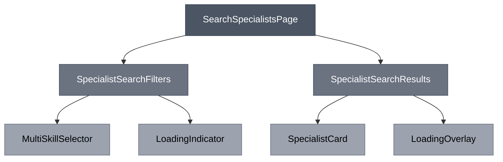

**Diagram sources**
- [SearchSpecialistsPage.vue](file://src/pages/SearchSpecialistsPage.vue)
- [SpecialistSearchFilters.vue](file://src/components/search/SpecialistSearchFilters.vue)
- [SpecialistSearchResults.vue](file://src/components/search/SpecialistSearchResults.vue)
- [MultiSkillSelector.vue](file://src/components/search/MultiSkillSelector.vue)
- [SpecialistCard.vue](file://src/components/search/SpecialistCard.vue)

**Section sources**
- [SearchSpecialistsPage.vue](file://src/pages/SearchSpecialistsPage.vue)
- [SpecialistSearchFilters.vue](file://src/components/search/SpecialistSearchFilters.vue)
- [SpecialistSearchResults.vue](file://src/components/search/SpecialistSearchResults.vue)

## Core Components
The Specialist Search Components subsystem consists of several key components that work together to provide a seamless search experience. These components are designed with reusability, accessibility, and performance in mind.

The system follows a clear separation of concerns, with distinct components handling filtering, results display, individual specialist representation, and skill selection. The components communicate through well-defined props and events, creating a predictable data flow from parent to child and events from child to parent.

## Data Structures and Types
The system defines a comprehensive type system that ensures type safety and provides clear contracts between components and services.

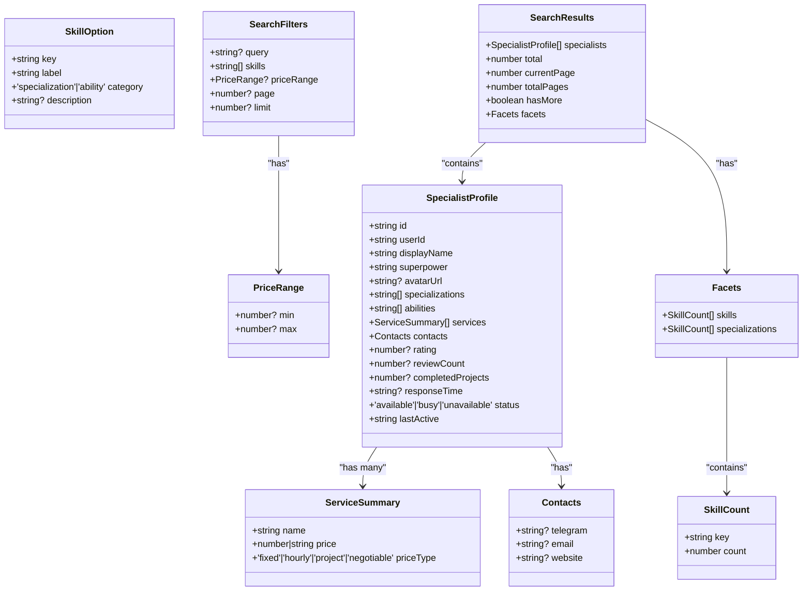

**Diagram sources**
- [specialist-search.ts](file://src/types/specialist-search.ts)

**Section sources**
- [specialist-search.ts](file://src/types/specialist-search.ts#L1-L115)

## State Management
The system uses Pinia for state management, providing a centralized store for search-related data and operations.

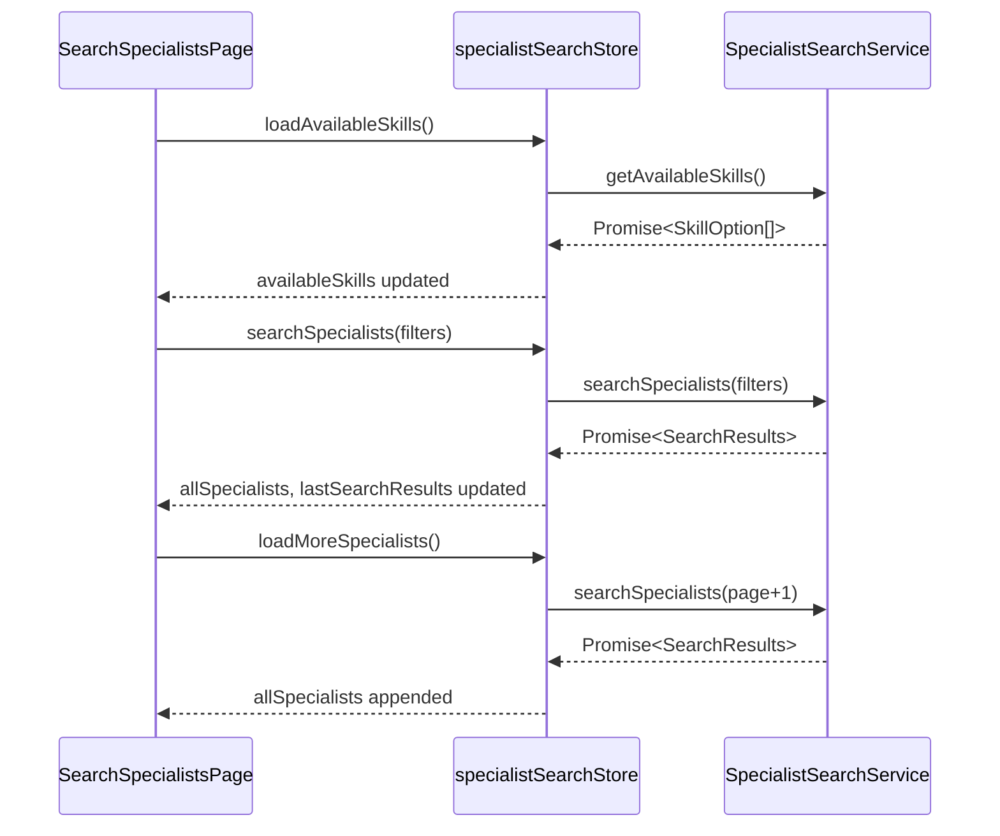

**Diagram sources**
- [specialist-search.ts](file://src/stores/specialist-search.ts)
- [specialist-search.ts](file://src/services/specialist-search.ts)

**Section sources**
- [specialist-search.ts](file://src/stores/specialist-search.ts#L1-L245)
- [specialist-search.ts](file://src/services/specialist-search.ts#L1-L454)

## Service Layer
The service layer provides an abstraction over the data source, handling search operations and data retrieval.

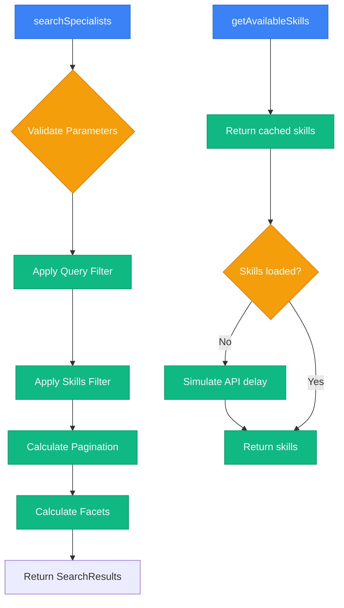

**Diagram sources**
- [specialist-search.ts](file://src/services/specialist-search.ts#L1-L454)

**Section sources**
- [specialist-search.ts](file://src/services/specialist-search.ts#L1-L454)

## Component Analysis

### SpecialistCard Component
The SpecialistCard component displays an individual specialist's information in a compact, visually appealing format.

**Purpose**: To present key information about a specialist in a consistent, scannable format that encourages user engagement.

**Props**:
- `specialist`: SpecialistProfile - The specialist data to display

**Events**:
- `view-profile`: Emitted when the user wants to view the full profile of the specialist

**Features**:
- Displays avatar with fallback to initials
- Shows specialist's name, superpower, and key information
- Lists specializations, abilities, and services with truncation
- Shows metadata including project count and last active status
- Responsive design that adapts to different screen sizes
- Visual feedback on hover with subtle animation

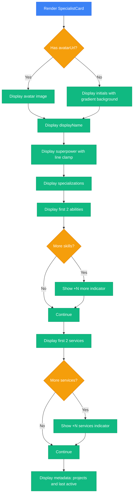

**Diagram sources**
- [SpecialistCard.vue](file://src/components/search/SpecialistCard.vue#L1-L278)

**Section sources**
- [SpecialistCard.vue](file://src/components/search/SpecialistCard.vue#L1-L278)

### SpecialistSearchFilters Component
The SpecialistSearchFilters component provides the user interface for filtering search results.

**Purpose**: To allow users to refine their search using text queries and skill selections.

**Props**:
- `loading`: boolean - Indicates if a search is currently in progress

**Events**:
- `search`: Emitted when the user submits a search with the current filters
- `clear`: Emitted when the user clears all filters

**Features**:
- Text input for searching by name or specialization
- MultiSkillSelector for selecting skills and specializations
- Submit and clear buttons with appropriate disabled states
- Display of active filters with removal options
- Search summary showing results count and applied filters
- Integration with Pinia store for filter persistence

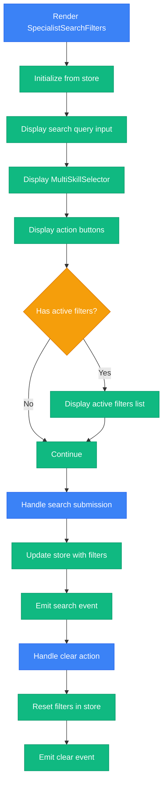

**Diagram sources**
- [SpecialistSearchFilters.vue](file://src/components/search/SpecialistSearchFilters.vue#L1-L232)

**Section sources**
- [SpecialistSearchFilters.vue](file://src/components/search/SpecialistSearchFilters.vue#L1-L232)

### SpecialistSearchResults Component
The SpecialistSearchResults component displays the list of specialists matching the search criteria.

**Purpose**: To present search results in a paginated, infinite-scrolling list with appropriate loading and error states.

**Props**:
- `specialists`: SpecialistProfile[] - The list of specialists to display
- `loading`: boolean - Indicates if the initial search is in progress
- `loadingMore`: boolean - Indicates if additional results are being loaded
- `empty`: boolean - Indicates if no results were found
- `canLoadMore`: boolean - Indicates if more results are available
- `totalResults`: number - Total number of results found
- `error`: string | null - Error message if search failed

**Events**:
- `load-more`: Emitted when more results should be loaded
- `clear-search`: Emitted when the user wants to clear the search
- `retry`: Emitted when the user wants to retry a failed search
- `view-profile`: Emitted when the user wants to view a specialist's profile

**Features**:
- Loading state with spinner and message
- Empty state with suggestion to modify search criteria
- Error state with retry option
- Results list with infinite scroll capability
- Staggered animation for specialist cards
- Automatic loading of additional results when scrolling
- Clear visual feedback for all states

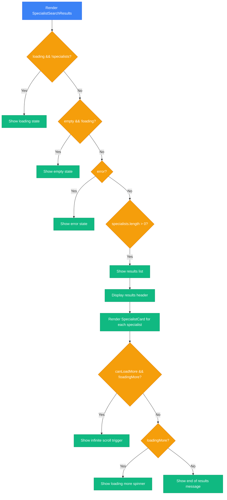

**Diagram sources**
- [SpecialistSearchResults.vue](file://src/components/search/SpecialistSearchResults.vue#L1-L301)

**Section sources**
- [SpecialistSearchResults.vue](file://src/components/search/SpecialistSearchResults.vue#L1-L301)

### MultiSkillSelector Component
The MultiSkillSelector component allows users to select multiple skills from a predefined list.

**Purpose**: To provide an intuitive interface for selecting multiple skills with search and keyboard navigation support.

**Props**:
- `modelValue`: string[] - The currently selected skill keys
- `options`: SkillOption[] - The available skills to choose from
- `placeholder`: string - Placeholder text for the input
- `maxSelections`: number - Maximum number of skills that can be selected

**Events**:
- `update:modelValue`: Emitted when the selection changes

**Features**:
- Displays selected skills as removable tags
- Searchable dropdown with keyboard navigation
- Visual feedback for selected and highlighted options
- Support for keyboard shortcuts (arrow keys, enter, escape, backspace)
- Click-outside detection to close the dropdown
- Custom scrollbar styling for better UX
- Focus management for accessibility

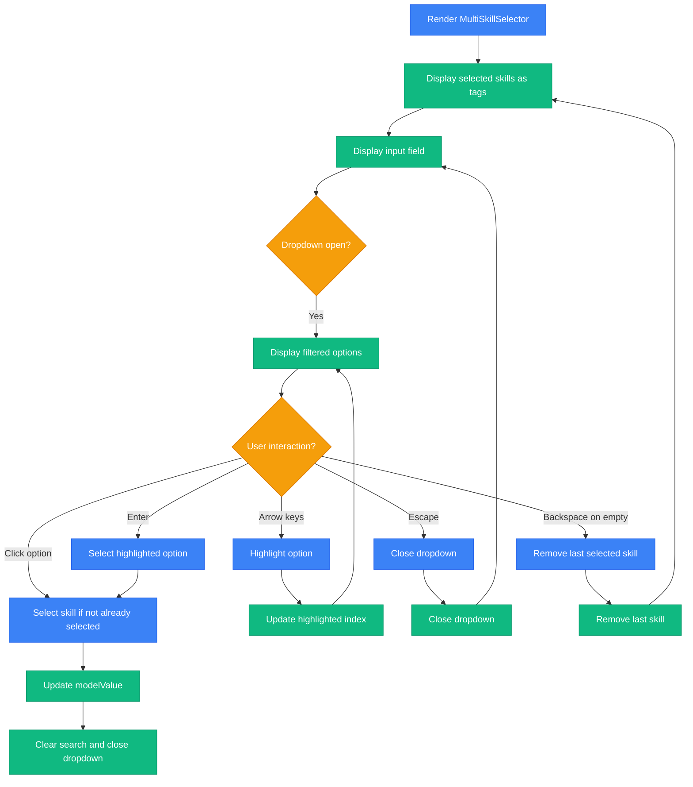

**Diagram sources**
- [MultiSkillSelector.vue](file://src/components/search/MultiSkillSelector.vue#L1-L318)

**Section sources**
- [MultiSkillSelector.vue](file://src/components/search/MultiSkillSelector.vue#L1-L318)

## Usage Patterns
The Specialist Search Components follow several key usage patterns that ensure consistency and predictability.

### Data Flow Pattern
The system follows a unidirectional data flow pattern where data flows from parent to child via props, and events flow from child to parent.

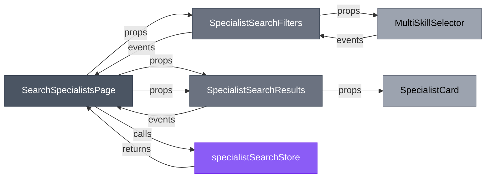

**Diagram sources**
- [SearchSpecialistsPage.vue](file://src/pages/SearchSpecialistsPage.vue)
- [SpecialistSearchFilters.vue](file://src/components/search/SpecialistSearchFilters.vue)
- [SpecialistSearchResults.vue](file://src/components/search/SpecialistSearchResults.vue)
- [MultiSkillSelector.vue](file://src/components/search/MultiSkillSelector.vue)
- [SpecialistCard.vue](file://src/components/search/SpecialistCard.vue)

**Section sources**
- [SearchSpecialistsPage.vue](file://src/pages/SearchSpecialistsPage.vue#L1-L118)
- [SpecialistSearchFilters.vue](file://src/components/search/SpecialistSearchFilters.vue#L1-L232)
- [SpecialistSearchResults.vue](file://src/components/search/SpecialistSearchResults.vue#L1-L301)

### State Management Pattern
The system uses a centralized store pattern with Pinia, where the specialistSearchStore manages all search-related state.

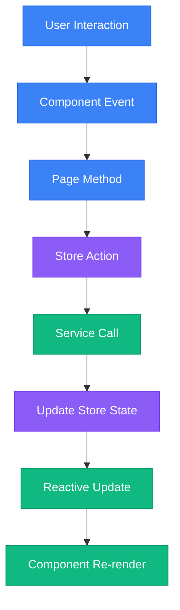

**Diagram sources**
- [specialist-search.ts](file://src/stores/specialist-search.ts)
- [SearchSpecialistsPage.vue](file://src/pages/SearchSpecialistsPage.vue)

**Section sources**
- [specialist-search.ts](file://src/stores/specialist-search.ts#L1-L245)
- [SearchSpecialistsPage.vue](file://src/pages/SearchSpecialistsPage.vue#L1-L118)

## Accessibility Features
The Specialist Search Components include several accessibility features to ensure the interface is usable by all users.

### Keyboard Navigation
All interactive elements are keyboard accessible:
- Tab navigation between form elements
- Arrow key navigation in MultiSkillSelector dropdown
- Enter to select options in MultiSkillSelector
- Escape to close MultiSkillSelector dropdown
- Backspace to remove last selected skill when input is empty

### Screen Reader Support
The components include appropriate ARIA attributes:
- Form labels properly associated with inputs
- Status messages for loading, empty, and error states
- Semantic HTML elements (buttons, form controls)
- ARIA live regions for dynamic content updates

### Focus Management
The components provide clear visual focus indicators:
- Focus rings on interactive elements
- Focus management in MultiSkillSelector
- Proper focus restoration after interactions

### Color Contrast
The components maintain sufficient color contrast:
- Text and background color combinations meet WCAG standards
- Dark mode support with appropriate color adjustments
- Hover and active states with clear visual feedback

```mermaid
flowchart TD
A[Accessibility Features] --> B[Keyboard Navigation]
A --> C[Screen Reader Support]
A --> D[Focus Management]
A --> E[Color Contrast]
B --> F[Tab navigation]
B --> G[Arrow key navigation]
B --> H[Enter/Escape keys]
B --> I[Backspace for removal]
C --> J[ARIA labels]
C --> K[ARIA live regions]
C --> L[Semantic HTML]
C --> M[Form labels]
D --> N[Focus rings]
D --> O[Focus management]
D --> P[Focus restoration]
E --> Q[WCAG contrast]
E --> R[Dark mode support]
E --> S[Visual feedback]
style A fill:#3B82F6,stroke:#2563EB,color:white
style B fill:#6B7280,stroke:#4B5563,color:white
style C fill:#6B7280,stroke:#4B5563,color:white
style D fill:#6B7280,stroke:#4B5563,color:white
style E fill:#6B7280,stroke:#4B5563,color:white
style F fill:#9CA3AF,stroke:#6B7280,color:black
style G fill:#9CA3AF,stroke:#6B7280,color:black
style H fill:#9CA3AF,stroke:#6B7280,color:black
style I fill:#9CA3AF,stroke:#6B7280,color:black
style J fill:#9CA3AF,stroke:#6B7280,color:black
style K fill:#9CA3AF,stroke:#6B7280,color:black
style L fill:#9CA3AF,stroke:#6B7280,color:black
style M fill:#9CA3AF,stroke:#6B7280,color:black
style N fill:#9CA3AF,stroke:#6B7280,color:black
style O fill:#9CA3AF,stroke:#6B7280,color:black
style P fill:#9CA3AF,stroke:#6B7280,color:black
style Q fill:#9CA3AF,stroke:#6B7280,color:black
style R fill:#9CA3AF,stroke:#6B7280,color:black
style S fill:#9CA3AF,stroke:#6B7280,color:black
```

**Diagram sources**
- [SpecialistCard.vue](file://src/components/search/SpecialistCard.vue)
- [SpecialistSearchFilters.vue](file://src/components/search/SpecialistSearchFilters.vue)
- [SpecialistSearchResults.vue](file://src/components/search/SpecialistSearchResults.vue)
- [MultiSkillSelector.vue](file://src/components/search/MultiSkillSelector.vue)

**Section sources**
- [SpecialistCard.vue](file://src/components/search/SpecialistCard.vue#L1-L278)
- [SpecialistSearchFilters.vue](file://src/components/search/SpecialistSearchFilters.vue#L1-L232)
- [SpecialistSearchResults.vue](file://src/components/search/SpecialistSearchResults.vue#L1-L301)
- [MultiSkillSelector.vue](file://src/components/search/MultiSkillSelector.vue#L1-L318)

## Styling and Design
The Specialist Search Components follow a consistent design system with attention to visual hierarchy, responsiveness, and user experience.

### Design Principles
- **Consistency**: Uniform styling across all components
- **Clarity**: Clear visual hierarchy and information organization
- **Feedback**: Visual feedback for user interactions
- **Responsiveness**: Adapts to different screen sizes
- **Performance**: Optimized animations and transitions

### Color System
The components use a color system that supports both light and dark modes:
- **Primary**: Blue (500-600) for interactive elements
- **Success**: Green (500-600) for positive states
- **Warning**: Amber (500) for warnings
- **Error**: Red (500-600) for errors
- **Neutral**: Gray (100-800) for backgrounds and text

### Typography
The components use a typographic scale that creates visual hierarchy:
- **Headings**: 1.125rem (18px) for names, 1rem (16px) for section headings
- **Body**: 0.875rem (14px) for most text
- **Captions**: 0.75rem (12px) for metadata and secondary text

### Spacing
The components follow a consistent spacing system:
- **Padding**: 1.5rem (24px) for card padding
- **Margins**: 1.5rem (24px) between major sections
- **Gaps**: 0.5rem (8px) between inline elements
- **Borders**: 1px solid for card borders

### Animations
The components include subtle animations to enhance user experience:
- **Hover effects**: Slight elevation and transform on card hover
- **Transitions**: Smooth transitions for state changes
- **Loading**: Animated spinners for loading states
- **Entry**: Staggered animations for list items

```mermaid
flowchart TD
A[Styling and Design] --> B[Design Principles]
A --> C[Color System]
A --> D[Typography]
A --> E[Spacing]
A --> F[Animations]
B --> G[Consistency]
B --> H[Clarity]
B --> I[Feedback]
B --> J[Responsiveness]
B --> K[Performance]
C --> L[Primary: Blue]
C --> M[Success: Green]
C --> N[Warning: Amber]
C --> O[Error: Red]
C --> P[Neutral: Gray]
C --> Q[Dark Mode Support]
D --> R[Headings: 18px, 16px]
D --> S[Body: 14px]
D --> T[Captions: 12px]
E --> U[Padding: 24px]
E --> V[Margins: 24px]
E --> W[Gaps: 8px]
E --> X[Borders: 1px]
F --> Y[Hover Effects]
F --> Z[Transitions]
F --> AA[Loading Animations]
F --> AB[Entry Animations]
style A fill:#3B82F6,stroke:#2563EB,color:white
style B fill:#6B7280,stroke:#4B5563,color:white
style C fill:#6B7280,stroke:#4B5563,color:white
style D fill:#6B7280,stroke:#4B5563,color:white
style E fill:#6B7280,stroke:#4B5563,color:white
style F fill:#6B7280,stroke:#4B5563,color:white
style G fill:#9CA3AF,stroke:#6B7280,color:black
style H fill:#9CA3AF,stroke:#6B7280,color:black
style I fill:#9CA3AF,stroke:#6B7280,color:black
style J fill:#9CA3AF,stroke:#6B7280,color:black
style K fill:#9CA3AF,stroke:#6B7280,color:black
style L fill:#9CA3AF,stroke:#6B7280,color:black
style M fill:#9CA3AF,stroke:#6B7280,color:black
style N fill:#9CA3AF,stroke:#6B7280,color:black
style O fill:#9CA3AF,stroke:#6B7280,color:black
style P fill:#9CA3AF,stroke:#6B7280,color:black
style Q fill:#9CA3AF,stroke:#6B7280,color:black
style R fill:#9CA3AF,stroke:#6B7280,color:black
style S fill:#9CA3AF,stroke:#6B7280,color:black
style T fill:#9CA3AF,stroke:#6B7280,color:black
style U fill:#9CA3AF,stroke:#6B7280,color:black
style V fill:#9CA3AF,stroke:#6B7280,color:black
style W fill:#9CA3AF,stroke:#6B7280,color:black
style X fill:#9CA3AF,stroke:#6B7280,color:black
style Y fill:#9CA3AF,stroke:#6B7280,color:black
style Z fill:#9CA3AF,stroke:#6B7280,color:black
style AA fill:#9CA3AF,stroke:#6B7280,color:black
style AB fill:#9CA3AF,stroke:#6B7280,color:black
```

**Diagram sources**
- [SpecialistCard.vue](file://src/components/search/SpecialistCard.vue)
- [SpecialistSearchFilters.vue](file://src/components/search/SpecialistSearchFilters.vue)
- [SpecialistSearchResults.vue](file://src/components/search/SpecialistSearchResults.vue)
- [MultiSkillSelector.vue](file://src/components/search/MultiSkillSelector.vue)

**Section sources**
- [SpecialistCard.vue](file://src/components/search/SpecialistCard.vue#L1-L278)
- [SpecialistSearchFilters.vue](file://src/components/search/SpecialistSearchFilters.vue#L1-L232)
- [SpecialistSearchResults.vue](file://src/components/search/SpecialistSearchResults.vue#L1-L301)
- [MultiSkillSelector.vue](file://src/components/search/MultiSkillSelector.vue#L1-L318)