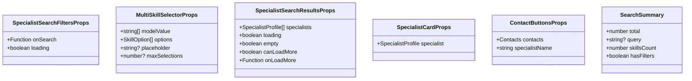

# Specialist Search Data Models

<cite>
**Referenced Files in This Document**   
- [specialist-search.ts](file://src/types/specialist-search.ts)
- [specialist-search.ts](file://src/services/specialist-search.ts)
- [SpecialistSearchFilters.vue](file://src/components/search/SpecialistSearchFilters.vue)
- [SpecialistSearchResults.vue](file://src/components/search/SpecialistSearchResults.vue)
- [SpecialistCard.vue](file://src/components/search/SpecialistCard.vue)
</cite>

## Table of Contents
1. [SpecialistProfile Interface](#specialistprofile-interface)
2. [SearchFilters and SearchResults Interfaces](#searchfilters-and-searchresults-interfaces)
3. [Component Prop Interfaces](#component-prop-interfaces)
4. [Skill and Service Data Structures](#skill-and-service-data-structures)
5. [Type Hierarchy and Relationships](#type-hierarchy-and-relationships)
6. [Data Flow and Usage Patterns](#data-flow-and-usage-patterns)

## SpecialistProfile Interface

The `SpecialistProfile` interface defines the complete data structure for a specialist in the search system. It contains comprehensive information about a specialist's identity, skills, services, and availability status.

**Diagram sources**
- [specialist-search.ts](file://src/types/specialist-search.ts#L4-L40)

**Section sources**
- [specialist-search.ts](file://src/types/specialist-search.ts#L4-L40)
- [SpecialistCard.vue](file://src/components/search/SpecialistCard.vue#L1-L320)

### Properties Breakdown

**Basic Information**
- `id`: Unique identifier for the specialist
- `userId`: Reference to the user account
- `displayName`: Full name displayed to users
- `superpower`: A brief description of the specialist's primary expertise
- `avatarUrl`: Optional URL to the specialist's profile picture

**Skills and Expertise**
- `specializations`: Array of strings representing the specialist's main areas of expertise
- `abilities`: Array of strings detailing specific capabilities and skills

**Services and Pricing**
- `services`: Array of `ServiceSummary` objects that define what services the specialist offers and their pricing

**Contact Information**
- `contacts`: Object containing optional contact details including Telegram, email, and website

**Metadata and Status**
- `rating`: Average rating from client reviews (optional)
- `reviewCount`: Number of reviews received (optional)
- `completedProjects`: Number of successfully completed projects
- `responseTime`: Estimated time for the specialist to respond to inquiries
- `status`: Current availability status ('available', 'busy', or 'unavailable')
- `lastActive`: Timestamp of the last time the specialist was active on the platform

## SearchFilters and SearchResults Interfaces

These interfaces define the structure for search operations, including the parameters used to filter specialists and the format of the returned results.

**Diagram sources**
- [specialist-search.ts](file://src/types/specialist-search.ts#L42-L78)

**Section sources**
- [specialist-search.ts](file://src/types/specialist-search.ts#L42-L78)
- [specialist-search.ts](file://src/services/specialist-search.ts#L1-L455)
- [SpecialistSearchFilters.vue](file://src/components/search/SpecialistSearchFilters.vue#L1-L233)

### SearchFilters Interface

The `SearchFilters` interface defines the criteria that can be applied when searching for specialists:

- `query`: Optional text string to search across specialist names, superpowers, specializations, and abilities
- `skills`: Array of skill keys to filter specialists by specific capabilities
- `priceRange`: Optional object with minimum and maximum price values to filter services
- `page`: Page number for pagination (defaults to 1)
- `limit`: Number of results per page (defaults to 5)

### SearchResults Interface

The `SearchResults` interface defines the structure of the response from a search operation:

- `specialists`: Array of `SpecialistProfile` objects matching the search criteria
- `total`: Total number of specialists matching the search (regardless of pagination)
- `currentPage`: Current page number in the pagination sequence
- `totalPages`: Total number of pages available
- `hasMore`: Boolean indicating if additional pages are available
- `facets`: Aggregated data about skills and specializations in the current results, useful for refining search filters

## Component Prop Interfaces

The search components use specific interfaces to define their input properties (props), ensuring type safety and clear API contracts.

**Diagram sources**
- [specialist-search.ts](file://src/types/specialist-search.ts#L80-L115)

**Section sources**
- [specialist-search.ts](file://src/types/specialist-search.ts#L80-L115)
- [SpecialistSearchFilters.vue](file://src/components/search/SpecialistSearchFilters.vue#L1-L233)
- [SpecialistSearchResults.vue](file://src/components/search/SpecialistSearchResults.vue#L1-L302)
- [SpecialistCard.vue](file://src/components/search/SpecialistCard.vue#L1-L320)

### SpecialistSearchFiltersProps

This interface defines the props for the `SpecialistSearchFilters` component:

- `onSearch`: Callback function triggered when search parameters change, receiving a partial `SearchFilters` object
- `loading`: Boolean flag indicating whether a search operation is currently in progress

### SpecialistSearchResultsProps

This interface defines the props for the `SpecialistSearchResults` component:

- `specialists`: Array of `SpecialistProfile` objects to display
- `loading`: Boolean indicating if the initial search is loading
- `empty`: Boolean indicating if no specialists match the search criteria
- `canLoadMore`: Boolean indicating if more results are available for infinite scrolling
- `onLoadMore`: Callback function to trigger loading of additional results

### SpecialistCardProps

This interface defines the props for the `SpecialistCard` component:

- `specialist`: A single `SpecialistProfile` object to display in the card format

### ContactButtonsProps

This interface defines the props for the `ContactButtons` component:

- `contacts`: The contacts object from a `SpecialistProfile`
- `specialistName`: The display name of the specialist for use in contact actions

## Skill and Service Data Structures

These interfaces define the specialized data structures used for skills and services within the search system.

**Diagram sources**
- [specialist-search.ts](file://src/types/specialist-search.ts#L12-L78)

**Section sources**
- [specialist-search.ts](file://src/types/specialist-search.ts#L12-L78)
- [specialist-search.ts](file://src/services/specialist-search.ts#L1-L455)

### ServiceSummary Interface

The `ServiceSummary` interface defines the structure of a service offered by a specialist:

- `name`: Descriptive name of the service
- `price`: Numeric value or string representation of the price
- `priceType`: Enumeration indicating how the price is structured:
  - `'fixed'`: Fixed price for the service
  - `'hourly'`: Price per hour of work
  - `'project'`: Price for the entire project
  - `'negotiable'`: Price to be determined through negotiation

### SkillOption Interface

The `SkillOption` interface defines the structure for skill selections in the UI:

- `key`: Unique identifier for the skill
- `label`: Display name of the skill
- `category`: Type of skill, either `'specialization'` or `'ability'`
- `description`: Optional detailed description of the skill

## Type Hierarchy and Relationships

The data model follows a hierarchical structure where various interfaces are composed together to create the complete specialist search system.

**Diagram sources**
- [specialist-search.ts](file://src/types/specialist-search.ts#L4-L115)

**Section sources**
- [specialist-search.ts](file://src/types/specialist-search.ts#L4-L115)

### Composition Relationships

The type hierarchy demonstrates how different interfaces are composed:

- `SpecialistProfile` serves as the central data model, containing references to `ServiceSummary` and `Contacts`
- `SearchResults` contains an array of `SpecialistProfile` objects along with pagination and facet data
- Component prop interfaces reference the core data models to ensure type consistency
- `SearchFilters` uses `SkillOption` for skill-based filtering

This composition approach promotes reusability and maintainability, as changes to base interfaces automatically propagate to dependent structures.

## Data Flow and Usage Patterns

The specialist search system follows a predictable data flow pattern from user interaction to display.

**Diagram sources**
- [specialist-search.ts](file://src/services/specialist-search.ts#L1-L455)
- [SpecialistSearchFilters.vue](file://src/components/search/SpecialistSearchFilters.vue#L1-L233)
- [SpecialistSearchResults.vue](file://src/components/search/SpecialistSearchResults.vue#L1-L302)
- [SpecialistCard.vue](file://src/components/search/SpecialistCard.vue#L1-L320)

**Section sources**
- [specialist-search.ts](file://src/services/specialist-search.ts#L1-L455)
- [SpecialistSearchFilters.vue](file://src/components/search/SpecialistSearchFilters.vue#L1-L233)
- [SpecialistSearchResults.vue](file://src/components/search/SpecialistSearchResults.vue#L1-L302)

### Search Process Flow

1. **User Input**: The user enters search criteria in the `SpecialistSearchFilters` component
2. **Filter Processing**: The component validates and structures the input into a `SearchFilters` object
3. **Service Request**: The `SpecialistSearchService` receives the filters and processes them
4. **Data Filtering**: The service applies text search, skill filtering, and calculates pagination
5. **Results Compilation**: The service returns a `SearchResults` object with specialists and metadata
6. **UI Rendering**: The `SpecialistSearchResults` component displays the results using `SpecialistCard` components
7. **User Interaction**: When a user clicks on a specialist card, they are navigated to the detailed profile view

This flow ensures a responsive and efficient search experience, with proper loading states and error handling throughout the process.