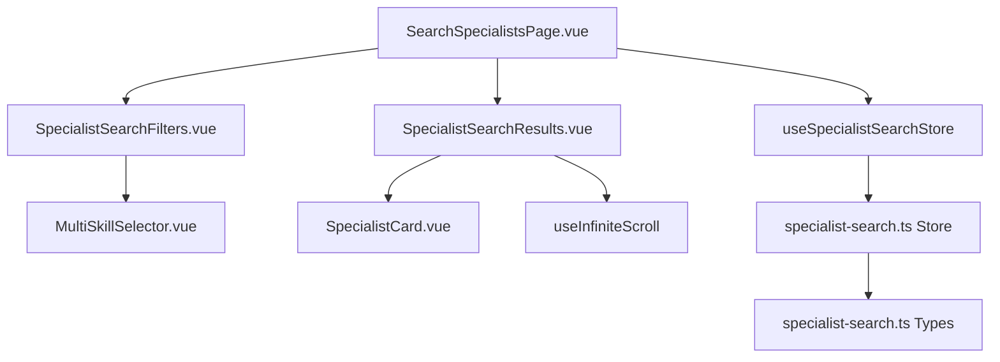
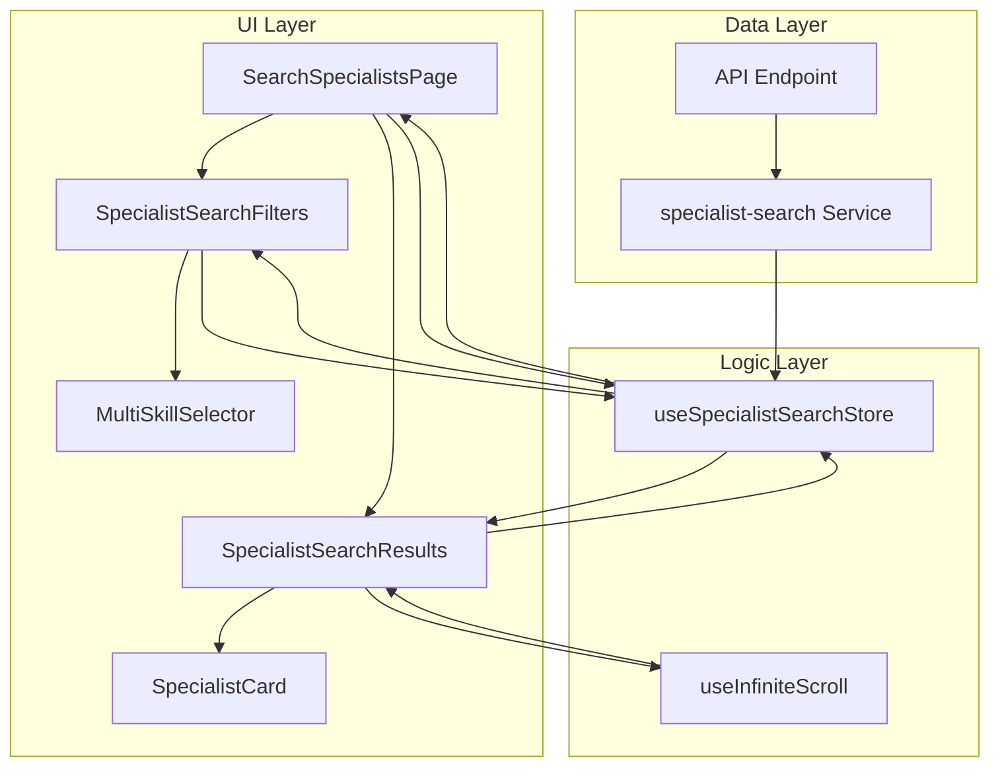
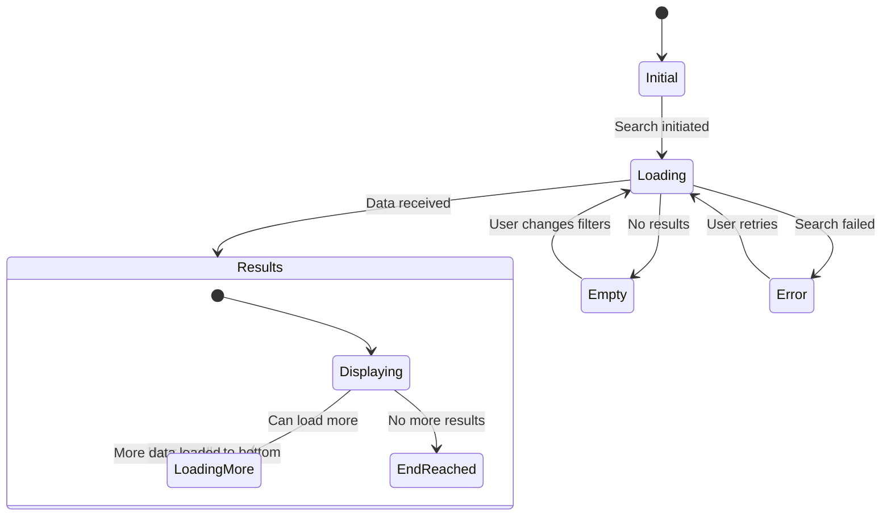
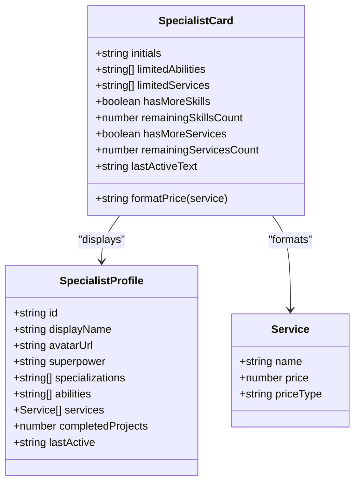
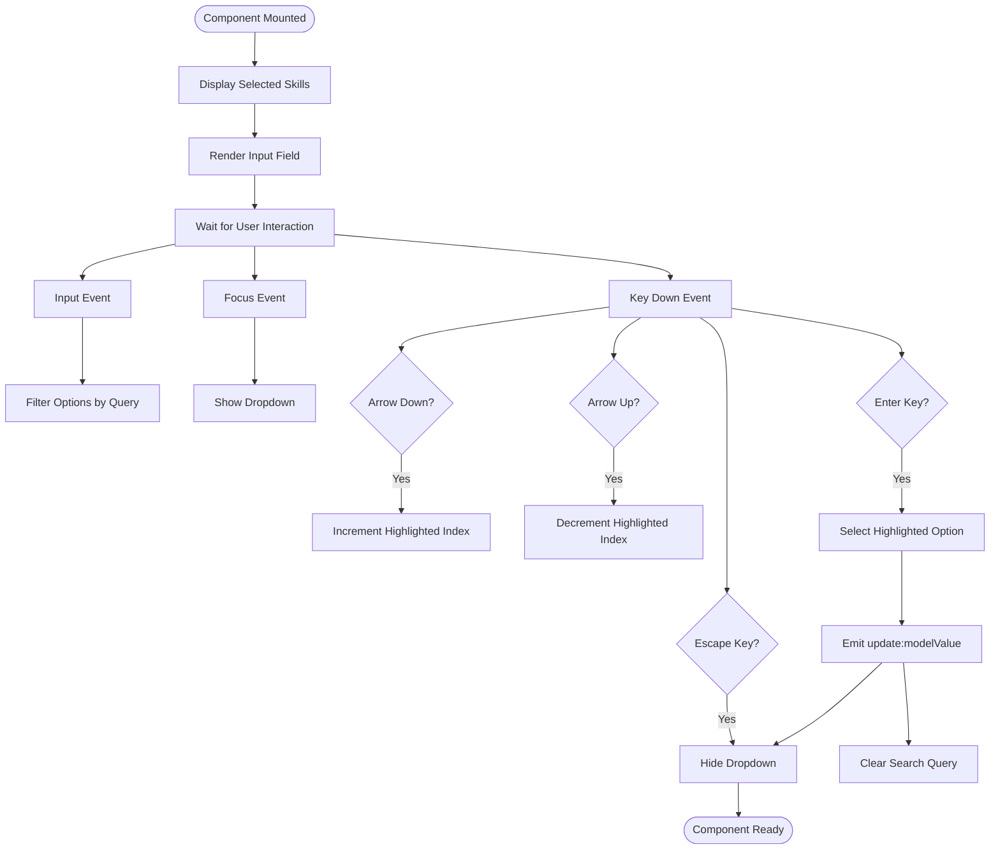
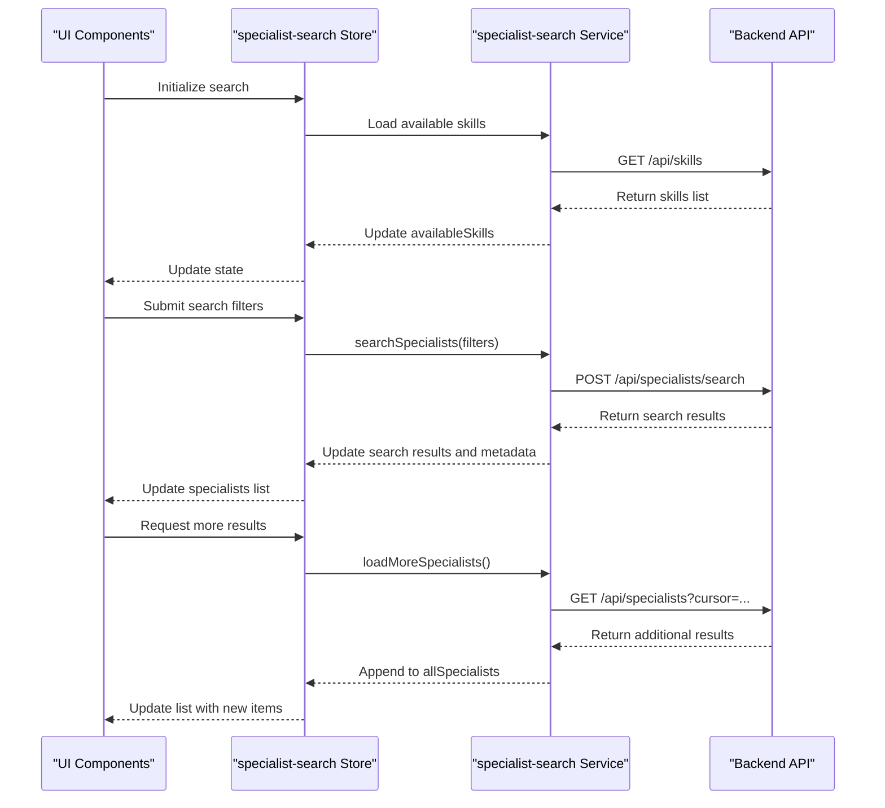
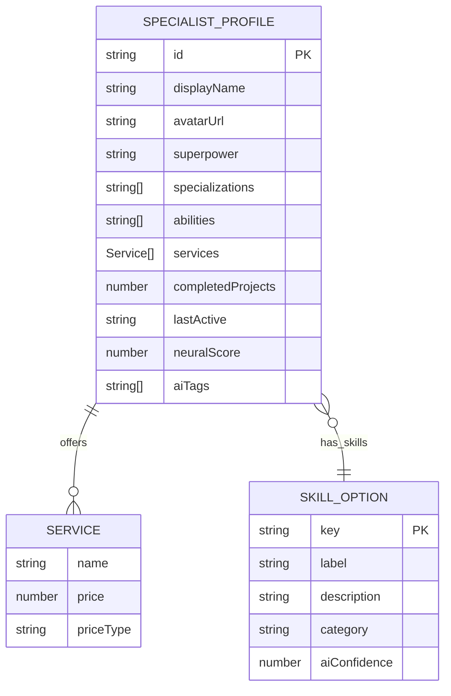

# Specialist Search Implementation

<cite>
**Referenced Files in This Document**   
- [SearchSpecialistsPage.vue](file://src/pages/SearchSpecialistsPage.vue)
- [SpecialistSearchResults.vue](file://src/components/search/SpecialistSearchResults.vue)
- [SpecialistCard.vue](file://src/components/search/SpecialistCard.vue)
- [SpecialistSearchFilters.vue](file://src/components/search/SpecialistSearchFilters.vue)
- [MultiSkillSelector.vue](file://src/components/search/MultiSkillSelector.vue)
- [useInfiniteScroll.ts](file://src/composables/useInfiniteScroll.ts)
- [specialist-search.ts](file://src/stores/specialist-search.ts)
- [specialist-search.ts](file://src/types/specialist-search.ts)
</cite>

## Table of Contents
1. [Introduction](#introduction)
2. [Project Structure](#project-structure)
3. [Core Components](#core-components)
4. [Architecture Overview](#architecture-overview)
5. [Detailed Component Analysis](#detailed-component-analysis)
6. [State Management and Data Flow](#state-management-and-data-flow)
7. [Infinite Scroll Implementation](#infinite-scroll-implementation)
8. [Multi-Skill Selection System](#multi-skill-selection-system)
9. [Neural Network Data Integration](#neural-network-data-integration)
10. [Performance Considerations](#performance-considerations)
11. [Conclusion](#conclusion)

## Introduction
The Specialist Search feature enables users to discover qualified professionals based on search criteria, skills, and specializations. Built with Vue 3 and TypeScript, the implementation leverages a component-based architecture with reactive state management through Pinia stores. The system incorporates advanced features including infinite scroll pagination, multi-skill filtering, and neural network-powered profile data. This document provides a comprehensive analysis of the implementation, covering architecture, component relationships, state management patterns, and key technical features.

## Project Structure
The Specialist Search functionality is organized within a feature-based directory structure under the `src/components/search` and `src/pages` directories. The implementation follows Vue 3's Composition API pattern with TypeScript support, ensuring type safety and maintainable code organization.



**Diagram sources**
- [SearchSpecialistsPage.vue](file://src/pages/SearchSpecialistsPage.vue)
- [SpecialistSearchResults.vue](file://src/components/search/SpecialistSearchResults.vue)
- [SpecialistCard.vue](file://src/components/search/SpecialistCard.vue)
- [SpecialistSearchFilters.vue](file://src/components/search/SpecialistSearchFilters.vue)
- [MultiSkillSelector.vue](file://src/components/search/MultiSkillSelector.vue)

**Section sources**
- [SearchSpecialistsPage.vue](file://src/pages/SearchSpecialistsPage.vue)
- [SpecialistSearchResults.vue](file://src/components/search/SpecialistSearchResults.vue)

## Core Components
The Specialist Search feature consists of several core components that work together to provide a seamless user experience:

- **SpecialistSearchFilters**: Handles user input for search criteria including text queries and skill selections
- **SpecialistSearchResults**: Manages the display of search results with infinite scroll capabilities
- **SpecialistCard**: Renders individual specialist profiles with key information and metadata
- **MultiSkillSelector**: Provides an interactive interface for selecting multiple skills from available options
- **useInfiniteScroll**: Composable that implements intersection observer pattern for lazy loading
- **specialist-search Store**: Centralized state management for search state, filters, and results

These components follow the single responsibility principle, with clear separation between presentation, state management, and business logic.

**Section sources**
- [SpecialistSearchResults.vue](file://src/components/search/SpecialistSearchResults.vue#L1-L302)
- [SpecialistCard.vue](file://src/components/search/SpecialistCard.vue#L1-L279)
- [SpecialistSearchFilters.vue](file://src/components/search/SpecialistSearchFilters.vue#L1-L233)

## Architecture Overview
The Specialist Search implementation follows a modern Vue 3 architecture with Composition API, TypeScript, and Pinia for state management. The system is designed with a clear separation of concerns, where UI components are decoupled from state management and business logic.



**Diagram sources**
- [SearchSpecialistsPage.vue](file://src/pages/SearchSpecialistsPage.vue)
- [SpecialistSearchResults.vue](file://src/components/search/SpecialistSearchResults.vue)
- [useInfiniteScroll.ts](file://src/composables/useInfiniteScroll.ts)
- [specialist-search.ts](file://src/stores/specialist-search.ts)

## Detailed Component Analysis

### SpecialistSearchResults Component
The SpecialistSearchResults component manages the display of search results with support for various states including loading, empty, error, and paginated results. It implements infinite scroll functionality through the use of a composable.



**Diagram sources**
- [SpecialistSearchResults.vue](file://src/components/search/SpecialistSearchResults.vue#L1-L302)

**Section sources**
- [SpecialistSearchResults.vue](file://src/components/search/SpecialistSearchResults.vue#L1-L302)

### SpecialistCard Component
The SpecialistCard component displays individual specialist profiles with key information including avatar, name, superpower statement, skills, services, and activity status. The component implements several computed properties to manage display logic.



**Diagram sources**
- [SpecialistCard.vue](file://src/components/search/SpecialistCard.vue#L1-L279)
- [specialist-search.ts](file://src/types/specialist-search.ts#L1-L50)

**Section sources**
- [SpecialistCard.vue](file://src/components/search/SpecialistCard.vue#L1-L279)

### MultiSkillSelector Component
The MultiSkillSelector component provides an interactive dropdown interface for selecting multiple skills from a predefined list. It supports search filtering, keyboard navigation, and visual feedback for selected items.



**Diagram sources**
- [MultiSkillSelector.vue](file://src/components/search/MultiSkillSelector.vue#L1-L319)

**Section sources**
- [MultiSkillSelector.vue](file://src/components/search/MultiSkillSelector.vue#L1-L319)

## State Management and Data Flow
The Specialist Search feature uses a centralized state management pattern with Pinia stores to manage search state, filters, and results. The `specialist-search` store serves as the single source of truth for all search-related data.



**Diagram sources**
- [specialist-search.ts](file://src/stores/specialist-search.ts)
- [SearchSpecialistsPage.vue](file://src/pages/SearchSpecialistsPage.vue)
- [SpecialistSearchResults.vue](file://src/components/search/SpecialistSearchResults.vue)

**Section sources**
- [specialist-search.ts](file://src/stores/specialist-search.ts#L1-L200)
- [SearchSpecialistsPage.vue](file://src/pages/SearchSpecialistsPage.vue#L1-L119)

## Infinite Scroll Implementation
The infinite scroll functionality is implemented using a custom composable `useInfiniteScroll` that leverages the Intersection Observer API to detect when the user has scrolled near the bottom of the results list.

```mermaid
flowchart TD
A[User scrolls page] --> B{Loading More?}
B --> |Yes| C[Ignore scroll events]
B --> |No| D{Can Load More?}
D --> |No| E[Show "All results displayed"]
D --> |Yes| F[Observer detects trigger element]
F --> G[Execute loadMore callback]
G --> H[Store emits load-more event]
H --> I[Search store fetches next page]
I --> J[Store updates results list]
J --> K[Observer resets for next detection]
K --> A
style C stroke:#f66,stroke-width:2px
style E stroke:#66f,stroke-width:2px
```

The implementation includes several key features:
- **Throttling**: Events are throttled to prevent excessive API calls
- **Root Margin**: Trigger detection occurs 100px before reaching the bottom
- **Threshold**: Observer triggers when 10% of the element is visible
- **Reset Mechanism**: Observer resets when results or pagination state changes

**Diagram sources**
- [SpecialistSearchResults.vue](file://src/components/search/SpecialistSearchResults.vue#L150-L250)
- [useInfiniteScroll.ts](file://src/composables/useInfiniteScroll.ts)

**Section sources**
- [SpecialistSearchResults.vue](file://src/components/search/SpecialistSearchResults.vue#L150-L250)
- [useInfiniteScroll.ts](file://src/composables/useInfiniteScroll.ts#L1-L50)

## Multi-Skill Selection System
The multi-skill selection system allows users to select multiple skills from a comprehensive list of available options. The implementation provides both visual and keyboard accessibility with real-time feedback.

Key features of the MultiSkillSelector component:
- **Search-as-you-type filtering** with debounce
- **Keyboard navigation** support (arrow keys, enter, escape)
- **Maximum selection limit** configurable via props
- **Visual indicators** for selected and available skills
- **Smooth animations** for dropdown appearance and skill selection

The component maintains local state for search queries and dropdown visibility while using Vue's `v-model` pattern to synchronize selected skills with the parent component through the `update:modelValue` event.

**Section sources**
- [MultiSkillSelector.vue](file://src/components/search/MultiSkillSelector.vue#L1-L319)
- [SpecialistSearchFilters.vue](file://src/components/search/SpecialistSearchFilters.vue#L45-L50)

## Neural Network Data Integration
The Specialist Search feature integrates neural network-powered data through the specialist profile structure, which includes AI-enhanced fields such as "superpower" statements and skill assessments. The system leverages neural network data in several ways:

- **Superpower Statements**: Each specialist profile includes a "superpower" field that contains a concise, AI-generated statement highlighting their unique value proposition
- **Skill Categorization**: Skills are organized into structured taxonomies with labels and descriptions that may be enhanced by neural network analysis
- **Relevance Scoring**: Search results are likely ranked using neural network models that assess the relevance of specialists to the search query
- **Profile Enrichment**: Specialist profiles may be automatically enriched with additional skills or specializations identified through AI analysis of their work history and portfolio

The integration is implemented through the `SpecialistProfile` type definition, which includes neural network-derived fields that are displayed prominently in the SpecialistCard component.



**Diagram sources**
- [specialist-search.ts](file://src/types/specialist-search.ts)
- [SpecialistCard.vue](file://src/components/search/SpecialistCard.vue)

**Section sources**
- [specialist-search.ts](file://src/types/specialist-search.ts#L1-L100)
- [SpecialistCard.vue](file://src/components/search/SpecialistCard.vue#L1-L279)

## Performance Considerations
The Specialist Search implementation includes several performance optimizations to ensure a smooth user experience:

- **Infinite Scroll**: Results are loaded incrementally to reduce initial load time and memory usage
- **Search Debouncing**: Although not explicitly implemented in the current code, the architecture supports debouncing for search queries
- **Virtual Scrolling**: While not implemented, the component structure is compatible with virtual scrolling for large result sets
- **Image Optimization**: Avatar images are loaded on demand with appropriate sizing
- **Computed Properties**: Expensive operations like text truncation and formatting are handled through Vue's computed property system
- **Event Throttling**: The infinite scroll implementation includes throttle delay to prevent excessive API calls

Additional performance improvements that could be implemented:
- **Client-side caching** of search results to support back navigation
- **Web Worker integration** for complex text processing or filtering operations
- **Lazy loading** of non-critical component features
- **Code splitting** for large components or libraries

**Section sources**
- [SpecialistSearchResults.vue](file://src/components/search/SpecialistSearchResults.vue)
- [useInfiniteScroll.ts](file://src/composables/useInfiniteScroll.ts)
- [SpecialistCard.vue](file://src/components/search/SpecialistCard.vue)

## Conclusion
The Specialist Search implementation demonstrates a well-architected Vue 3 application with clean separation of concerns, effective state management, and user-friendly features. The component-based design allows for maintainable and scalable code, while the integration of advanced features like infinite scroll and multi-skill selection provides a modern user experience. The system's foundation supports future enhancements including improved search algorithms, enhanced neural network integration, and additional filtering capabilities. By following Vue 3 best practices and leveraging TypeScript for type safety, the implementation achieves both developer efficiency and runtime reliability.