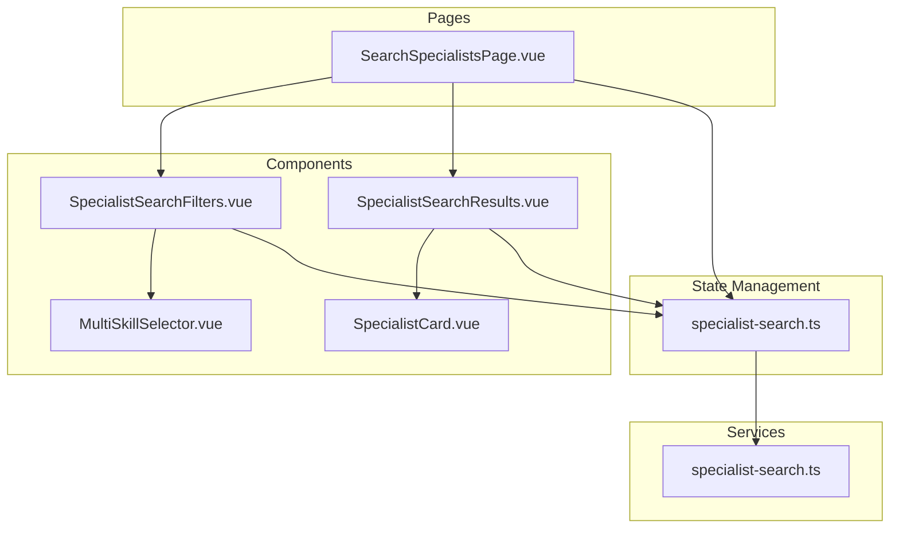
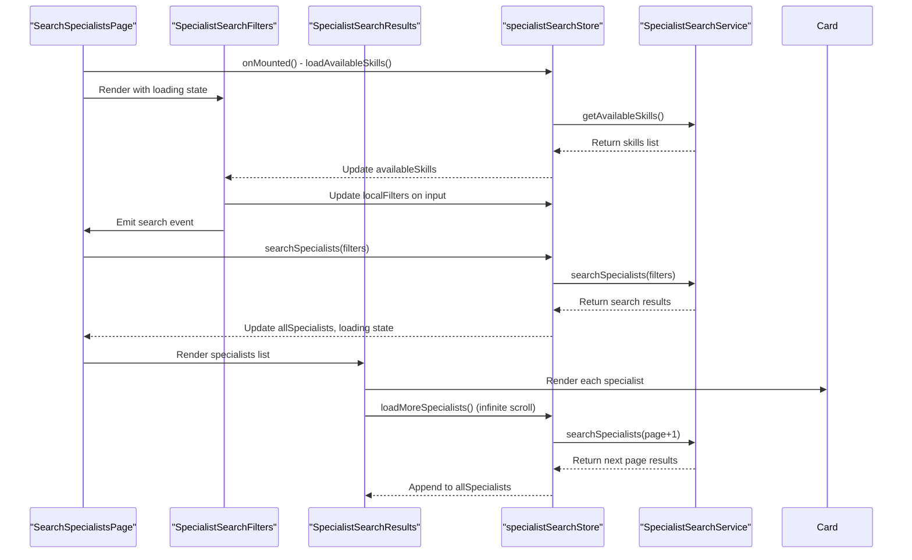
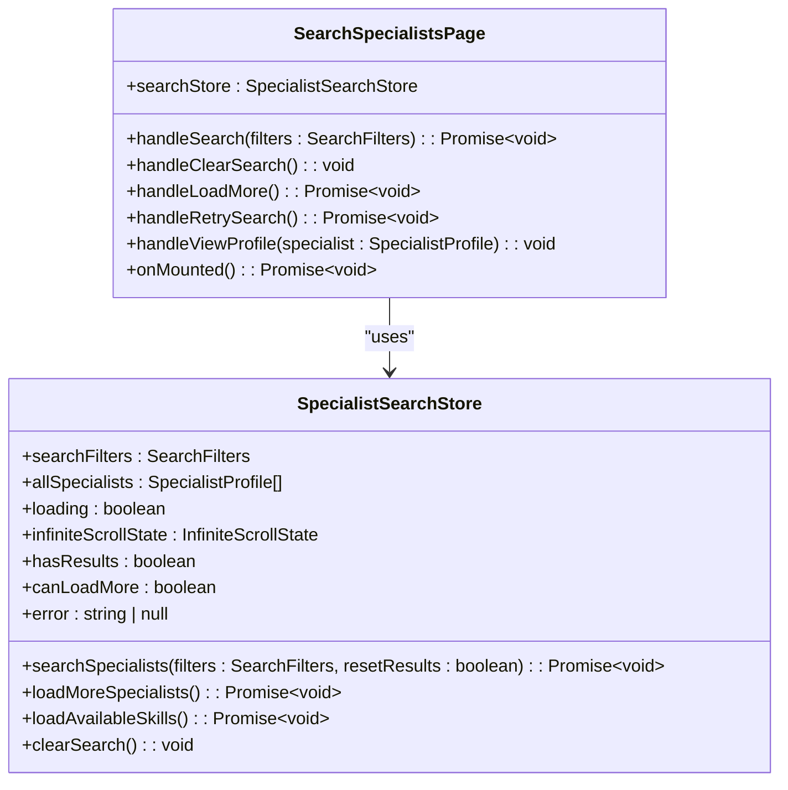
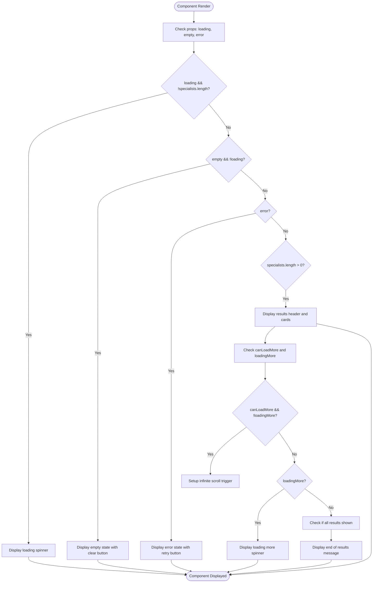
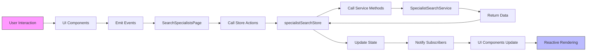
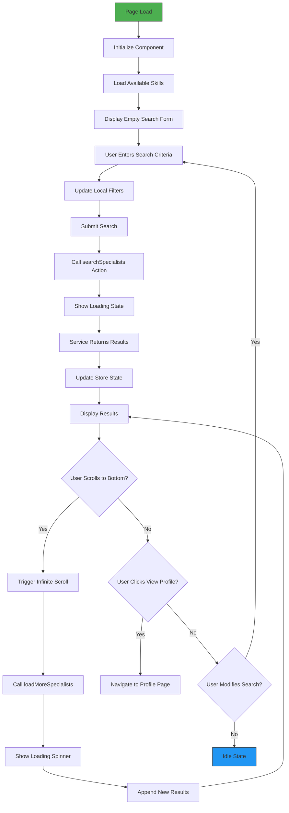

# Specialist Search Module

<cite>
**Referenced Files in This Document**   
- [SearchSpecialistsPage.vue](file://src/pages/SearchSpecialistsPage.vue)
- [SpecialistSearchFilters.vue](file://src/components/search/SpecialistSearchFilters.vue)
- [SpecialistSearchResults.vue](file://src/components/search/SpecialistSearchResults.vue)
- [SpecialistCard.vue](file://src/components/search/SpecialistCard.vue)
- [specialist-search.ts](file://src/stores/specialist-search.ts)
- [specialist-search.ts](file://src/services/specialist-search.ts)
</cite>

## Table of Contents
1. [Introduction](#introduction)
2. [Project Structure](#project-structure)
3. [Core Components](#core-components)
4. [Architecture Overview](#architecture-overview)
5. [Detailed Component Analysis](#detailed-component-analysis)
6. [State Management and Data Flow](#state-management-and-data-flow)
7. [User Interaction Flow](#user-interaction-flow)
8. [Performance and Optimization](#performance-and-optimization)
9. [Conclusion](#conclusion)

## Introduction
The Specialist Search Module is a core feature of the MayaWork frontend application, enabling users to discover and connect with AI specialists based on skills, specializations, and search criteria. This module implements a comprehensive search interface with filtering, infinite scrolling, and responsive card-based results display. The implementation follows Vue 3 Composition API patterns with Pinia for state management and TypeScript for type safety.

## Project Structure
The Specialist Search Module is organized across multiple directories following a feature-based component architecture. The core functionality is distributed between pages, components, stores, and services, with clear separation of concerns.



**Diagram sources**
- [SearchSpecialistsPage.vue](file://src/pages/SearchSpecialistsPage.vue)
- [SpecialistSearchFilters.vue](file://src/components/search/SpecialistSearchFilters.vue)
- [SpecialistSearchResults.vue](file://src/components/search/SpecialistSearchResults.vue)
- [SpecialistCard.vue](file://src/components/search/SpecialistCard.vue)
- [specialist-search.ts](file://src/stores/specialist-search.ts)
- [specialist-search.ts](file://src/services/specialist-search.ts)

**Section sources**
- [SearchSpecialistsPage.vue](file://src/pages/SearchSpecialistsPage.vue)
- [SpecialistSearchFilters.vue](file://src/components/search/SpecialistSearchFilters.vue)
- [SpecialistSearchResults.vue](file://src/components/search/SpecialistSearchResults.vue)

## Core Components
The Specialist Search Module consists of several key components that work together to provide a seamless search experience. The main components include the search page, filters, results display, specialist cards, and supporting state management and service layers.

**Section sources**
- [SearchSpecialistsPage.vue](file://src/pages/SearchSpecialistsPage.vue)
- [SpecialistSearchFilters.vue](file://src/components/search/SpecialistSearchFilters.vue)
- [SpecialistSearchResults.vue](file://src/components/search/SpecialistSearchResults.vue)
- [SpecialistCard.vue](file://src/components/search/SpecialistCard.vue)

## Architecture Overview
The Specialist Search Module follows a clean architecture pattern with clear separation between presentation, state management, and data access layers. The module uses a store-driven approach where the Pinia store serves as the single source of truth for search state and results.



**Diagram sources**
- [SearchSpecialistsPage.vue](file://src/pages/SearchSpecialistsPage.vue)
- [SpecialistSearchFilters.vue](file://src/components/search/SpecialistSearchFilters.vue)
- [SpecialistSearchResults.vue](file://src/components/search/SpecialistSearchResults.vue)
- [specialist-search.ts](file://src/stores/specialist-search.ts)
- [specialist-search.ts](file://src/services/specialist-search.ts)

## Detailed Component Analysis

### SearchSpecialistsPage.vue Analysis
The SearchSpecialistsPage.vue component serves as the main entry point for the specialist search feature. It orchestrates the interaction between the search filters, results display, and state management.



**Diagram sources**
- [SearchSpecialistsPage.vue](file://src/pages/SearchSpecialistsPage.vue#L1-L118)
- [specialist-search.ts](file://src/stores/specialist-search.ts#L1-L245)

**Section sources**
- [SearchSpecialistsPage.vue](file://src/pages/SearchSpecialistsPage.vue#L1-L118)

### SpecialistSearchFilters.vue Analysis
The SpecialistSearchFilters component provides the user interface for specifying search criteria, including text search and skill selection. It manages local form state while synchronizing with the global store.

```mermaid
classDiagram
class SpecialistSearchFilters {
+props : { loading? : boolean }
+emits : 'search', 'clear'
+localFilters : SearchFilters
+availableSkills : SkillOption[]
+searchSummary : string
+hasActiveFilters : boolean
+getSkillLabel(skillKey : string) : string
+removeSkillFilter(skillKey : string) : void
+handleSearch() : void
+handleClear() : void
+initializeFilters() : void
+onMounted() : Promise~void~
}
class MultiSkillSelector {
+v-model : string[]
+options : SkillOption[]
+placeholder : string
+max-selections : number
}
SpecialistSearchFilters --> MultiSkillSelector : "uses"
SpecialistSearchFilters --> SpecialistSearchStore : "reads availableSkills"
```

**Diagram sources**
- [SpecialistSearchFilters.vue](file://src/components/search/SpecialistSearchFilters.vue#L1-L232)
- [MultiSkillSelector.vue](file://src/components/search/MultiSkillSelector.vue)

**Section sources**
- [SpecialistSearchFilters.vue](file://src/components/search/SpecialistSearchFilters.vue#L1-L232)

### SpecialistSearchResults.vue Analysis
The SpecialistSearchResults component handles the display of search results with support for loading states, empty states, error states, and infinite scrolling. It implements the Intersection Observer pattern for lazy loading.



**Diagram sources**
- [SpecialistSearchResults.vue](file://src/components/search/SpecialistSearchResults.vue#L1-L301)

**Section sources**
- [SpecialistSearchResults.vue](file://src/components/search/SpecialistSearchResults.vue#L1-L301)

### SpecialistCard.vue Analysis
The SpecialistCard component displays individual specialist information in a compact, visually appealing format. It includes intelligent text truncation, skill categorization, and responsive design.

```mermaid
classDiagram
class SpecialistCard {
+props : { specialist : SpecialistProfile }
+emits : 'view-profile'
+initials : string
+limitedAbilities : string[]
+limitedServices : string[]
+hasMoreSkills : boolean
+remainingSkillsCount : number
+hasMoreServices : number
+remainingServicesCount : number
+lastActiveText : string
+formatPrice(service : Service) : string
}
class SpecialistProfile {
+id : string
+userId : string
+displayName : string
+superpower : string
+avatarUrl : string | undefined
+specializations : string[]
+abilities : string[]
+services : Service[]
+contacts : Contacts
+rating : number
+reviewCount : number
+completedProjects : number
+responseTime : string
+status : 'available' | 'busy'
+lastActive : string
}
class Service {
+name : string
+price : number | string
+priceType : 'hourly' | 'project' | 'fixed' | 'negotiable'
}
SpecialistCard --> SpecialistProfile
```

**Diagram sources**
- [SpecialistCard.vue](file://src/components/search/SpecialistCard.vue#L1-L278)
- [specialist-search.ts](file://src/types/specialist-search.ts)

**Section sources**
- [SpecialistCard.vue](file://src/components/search/SpecialistCard.vue#L1-L278)

## State Management and Data Flow
The Specialist Search Module uses Pinia for state management, providing a centralized store that maintains search state, results, and UI state across components.



**Diagram sources**
- [specialist-search.ts](file://src/stores/specialist-search.ts#L1-L245)
- [specialist-search.ts](file://src/services/specialist-search.ts#L1-L454)

**Section sources**
- [specialist-search.ts](file://src/stores/specialist-search.ts#L1-L245)
- [specialist-search.ts](file://src/services/specialist-search.ts#L1-L454)

## User Interaction Flow
The user interaction flow for the Specialist Search Module follows a predictable pattern from initial page load to search execution and results interaction.



**Diagram sources**
- [SearchSpecialistsPage.vue](file://src/pages/SearchSpecialistsPage.vue#L1-L118)
- [SpecialistSearchFilters.vue](file://src/components/search/SpecialistSearchFilters.vue#L1-L232)
- [SpecialistSearchResults.vue](file://src/components/search/SpecialistSearchResults.vue#L1-L301)

**Section sources**
- [SearchSpecialistsPage.vue](file://src/pages/SearchSpecialistsPage.vue#L1-L118)
- [SpecialistSearchFilters.vue](file://src/components/search/SpecialistSearchFilters.vue#L1-L232)
- [SpecialistSearchResults.vue](file://src/components/search/SpecialistSearchResults.vue#L1-L301)

## Performance and Optimization
The Specialist Search Module implements several performance optimizations to ensure a smooth user experience, particularly with the infinite scrolling feature and efficient state updates.

```mermaid
graph TD
A[Performance Optimizations] --> B[Infinite Scroll]
A --> C[Throttled Observations]
A --> D[Computed Properties]
A --> E[Localized State]
A --> F[Efficient Re-renders]
B --> B1[Intersection Observer API]
B --> B2[Lazy Loading]
B --> B3[Progressive Rendering]
C --> C1[throttleDelay: 300ms]
C --> C2[rootMargin: '100px']
C --> C3[threshold: 0.1]
D --> D1[searchSummary Computed]
D --> D2[hasActiveFilters Computed]
D --> D3[canLoadMore Computed]
E --> E1[localFilters in Filters]
E --> E2[props instead of direct store access]
F --> F1[track-by key on v-for]
F --> F2[shallow refs where possible]
F --> F3[avoid deep watchers]
style A fill:#FF9800,stroke:#333,color:white
style B fill:#FFC107,stroke:#333
style C fill:#FFC107,stroke:#333
style D fill:#FFC107,stroke:#333
style E fill:#FFC107,stroke:#333
style F fill:#FFC107,stroke:#333
```



**Diagram sources**
- [SpecialistSearchResults.vue](file://src/components/search/SpecialistSearchResults.vue#L1-L301)
- [useInfiniteScroll.ts](file://src/composables/useInfiniteScroll.ts)
- [specialist-search.ts](file://src/stores/specialist-search.ts#L1-L245)

**Section sources**
- [SpecialistSearchResults.vue](file://src/components/search/SpecialistSearchResults.vue#L1-L301)
- [useInfiniteScroll.ts](file://src/composables/useInfiniteScroll.ts)

## Conclusion
The Specialist Search Module provides a robust and user-friendly interface for discovering AI specialists within the MayaWork. The implementation demonstrates effective use of Vue 3's Composition API, Pinia for state management, and TypeScript for type safety. Key strengths include the clean separation of concerns, efficient infinite scrolling implementation, and comprehensive error handling. The module is well-structured for maintainability and could be extended with additional filtering options, saved searches, or advanced sorting capabilities. The current implementation effectively balances functionality with performance, providing a smooth user experience even with larger result sets.