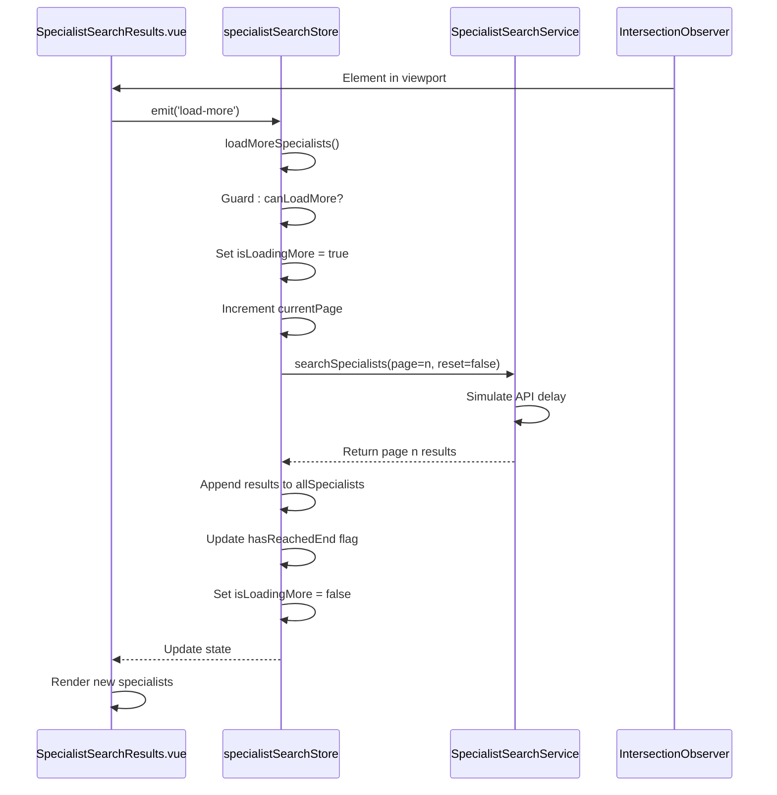
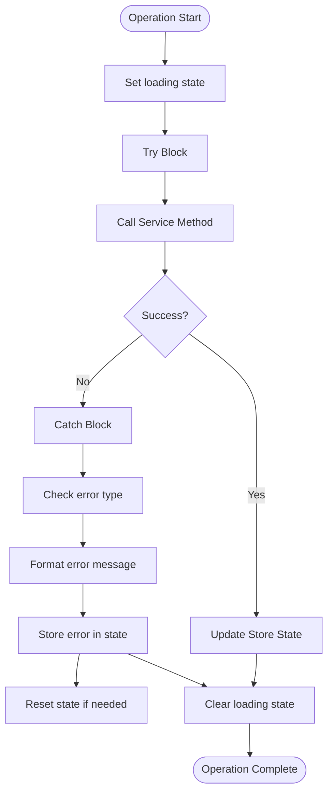
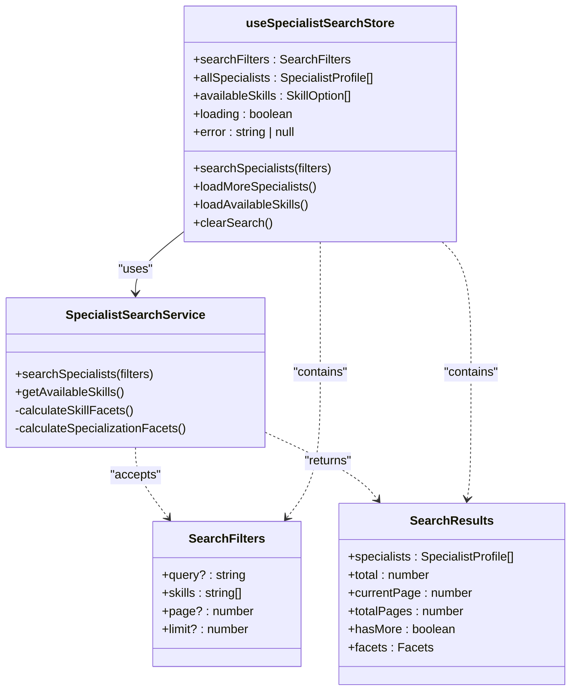
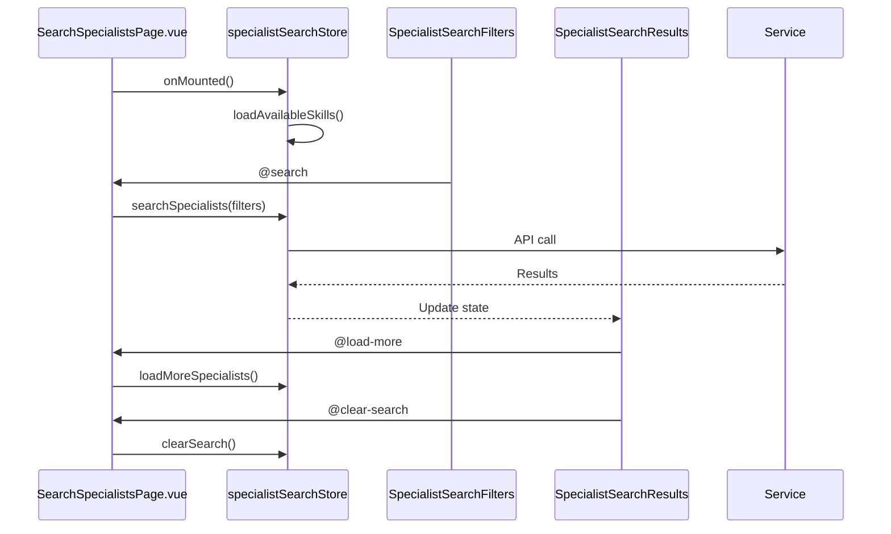

# Specialist Search Store

<cite>
**Referenced Files in This Document**   
- [specialist-search.ts](file://src/stores/specialist-search.ts#L1-L245)
- [specialist-search.ts](file://src/services/specialist-search.ts#L1-L454)
- [specialist-search.ts](file://src/types/specialist-search.ts#L1-L115)
- [SearchSpecialistsPage.vue](file://src/pages/SearchSpecialistsPage.vue#L1-L118)
- [SpecialistSearchResults.vue](file://src/components/search/SpecialistSearchResults.vue#L1-L301)
- [SpecialistSearchFilters.vue](file://src/components/search/SpecialistSearchFilters.vue)
</cite>

## Table of Contents
1. [Introduction](#introduction)
2. [Core State Properties](#core-state-properties)
3. [Getters](#getters)
4. [Actions](#actions)
5. [Infinite Scroll Implementation](#infinite-scroll-implementation)
6. [Error Handling](#error-handling)
7. [Integration with Search Service](#integration-with-search-service)
8. [Usage Patterns](#usage-patterns)
9. [Type Definitions](#type-definitions)

## Introduction
The Specialist Search Store is a Pinia store responsible for managing the state of the specialist search functionality in the Maya Platform frontend application. It handles search operations, filters, results, and infinite scroll behavior for finding AI specialists. The store integrates with the SpecialistSearchService to fetch data and provides a reactive interface for components to interact with search functionality.

**Section sources**
- [specialist-search.ts](file://src/stores/specialist-search.ts#L1-L245)

## Core State Properties
The store maintains several key state properties that represent the current search state:

:searchFilters
- Type: `SearchFilters`
- Default: `{ query: '', skills: [], page: 1, limit: 5 }`
- Description: Contains the current search criteria including text query and selected skills

:allSpecialists
- Type: `SpecialistProfile[]`
- Default: `[]`
- Description: Array of all currently loaded specialist profiles from search results

:availableSkills
- Type: `SkillOption[]`
- Default: `[]`
- Description: List of available skills that can be used as filters, loaded from the service

:loading
- Type: `boolean`
- Default: `false`
- Description: Indicates whether a primary search operation is in progress

:skillsLoading
- Type: `boolean`
- Default: `false`
- Description: Indicates whether available skills are being loaded

:error
- Type: `string | null`
- Default: `null`
- Description: Stores any error message from failed operations

:hasSearched
- Type: `boolean`
- Default: `false`
- Description: Tracks whether a search has been performed (used for UI state)

:infiniteScrollState
- Type: `InfiniteScrollState`
- Default: `{ isLoadingMore: false, hasReachedEnd: false, currentPage: 1, pageSize: 5 }`
- Description: Manages the state of infinite scroll functionality

:lastSearchResults
- Type: `SearchResults | null`
- Default: `null`
- Description: Stores metadata about the last search (total results, pagination info, etc.)

**Section sources**
- [specialist-search.ts](file://src/stores/specialist-search.ts#L6-L58)

## Getters
Computed properties provide derived state from the store's reactive data:

:hasResults
- Returns: `boolean`
- Logic: `allSpecialists.value.length > 0`
- Purpose: Determines if any search results are available

:selectedSkillLabels
- Returns: `string[]`
- Logic: Maps selected skill keys to their human-readable labels using availableSkills
- Purpose: Provides display labels for selected skill filters

:searchSummary
- Returns: `string`
- Logic: Generates a human-readable summary of search results and applied filters
- Example: "Found 5 specialists by filters: 'AI', 2 skills"
- Note: Contains hardcoded Russian text that should be localized

:availableSpecialistsCount
- Returns: `number`
- Logic: Counts specialists with status 'available' from allSpecialists
- Purpose: Shows how many specialists are currently available for work

:canLoadMore
- Returns: `boolean`
- Logic: Returns true if more results can be loaded (not reached end, not loading, and has searched)
- Purpose: Controls visibility of infinite scroll loading

**Section sources**
- [specialist-search.ts](file://src/stores/specialist-search.ts#L60-L102)

## Actions
The store exposes several actions to manipulate state and perform operations:

:searchSpecialists
- Parameters: `filters?: Partial<SearchFilters>`, `resetResults = true`
- Functionality:
  - Updates search filters if provided
  - Resets results and pagination if resetResults is true
  - Sets loading state and clears errors
  - Calls searchService.searchSpecialists with current filters
  - Updates allSpecialists, lastSearchResults, and infiniteScrollState
  - Handles errors and resets state on failure
  - Clears loading state in finally block
- Error Handling: Catches and stores error messages, resets results on error if resetResults is true

:loadMoreSpecialists
- Parameters: None
- Functionality:
  - Guards against multiple simultaneous loads using canLoadMore
  - Increments currentPage in infiniteScrollState
  - Calls searchSpecialists with current page and resetResults=false
  - Handles errors by decrementing page counter
  - Manages isLoadingMore state
- Purpose: Loads the next page of results for infinite scroll

:loadAvailableSkills
- Parameters: None
- Functionality:
  - Early returns if skills are already loaded
  - Sets skillsLoading state
  - Calls searchService.getAvailableSkills
  - Updates availableSkills on success
  - Handles errors
  - Clears skillsLoading state
- Purpose: Loads the list of available skills for filtering

:updateFilters
- Parameters: `filters: Partial<SearchFilters>`
- Functionality: Uses Object.assign to update searchFilters with provided values
- Purpose: Updates search criteria without triggering a search

:clearSearch
- Parameters: None
- Functionality: Resets all state properties to initial values
- Purpose: Clears all search data and starts fresh

:addSkillFilter
- Parameters: `skillKey: string`
- Functionality: Adds skill to filters.skills if not already present
- Purpose: Adds a skill filter

:removeSkillFilter
- Parameters: `skillKey: string`
- Functionality: Removes skill from filters.skills if present
- Purpose: Removes a skill filter

:toggleSkillFilter
- Parameters: `skillKey: string`
- Functionality: Toggles skill presence in filters using add/remove
- Purpose: Toggles a skill filter on/off

**Section sources**
- [specialist-search.ts](file://src/stores/specialist-search.ts#L104-L245)

## Infinite Scroll Implementation
The store implements infinite scroll functionality through a combination of state management and component integration:



**Diagram sources**
- [specialist-search.ts](file://src/stores/specialist-search.ts#L165-L199)
- [SpecialistSearchResults.vue](file://src/components/search/SpecialistSearchResults.vue#L1-L301)

Key aspects of the implementation:
- Uses `infiniteScrollState` object to track loading state, current page, and end-of-results status
- The `canLoadMore` getter prevents loading when at the end or already loading
- `loadMoreSpecialists` action handles the loading logic and error recovery
- Integration with `useInfiniteScroll` composable in the SpecialistSearchResults component
- Uses IntersectionObserver pattern via the composable to trigger loading when scroll position reaches threshold

**Section sources**
- [specialist-search.ts](file://src/stores/specialist-search.ts#L44-L54)
- [SpecialistSearchResults.vue](file://src/components/search/SpecialistSearchResults.vue#L1-L301)

## Error Handling
The store implements comprehensive error handling for all asynchronous operations:



**Diagram sources**
- [specialist-search.ts](file://src/stores/specialist-search.ts#L124-L163)

Error handling patterns:
- All async actions use try/catch blocks to prevent unhandled rejections
- Errors are normalized: `err instanceof Error ? err.message : 'Generic error message'`
- Specific error messages are provided for different operations:
  - Search: "Ошибка поиска специалистов" (Search error)
  - Load more: "Ошибка загрузки дополнительных результатов" (Load more error)
  - Load skills: "Ошибка загрузки навыков" (Load skills error)
- Loading states are always cleared in finally blocks
- Failed searches can optionally reset results (controlled by resetResults parameter)
- The error state is exposed to components for display

**Section sources**
- [specialist-search.ts](file://src/stores/specialist-search.ts#L124-L163)

## Integration with Search Service
The store integrates with the SpecialistSearchService to perform backend operations:



**Diagram sources**
- [specialist-search.ts](file://src/stores/specialist-search.ts#L1-L245)
- [specialist-search.ts](file://src/services/specialist-search.ts#L1-L454)

Integration details:
- The store creates an instance of SpecialistSearchService as a private property
- Service methods are called directly from store actions
- Search parameters are passed from store state to service methods
- Results from the service are processed and stored in the store
- The service currently uses fake data but is designed to be replaced with API calls
- Both store and service share type definitions from specialist-search.ts

**Section sources**
- [specialist-search.ts](file://src/stores/specialist-search.ts#L1-L245)
- [specialist-search.ts](file://src/services/specialist-search.ts#L1-L454)

## Usage Patterns
The store is used in conjunction with components and pages following specific patterns:

### Page Integration
The SearchSpecialistsPage.vue component initializes and coordinates the search functionality:



**Diagram sources**
- [SearchSpecialistsPage.vue](file://src/pages/SearchSpecialistsPage.vue#L1-L118)
- [specialist-search.ts](file://src/stores/specialist-search.ts#L1-L245)

Key usage patterns:
- The page component imports and instantiates the store
- On mount, it loads available skills to populate filters
- It handles events from child components and calls appropriate store actions
- It passes store state properties as props to child components
- Error handling is implemented with try/catch blocks around store actions
- The page serves as the orchestrator between UI components and the store

### Component Integration
Child components consume store state through props rather than direct store access:
- SpecialistSearchFilters receives loading state and emits search events
- SpecialistSearchResults receives all relevant state properties as props
- This pattern promotes reusability and testability
- The store remains the single source of truth

**Section sources**
- [SearchSpecialistsPage.vue](file://src/pages/SearchSpecialistsPage.vue#L1-L118)
- [SpecialistSearchResults.vue](file://src/components/search/SpecialistSearchResults.vue#L1-L301)
- [SpecialistSearchFilters.vue](file://src/components/search/SpecialistSearchFilters.vue)

## Type Definitions
The store relies on several type definitions from the specialist-search types file:

```mermaid
erDiagram
SPECIALIST_PROFILE {
string id PK
string userId
string displayName
string superpower
string avatarUrl
string[] specializations
string[] abilities
ServiceSummary[] services
Contacts contacts
number rating
number reviewCount
number completedProjects
string responseTime
string status
string lastActive
}
SERVICE_SUMMARY {
string name
number|string price
string priceType
}
SKILL_OPTION {
string key
string label
string category
string description
}
SEARCH_FILTERS {
string query
string[] skills
PriceRange priceRange
number page
number limit
}
SEARCH_RESULTS {
SpecialistProfile[] specialists
number total
number currentPage
number totalPages
boolean hasMore
Facets facets
}
INFINITE_SCROLL_STATE {
boolean isLoadingMore
boolean hasReachedEnd
number currentPage
number pageSize
}
SPECIALIST_PROFILE ||--o{ SERVICE_SUMMARY : "has"
SEARCH_RESULTS }o--|| SPECIALIST_PROFILE : "contains"
```

**Diagram sources**
- [specialist-search.ts](file://src/types/specialist-search.ts#L1-L115)

Key interfaces:
- **SpecialistProfile**: Represents a specialist with their skills, services, and metadata
- **ServiceSummary**: Describes a service offered by a specialist with pricing information
- **SkillOption**: Defines a selectable skill with key, label, and category
- **SearchFilters**: Contains the search criteria including query, skills, and pagination
- **SearchResults**: Response structure from search operations with results and metadata
- **InfiniteScrollState**: Tracks the state of infinite scroll loading
- **Component prop interfaces**: Define the API for search-related components

These types ensure type safety throughout the search functionality and are shared between the store, service, and components.

**Section sources**
- [specialist-search.ts](file://src/types/specialist-search.ts#L1-L115)