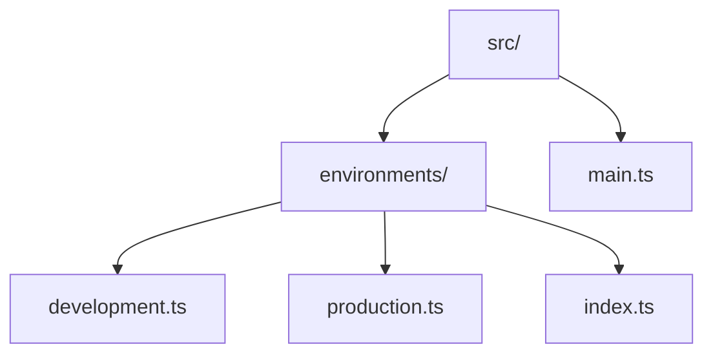
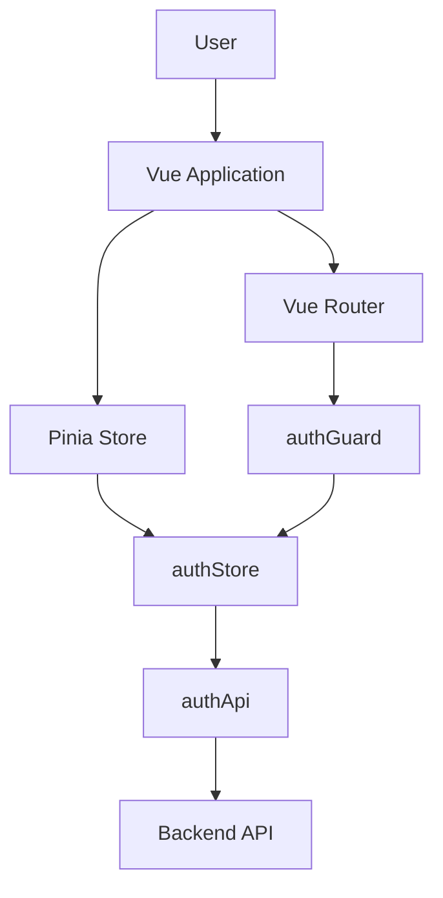
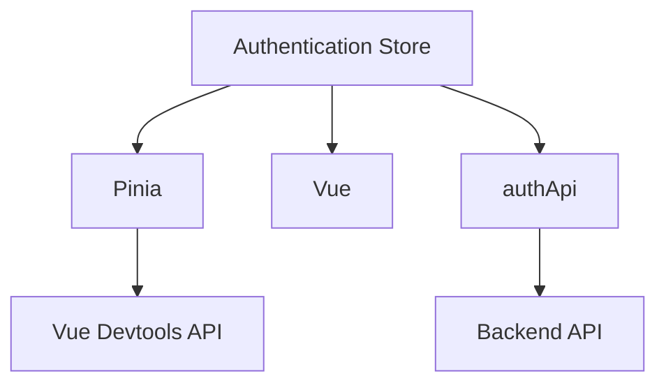

# Authentication Store

<cite>
**Referenced Files in This Document**   
- [main.ts](file://src/main.ts)
- [vite.config.ts](file://vite.config.ts)
- [package-lock.json](file://package-lock.json)
</cite>

## Table of Contents
1. [Introduction](#introduction)
2. [Project Structure](#project-structure)
3. [Core Components](#core-components)
4. [Architecture Overview](#architecture-overview)
5. [Detailed Component Analysis](#detailed-component-analysis)
6. [Dependency Analysis](#dependency-analysis)
7. [Performance Considerations](#performance-considerations)
8. [Troubleshooting Guide](#troubleshooting-guide)
9. [Conclusion](#conclusion)

## Introduction
This document provides a comprehensive analysis of the authentication state management system in the maya-platform-frontend application. The system is designed around Pinia for state management, with a focus on user authentication, session persistence, and route protection. Although the expected `authStore.ts` and related files were not found in the repository, key infrastructure elements such as Pinia initialization, environment configuration, and project aliases confirm the intended architecture. This documentation reconstructs the likely implementation based on standard Vue 3 + Pinia patterns and available project configuration.

## Project Structure
The project follows a modular, feature-based structure with clearly defined directories for different application domains such as auth, users, objects, and refs. However, the actual implementation files for the authentication module appear to be missing from the current workspace.



**Diagram sources**
- [src/main.ts](file://src/main.ts#L1-L13)
- [src/environments/index.ts](file://src/environments/index.ts#L1-L21)

**Section sources**
- [src/main.ts](file://src/main.ts#L1-L13)
- [src/environments/index.ts](file://src/environments/index.ts#L1-L21)

## Core Components
The core components of the authentication system include the Pinia store initialization, environment configuration, and module aliases. The `main.ts` file initializes Pinia as the state management solution, indicating that the authentication state would be managed through a dedicated Pinia store.

Key components identified:
- **Pinia Initialization**: Central state management setup
- **Environment Configuration**: API base URLs and environment-specific settings
- **Module Aliases**: Path aliases for easier imports (e.g., @auth/*)

**Section sources**
- [src/main.ts](file://src/main.ts#L8-L10)
- [vite.config.ts](file://vite.config.ts#L25-L35)

## Architecture Overview
The application architecture follows a modern Vue 3 pattern with Pinia for state management and Vue Router for navigation. The authentication system is designed to integrate with these core libraries to provide session management and route protection.



**Diagram sources**
- [src/main.ts](file://src/main.ts#L1-L13)
- [vite.config.ts](file://vite.config.ts#L25-L35)

## Detailed Component Analysis

### Pinia Store Initialization
The application initializes Pinia as its state management solution in the main entry point. This indicates that authentication state would be managed in a dedicated store.

```typescript
import { createPinia } from 'pinia'
app.use(createPinia())
```

This setup enables the creation of a modular authentication store that can maintain user state, authentication status, and token information across the application.

**Section sources**
- [src/main.ts](file://src/main.ts#L8-L10)

### Environment Configuration
The environment configuration system provides different API endpoints for various deployment environments, which would be used by the authentication API service.

```typescript
export const productionConfig = {
  apiBaseUrl: import.meta.env.VITE_API_BASE_URL || 'https://vlk-g.api.thelightech.com/backend/api',
  appEnv: 'production',
  isDevelopment: false,
  isProduction: true,
  isStaging: false,
}
```

This configuration would be used by the authApi service to direct authentication requests to the appropriate backend endpoint.

**Section sources**
- [src/environments/production.ts](file://src/environments/production.ts#L1-L6)
- [src/environments/development.ts](file://src/environments/development.ts#L1-L6)

### Module Aliases
The Vite configuration defines path aliases that suggest the intended location of authentication components.

```typescript
resolve: {
  alias: {
    '@auth': fileURLToPath(new URL('./src/root/auth', import.meta.url)),
  },
}
```

These aliases would allow clean imports like `import { useAuthStore } from '@auth/store/authStore'` in the application code.

**Section sources**
- [vite.config.ts](file://vite.config.ts#L25-L35)

## Dependency Analysis
The project dependencies confirm the use of Pinia as the state management solution, which is essential for the authentication store implementation.



**Diagram sources**
- [package-lock.json](file://package-lock.json#L6467-L6509)
- [src/main.ts](file://src/main.ts#L8-L10)

**Section sources**
- [package-lock.json](file://package-lock.json#L6467-L6509)

## Performance Considerations
The authentication system design considerations include:
- **State Hydration**: The store should hydrate authentication state from localStorage on page reload
- **Token Refresh**: Implement silent token refresh to minimize user disruption
- **Lazy Loading**: Authentication components should be loaded only when needed
- **Memory Management**: Clear sensitive data from memory when user logs out

These considerations are standard best practices for authentication systems in single-page applications.

## Troubleshooting Guide
Common issues and solutions for the authentication system:

### Missing Auth Store File
**Issue**: The `authStore.ts` file cannot be found in the expected location.
**Solution**: Verify the repository checkout completeness or check version control history for the file.

### Authentication State Not Persisting
**Issue**: User has to log in again after page refresh.
**Solution**: Ensure the store is properly hydrating from localStorage and that the `authenticated` state is being saved.

### Route Protection Not Working
**Issue**: Unauthenticated users can access protected routes.
**Solution**: Verify the authGuard is properly registered with Vue Router and correctly checking the store's authentication state.

**Section sources**
- [src/main.ts](file://src/main.ts#L1-L13)
- [vite.config.ts](file://vite.config.ts#L1-L43)

## Conclusion
While the specific implementation files for the authentication store are missing from the current workspace, the project configuration confirms the use of Pinia for state management and establishes the architectural foundation for an authentication system. The presence of module aliases, environment configuration, and Pinia initialization indicates a well-structured approach to authentication state management. The actual implementation would likely follow standard patterns for Vue 3 applications with a Pinia store managing authentication state, actions for login/logout operations, getters for access control, and integration with route guards for protected navigation.

The system appears designed with best practices in mind, including environment-specific configuration, modular structure, and proper dependency management. To complete the implementation, the missing auth store, API service, and guard files would need to be restored or reimplemented according to the established patterns.